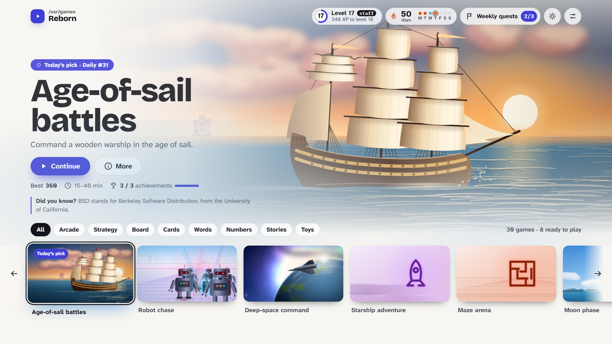
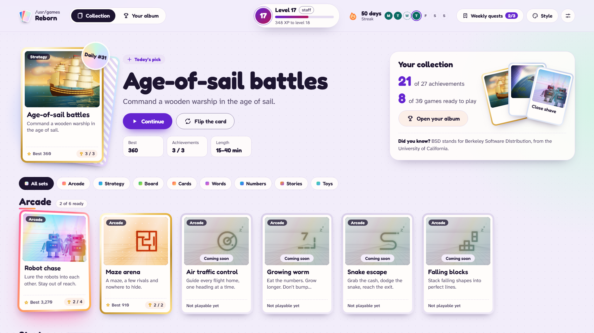
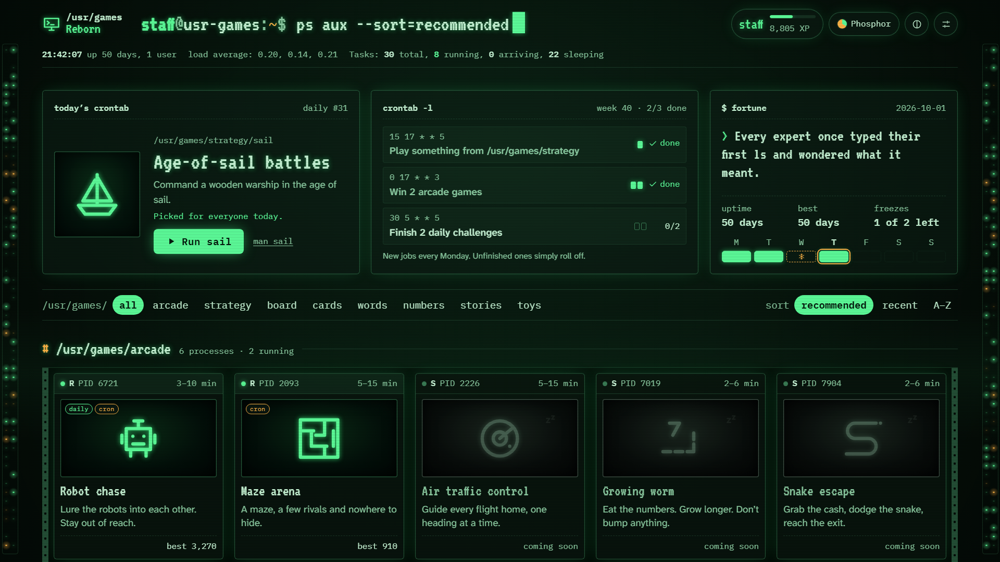

# /usr/games Reborn

**Thirty classics from the Unix games directory, reborn for today.**


From the late 1970s on, every BSD Unix machine shipped a directory of games: `/usr/games`. Air
traffic control on a text screen, a cave with something living in it, a solitaire with a stubborn
reserve pile, a starship adventure written to try out the C language. This collection keeps the
soul of each one, the decision that made it fun, and rebuilds everything else for people who have
never seen a terminal, and for the people who grew up with one.

## The Hall

The collection's front door is **the Hall**, and it comes in three styles. You pick one on your
first visit and can switch any time in Settings; all three share your progress. Everything is drawn
in code, with no images, and every look is designed for light and for dark.

| Console Home                                                                                                           | Holo Collection                                                                                               | The Machine Room                                                                                                                                  |
| ---------------------------------------------------------------------------------------------------------------------- | ------------------------------------------------------------------------------------------------------------- | ------------------------------------------------------------------------------------------------------------------------------------------------- |
|                                                       |            |                         |
| A games-console home screen: today's pick fills the stage, every game has living key art. The default for new players. | Every game is a holographic card in a binder; cards lean toward your pointer and fill your album as you play. | A Unix machine at night: games run as processes, each with its own manual page. Three palettes: **Phosphor**, **Manual Page** and **Sunset Lab**. |

You log in with a name of your choice (it stays on your device), and your profile fills up as you
play. Every game is playable from your first visit.

**Levels and ranks.** XP comes from finished sessions, the first win of the day in each game, daily
challenges, achievements and weekly quests. Your level climbs from 1 to 99, and every stretch of
levels carries a Unix rank: you start as `guest` and move up through `user`, `staff` and `wheel`
to `root`. Playing many different games is the fastest way up; ranks unlock cosmetics such as
Console skins, Holo foils, prompt colours and, at `root`, a hidden server closet. They never lock a
game.

**Weekly quests and achievements.** Each week brings three small quests across different games
(the Machine Room calls them cron jobs); a week you miss simply rolls over. Achievements (packages,
in the Machine Room, installed into your home directory) collect in your profile. Your streak counts
the days you play, and two quiet days a week are covered automatically.

## Games

<!-- games:start -->

<!-- Generated by `pnpm run docs` from the Hall catalog. Do not edit by hand. -->

| Game                | Directory             | Inspired by                                       | Status      | Kind   |
| ------------------- | --------------------- | ------------------------------------------------- | ----------- | ------ |
| Selene              | `/usr/games/toys`     | pom (1989)                                        | shipped     | hosted |
| Abyssal Worms       | `/usr/games/toys`     | worms (1989)                                      | shipped     | hosted |
| Rain on Still Water | `/usr/games/toys`     | rain (1989)                                       | shipped     | hosted |
| Broadside           | `/usr/games/strategy` | sail (1980)                                       | shipped     | hosted |
| Trek — Deep Space   | `/usr/games/strategy` | trek (1980)                                       | shipped     | hosted |
| Hunt — Ricochet     | `/usr/games/arcade`   | hunt (1983)                                       | shipped     | hosted |
| Robots              | `/usr/games/arcade`   | robots (1991)                                     | shipped     | hosted |
| Zoomies             | `/usr/games/arcade`   | robots (1980)                                     | shipped     | native |
| Pajamas to Paradise | `/usr/games/stories`  | battlestar (1979)                                 | shipped     | hosted |
| Skyloom             | `/usr/games/arcade`   | the 1986 Berkeley air traffic control game (1986) | shipped     | native |
| Control Room 1986   | `/usr/games/arcade`   | atc (1986)                                        | shipped     | hosted |
| Cave hunt           | `/usr/games/strategy` | wump (1989)                                       | coming soon | native |
| Growing worm        | `/usr/games/arcade`   | worm (1989)                                       | coming soon | native |
| Snake escape        | `/usr/games/arcade`   | snake (1980)                                      | coming soon | native |
| Falling blocks      | `/usr/games/arcade`   | the BSD falling-blocks program (1989)             | coming soon | native |
| Five in a row       | `/usr/games/board`    | gomoku (1994)                                     | coming soon | native |
| Dots and boxes      | `/usr/games/board`    | dab (2003)                                        | coming soon | native |
| Backgammon          | `/usr/games/board`    | backgammon (1980)                                 | coming soon | native |
| Property trading    | `/usr/games/board`    | monop (1980)                                      | coming soon | native |
| Cribbage            | `/usr/games/cards`    | cribbage (1980)                                   | coming soon | native |
| Solitaire           | `/usr/games/cards`    | canfield (1983)                                   | coming soon | native |
| Go fish             | `/usr/games/cards`    | fish (1990)                                       | coming soon | native |
| Road-trip card race | `/usr/games/cards`    | mille (1983)                                      | coming soon | native |
| Dice push-your-luck | `/usr/games/cards`    | pig (1992)                                        | coming soon | native |
| Letter grid         | `/usr/games/words`    | the BSD letter-grid program (1993)                | coming soon | native |
| Word guess          | `/usr/games/words`    | hangman (1983)                                    | coming soon | native |
| Trivia              | `/usr/games/words`    | quiz (1991)                                       | coming soon | native |
| Number sprint       | `/usr/games/numbers`  | arithmetic (1989)                                 | coming soon | native |
| Signal lab          | `/usr/games/numbers`  | caesar, morse and friends (1980)                  | coming soon | native |
| Colossal cave       | `/usr/games/stories`  | adventure (1991)                                  | coming soon | native |
| Dungeon descent     | `/usr/games/stories`  | hack (1982)                                       | coming soon | native |
| Fantasy realm       | `/usr/games/stories`  | phantasia (1986)                                  | coming soon | native |

<!-- games:end -->

The table is generated from the Hall's catalog by `pnpm run docs`. Titles are working titles until each
game's brief is written. Adopted games arrive first, then new games wave by wave.

## Run it locally

You need Node 22.12 or newer and pnpm.

```sh
pnpm install
pnpm dev        # the Hall at http://localhost:5173
pnpm build      # the Hall and every game into dist/
pnpm check      # lint, typecheck, unit tests and the repository guards
pnpm e2e        # the Hall's end-to-end tests (Playwright)
pnpm shots      # the hero frames into docs/media/hall/hero/
pnpm shots:all  # every screen × style × palette × appearance into docs/media/hall/
pnpm sim        # the progression balance simulations
```

## How it is built

TypeScript, Vite, Vitest and Playwright in a pnpm workspace, with a framework-free Hall, a shared
kit for native games and a tiny bridge for adopted games. Start with
[`docs/ARCHITECTURE.md`](docs/ARCHITECTURE.md), the decisions in [`docs/adr/`](docs/adr/README.md)
and the rules for contributors (human or agent) in [`AGENTS.md`](AGENTS.md).

## Credits and licence

Our code is MIT-licensed ([`LICENSES/MIT.txt`](LICENSES/MIT.txt)). The original games were written
by many people for BSD Unix; their authors, the bsd-games package and the fonts are credited in
[`CREDITS.md`](CREDITS.md), and the original notices for anything we derive are kept in
[`LICENSES/`](LICENSES/README.md).
