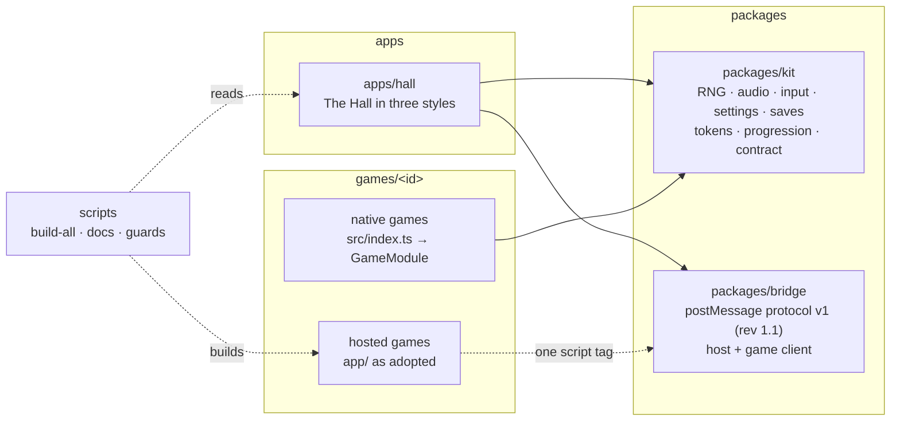
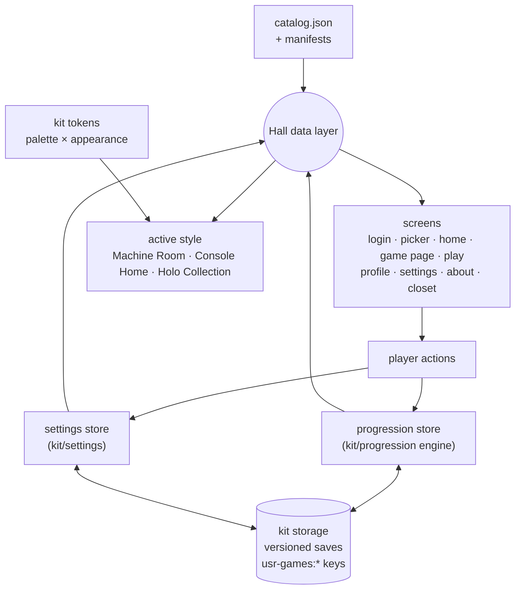
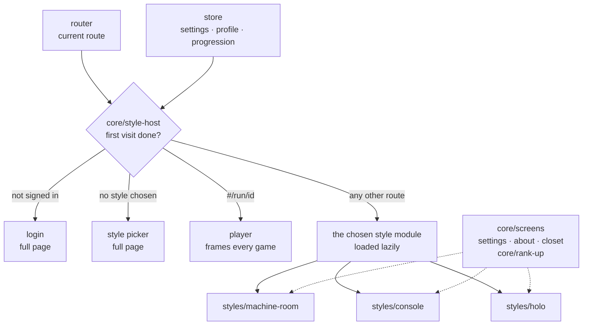
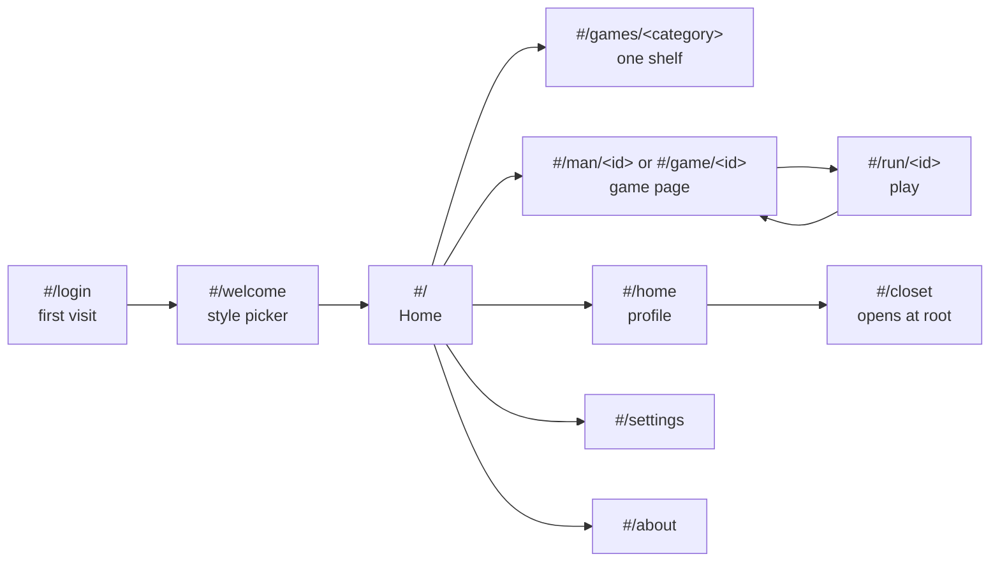
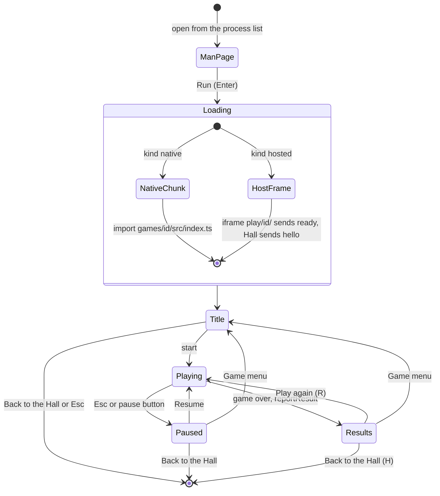
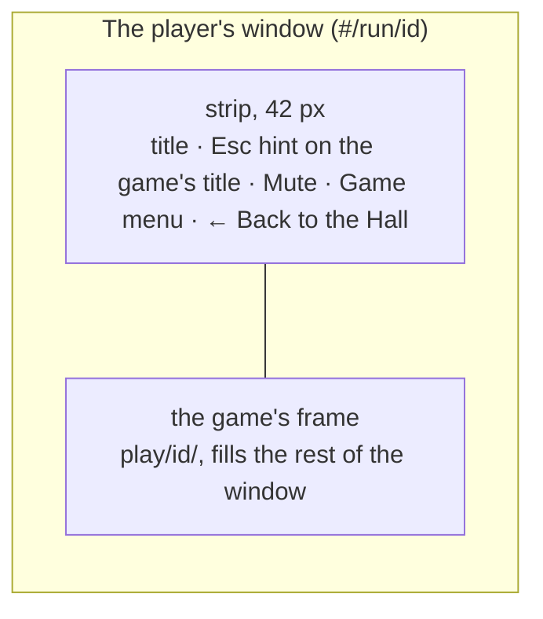
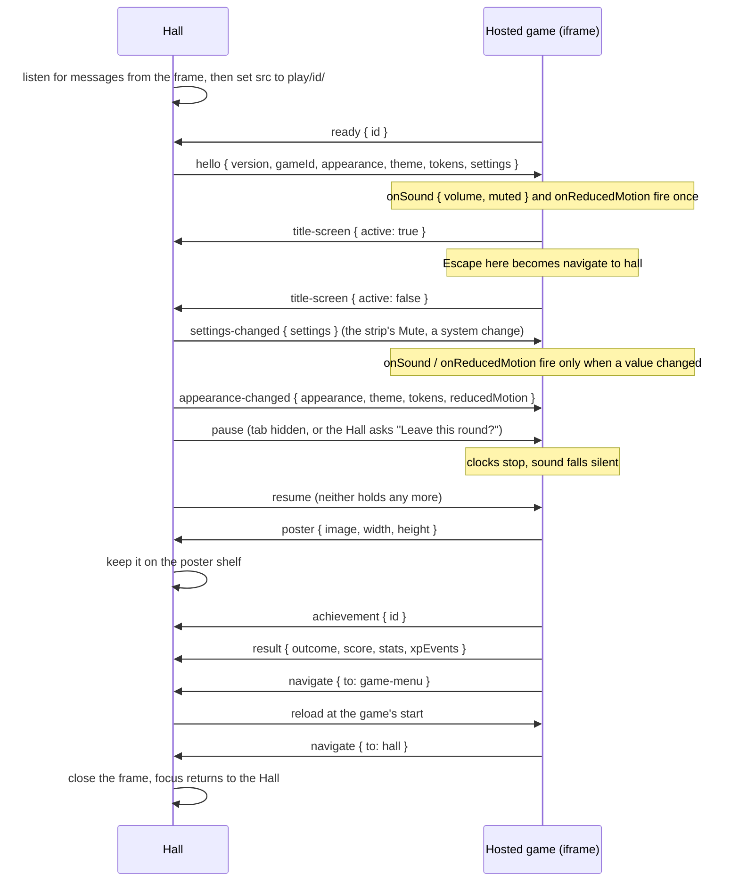
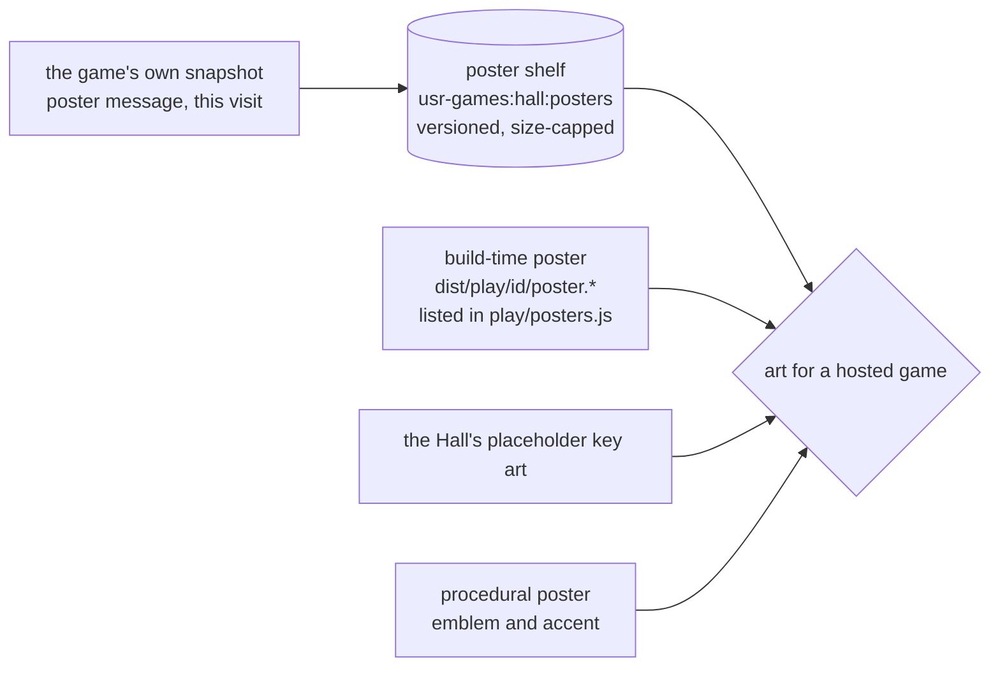
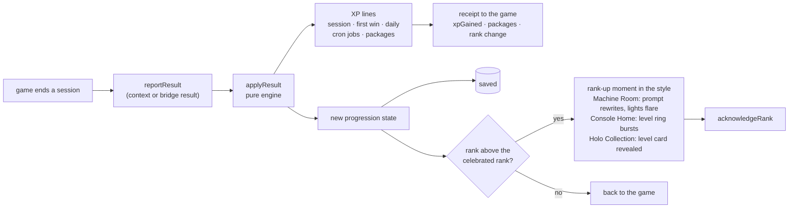
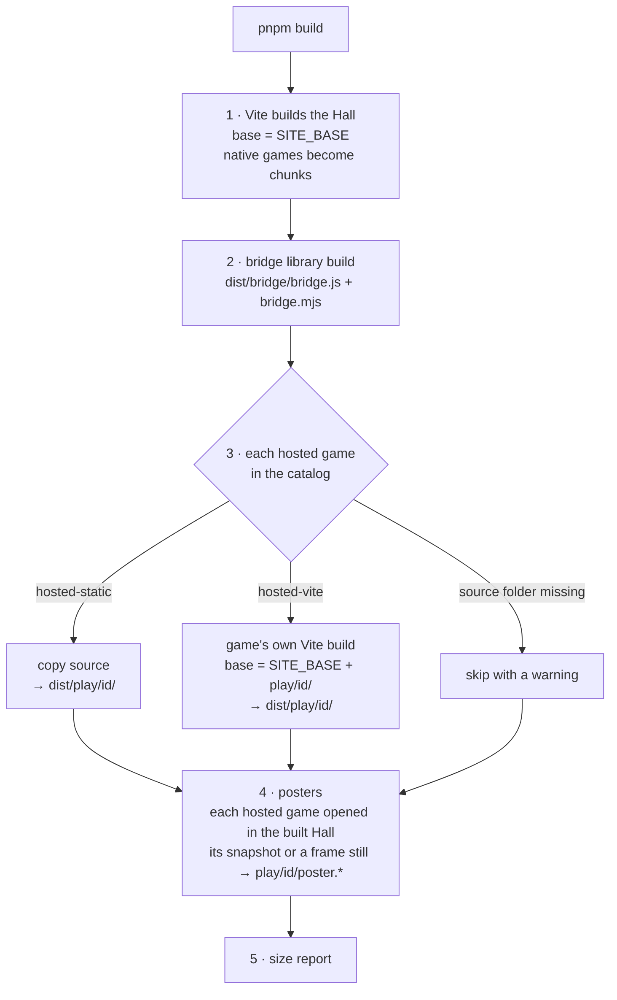

# Architecture

/usr/games Reborn is one static website: the **Hall** (a framework-free TypeScript app) plus every
game, built into `dist/`. This document is the map. The decisions behind it are in
[`adr/`](adr/README.md); the rules for working in the repository are in
[`../AGENTS.md`](../AGENTS.md).

## Packages



| Folder             | What it is                                                                         | Who changes it                                                                |
| ------------------ | ---------------------------------------------------------------------------------- | ----------------------------------------------------------------------------- |
| `apps/hall/`       | The Hall: three styles, shared screens, the player that frames games, the catalog  | The session that owns the Hall in a wave; games touch only their catalog line |
| `packages/kit/`    | Shared runtime for native games and the Hall ([README](../packages/kit/README.md)) | One named kit owner per wave                                                  |
| `packages/bridge/` | Protocol, Hall-side host, game-side client, fixtures                               | One named bridge owner per wave                                               |
| `games/<id>/`      | One folder per game, native or hosted ([README](../games/README.md))               | That game's session                                                           |
| `scripts/`         | Build, docs table, guards, typecheck                                               | The foundation or a consolidation prompt                                      |
| `docs/`            | Architecture, ADRs, templates, progress, known issues, media                       | Shared; edit only your own line                                               |

Games never import from each other, and neither the kit nor the bridge imports from a game.

## The catalog

`apps/hall/src/catalog/catalog.json` lists every game, one line each, in display order:

```json
{ "id": "atc", "source": "placeholder" }
```

`placeholder` resolves to `apps/hall/src/catalog/placeholders/<id>.json` (working-title copy for a
planned game); `game` resolves to `games/<id>/manifest.json`. A game session flips its own line to
`game` at the very end of its prompt. `fixtures` lists the two bridge test games, which appear only
in development and in `pnpm build --fixtures`.

Every manifest follows `GameManifest` in `packages/kit/src/manifest/manifest.ts` and is validated by
`validateManifest` in unit tests, at Hall start-up in development, and by `pnpm check:catalog`.
The Hall's dev server watches `games/*/manifest.json` (`scripts/lib/catalog-dev-plugin.ts`), so a
manifest added, changed or removed while it runs reloads the catalog without a restart.
Statuses: `coming-soon` (sleeping in the process list), `adopting` (a hosted game on its way),
`shipped` (runnable) and `unlisted` (hidden).

## Hall data flow



- **Settings** (style, palette, appearance, Console skin and Holo finish, volume, motion,
  colour-blind palette, control remaps) live in one versioned save. `system` appearance and motion follow the operating system live.
- **Progression** is one versioned save holding XP, day logs, game stats, installed packages, the
  week's cron jobs, the streak and Hall activity. The Hall calls the pure engine with today's date
  and the list of shipped games, then saves the new state.
- **Forget my data** removes every `usr-games:` key, Hall and games alike.

## Hall styles and palettes

The Hall comes in three **styles**, complete presentations over the same data: the **Machine Room**
(Unix wording, three palettes: Phosphor, Manual Page, Sunset Lab), **Console Home** and **Holo
Collection** (plain words, one signature palette each, varied by rank-unlocked skins and finishes).
Every palette is designed in light and dark. The decision and its rules are in
[ADR 0010](adr/0010-hall-styles-and-palettes.md).



- **Tokens** live in [`packages/kit/src/tokens/themes.ts`](../packages/kit/src/tokens/themes.ts)
  and are written to the root element as `--ug-*` custom properties with `data-style`,
  `data-theme` (the palette) and `data-appearance`. The AA contrast contract for all five
  palettes, in both appearances and their colour-blind variants, is a unit test.
- **A style module** (`StyleModule` in `apps/hall/src/core/style-module.ts`) has `start`, which
  mounts the style and returns `destroy`, and `preview`, which renders its Home into a frame for
  the picker. `core/style-host.ts` loads only the style in use and swaps it when the setting
  changes.
- **Scoped CSS.** A style's rules sit under `[data-style='<style>']` with prefixed names (`ch-`,
  `hc-`; the Machine Room keeps its approved names under its scope). Shared screens use `set-`,
  `ab-` and `cl-` and are built from tokens only.
- **Shared screens, own frames.** The settings panel, About and the server closet are written once
  in `core/screens/`, and `core/rank-up.ts` works out what a rank-up unlocked; each style frames
  them in its own chrome and passes `wording: 'unix'` (Machine Room) or `'plain'`.
- **Ambience and art.** The Machine Room paints a Canvas scene behind the interface and one fixed,
  blended room-light layer (`--room-light` on `body::before`); Console Home and Holo Collection
  show key art from `core/art` (a game's poster or demo, placeholder art, or a procedural poster).
  Ambience pauses off-screen, stills under reduced motion and never carries information, so
  contrast is judged without it.

| Style           | Folder                               | Palettes                          | Words |
| --------------- | ------------------------------------ | --------------------------------- | ----- |
| Machine Room    | `apps/hall/src/styles/machine-room/` | Phosphor, Manual Page, Sunset Lab | Unix  |
| Console Home    | `apps/hall/src/styles/console/`      | Console, with accent skins        | Plain |
| Holo Collection | `apps/hall/src/styles/holo/`         | Holo, with foil finishes          | Plain |

Development builds also have screenshot scenes (`apps/hall/src/scenes/scenes.ts`,
`?scene=<name>&appearance=light|dark&freeze=1`, plus `&theme=` for the Machine Room palettes): the
live Hall on a seeded in-memory save for a demo player with a pinned clock, used for the hero
frames in [`docs/media/hall/hero/`](media/hall/hero/README.md) and the screenshots in
[`docs/media/hall/`](media/hall/).

## Routing



Every style answers every route; they differ only in what they call things (the Machine Room's
game page is a man page at `#/man/<id>`, the others link to `#/game/<id>`, and both resolve to
the same route). A signed-in player who lands on `#/login` goes on to Home.

Hash routes work on GitHub Pages without a fallback page, and every screen change is a history
entry, so the browser's Back button always works (see [ADR 0007](adr/0007-hash-routing-and-site-base.md)).

## Game lifecycle



The **player** (`apps/hall/src/core/player/`) owns `#/run/<id>`. It belongs to no style: it
takes the player's palette and wording (plain in Console Home and Holo Collection, light Unix
captions in the Machine Room) and scopes its CSS to `pl-` classes under `data-style="player"`.

- **Native** games are mounted into a host element with a `GameContext` from the kit contract
  (`native-session.ts`, `context.ts`). The Hall draws the Pause button, the pause menu (Resume ·
  game items · How to play · Settings · Game menu · Back to the Hall) and, for results reported
  with `presentation: 'hall'`, the results screen (Play again (R) · Game menu · Back to the Hall
  (H)). Play again calls the game's optional `playAgain()`, else remounts it. While a dialog is
  open the stage is `inert`, so keys never reach the game underneath.
- **Hosted** games run in a same-origin frame (`hosted-session.ts`) laid out below a slim strip
  (42 px) with the game's title, **Mute** (the Hall's master mute), **Game menu** and
  **← Back to the Hall**. The strip is part of the layout, never an overlay: the frame starts where
  it ends, so a game's own top bar is never covered and the frame keeps its size during play
  ([ADR 0012](adr/0012-bridge-1-1-strip-and-posters.md)). Escape on the game's own title screen
  returns to the Hall through the bridge's title-screen signal.



- A game that cannot run yet (coming soon, or not built) gets a still page with its poster and the
  ways back (`not-launchable.ts`); `isLaunchable(entry)` tells a style whether to offer Play.
- Receipts become toasts: XP, achievements (packages) and a rank change; the rank-up moment itself
  plays in the style when the player returns to the Hall.

## Bridge handshake (protocol v1, revision 1.1)



Every message is an envelope `{ protocol: 'usr-games-bridge', version: 1, type, payload }`,
checked for origin, source window and a strict schema on arrival. Revision 1.1 changed no message:
it made following the Hall's sound, motion and pause part of every hosted game's contract and gave
the game-side client `onSound`, `onReducedMotion`, `pauseWhenHidden` and `soundLevel`
([ADR 0012](adr/0012-bridge-1-1-strip-and-posters.md)). See
[ADR 0004](adr/0004-bridge-protocol-v1.md) and `packages/bridge/README.md`.

## Hosted games' key art



A hosted game's art comes, in order, from its own snapshot (sent this visit or kept on the poster
shelf from an earlier one), the still `pnpm build` captured of it, the Hall's placeholder key art,
and finally a procedural poster (`core/art/art.ts`, `core/art/poster-shelf.ts`,
`core/art/build-posters.ts`). The shelf keeps one poster per game (at most 400 000 characters, the
whole shelf 1 600 000; the oldest leave first) and is wiped by "Forget my data".

## Progression flow



The rules and numbers are in [ADR 0005](adr/0005-progression-rules.md); the balance simulations and
their results are in [`NOTES-progression.md`](NOTES-progression.md).

Every style stages the rank-up its own way from the same data (`core/rank-up.ts`: the ranks
crossed, the level reached, the cosmetics unlocked). Each lasts about two seconds, plays the shared
chord, can be skipped with Esc, Enter, Space, a click or its Skip button, is announced to screen
readers and becomes a short cross-fade under reduced motion. `acknowledgeRank` is called when it
ends, so it plays once; screenshot scenes hold its peak without acknowledging it.

## Build pipeline



`pnpm build --fixtures` adds the bridge fixtures to the catalog and builds them the same way.
The poster step needs Playwright's Chromium (`pnpm exec playwright install chromium`); without it,
or with `--no-posters`, it writes an empty `play/posters.js` and the Hall keeps its own art. The
GitHub Actions workflows run `pnpm check`, the unit tests and the Hall's end-to-end tests on every
push, and deploy `dist/` to Pages from the main branch.

## Guards

`pnpm check` runs lint, typecheck, unit tests and the repository guards: catalog completeness and
manifest validity, the zero-raster scan, the no-runtime-network scan, the trademark and content word
lists for UI copy, Mermaid validity in every Markdown file, and (when the originals are available
locally) a provenance scan for text copied from them. Allow-lists live in
`scripts/guards.config.json` and each entry points to the decision that permits it.

## Where things are defined

| Concern                                         | Where                                                                   |
| ----------------------------------------------- | ----------------------------------------------------------------------- |
| Colours, fonts, radius per palette × appearance | `packages/kit/src/tokens/themes.ts`                                     |
| Styles and the first-visit routing              | `apps/hall/src/core/style-host.ts`, `apps/hall/src/styles/`             |
| Settings, About and the server closet           | `apps/hall/src/core/screens/`                                           |
| Rank-up data and the chord                      | `apps/hall/src/core/rank-up.ts`                                         |
| Levels and plain wording                        | `packages/kit/src/progression/levels.ts`, `apps/hall/src/core/plain.ts` |
| Key art and procedural posters                  | `apps/hall/src/core/art/`                                               |
| Hosted games' posters (shelf, build-time)       | `apps/hall/src/core/art/poster-shelf.ts`, `scripts/lib/posters.ts`      |
| The hosted strip                                | `apps/hall/src/core/player/hosted-session.ts`, `player.css`             |
| XP numbers and rank thresholds                  | `packages/kit/src/progression/rules.ts`, `ranks.ts`                     |
| Hall packages and cosmetics                     | `packages/kit/src/progression/hall-packages.ts`, `cosmetics.ts`         |
| Hall sounds                                     | `packages/kit/src/audio/patches.ts`, `apps/hall/src/core/sound.ts`      |
| Game contract                                   | `packages/kit/src/contract/contract.ts`                                 |
| Manifest schema                                 | `packages/kit/src/manifest/manifest.ts`, `validate.ts`                  |
| Bridge protocol                                 | `packages/bridge/src/protocol.ts`                                       |
| Bridge game client (sound, motion, pause)       | `packages/bridge/src/game.ts`                                           |
| Catalog                                         | `apps/hall/src/catalog/`                                                |
| Build and guards                                | `scripts/`                                                              |
