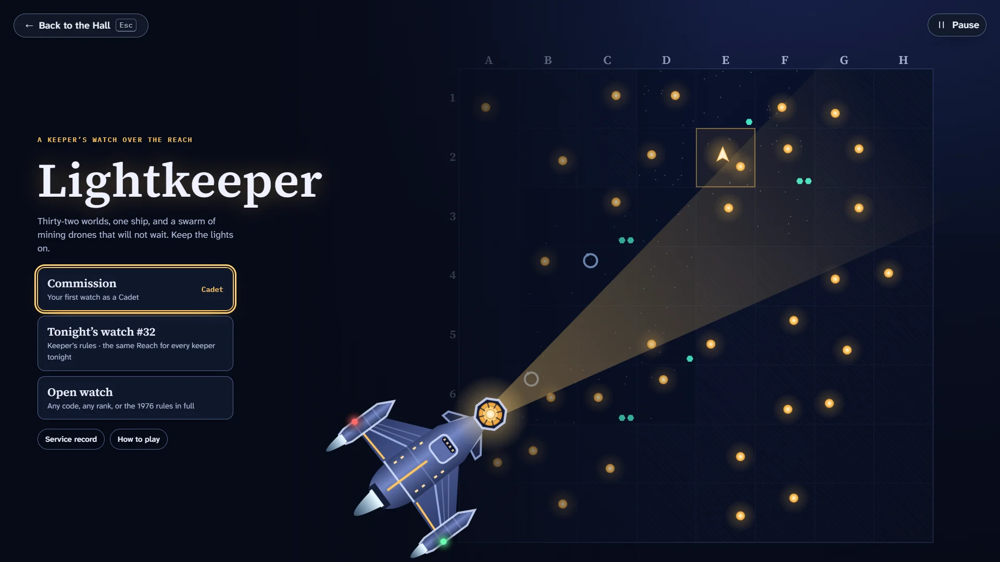
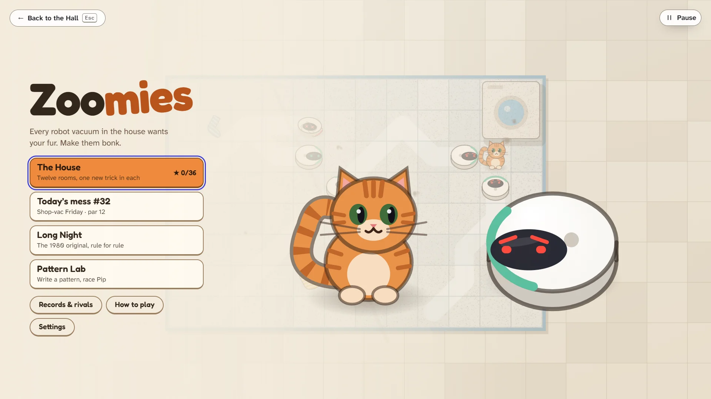
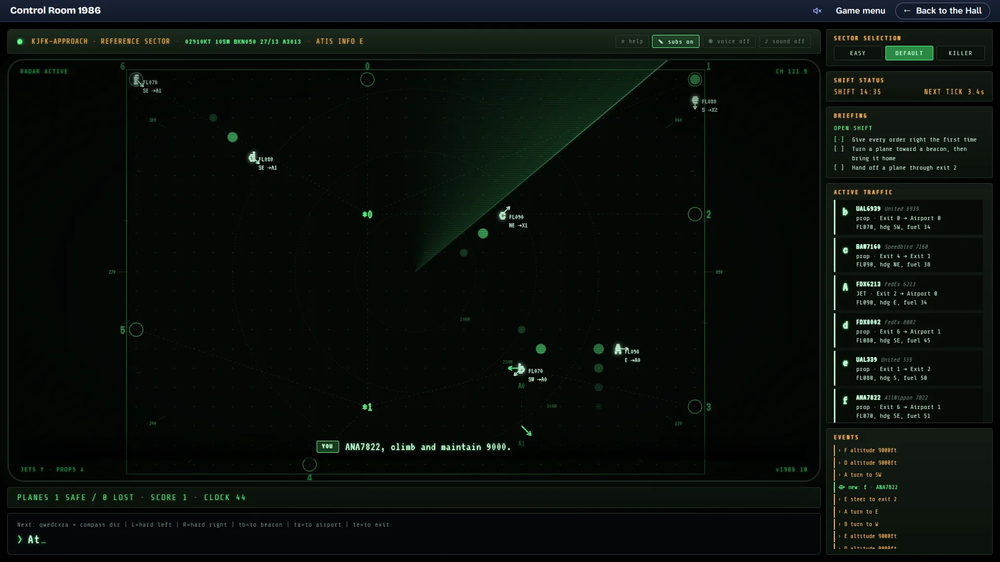

# Review pass: Lightkeeper, Zoomies, Control Room 1986

Prompt C1 §6, 2026-10-02. Three games shipped at the owner's request without a hero-frame review.
This is an honest look at each against the collection's standards, for the owner and the
architect to turn into follow-up prompts. Nothing in these games was changed for the review.

**How the shots were taken.** Live in the Hall (Console Home, a signed-in guest), at 1920×1080, on
the machine's GPU, light and dark. Lightkeeper and Zoomies were played to each moment with their
own development hooks to save time (autopilot, the solver's par route). Control Room 1986 has a
single look, so it was shot once with the Hall at night; its random traffic was seeded the way its
own tests seed it. Its hidden testing aid was never opened. Two signature frames (Lightkeeper's
beams, Zoomies' last turn) were picked from a slowed or recorded burst so the moment is caught
mid-flight; what they show is what normal speed shows.

| Game              | Title                                                                       | Main play                                                                 | Signature moment                                                                    |
| ----------------- | --------------------------------------------------------------------------- | ------------------------------------------------------------------------- | ----------------------------------------------------------------------------------- |
| Lightkeeper       | [light](lightkeeper/title-light.webp) · [dark](lightkeeper/title-dark.webp) | [light](lightkeeper/play-light.webp) · [dark](lightkeeper/play-dark.webp) | [light](lightkeeper/signature-light.webp) · [dark](lightkeeper/signature-dark.webp) |
| Zoomies           | [light](zoomies/title-light.webp) · [dark](zoomies/title-dark.webp)         | [light](zoomies/play-light.webp) · [dark](zoomies/play-dark.webp)         | [light](zoomies/signature-light.webp) · [dark](zoomies/signature-dark.webp)         |
| Control Room 1986 | [its single look](atc-classic/title.webp)                                   | [its single look](atc-classic/play.webp)                                  | [its single look](atc-classic/signature.webp)                                       |

**Verdict in one line each.** Zoomies is the closest to the collection's bar: it sells itself at a
glance and plays cleanly, but its big moment is too quiet. Lightkeeper has the best title screen of
the three and a deep game underneath, but play reads like a control panel and its signature moment
is a thin line and a number. Control Room 1986 is a faithful, atmospheric typed radar that most
16-year-olds will bounce off in the first minute.

---

## Lightkeeper

**First impression for a 16-year-old.** The menu is strong: a confident serif title, one line that
says what is at stake ("Thirty-two worlds, one ship, and a swarm … Keep the lights on"), three clear
ways to play and a hero ship throwing a lighthouse beam across the chart. It looks like a game made
with care. The trouble starts on the first watch: play opens on a dense dashboard (reserve, power,
shield, four chips, a zone map, a mini chart, a calls list and a long log) and the eye has no single
place to land. The fun of the 1976 game (reading a swarm, timing beams, rescuing a world just in
time) is in there, but the screen asks the player to read rather than to look.

**Readability.** Type sizes are good and the light look is crisp. The log on the right is a wall of
sentences that grows every turn; nobody will read it, yet it takes a quarter of the screen. The
middle column has the First Officer's advice at the top and then about 600 px of nothing above the
drive control. On the zone map the gleaners, black holes and stars are clear, but the ship is small
for the hero of the game. The flare preview contradicts itself: the track is drawn as a stair-stepped
dotted path while the card says the flare is "flown true" with a ±12° stray wedge drawn straight.

**Light and dark.** Both are designed, not inverted, and both are handsome: Night Watch is deep blue
with warm worlds, Chart is parchment with ink outlines and a compass rose. In Chart the lighthouse
beam on the menu and the flare wedge in play are so pale they nearly vanish.

**Navigation standard.** The menu has "← Back to the Hall" with Esc, play has the Pause button with
its Esc hint, and the action bar shows every key. Two Hall-level slips show up here: the Hall's Pause
pill is drawn on the game menu too, where there is nothing to pause, and during play it overlaps the
right edge of the game's status chip ("Red alert", "Low power").

**Accessibility.** Every action has a key and a visible key cap; focus rings are clear in both looks.
The log is long and unstructured for a screen reader. Status depends partly on colour (the red and
green bars beside log lines).

**Consistency with the Hall.** Good: it uses the Hall's fonts and tokens, its cards and pills match
Console Home, and the results flow goes through the Hall.

**Signature moment.** A world being saved: the beams fire, the last gleaner goes dark and Driftmoor
is safe ([dark](lightkeeper/signature-dark.webp)). On screen this is one thin beam, a "118" and a
faded husk. The saved world, the reason for the whole turn, sits small and unmarked in a corner. The
side panel and the log announce "no gleaners" and "Driftmoor is safe" before the beams have even
arrived, so the result is spoiled before it is seen. Also reported while capturing, not in these
shots: on the "The Reach is safe" results screen at 1920×1080 the score block fills only the top
left and most of the left column is empty.

**Top five improvements**

1. **Make saving a world the big moment.** Let the beams land first, then light the world up (a
   bloom, its name, the call ring closing) and only then update the panel and the log. Keep it short
   and skippable; the rule data does not change.
2. **Calm the play screen.** Give the zone map the stage: fold the log into a collapsible "Ship's
   log" (last three lines visible), move the calls list under the chart, and use the empty middle
   column for the First Officer and the selected world's card.
3. **Make the ship read as the hero in play.** Larger in the zone view, with its beam and shield
   state drawn on it, so the player looks at the ship instead of the bars.
4. **Fix the flare preview** so the drawn track, the stray wedge and the words agree.
5. **Strengthen Chart's beams and wedges** (and check the Hall's Pause pill against the status chips
   on the Hall side) so the light look loses nothing that the night look shows.

---

## Zoomies

**First impression for a 16-year-old.** Instantly likeable. The logo, the big ginger cat and the
grumpy robot vacuum say "cute puzzle game" before a word is read, and the tagline ("Every robot
vacuum in the house wants your fur. Make them bonk.") is the best line in the three games. Four
clear modes, stars to collect, a Daily. In play the cat is tiny on a very large board, and the board
is covered in red hatching (the vacuums' reach) and dotted paths, so the first look at a room is busy
rather than inviting.

**Readability.** The side panel is clear: room, turn against par, vacuums left, safe zooms. One card
wraps badly ("6 +3 in the" / "dock"), and with nine or more vacuums its dot row breaks onto a lonely
second line. The key help sits at the very bottom, far from the controls it describes, with empty
space in between. During quick play the Hall's achievement toasts stack over the bottom of the side
panel and hide the status line and the key help.

**Light and dark.** Both designed and both warm: Afternoon is wood floor and rug, Midnight is a
violet room in moonlight. In play the two read equally well. In the signature reveal they do not
(below).

**Navigation standard.** The menu has "← Back to the Hall" with Esc; play has Pause with Esc; Undo
and every action carry key caps. The Hall's Pause pill also shows on the game menu, as in
Lightkeeper.

**Accessibility.** Full keyboard play (QWE/AD/ZXC, arrows, number pad, click a neighbouring square)
with visible keys. The danger hatching uses pattern as well as colour, which is good for colour-blind
players. A focus ring is drawn around the whole board (yellow at night, indigo by day), which reads
more like a frame than a focus cue.

**Consistency with the Hall.** Strong: Hall-style cards, pills and type, and its own lovable
character on top.

**Signature moment.** The rug-trail reveal at the end of a room, when every vacuum's path appears on
the rug and all seven sit in one tangle beside a happy cat ([dark](zoomies/signature-dark.webp),
[light](zoomies/signature-light.webp)). At night the glowing dotted trails are lovely. By day they
become wide cream bands that merge into blobs where they cross, and the shape is lost. In both looks
the payoff, the tangle and the cat, is small, dimmed and pushed against the right edge, and the
panel already says "Vacuums left 0" while the last vacuum is still rolling in.

**Top five improvements**

1. **Give the room-cleared reveal a payoff.** Bring the tangle and the cat forward (a zoom or a
   spotlight, a happy cat pose, a little pile-up bounce), then draw the trails; announce the count
   only once the last vacuum has arrived.
2. **Redraw the day-look trails** as thinner, darker stripes (a vacuumed-carpet nap) so they stay
   readable where they cross, matching the night look's clarity.
3. **Make the cat the hero on big boards.** Scale the cat (or the camera) so it is never a speck,
   and soften the danger hatching outside the cat's next moves.
4. **Tidy the side panel:** a counter that never wraps ("6 left · 3 docked"), dots that fit, the key
   help next to the buttons, and toasts placed where they never cover the panel.
5. **Replace the board-wide focus ring** with a clear focus cue on the cat or the chosen square.

---

## Control Room 1986

**First impression for a 16-year-old.** It looks like the real thing: a green phosphor radar, a
sweep, flight strips, radio lines, a career with stamps. That authenticity is also the wall. The game
menu is a terminal page of small monospace text, and the first shift asks for typed commands
("At", "qwedcxza = compass dir", FL070, "hdg SE", ATIS) before anything exciting happens. Players who
love simulators will be delighted; most will leave before the first landing.

**Readability.** At 1920×1080 the radar's data blocks are about 10 px; airport and range labels are
very dim; the locked career rows, the licence details and the footer look below AA contrast. The
reference card is open by default on every shift and covers the left third of the radar, including
exits 5 and 6 and the planes near them. The subtitle line ("ANA7822, climb and maintain 9000.") is
the most readable thing on screen and the best idea in the presentation. The faint radar in the top
left of the menu panel reads as a smudge.

**Light and dark.** A single night look by design (listed under "Missing appearances" in
`docs/KNOWN-ISSUES.md`); the Hall's strip follows the Hall's appearance.

**Navigation standard.** Since C1 the Hall's strip sits above the game with Mute, Game menu and Back
to the Hall, and Escape on the menu leads home. The game's own end screens do not follow the results
order (Play again · Game menu · Back to the Hall), and its sidebar sector buttons abandon a running
shift without asking (known issues #24 and #29).

**Accessibility.** Keyboard first by nature, and since C1 it follows the Hall's sound and part of
its reduced motion. Gaps remain: the radar sweep, title fade and blinking cursors always run (#28);
the tiny, dim text above; no structure for screen readers in the traffic list.

**Consistency with the Hall.** It is its own world, as an adopted game may be; it shares nothing of
the Hall's type or palette. Real airline names appear on screen (a listed temporary trademark
exception), and the menu credits Ed James's game to 1986 while the game's own ABOUT gives his notice
as 1987, which is worth a look.

**Signature moment.** A busy handoff: seven planes, the radio saying "JAL129, contact center, good
day", the events list ticking "JAL129 exited" ([shot](atc-classic/signature.webp)). Nothing on the
radar marks the moment; it looks like any other second of play. A landing or a clean handoff is
where this game should feel great.

**Top five improvements**

1. **An on-ramp before the terminal:** a first shift that teaches one order at a time with
   clickable flight strips (click a plane, pick a turn or an altitude) that type the command for the
   player, so the typed language is learned, not required.
2. **Readable radar:** larger data blocks and labels (with a size setting), AA contrast for every
   line of text, and the reference card closed by default (open with `\` and remembered).
3. **Celebrate landings and handoffs:** a short sweep flash on the plane, a strip stamped "HOME",
   the radio line highlighted, so the signature moment is visible on the radar itself.
4. **Follow the navigation standard inside the game:** results in the standard order, a confirm
   before abandoning a shift, and a reduced-motion path for the sweep and blinking.
5. **Our own names:** replace the real airline names with fictional ones in the same style, as
   Skyloom did, and settle the 1986 or 1987 credit.

---

## Across all three

- **The Hall's Pause pill on native games' menus** (Lightkeeper, Zoomies) is a Hall-side follow-up:
  on a game's own menu only "← Back to the Hall" should show, and the pill should never cover a
  game's status chips.
- **Signature moments are under-staged in all three.** Each game's rules already produce a great
  moment (a world saved, a room cleared, a plane home); each presents it as a log line or a number.
  A short, skippable, reduced-motion-aware flourish would lift every one of them.
- **Light looks need the same care at the climax as in play**: Lightkeeper's beams and Zoomies'
  trails are where the light look loses most.
