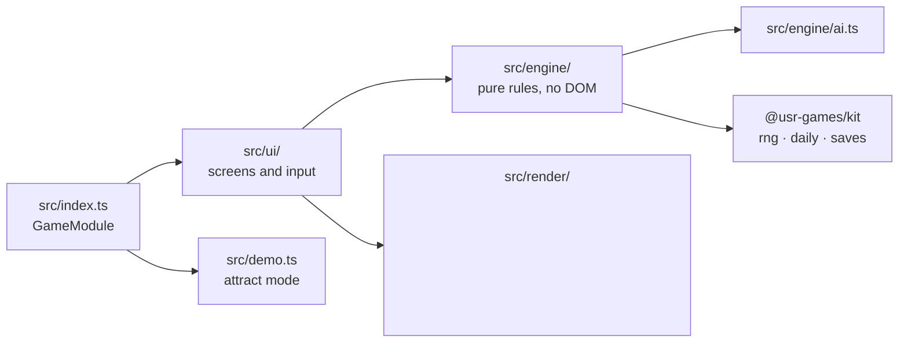
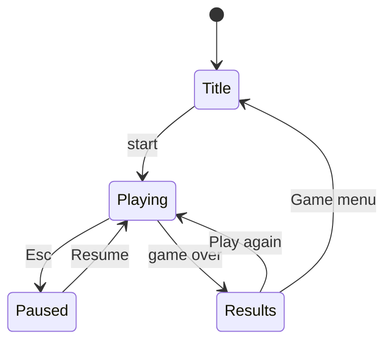

# <Game title> — architecture

<!--
ARCHITECTURE.md is for programmers who will change this game later. Say where everything lives
and how to change it. Diagrams in Mermaid only. Replace every <placeholder> and delete these comments.
-->

## Overview

<!-- Two sentences: native or hosted, rendering technology (SVG / Canvas / WebGL), engine size. -->

## Module map

| Path           | Responsibility                                                   |
| -------------- | ---------------------------------------------------------------- |
| `src/index.ts` | `mount`, `demo`, `achievements` (the kit contract)               |
| `src/engine/`  | <State, rules, scoring, daily generation; seeded, deterministic> |
| `src/render/`  | <Drawing>                                                        |
| `src/ui/`      | <Screens, input mapping, pause items>                            |
| `src/lib/`     | <Helpers that are kit candidates>                                |

## State machine

## Engine

<!-- The core loop, data structures, randomness (which kit RNG streams and labels), determinism guarantees. -->

## AI

<!-- How the computer opponent decides; difficulty levels; node or iteration budgets (never wall-clock). -->

## Where visuals are defined

<!-- Every drawable thing and the file/function that draws it; how theme tokens and the accent are read; light and dark differences; reduced-motion behaviour. -->

| Visual  | Defined in            | Change it by |
| ------- | --------------------- | ------------ |
| <Board> | `src/render/board.ts` | <…>          |

## Where sounds are defined

<!-- Every patch (kit synth, no audio files) and when it plays. -->

| Sound  | Patch                       | Plays when |
| ------ | --------------------------- | ---------- |
| <Move> | `src/audio/patches.ts#move` | <…>        |

## Hall integration

<!-- reportResult mapping (outcome, score, stats, xpEvents), packages, pause menu items, daily numbering, share string, saves and their versions/migrations. -->

## Tests

<!-- Unit tests, simulations (with their locked numbers), e2e specs, screenshots; the commands to run each. -->

| Test              | Command                      | What it proves |
| ----------------- | ---------------------------- | -------------- |
| Engine unit tests | `pnpm vitest --project <id>` | <…>            |

## Kit candidates

<!-- Helpers in src/lib/ that other games could use; the wave's kit owner decides. -->
