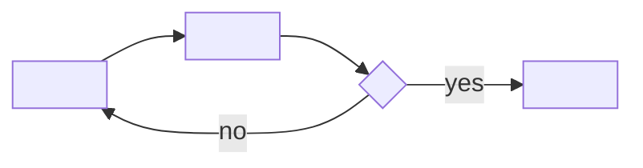

# How to play <Game title>

<!--
HOW-TO-PLAY.md is the player's manual. Write for someone who has never seen a terminal.
The in-game "How to play" screen should say the same things in fewer words.
Replace every <placeholder> and delete these comments.
-->

## Goal

<!-- One or two sentences: how you win, or what a good session looks like. -->

## Controls

<!-- Every action, keyboard first. Mouse and drag alternatives in their own column. Remappable actions are marked. -->

| Action                     | Keyboard            | Mouse            | Remappable |
| -------------------------- | ------------------- | ---------------- | ---------- |
| <Move>                     | <Arrow keys / WASD> | <Click a cell>   | yes        |
| Pause                      | Esc                 | Pause button     | no         |
| Play again (results)       | R                   | Play again       | no         |
| Back to the Hall (results) | H                   | Back to the Hall | no         |

## Rules

<!-- Numbered steps of a turn or a round, then edge cases. Diagrams help: Mermaid only. -->

1. <Step>
2. <Step>

## Modes

<!-- Each mode: what changes, who it is for. Include the daily challenge if there is one: same seed for everyone, numbered by the kit (#N). -->

| Mode      | What changes                                |
| --------- | ------------------------------------------- |
| <Classic> | <…>                                         |
| Daily #N  | <Everyone gets the same <board/seed> today> |

## Settings

<!-- Game-specific settings only; the Hall's settings (appearance, sound, motion, palette) apply everywhere. -->

| Setting      | Options                | Default  |
| ------------ | ---------------------- | -------- |
| <Difficulty> | <Easy · Normal · Hard> | <Normal> |

## Scoring

<!-- How score is computed, what counts as best, what goes into the share string. -->

## Achievements (packages)

<!-- The same list as the manifest's `packages`: id, title, how to earn it. Hidden packages: list them as "hidden". -->

| Package       | How to earn it          |
| ------------- | ----------------------- |
| `<first-win>` | <Win your first round.> |

## XP

This game reports results to the Hall: a completed session, the first win of the day, the daily
challenge and packages all earn XP (see the Hall's rules). <List any game-specific XP events and
weekly cron goals.>

## Tips

- <Tip>
- <Tip>
