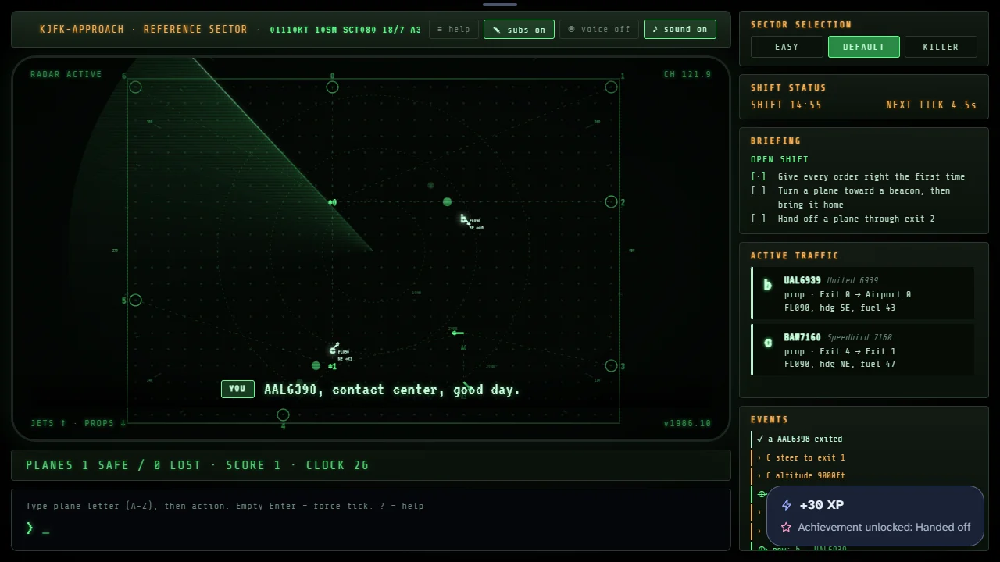

# Control Room 1986

> Type the orders that bring every flight home.

## The hook

You are the controller on a night shift in a room lit by one green radar. Planes appear without
warning at the edges of your sector and at its airports, each with somewhere to be: an airport,
where it must touch down at zero feet flying along the runway arrow, or an exit, where it must
leave at exactly 9,000 feet. You talk to them one typed line at a time. `Aa9` climbs plane A,
`Atd` turns it east, `Ac` parks it in a circle while you think. Every few seconds the radar ticks
and everything moves at once: altitudes change by a thousand feet, headings by up to ninety
degrees, fuel drops. The shift runs until the first plane is lost.

Around that 1986 shift sits a controller's career. Twelve assignments ask for a number of planes
home before your relief takes over, and passing them takes you from Trainee to Chief of the Room.
Every shift opens with a clipboard of tasks that earn commendation stamps, and ends with the room's
printer typing your shift report into a logbook. Once a day, Daily Traffic gives every controller
the same planes.

## Where it comes from

`atc` is Ed James’s air traffic control game from the BSD games, written at UC Berkeley; his own
notice in the sources is dated 1987, and the manual page carries the Regents’ copyright of 1990
and 1993. The manual admits it was based on someone’s description of a game for an unknown
PC, “maybe”. On a terminal it drew the sector as a grid of dots and letters, read every order a
character at a time, and came with fifteen hand-made sectors, among them Default, Easy and
Killer. There was no winning: the score list was sorted by planes safe.

This port was built earlier by the owner of /usr/games Reborn, as a “Control Room 1986” in a web
page, and joined the collection as it was. The collection also has its own new take on `atc`; the
two sit side by side.

## What is new

- A curved phosphor radar: range rings, a compass card, a sweep that turns every six seconds and
  short afterglow trails behind each plane.
- Data blocks beside every plane (flight level, heading and destination) and a traffic panel with
  origin, destination, altitude, heading and fuel, which turns yellow, then red.
- A command line that explains itself: after every key the line above it lists what may come next,
  or describes the finished order.
- A radio: pilots call in, ask for priority when fuel runs short and read back your orders, as
  subtitles and, if you turn it on, a spoken voice that runs on your own device.
- A career of twelve assignments over the three sectors, with ranks, sector endorsements and a
  controller licence that keeps your service record.
- A briefing of tasks before every shift, followed live in the sidebar, one commendation stamp
  each.
- A shift report printed line by line on green-bar paper, kept in a logbook of your last twenty
  shifts.
- Daily Traffic: the same planes and tasks for every controller each day, with a share line.
- A reference card of every order, a fifteen-minute shift clock, an event log and a quiet console
  hum, all drawn and synthesised in code.

## At a glance

|                 |                     |
| --------------- | ------------------- |
| Directory       | `/usr/games/arcade` |
| Players         | 1                   |
| Session         | 5–15 minutes        |
| Daily challenge | yes, Daily Traffic  |
| Inspired by     | `atc` (1986)        |

## More

- [How to play](HOW-TO-PLAY.md)
- [Changes from the original](CHANGES-FROM-ORIGINAL.md)
- [Architecture](ARCHITECTURE.md)
- [Notes](NOTES.md)
