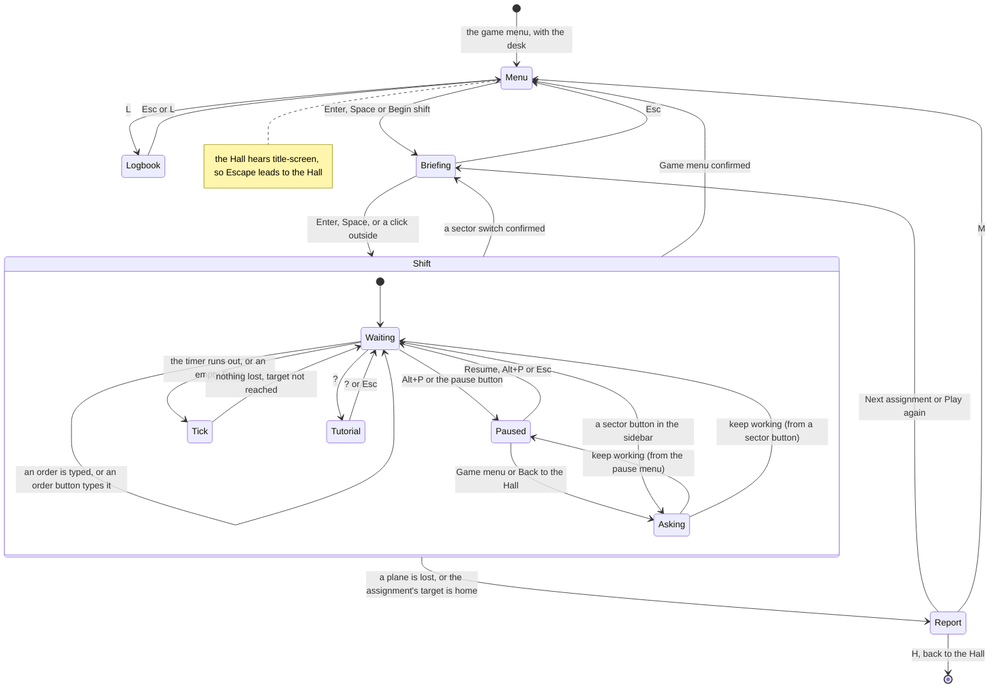
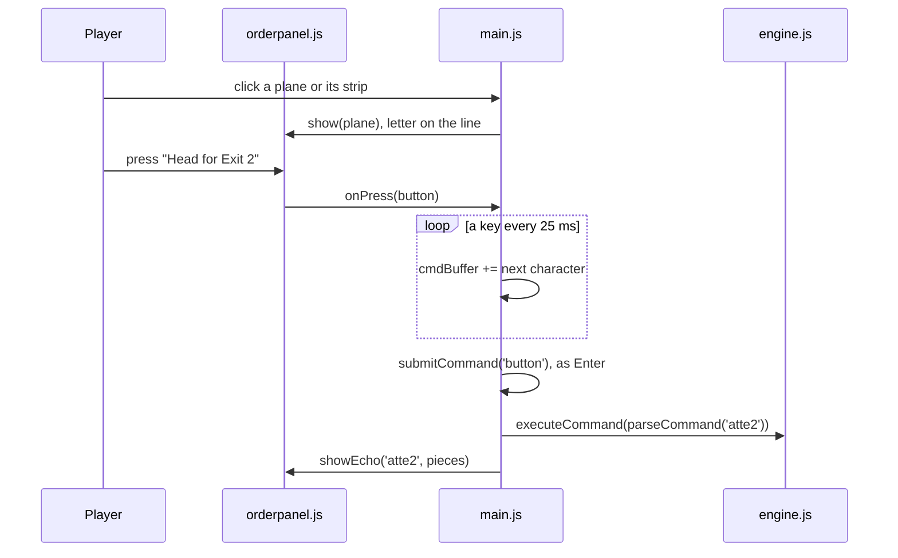

# Control Room 1986 — architecture

## Overview

Control Room 1986 is a **hosted** game: the owner’s finished typed-radar port of `atc`
(“fancy-web”), adopted as it was into `games/atc-classic/app/`. It is vanilla ES modules with no
build step and no dependencies: a Canvas 2D radar, a CSS console around it, Web Audio for every
sound and the browser’s speech synthesis for the optional radio voice. The Hall serves the folder
as it is (`hosted-static`) at `play/atc-classic/`. The rules are a small engine with no DOM (about
490 lines); `main.js` wires it to the page. Around it, the career, the briefing, the Daily, the
shift report and the service record are pure modules added in the collection, drawn by `desk.js`
and saved through `store.js`. Polish P1-C added the order buttons (a pure board in `orders.js`,
drawn by `orderpanel.js`), the pause menu and settings (`sheets.js`, `settings.js`), the
first-shift tips (`tips.js`), invented carriers (`carriers.js`), the radar's palette with its
contrast test (`palette.js`) and the cheat panel's planner (`planner.js`). The upstream design notes are in
[`../app/docs/diff-log.md`](../app/docs/diff-log.md) and its decisions in [`adr/`](adr/).

## Module map

```mermaid
flowchart LR
  html["app/index.html<br/>console layout, all CSS, title,<br/>tutorial and loss screens"] --> bridge["../../bridge/bridge.js<br/>the Hall's bridge"]
  html --> main["src/main.js<br/>input, ticks, radar drawing,<br/>panels, audio, radio"]
  main --> engine["src/engine.js<br/>state, tick, commands, seeded RNG"]
  main --> playfields["src/playfields.js<br/>Easy, Default, Killer"]
  main --> parser["src/parser.js<br/>typed grammar, live hints"]
  main --> chatter["src/chatter.js<br/>radio phrases and spoken forms"]
  main --> planner["src/planner.js<br/>the cheat panel's routes"]
  planner --> hints["src/hints.js<br/>rules of thumb, the fallback"]
  main --> orderpanel["src/orderpanel.js<br/>the order panel"]
  orderpanel --> orders["src/orders.js<br/>the order board"]
  main --> sheets["src/sheets.js<br/>pause menu, settings, questions"]
  main --> settings["src/settings.js<br/>settings and their defaults"]
  main --> tips["src/tips.js<br/>first-shift tips"]
  main --> carriers["src/carriers.js<br/>invented carriers"]
  main --> palette["src/palette.js<br/>radar colours, contrast"]
  chatter --> carriers
  orders --> engine
  planner --> engine
  main --> hall["src/hall.js<br/>results, packages, poster, pause"]
  main --> desk["src/desk.js<br/>game menu desk, briefing,<br/>report, logbook"]
  desk --> career["src/career.js<br/>assignments, ranks"]
  desk --> report["src/report.js<br/>report lines"]
  main --> briefing["src/briefing.js<br/>tasks and their tracker"]
  main --> daily["src/daily.js<br/>number, sector, seed, share"]
  main --> service["src/service.js<br/>service record, logbook"]
  main --> store["src/store.js<br/>saved under usr-games:atc-classic:"]
  hall --> bridge
  parser --> engine
  chatter --> engine
  hints --> engine
  playfields --> engine
```

| Path                    | Responsibility                                                                                        |
| ----------------------- | ----------------------------------------------------------------------------------------------------- |
| `app/index.html`        | The page: the console grid, every style (palette custom properties at the top), title, tutorial, loss |
| `app/src/main.js`       | Keyboard and buttons, the tick timer, drawing the radar, the traffic and event panels, sound, radio   |
| `app/src/engine.js`     | Game state, `tick`, `spawnPlane`, `executeCommand`; Mulberry32 RNG                                    |
| `app/src/playfields.js` | The three sectors: size, tick length, spawn rate, exits, beacons, airports, airway lines              |
| `app/src/parser.js`     | The order grammar, parsed incrementally (`OK`, `PARTIAL` with what may follow, `ERROR`)               |
| `app/src/chatter.js`    | Radio lines for each event, as subtitle text and as spoken text                                       |
| `app/src/hints.js`      | The cheat panel's old rules of thumb, now the planner's last fallback                                 |
| `app/src/planner.js`    | The cheat panel: a route for every plane, planned one after another, and the orders that fly it       |
| `app/src/orders.js`     | The order board: every order a plane can be given, its typed command and what the parser reads        |
| `app/src/orderpanel.js` | The order panel in the sheet beside the radar, the beacon picker, the "Typed as" line                 |
| `app/src/sheets.js`     | The pause menu, the settings and the questions asked before a shift is left                           |
| `app/src/settings.js`   | Order buttons (and their default), radar text size, reference card, tips done                         |
| `app/src/tips.js`       | The three first-shift tips and their placement                                                        |
| `app/src/carriers.js`   | The invented carriers: codes, radio names, call signs                                                 |
| `app/src/palette.js`    | The radar's colours and the contrast arithmetic                                                       |
| `app/src/fonts/`        | Self-hosted VT323 and Share Tech Mono (added on adoption)                                             |
| `app/src/hall.js`       | The bridge glue (added on adoption): results, packages, poster, the Hall's pause                      |
| `app/src/career.js`     | The twelve assignments, ranks, endorsements; the career record and how a shift changes it             |
| `app/src/briefing.js`   | Briefing tasks, their wording, the tracker that follows them through a shift, open-shift draws        |
| `app/src/daily.js`      | Daily Traffic: number (same epoch as the kit), sector by weekday, seed, share line                    |
| `app/src/report.js`     | The shift report as fixed-width lines                                                                 |
| `app/src/service.js`    | The service record and the logbook                                                                    |
| `app/src/store.js`      | Saving under the collection's `usr-games:` prefix                                                     |
| `app/src/desk.js`       | Drawing the game menu's desk, the briefing clipboard and card, the printed report, the logbook        |
| `app/tests/`            | Unit tests (node:test): the upstream five files and the collection's                                  |

## State machine

The game menu is the title screen: Begin shift hides it, and the report's Game menu brings it back
(`showTitle`). The Hall's Game menu reloads the page. The clock stops for a set of reasons
(`pauseReasons`): the briefing being read, the tutorial, the pause menu or a question, the Hall's
pause and a hidden page; it runs again only when none is left. The console (`#app`) is inert while
the game menu covers it, so Tab reaches only the menu. The tutorial opens by itself the first
time the position is taken on a device.

## Order buttons

With the setting on, a click on a plane (radar hit test in `planeAtPoint`, or its strip) selects
it: `selectPlane` puts its letter on the command line (`lineFromSelection`) and the panel shows
`orderBoard(plane, playfield)`. Each button carries its typed command, its pieces with their
meaning, and the command as `parseCommand` reads it. A button is off exactly when the engine,
tried on a copy of the plane, refuses the command or it would change nothing. `pressOrder` types
the command on the line a key at a time (25 ms; whole under reduced motion), waits 320 ms, then
calls `submitCommand('button')`, the same function as Enter, so the engine receives exactly what a
player would have typed. A typed key (`leaveTheButtons`) closes the panel and keeps the line; a key
during a button's typing drops it (`stopTyping`); Enter sends it at once (`finishTyping`). Orders
given with buttons are counted apart (`buttonOrders`) for the setting's default and for the Fluent
nod (50 typed by hand in a shift, `withTypedOrders` in `career.js`).

## Engine

`createGame(playfield, { seed })` returns the state: the playfield, a clock, the planes in the air
and on the ground, the planes safe, and the loss (plane and reason). `main.js` seeds it from
`Math.random()`. `tick(game)` advances one step in the original’s order: planes cleared to climb
leave the ground; each plane in the air (props only on even clocks) burns fuel, moves its altitude
one step and its heading at most two eighths toward the ordered values (or two eighths clockwise
when circling), moves one cell and is checked against its destination and the loss conditions;
planes that arrived are swept up and counted; pairs are checked for collision; and with odds of one
in `newplaneMean` a new plane is placed. It returns the tick’s events (`spawn`, `takeoff`, `land`,
`exit`, `beacon`, `loss`). A loss returns at once, before the sweep, so arrivals in that tick never
reach the score. `executeCommand(game, cmd)` only changes a plane’s ordered altitude, ordered
heading or mark; the tick does the rest. A direction order with a delay (`cmd.delayedBeacon`, from
`@b1` or `ab1`) goes through `executeDelayed`: the beacon must be on the plane's track
(`isOnTrack`), a "towards" order is aimed from the beacon, and the plane keeps its heading
(`delayed`) until the tick that puts it on the beacon, which fires a `beacon` event. Loss reasons
come from `LOSS`, in the room's own words.

Planes are named by a number from 0 to 25: uppercase for jets, lowercase for props. A letter is
reused once its plane has gone.

## The cheat panel

The panel is the owner's testing aid for checking that a shift can be won by hand, so players
never see it: its button is hidden, and it opens for one visit with `?cheat=1` in the address or
Ctrl+Alt+C. The in-Hall suites use the key to type its suggestions.

| What                     | Where                                                                                           |
| ------------------------ | ----------------------------------------------------------------------------------------------- |
| Open with the address    | `cheatLiveVisible` in `app/src/main.js` reads `?cheat=1` once, at load                          |
| Open or close with a key | Ctrl+Alt+C, the first check in `onKeyDown` (`main.js`), on the menu and during a shift          |
| The hidden button        | `#cheat-btn` in `app/index.html` carries `hidden`; its click handler is still wired             |
| The panel itself         | `#cheat-live-panel` in `index.html`, filled by `renderCheatLive` from `planner.js`              |
| Remembered?              | No: the old `atc-fancyweb-cheat-live` key is no longer read or written, so it is off each visit |
| Effect on results        | None: it only suggests, the player types every order, and shifts report and earn as any other   |

To show it to players again, remove `hidden` from `#cheat-btn`; to remove it for good, delete the
panel, `planner.js`, `hints.js` and the key, and the suites' `showCheat` in `e2e/shift.ts` with
them.

Nothing flies the planes; the panel only suggests, and the player types. `planTraffic(game)` plans
every plane in turn, shortest on fuel first, with an A* search over its moves (a quarter turn and
1,000 feet a move, in ticks: props move every other tick) to its exit at 9 or its runway at 0 on the
arrow's heading. Each route reserves its cells tick by tick (`createReservations`), and the planes
planned later keep clear of them by more than one cell or 1,000 feet. A plane with no clear route
gets `safestMove`; a plane on the ground holds short until its climb-out is clear; only then do
`hints.js`'s rules of thumb answer. A row carries `commands`, the fewest orders that fly the start
of the route exactly (`ordersForRoute`). Following every suggestion, no shift was lost over 30
seeds of 300 ticks on any sector (`docs/NOTES.md`); `tests/planner.test.js` keeps that true.

## Where visuals are defined

| Visual                                                      | Defined in                                                               |
| ----------------------------------------------------------- | ------------------------------------------------------------------------ |
| Page palette (phosphor green, dim, bright, amber, red)      | `app/index.html` (custom properties at the top)                          |
| Radar colours, tested for AA contrast                       | `app/src/palette.js`                                                     |
| Radar lettering sizes (and the Radar text size setting)     | `app/src/main.js` (`readablePx`, `radarPx`, `radarFont`)                 |
| Radar: dot grid, range rings, compass card, border, airways | `app/src/main.js` (`render`, `drawRangeRings`, `drawCompassCard`)        |
| Sweep line and its fading trail                             | `app/src/main.js` (`drawRadarSweep`)                                     |
| Exits, beacons, airports and their arrows                   | `app/src/main.js` (`render`, `drawArrow`)                                |
| Planes, data blocks, afterglow trails, the crash marker     | `app/src/main.js` (`drawPlane`, `drawPlaneTrail`, `render`)              |
| Selection brackets                                          | `app/src/main.js` (`drawSelection`)                                      |
| HOME and HANDED OFF: ring and word on the radar             | `app/src/main.js` (`celebrate`, `drawMoments`)                           |
| Stamped strips                                              | `app/src/main.js` (`arrivedStripHtml`) and `.stamp` in the CSS           |
| Title screen scope                                          | `app/src/main.js` (`startTitleScope`)                                    |
| Order panel, pause menu, settings, tips                     | `app/index.html` (CSS), drawn by `orderpanel.js`, `sheets.js`, `tips.js` |
| Console, scanlines, vignette, panels, subtitles, overlays   | `app/index.html` (CSS)                                                   |
| Fonts                                                       | `app/src/fonts/fonts.css`                                                |

Everything is drawn in code; the game has no images. It has one dark look and does not read the
Hall’s tokens or appearance. Reduced motion (in the Hall the Hall’s setting, on its own the
system’s; `motionReduced` in `main.js`, `:root[data-motion]` and the media query in the CSS, where
a Hall at full motion wins over the system): no sweep, each tick's positions fade in over 700 ms;
the menu goes at once; no pulse, blink or dropping stamp; an order button's command appears whole;
the landing ring stands still; the report prints at once.

## Where sounds are defined

Every sound is synthesised in `app/src/main.js` with Web Audio; there are no audio files. On its
own, sound is on by default and starts with the first shift (the audio graph needs a user gesture).
In the Hall the sound switch follows the Hall’s mute for the visit (never saved), and the hum, the
beeps and the voice play at their designed levels scaled by the Hall’s volume (`hallLevel`).

| Sound                                  | Function                      | Plays when                                                                     |
| -------------------------------------- | ----------------------------- | ------------------------------------------------------------------------------ |
| Console hum (42 Hz drone, faint whine) | `createAmbientBed`            | All the time while sound is on                                                 |
| Radar ping                             | `playRadarPing`               | An order is accepted                                                           |
| Key click                              | `playKeyClack`                | A character is typed, deleted, or typed by an order button                     |
| Low blip                               | `playTick`                    | An empty Enter forces a tick                                                   |
| Spawn beep                             | `playSpawn`                   | A new plane appears                                                            |
| Rising chime                           | `playSuccess`                 | A plane lands or leaves by its exit, with the ring and stamp; a relief arrives |
| Falling klaxon                         | `playLoss`                    | A plane is lost                                                                |
| Buzz                                   | `playBeep` in `submitCommand` | An order is refused                                                            |

The radio voice is the browser’s speech synthesis (`speak` in `main.js`), off by default. Since
adoption it speaks only with a voice whose `localService` is true, so nothing is sent to an online
speech service; without one it stays silent and the subtitles still show. While the Hall is muted
it says nothing either, and the subtitles carry on.

## Hall integration

The bridge glue lives in `app/src/hall.js`, plus the bridge script tag in `index.html`; `main.js`
calls it at the moments below.

| Game moment                                                                   | Bridge message                                                                                                                                                                                              |
| ----------------------------------------------------------------------------- | ----------------------------------------------------------------------------------------------------------------------------------------------------------------------------------------------------------- |
| The title screen gains or loses `hiding` (`#title-screen`)                    | `title-screen { active }`, from a `MutationObserver` on its class                                                                                                                                           |
| `endShift` (a plane lost, or an assignment's relief)                          | `result { outcome, score, stats, xpEvents, daily, durationSeconds }`                                                                                                                                        |
| `startNewGame` while a shift that had ticked was still running                | `result { outcome: 'quit', … }` for the abandoned shift                                                                                                                                                     |
| After every tick (`noteTick` right after `tick`)                              | packages `wheels-down`, `handed-off`, `cleared-for-takeoff`, `holding-pattern`, `on-the-beacon`, `minimum-fuel`, `fast-lane`, `steady-hands`, `full-board`, `reference-sector`, `rush-hour`, `double-shift` |
| After every accepted order (`noteCommand` in `submitCommand`)                 | remembers circling and beacon-bound planes for their packages                                                                                                                                               |
| A radar frame drawn six seconds into the first shift, with a plane in the air | `poster`, through `posterFromCanvas` on `#radar`, once per visit                                                                                                                                            |
| The report's Back to the Hall, or the pause menu's (after its question)       | `navigate { to: 'hall' }`                                                                                                                                                                                   |
| The Hall's `pause` and `resume` (its pause menu, its hidden tab)              | `onHallPause` stops and restarts the clock and quiets the room                                                                                                                                              |
| The Hall's sound arrives or changes                                           | `onHallSound` turns the sound switch with the Hall's mute, for the visit only; `hallLevel(level)` scales the hum, the beeps and the voice by the Hall's volume (0 while muted, so the voice stays silent)   |
| The Hall's reduced motion arrives or changes                                  | `hallReducedMotion()` (through `motionReduced`) stills the radar and the report; `data-motion` on the root stills the CSS                                                                                   |

- **Outcome.** A career assignment is `win` when its relief arrives and `loss` when a plane is lost
  first. An open shift or the Daily is `win` when at least one plane was brought home before the
  loss and `loss` when none was (ADR 0011: an endless game wins at its first milestone). `quit` for
  a shift abandoned with the sidebar's sector buttons (after their question) after at least one
  tick. Leaving through the
  Hall's strip reports nothing, as in the other adopted games.
- **Daily.** `daily: true` on every Daily Traffic shift; the Hall gives its daily XP once a day.
- **Score.** The planes safe, which is the game's own `SCORE`.
- **Stats.** `planesSafe`, `landings`, `exits` and `stamps`, feeding the weekly goals "Guide {n}
  planes home" (10–30) and "Earn {n} commendation stamps" (4–12).
- **XP events.** `planes-safe`: 3 XP per plane, at most 18; `stamps`: 3 per stamp (at most 12 on
  an assignment); `promotion`: 6. None for a quit. The Hall caps the session's events at 30.
- **Packages.** Counted only from ticks that did not lose a plane, so they agree with the score.
- **Saves.** `store.js` keeps `career`, `service`, `logbook`, `desk`, `licence` and `settings` under
  `usr-games:atc-classic:` with a version, so the Hall's "Forget everything" clears them. The
  older display switches (sound, voice, subtitles) keep their upstream keys; the reference card's
  state moved into `settings`, closed by default.

Escape on the game menu leads to the Hall; on the briefing it goes back to the game menu. Escape
that closes the tutorial, the settings or a question is marked as handled, on the menu as during a
shift, so the bridge leaves it alone. The game does not follow the Hall's appearance messages. Opened on its own,
the bridge script is missing and `hall.js` does nothing; the report then offers no Back to the
Hall, and the page's own `visibilitychange` still pauses the clock.

## Tests

| Test                        | Command                                                                  | What it proves                                                                                                                                                                                                                                                                                                                                                                                                                                                                                                                     |
| --------------------------- | ------------------------------------------------------------------------ | ---------------------------------------------------------------------------------------------------------------------------------------------------------------------------------------------------------------------------------------------------------------------------------------------------------------------------------------------------------------------------------------------------------------------------------------------------------------------------------------------------------------------------------- |
| Unit tests (115)            | `pnpm run test:hosted` (or `node --test "tests/*.test.js"` in `app/`)    | The upstream five files (65): engine, radio phrases, the rules of thumb, autoplay, stress. `career.test.js` (16): the career, briefing, Daily, report and service record. `orders.test.js` (5): every button over 360 random states types exactly the command it means and the engine treats the two the same. `delay.test.js` (9), `planner.test.js` (5): no shift lost on any sector, a landing talked down. `settings.test.js` (9), `contrast.test.js` (2), `names.test.js` (4): no real airline or airport, no guard exception |
| In the Hall (24)            | `pnpm exec playwright test -c games/atc-classic e2e/atc-classic.spec.ts` | Opens on its menu with no outside requests; losses and wins reported; one poster per visit; a sector switch asks, then reports a quit; Escape, `?` and the tutorial on the menu and in a shift; the voice; the Hall's sound, motion and pause; the strip; Back to the Hall, Game menu, browser Back and Escape on the menu                                                                                                                                                                                                         |
| The career in the Hall (6)  | `pnpm exec playwright test -c games/atc-classic e2e/career.spec.ts`      | The cheat hidden until its key; the first assignment to its relief, report and logbook; the Daily as the daily challenge; a hidden page stops the clock; a lost assignment tried again                                                                                                                                                                                                                                                                                                                                             |
| The polish in the Hall (10) | `pnpm exec playwright test -c games/atc-classic e2e/polish.spec.ts`      | A first shift by mouse alone (radar click, buttons, pause, Game menu with its question); a shift by keyboard alone (Alt keys, the first assignment, results order); mixed play; a seasoned record starts with the buttons off; every way out of a shift; the results order of every report; reduced motion; AA contrast of every line of text on every screen                                                                                                                                                                      |
| Screenshots                 | `SHOTS=1 pnpm exec playwright test -c games/atc-classic`                 | `docs/media/`: the menu, a shift on Default, a plane handed off, the briefing, a printed report, the logbook (1280×720); `docs/media/polish/`: the P1-C frames at 1920×1080                                                                                                                                                                                                                                                                                                                                                        |

The game has no test hooks or URL options besides the hidden cheat, so the in-Hall suites play it
through the keyboard (`e2e/shift.ts`): they seed `Math.random` inside the game's frame so the
engine's seed and the traffic repeat, choose a tab and begin, take the position, open the cheat
with its key, type its suggestions and force ticks with empty Enters. Set `HALL_PORT` when the
Hall's usual port (5173) is taken.

## Kit candidates

None: hosted games talk to the Hall only through the bridge.
