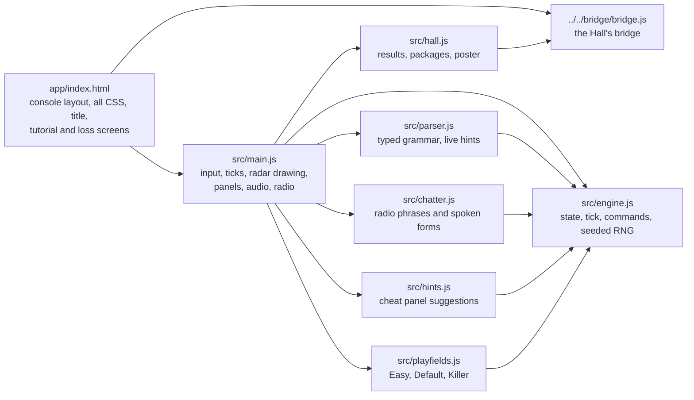
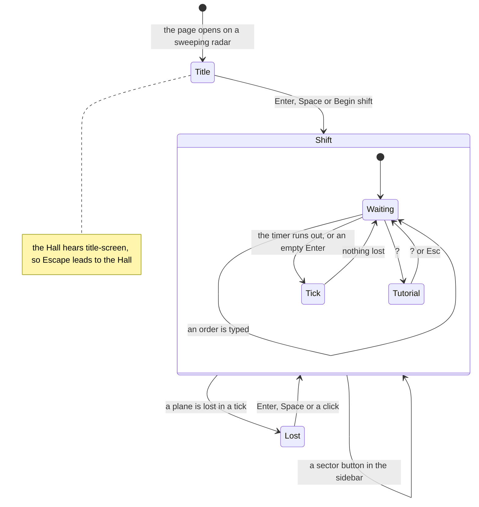

# Control Room 1986 — architecture

## Overview

Control Room 1986 is a **hosted** game: the owner’s finished typed-radar port of `atc`
(“fancy-web”), adopted as it was into `games/atc-classic/app/`. It is vanilla ES modules with no
build step and no dependencies: a Canvas 2D radar, a CSS console around it, Web Audio for every
sound and the browser’s speech synthesis for the optional radio voice. The Hall serves the folder
as it is (`hosted-static`) at `play/atc-classic/`. The rules are a small engine with no DOM (about
490 lines); `main.js` wires it to the page. The upstream design notes are in
[`../app/docs/diff-log.md`](../app/docs/diff-log.md) and its decisions in [`adr/`](adr/).

## Module map

| Path                    | Responsibility                                                                                        |
| ----------------------- | ----------------------------------------------------------------------------------------------------- |
| `app/index.html`        | The page: the console grid, every style (palette custom properties at the top), title, tutorial, loss |
| `app/src/main.js`       | Keyboard and buttons, the tick timer, drawing the radar, the traffic and event panels, sound, radio   |
| `app/src/engine.js`     | Game state, `tick`, `spawnPlane`, `executeCommand`; Mulberry32 RNG                                    |
| `app/src/playfields.js` | The three sectors: size, tick length, spawn rate, exits, beacons, airports, airway lines              |
| `app/src/parser.js`     | The order grammar, parsed incrementally (`OK`, `PARTIAL` with what may follow, `ERROR`)               |
| `app/src/chatter.js`    | Radio lines for each event, as subtitle text and as spoken text                                       |
| `app/src/hints.js`      | The cheat panel: one suggested order per plane, most urgent first                                     |
| `app/src/fonts/`        | Self-hosted VT323 and Share Tech Mono (added on adoption)                                             |
| `app/src/hall.js`       | The bridge glue (added on adoption)                                                                   |
| `app/tests/`            | The upstream unit tests (node:test)                                                                   |

## State machine

The title screen shows only once per visit: Begin shift adds its `hiding` class and then hides it
for good, and a new shift after a loss starts straight away on the same sector. The Hall’s Game
menu reloads the page, which brings the title back. The tutorial opens by itself 0.4 s into the
first shift on a device and pauses the tick timer and the shift clock while it is open; nothing
else pauses the game.

## Engine

`createGame(playfield, { seed })` returns the state: the playfield, a clock, the planes in the air
and on the ground, the planes safe, and the loss (plane and reason). `main.js` seeds it from
`Math.random()`. `tick(game)` advances one step in the original’s order: planes cleared to climb
leave the ground; each plane in the air (props only on even clocks) burns fuel, moves its altitude
one step and its heading at most two eighths toward the ordered values (or two eighths clockwise
when circling), moves one cell and is checked against its destination and the loss conditions;
planes that arrived are swept up and counted; pairs are checked for collision; and with odds of one
in `newplaneMean` a new plane is placed. It returns the tick’s events (`spawn`, `takeoff`, `land`,
`exit`, `beacon`, `loss`). A loss returns at once, before the sweep, so arrivals in that tick never
reach the score. `executeCommand(game, cmd)` only changes a plane’s ordered altitude, ordered
heading or mark; the tick does the rest.

Planes are named by a number from 0 to 25: uppercase for jets, lowercase for props. A letter is
reused once its plane has gone.

## The cheat panel

There is no AI flying the planes. `hints.js` looks at each plane on its own (and at its neighbours
for separation) and returns one suggested order with a priority: `urgent` (avoid a collision, fuel
at 6 or less, a wall next tick, a wrong-altitude arrival), `normal` (a step toward the
destination) or `ok` (nothing to type). For airports it routes the plane to the runway’s approach
line first, then matches altitude to distance. The panel only shows the text; the player types it.
The upstream stress test follows every suggestion for every plane: on Easy it brings home 3.2
planes a shift on average over 30 seeds, on Default 2.6 over 20, and every run ends in a loss.

## Where visuals are defined

| Visual                                                      | Defined in                                                        |
| ----------------------------------------------------------- | ----------------------------------------------------------------- |
| Palette (phosphor green, dim, bright, amber, red)           | `app/index.html` (custom properties at the top) and `main.js`     |
| Radar: dot grid, range rings, compass card, border, airways | `app/src/main.js` (`render`, `drawRangeRings`, `drawCompassCard`) |
| Sweep line and its fading trail                             | `app/src/main.js` (`drawRadarSweep`)                              |
| Exits, beacons, airports and their arrows                   | `app/src/main.js` (`render`, `drawArrow`)                         |
| Planes, data blocks, afterglow trails, the crash marker     | `app/src/main.js` (`drawPlane`, `drawPlaneTrail`, `render`)       |
| Title screen radar                                          | `app/src/main.js` (`startTitleRadarLoop`)                         |
| Console, scanlines, vignette, panels, subtitles, overlays   | `app/index.html` (CSS)                                            |
| Fonts                                                       | `app/src/fonts/fonts.css`                                         |

Everything is drawn in code; the game has no images. It has one dark look and does not read the
Hall’s tokens, appearance or reduced-motion setting.

## Where sounds are defined

Every sound is synthesised in `app/src/main.js` with Web Audio; there are no audio files. Sound is
on by default and starts with the first shift (the audio graph needs a user gesture).

| Sound                                  | Function                      | Plays when                          |
| -------------------------------------- | ----------------------------- | ----------------------------------- |
| Console hum (42 Hz drone, faint whine) | `createAmbientBed`            | All the time while sound is on      |
| Radar ping                             | `playRadarPing`               | An order is accepted                |
| Key click                              | `playKeyClack`                | A character is typed or deleted     |
| Low blip                               | `playTick`                    | An empty Enter forces a tick        |
| Spawn beep                             | `playSpawn`                   | A new plane appears                 |
| Rising chime                           | `playSuccess`                 | A plane lands or leaves by its exit |
| Falling klaxon                         | `playLoss`                    | A plane is lost                     |
| Buzz                                   | `playBeep` in `submitCommand` | An order is refused                 |

The radio voice is the browser’s speech synthesis (`speak` in `main.js`), off by default. Since
adoption it speaks only with a voice whose `localService` is true, so nothing is sent to an online
speech service; without one it stays silent and the subtitles still show.

## Hall integration

All of it lives in `app/src/hall.js`, plus the bridge script tag in `index.html` and one import
and five calls in `main.js`.

| Game moment                                                                   | Bridge message                                                                                                                                                                                              |
| ----------------------------------------------------------------------------- | ----------------------------------------------------------------------------------------------------------------------------------------------------------------------------------------------------------- |
| The title screen gains `hiding` (`#title-screen`)                             | `title-screen { active }`, from a `MutationObserver` on its class                                                                                                                                           |
| `endGame` (a plane lost)                                                      | `result { outcome, score, stats, xpEvents, durationSeconds }`                                                                                                                                               |
| `startNewGame` while a shift that had ticked was still running                | `result { outcome: 'quit', … }` for the abandoned shift                                                                                                                                                     |
| After every tick (`noteTick` right after `tick`)                              | packages `wheels-down`, `handed-off`, `cleared-for-takeoff`, `holding-pattern`, `on-the-beacon`, `minimum-fuel`, `fast-lane`, `steady-hands`, `full-board`, `reference-sector`, `rush-hour`, `double-shift` |
| After every accepted order (`noteCommand` in `submitCommand`)                 | remembers circling and beacon-bound planes for their packages                                                                                                                                               |
| A radar frame drawn six seconds into the first shift, with a plane in the air | `poster`, through `posterFromCanvas` on `#radar`, once per visit                                                                                                                                            |

- **Outcome.** `win` when at least one plane was brought home before the loss, `loss` when none
  was (ADR 0011: an endless game wins at its first milestone); `quit` for a shift abandoned with
  the sidebar’s sector buttons after at least one tick. Leaving through the Hall’s strip reports
  nothing, as in the other adopted games.
- **Score.** The planes safe, which is the game’s own `SCORE`.
- **Stats.** `planesSafe`, `landings` and `exits`, feeding the weekly goal “Guide {n} planes home”
  (10–30).
- **XP events.** `planes-safe`: 3 XP per plane, at most 25; none for a quit.
- **Packages.** Counted only from ticks that did not lose a plane, so they agree with the score.
- **The cheat panel** changes nothing here: it suggests, the player types.

`main.js` calls `noteShiftStarted` at the end of `startNewGame`, `noteTick` right after `tick`,
`noteShiftEnded` at the top of `endGame`, `noteCommand` once an order is accepted, and offers the
poster right after `render()` in the frame loop. Escape on the title screen leads to the Hall; the
tutorial cannot open there (the game ignores `?` until a shift begins), and during a shift the
game marks the Escape that closes it as handled. The game ignores the Hall’s pause, appearance and
settings messages. Opened on its own, the bridge script is missing and `hall.js` does nothing.

## Tests

| Test                     | Command                                                               | What it proves                                                                                                                                                                                                                                                                                                                                                                                                                                               |
| ------------------------ | --------------------------------------------------------------------- | ------------------------------------------------------------------------------------------------------------------------------------------------------------------------------------------------------------------------------------------------------------------------------------------------------------------------------------------------------------------------------------------------------------------------------------------------------------ |
| Upstream unit tests (65) | `pnpm run test:hosted` (or `node --test "tests/*.test.js"` in `app/`) | Five files: the engine (30), the radio phrases (10), the cheat suggestions (15), autoplay landings and departures (5) and the stress runs over 50 seeds (5)                                                                                                                                                                                                                                                                                                  |
| In the Hall (13)         | `pnpm exec playwright test -c games/atc-classic`                      | Opens on its title with no outside requests; a shift with nobody at the controls reports a loss; following the suggestions brings a plane home and reports a win with its package; one poster per visit; a sector switch mid-shift reports a quit; Escape and the tutorial on the title and during a shift; the voice uses only an on-device voice and the subtitles carry on without one; Back to the Hall, Game menu, browser Back and Escape on the title |
| Screenshots              | `SHOTS=1 pnpm exec playwright test -c games/atc-classic`              | `docs/media/` (title, a shift on Default, a plane handed off with the radio reading it back)                                                                                                                                                                                                                                                                                                                                                                 |

The game has no test hooks or URL options, so the in-Hall suite plays it through the keyboard
(`e2e/shift.ts`): it seeds `Math.random` inside the game’s frame so the engine’s seed and the
traffic repeat, begins a shift, types the cheat panel’s suggestions and forces ticks with empty
Enters. Set `HALL_PORT` when the Hall’s usual port (5173) is taken.

## Kit candidates

None: hosted games talk to the Hall only through the bridge.
