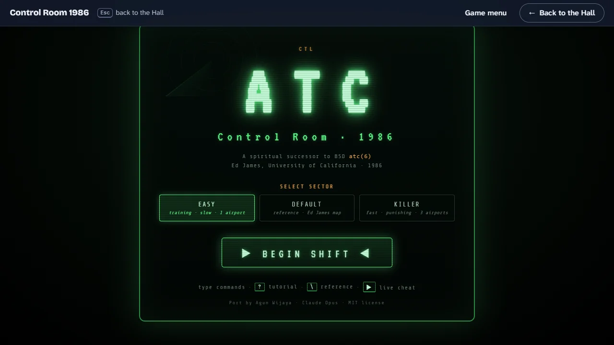
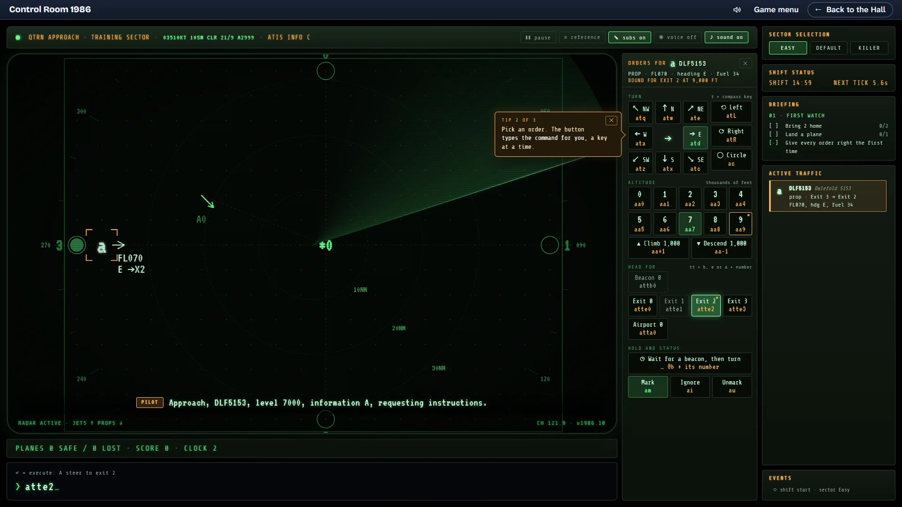
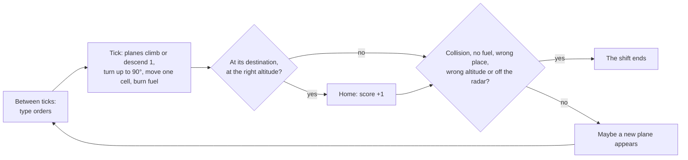
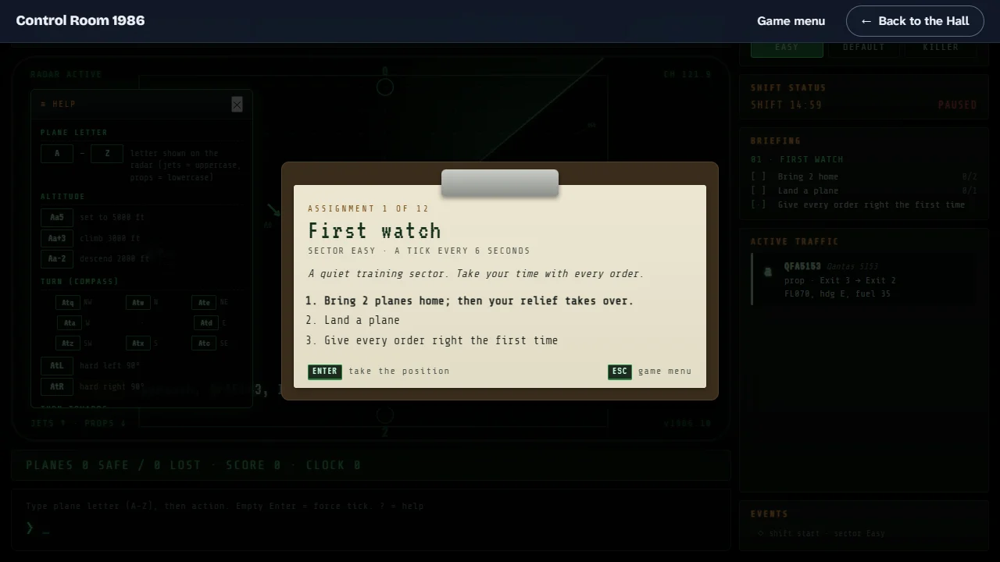
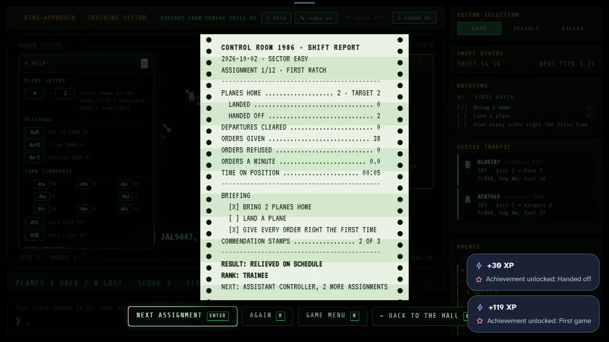

# How to play Control Room 1986

## Goal

Bring planes home without losing one. Each plane has one destination: an airport, where it must
arrive at altitude 0 flying in the direction of the runway arrow, or an exit on the edge of the
radar, where it must arrive at altitude 9 (9,000 feet). Any shift ends the moment a plane is lost.

There are three ways to work a shift, chosen on the game menu:

- **Career:** twelve assignments, each asking for a number of planes home; when you reach it, your
  relief controller takes over and the assignment is passed. Passing assignments raises your rank,
  from Trainee to Chief of the Room.
- **Open shift:** the 1986 way, new traffic until a plane is lost, on the sector of your choice.
- **Daily Traffic:** one shift a day with the same traffic and the same briefing for every
  controller.

Every shift opens with a **briefing** of tasks on a clipboard; each one done earns a commendation
stamp. When it ends, the room's printer types a **shift report**, and it goes into your
**logbook**.



## Two ways to give an order

Every order is a short line typed at the `>` prompt under the radar, in the language of the 1986
game (see [Orders](#orders)). You can type it, or let the **order buttons** type it for you:

1. Click a plane on the radar, or its strip in the traffic list. Amber brackets mark it, its strip
   lights up, and its letter appears on the command line.
2. The order panel beside the radar shows what that plane can do now: turn (the compass laid out as
   the keys `q w e / a · d / z x c`), hard left or right, circle, an altitude from 0 to 9 or 1,000
   feet up or down, head for any beacon, exit or airport, wait for a beacon, mark, ignore or
   unmark. Under each button is the command it types. A ★ marks the plane’s destination and the
   altitude it needs there; a dashed button is one the plane cannot use now, or an order it is
   already following.
3. Press one. It types its command on the line a key at a time, leaves it there a beat and sends
   it, exactly as if you had typed it and pressed Enter. Under the panel, **Typed as** shows the
   command piece by piece for two seconds, with a link to its line on the reference card.

Typing always works as before. A key you type goes to the command line and closes the panel: click
a plane, then type the rest of its order, if you like. Enter on the letter a click put there
brings the next tick, as an empty line does.

The order buttons are on for a new career, and off if your record already shows 50 orders typed by
hand; switch them in the settings, in the pause menu or with Alt+O. On the first shift of a new
career three small tips walk you through it (select a plane, press an order, watch what it typed);
each goes for good once done or dismissed.



## Controls

Keys are the game’s own and cannot be remapped from the Hall.

| Action                                   | Keyboard                          | Mouse                                      |
| ---------------------------------------- | --------------------------------- | ------------------------------------------ |
| Career, Open shift, Daily Traffic        | 1, 2, 3 (or ← →)                  | The tabs on the game menu                  |
| Choose an assignment or a sector         | ↑ ↓                               | Click it                                   |
| Open the logbook (game menu)             | L                                 | LOGBOOK                                    |
| Read another page of the logbook         | ↑ ↓                               | Click a row                                |
| Close the logbook                        | Esc or L                          | Outside the pages                          |
| Settings (game menu)                     | S                                 | SETTINGS                                   |
| How to play (game menu or shift)         | ?                                 | HOW TO PLAY in the pause menu              |
| Begin the shift (game menu)              | Enter or Space                    | ▶ BEGIN SHIFT ◀                            |
| Take the position (briefing)             | Enter or Space                    | Outside the clipboard                      |
| Back to the game menu (briefing)         | Esc                               | —                                          |
| Select a plane for the order buttons     | —                                 | Click it on the radar, or its strip        |
| Type an order                            | Letters, digits, `+`, `-` and `@` | Press an order button                      |
| Give the order                           | Enter                             | (the button sends it)                      |
| Force the next tick now                  | Enter on an empty line            | —                                          |
| Delete the last character                | Backspace                         | —                                          |
| Clear the line, close the order panel    | Esc                               | ✕ on the panel                             |
| Pause (settings and the ways out)        | Alt+P                             | ❚❚ pause                                   |
| Resume                                   | Alt+P or Esc                      | ▶ RESUME                                   |
| Close the tutorial                       | ? or Esc                          | ✕ close, or outside its panel              |
| Reference card of every order            | `\`                               | ≡ reference, ✕ on the card                 |
| Order buttons on or off                  | Alt+O                             | Settings or the pause menu                 |
| Radar text size                          | Alt+T                             | Settings or the pause menu                 |
| Subtitles, voice, sound                  | Alt+S, Alt+V, Alt+M               | ✎ subs, ◉ voice, ♪ sound                   |
| Start an open shift on another sector    | —                                 | Easy, Default or Killer, then confirm      |
| Finish printing the report               | Any key                           | Click the paper                            |
| Next assignment (report)                 | Enter                             | NEXT ASSIGNMENT                            |
| Play again (report)                      | R                                 | PLAY AGAIN                                 |
| Game menu (report)                       | M                                 | GAME MENU                                  |
| Back to the Hall (report)                | H                                 | ← BACK TO THE HALL                         |
| Copy the Daily's share line (report)     | S                                 | COPY SHARE LINE                            |
| Leave a shift for the game menu          | Alt+P, then GAME MENU, confirm    | The same, or Game menu on the Hall’s strip |
| Leave a shift for the Hall               | Alt+P, then BACK TO THE HALL      | The same, or the Hall’s strip              |
| Leave for the Hall from the title screen | Esc                               | ← Back to the Hall on the Hall’s strip     |

A button reached with Tab takes Enter and Space; a button you clicked does not keep them, so Enter
still sends the command line. Escape stays the command line’s clear key, as in 1986, so the pause
menu has Alt+P and its own button.

### Orders

Every order starts with a plane’s letter, as shown on the radar; the case you type does not matter.
Then comes the action. While you type, the line above the prompt lists what may come next, or
describes the finished order.

| You type               | What it does                                                                   |
| ---------------------- | ------------------------------------------------------------------------------ |
| `Aa5`                  | Plane A climbs or descends to altitude 5 (5,000 feet); `Aa0` lands or holds it |
| `Aa+3` or `Aac3`       | Plane A climbs 3,000 feet from where it is (never above 9)                     |
| `Aa-2` or `Aad2`       | Plane A descends 2,000 feet (never below 0)                                    |
| `Atw`, `Ate`, `Atd` …  | Plane A turns to a compass direction (see the compass below)                   |
| `AtL`, `AtR`           | Plane A turns 90 degrees left or right                                         |
| `Attb0`                | Plane A turns toward beacon 0 (`*0` on the radar)                              |
| `Atta1`                | Plane A turns toward airport 1 (`A1`)                                          |
| `Atte2`                | Plane A turns toward exit 2 (the `2` on the edge)                              |
| `Ac`                   | Plane A circles clockwise where it is, until you give it a new heading         |
| `Am`, `Ai`, `Au`       | Mark, ignore or unmark plane A: bright, dim or plain green on the radar        |
| `Atd@b1` (or `Atdab1`) | Plane A flies on to beacon 1, then turns east there                            |

Any turn or circle can **wait for a beacon** this way, as long as the beacon lies ahead on the
plane’s present track (it would otherwise never get there). A "towards" order is then aimed from
the beacon: `Atte2@b0` turns toward exit 2 from beacon 0. Altitude and status orders cannot wait,
and leave a waiting turn alone; a new turn replaces it. The strip shows `turns at *1` meanwhile.

The eight directions sit around the `s` key, as in the original:

```
q  w  e        NW  N  NE
a     d   =    W       E
z  x  c        SW  S  SE
```

A plane on the ground at an airport waits there until it is given an altitude above 0
(`Ba+7`, say); it leaves the ground on the next tick and climbs away along the runway arrow.

## Rules

1. The radar moves in **ticks**: every 6 seconds on Easy, 5 on Default and 3 on Killer. Between
   ticks nothing moves, so you have time to type. An empty Enter skips the wait.
2. On each tick, every **jet** (an uppercase letter) moves one cell along its heading; a **prop**
   (a lowercase letter) moves only on every other tick.
3. When a plane moves, its altitude changes by at most 1 (1,000 feet) toward the altitude you
   gave it, its heading turns by at most 90 degrees toward the heading you gave it, and it burns
   one unit of fuel.
4. A plane that reaches its airport at altitude 0 flying along the runway arrow, or its exit at
   altitude 9, is home: it leaves the radar and adds one to your score.
5. New planes appear now and then, at an exit at altitude 7 heading into the sector, or on the
   ground at an airport. They start with as much fuel as the sector is wide plus tall.



**The shift ends** the moment any of these happens:

- two planes in the air come within one cell of each other (diagonals included) while no more
  than 1,000 feet apart ("lost separation");
- a plane runs out of fuel ("fuel exhausted, diverted");
- a plane reaches its own exit below 9,000 feet;
- a plane comes down to altitude 0 at the wrong airport, at its own airport against the arrow, at
  an airport when it should leave by an exit, or anywhere away from an airport;
- a plane flies off the edge of the radar.

The edge cells, exits included, are part of the radar: a plane may fly along them and over other
exits. Only its own exit at 9,000 feet takes it home, and only leaving the grid ends the shift.

## Modes

### Sectors

Three sectors. An assignment says which it uses; an open shift is on the sector you choose; the
Daily's sector is set by the day of the week (Easy on Mondays and Thursdays, Killer on Sundays,
Default the other days).

| Sector  | Size  | Tick | A new plane about every | Exits | Airports | Beacons | Fuel at start |
| ------- | ----- | ---- | ----------------------- | ----- | -------- | ------- | ------------- |
| Easy    | 20×15 | 6 s  | 8 ticks                 | 4     | 1        | 1       | 35            |
| Default | 30×21 | 5 s  | 5 ticks                 | 7     | 2        | 2       | 51            |
| Killer  | 30×21 | 3 s  | 3 ticks                 | 7     | 3        | 3       | 51            |

The sector buttons in the sidebar start a new open shift on that sector; during a shift they ask
first, since the shift under way stops and is not printed.
The `SHIFT` clock counts down fifteen minutes; reaching zero with the shift still running completes
the briefing task "Stay on position for the full 15 minutes", and the shift carries on.

### Career

Twelve assignments, open one after another. Each has a target of planes home and two tasks; reach
the target and your relief takes over, which passes the assignment. A plane lost first ends it, and
you can try again at once.

| #   | Assignment           | Sector  | Target |
| --- | -------------------- | ------- | ------ |
| 1   | First watch          | Easy    | 2      |
| 2   | Wheels down          | Easy    | 3      |
| 3   | Morning push         | Easy    | 5      |
| 4   | The reference sector | Default | 3      |
| 5   | Two fields           | Default | 5      |
| 6   | Long afternoon       | Easy    | 8      |
| 7   | Handoffs             | Default | 7      |
| 8   | Fast lane            | Killer  | 2      |
| 9   | Evening rush         | Default | 9      |
| 10  | Short fuse           | Killer  | 4      |
| 11  | Double watch         | Default | 12     |
| 12  | Midnight in the room | Killer  | 7      |

Each assignment earns up to three stamps: its target and its two tasks. A stamp counts only on a
pass, and replaying keeps your best.

| Rank                 | Asks for                         |
| -------------------- | -------------------------------- |
| Trainee              | —                                |
| Assistant Controller | 3 assignments passed             |
| Controller           | 6                                |
| Senior Controller    | 9                                |
| Watch Supervisor     | all 12                           |
| Chief of the Room    | all 12, with 30 of the 36 stamps |

Passing every assignment of a sector stamps its **endorsement** on your licence. One more stamp,
**Fluent**, goes on the licence the first time you give 50 orders typed by hand (without the
order buttons) in one shift, and that shift’s report says so.

### Open shift

New traffic until a plane is lost, as in 1986, with three tasks drawn for the sector. The licence
keeps your best open shift on each sector.

### Daily Traffic

One shift a day, numbered like every daily challenge in the Hall (#1 was 1 September 2026). The
planes, the moments they appear and the three tasks are the same for every controller that day.
The first flight of the day is the one on record; you can fly it again for practice. The report
offers a share line without a link:

```text
Control Room 1986 #32 · Default · 7 home · 🟩🟩⬜
```

One square per briefing task: green when done.

### The briefing

| Task                                                 | Done when                                                       |
| ---------------------------------------------------- | --------------------------------------------------------------- |
| Land _n_ planes (at airport _a_)                     | that many land (at that airport)                                |
| Hand off _n_ planes through the exits (exit _e_)     | that many leave by their exits (one by that exit)               |
| Clear _n_ departures off the ground                  | that many take off                                              |
| Turn a plane toward a beacon, then bring it home     | a plane given `ttb` comes home                                  |
| Park a plane in a holding circle, then bring it home | a plane given `c` comes home                                    |
| Give every order right the first time                | at the end, if no order was refused by the parser or the engine |
| Keep every pilot off minimum fuel                    | at the end, if no plane in the air fell to fuel 6               |
| Stay on position for the full 15 minutes             | the shift clock reaches zero with the shift still running       |

The briefing card in the sidebar follows each task as you work: `[✓]` done, `[·]` holding,
`[✗]` broken. Nothing counts from the tick that loses a plane.



## Settings

SETTINGS on the game menu (S) and the pause menu during a shift (Alt+P, or ❚❚ pause) hold them all;
the bar along the top of the console has the radio switches and the reference card too. They are
remembered on this device. In the Hall the sound switch follows the Hall’s mute instead, without
changing what is remembered.

| Setting         | Options                                                         | Default                                   | Key   |
| --------------- | --------------------------------------------------------------- | ----------------------------------------- | ----- |
| Order buttons   | The order panel beside the radar, or typing only                | On; off once 50 orders were typed by hand | Alt+O |
| Radar text size | Standard, Large or Extra large: data blocks, labels and numbers | Standard                                  | Alt+T |
| Reference card  | Every order on a card docked beside the radar                   | Closed                                    | `\`   |
| Subtitles       | The radio lines written on the radar, or not                    | On                                        | Alt+S |
| Voice           | Pilots and you speak the radio lines aloud, or not              | Off                                       | Alt+V |
| Sound           | The console hum and the beeps, on or off                        | On (in the Hall, as the Hall’s sound is)  | Alt+M |

The pause menu lists, in order: Resume, the order buttons’ switch, How to play, the settings, Game
menu and Back to the Hall. The two ways out ask first: a shift left that way stops and is not
printed or logged.

Standard text is never smaller than 14 pixels at 1920×1080 or 12 at 1280×720; Large and Extra
large are a quarter and a half bigger. Every line of text in the game reaches the AA contrast of
the accessibility guidelines.

The voice uses only a speech voice that runs on your own device; where the browser offers none,
the radio stays silent and the subtitles carry on. In the Hall the hum, the beeps and the voice
are as loud as the Hall’s volume allows, and while the Hall is muted the room and the voice are
silent; the subtitles carry on. The tutorial opens by itself when you take the position for the
first time.

The shift clock stops while the briefing is open, while the tutorial or the pause menu is open,
while the Hall's own pause is up and while the page is hidden; the room goes quiet in the last two.

Your career, service record and logbook are kept in this browser with the rest of the collection,
and the Hall's "Forget everything" clears them too.

With reduced motion (the Hall’s setting, or on its own your system’s) the radar has no sweep: each
tick’s new positions fade in slowly instead. The game menu goes at once instead of fading, nothing
blinks or pulses, an order button’s command appears whole, a landing’s ring and stamp stand still,
and the shift report prints at once. A Hall set to full motion wins over the system.

Control Room 1986 has a single dark look; the Hall’s strip follows the Hall’s light or dark
appearance.

## Scoring

The score is the number of planes brought home in the shift, shown under the radar as
`PLANES n SAFE … SCORE n`. Each one home is marked: a ring opens on the radar where it arrived,
with HOME or HANDED OFF beside it, its strip is stamped, and its radio line is picked out. The shift report adds landings, handoffs, departures cleared, orders
given and refused, orders a minute, time on position (pauses left out), the briefing with its
stamps, how the shift ended, and your rank. The Hall keeps your best score; the licence keeps your
shifts worked, planes home, hours on duty and stamps.



## Achievements (packages)

| Package               | How to earn it                                                                 |
| --------------------- | ------------------------------------------------------------------------------ |
| `wheels-down`         | Land a plane on its runway.                                                    |
| `handed-off`          | See a plane out through its exit at 9,000 feet.                                |
| `cleared-for-takeoff` | Send a plane waiting at an airport up into the sector.                         |
| `holding-pattern`     | Order a plane to circle (`c`), then bring it home.                             |
| `on-the-beacon`       | Turn a plane toward a beacon (`ttb`), then bring it home.                      |
| `steady-hands`        | Bring five planes home in one shift.                                           |
| `reference-sector`    | Bring five planes home in one shift on Default.                                |
| `minimum-fuel`        | Bring a plane home after its pilot has called “minimum fuel” (fuel 6 or less). |
| `full-board`          | Bring ten planes home in one shift.                                            |
| `fast-lane`           | Bring a plane home on Killer.                                                  |
| `rush-hour`           | Bring five planes home in one shift on Killer.                                 |
| `double-shift`        | Bring 25 planes home in one shift.                                             |

A plane counts as home when it adds to the score. In the tick that loses a plane nothing counts,
because the game stops before it adds that tick’s arrivals.

## XP

Each shift reports to the Hall when it ends. A career assignment is a win when the relief arrives
and a loss when a plane is lost first; an open shift or the Daily is a win when at least one plane
came home. Daily Traffic counts as the Hall's daily challenge. On top of the session's XP, a shift
earns 3 XP for every plane home (up to 18), 3 for every commendation stamp and 6 for a promotion;
the Hall caps a session's extras at 30. A shift you leave by pressing a sector button in the
sidebar, after at least one tick, counts as quit and earns no XP, though its planes still count
toward the weekly goal. Weekly goals can ask you to guide 10–30 planes home or to earn 4–12
commendation stamps.

## Tips

- Start on Easy. One airport, slow ticks and fuel to spare.
- With the order buttons on, watch the command line as you press them: the language comes by
  itself, and typing is faster once it has.
- Read the traffic panel, not just the radar: destination, altitude, heading and fuel for every
  plane, with fuel in yellow below 12 and red below 5.
- To land, bring the plane onto the runway’s line a few cells out, flying along the arrow, with its
  altitude equal to its distance from the airport, then give `a0`: it loses a thousand feet a cell
  and touches down on the airport.
- Climb exit-bound planes to 9 early (`a9`); a plane that arrives low ends the shift.
- When you are busy or a plane is early, park it with `c` at a safe altitude and come back to it.
- Keep crossing planes at least 2,000 feet apart: altitude is the quickest way to separate them.
- An empty Enter skips the wait when nothing needs an order.
- On the game menu, 1, 2 and 3 pick the way to work and ↑ ↓ the assignment or sector; Enter
  begins.
- Read the briefing before you take the position: a task like "Land a plane at airport 1" decides
  which plane to serve first.
