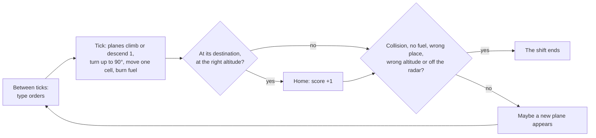

# How to play Control Room 1986

## Goal

Bring as many planes home as you can before one is lost. Each plane has one destination: an
airport, where it must arrive at altitude 0 flying in the direction of the runway arrow, or an exit
on the edge of the radar, where it must arrive at altitude 9 (9,000 feet). A shift has no winning
state; it ends the moment any plane is lost, and your score is the number of planes brought home.

## Controls

Control Room 1986 is played by typing orders at the `>` line under the radar. The mouse works the
title screen, the switches along the top of the console and the sector buttons in the sidebar.
Keys are the game’s own and cannot be remapped from the Hall.

| Action                                   | Keyboard                          | Mouse                                        |
| ---------------------------------------- | --------------------------------- | -------------------------------------------- |
| Choose a sector (title screen)           | — (see the tips)                  | Easy, Default or Killer                      |
| Begin the shift (title screen)           | Enter or Space                    | ▶ BEGIN SHIFT ◀                              |
| Type an order                            | Letters, digits, `+`, `-` and `@` | —                                            |
| Give the order                           | Enter                             | —                                            |
| Force the next tick now                  | Enter on an empty line            | —                                            |
| Delete the last character                | Backspace                         | —                                            |
| Clear the line                           | Esc                               | —                                            |
| Tutorial (pauses the shift)              | ? (during a shift)                | —                                            |
| Close the tutorial                       | ? or Esc                          | ✕ close, or outside its panel                |
| Reference card of every order            | `\`                               | ≡ help, ✕ on the card                        |
| Cheat panel (what to type next)          | —                                 | ▶ cheat, ✕ on the panel                      |
| Subtitles, voice, sound                  | —                                 | ✎ subs, ◉ voice, ♪ sound                     |
| Start a new shift on another sector      | —                                 | Easy, Default or Killer in the sidebar       |
| New shift after a loss                   | Enter or Space                    | Click anywhere                               |
| Leave for the Hall from the title screen | Esc                               | Move to the top edge; ← Back to the Hall     |
| Leave for the Hall during a shift        | Tab to the Hall’s strip           | Move to the top edge; ← Back to the Hall     |
| Back to the title screen                 | Tab to the Hall’s strip           | Move to the top edge; Game menu (then Leave) |

### Orders

Every order starts with a plane’s letter, as shown on the radar; the case you type does not matter.
Then comes the action. While you type, the line above the prompt lists what may come next, or
describes the finished order.

| You type               | What it does                                                                   |
| ---------------------- | ------------------------------------------------------------------------------ |
| `Aa5`                  | Plane A climbs or descends to altitude 5 (5,000 feet); `Aa0` lands or holds it |
| `Aa+3` or `Aac3`       | Plane A climbs 3,000 feet from where it is (never above 9)                     |
| `Aa-2` or `Aad2`       | Plane A descends 2,000 feet (never below 0)                                    |
| `Atw`, `Ate`, `Atd` …  | Plane A turns to a compass direction (see the compass below)                   |
| `AtL`, `AtR`           | Plane A turns 90 degrees left or right                                         |
| `Attb0`                | Plane A turns toward beacon 0 (`*0` on the radar)                              |
| `Atta1`                | Plane A turns toward airport 1 (`A1`)                                          |
| `Atte2`                | Plane A turns toward exit 2 (the `2` on the edge)                              |
| `Ac`                   | Plane A circles clockwise where it is, until you give it a new heading         |
| `Am`, `Ai`, `Au`       | Mark, ignore or unmark plane A: bright, dim or plain green on the radar        |
| `Atd@b1` (or `Atdab1`) | Accepted, but the order is carried out at once, not at beacon 1                |

The eight directions sit around the `s` key, as in the original:

```
q  w  e        NW  N  NE
a     d   =    W       E
z  x  c        SW  S  SE
```

A plane on the ground at an airport waits there until it is given an altitude above 0
(`Ba+7`, say); it leaves the ground on the next tick and climbs away along the runway arrow.

## Rules

1. The radar moves in **ticks**: every 6 seconds on Easy, 5 on Default and 3 on Killer. Between
   ticks nothing moves, so you have time to type. An empty Enter skips the wait.
2. On each tick, every **jet** (an uppercase letter) moves one cell along its heading; a **prop**
   (a lowercase letter) moves only on every other tick.
3. When a plane moves, its altitude changes by at most 1 (1,000 feet) toward the altitude you
   gave it, its heading turns by at most 90 degrees toward the heading you gave it, and it burns
   one unit of fuel.
4. A plane that reaches its airport at altitude 0 flying along the runway arrow, or its exit at
   altitude 9, is home: it leaves the radar and adds one to your score.
5. New planes appear now and then, at an exit at altitude 7 heading into the sector, or on the
   ground at an airport. They start with as much fuel as the sector is wide plus tall.



**The shift ends** the moment any of these happens:

- two planes in the air come within one cell of each other (diagonals included) while no more
  than 1,000 feet apart;
- a plane runs out of fuel;
- a plane reaches its own exit below 9,000 feet;
- a plane comes down to altitude 0 at the wrong airport, at its own airport against the arrow, at
  an airport when it should leave by an exit, or anywhere away from an airport;
- a plane flies off the edge of the radar.

The edge cells, exits included, are part of the radar: a plane may fly along them and over other
exits. Only its own exit at 9,000 feet takes it home, and only leaving the grid ends the shift.

## Modes

Three sectors, chosen on the title screen and remembered on this device. Each shift draws its
traffic at random.

| Sector  | Size  | Tick | A new plane about every | Exits | Airports | Beacons | Fuel at start |
| ------- | ----- | ---- | ----------------------- | ----- | -------- | ------- | ------------- |
| Easy    | 20×15 | 6 s  | 8 ticks                 | 4     | 1        | 1       | 35            |
| Default | 30×21 | 5 s  | 5 ticks                 | 7     | 2        | 2       | 51            |
| Killer  | 30×21 | 3 s  | 3 ticks                 | 7     | 3        | 3       | 51            |

The sector buttons in the sidebar start a new shift on that sector at once, without asking. The
`SHIFT` clock counts down fifteen minutes, but only for show: nothing happens when it reaches zero.
Control Room 1986 has no daily challenge.

## Settings

All of them live in the bar along the top of the console and are remembered on this device.

| Setting        | Options                                                  | Default |
| -------------- | -------------------------------------------------------- | ------- |
| Sound          | The console hum and the beeps, on or off                 | On      |
| Voice          | Pilots and you speak the radio lines aloud, or not       | Off     |
| Subtitles      | The radio lines written under the radar, or not          | On      |
| Reference card | Every order on one card beside the radar                 | Shown   |
| Cheat panel    | The next line to type for every plane, most urgent first | Shown   |

The voice uses only a speech voice that runs on your own device; where the browser offers none,
the radio stays silent and the subtitles carry on. The tutorial opens by itself at the start of
your first shift and pauses the shift while it is open; nothing else pauses it.

Control Room 1986 has a single dark look; the Hall’s strip follows the Hall’s light or dark
appearance.

## Scoring

The score is the number of planes brought home in the shift, shown under the radar as
`PLANES n SAFE … SCORE n`. The loss screen names the plane that was lost and why, with the planes
safe and the length of the shift. The Hall keeps your best score.

## Achievements (packages)

| Package               | How to earn it                                                                 |
| --------------------- | ------------------------------------------------------------------------------ |
| `wheels-down`         | Land a plane on its runway.                                                    |
| `handed-off`          | See a plane out through its exit at 9,000 feet.                                |
| `cleared-for-takeoff` | Send a plane waiting at an airport up into the sector.                         |
| `holding-pattern`     | Order a plane to circle (`c`), then bring it home.                             |
| `on-the-beacon`       | Turn a plane toward a beacon (`ttb`), then bring it home.                      |
| `steady-hands`        | Bring five planes home in one shift.                                           |
| `reference-sector`    | Bring five planes home in one shift on Default.                                |
| `minimum-fuel`        | Bring a plane home after its pilot has called “minimum fuel” (fuel 6 or less). |
| `full-board`          | Bring ten planes home in one shift.                                            |
| `fast-lane`           | Bring a plane home on Killer.                                                  |
| `rush-hour`           | Bring five planes home in one shift on Killer.                                 |
| `double-shift`        | Bring 25 planes home in one shift.                                             |

A plane counts as home when it adds to the score. In the tick that loses a plane nothing counts,
because the game stops before it adds that tick’s arrivals.

## XP

Each shift reports to the Hall when a plane is lost. A shift that brought at least one plane home
counts as a win, since the game has no winning state; a shift with none home counts as a loss. On
top of the session’s XP, a shift earns 3 XP for every plane brought home (up to 25); the Hall caps
a session’s extras at 30. A shift you leave by pressing a sector button in the sidebar, after at
least one tick, counts as quit and earns no XP, though its planes still count toward the weekly
goal. Weekly goals can ask you to guide a number of planes home (10–30).

The cheat panel only suggests lines; you still type each one, so shifts played with it count like
any other.

## Tips

- Start on Easy. One airport, slow ticks and fuel to spare.
- Read the traffic panel, not just the radar: destination, altitude, heading and fuel for every
  plane, with fuel in yellow below 12 and red below 5.
- To land, bring the plane onto the runway’s line a few cells out, flying along the arrow, with its
  altitude equal to its distance from the airport, then give `a0`: it loses a thousand feet a cell
  and touches down on the airport.
- Climb exit-bound planes to 9 early (`a9`); a plane that arrives low ends the shift.
- When you are busy or a plane is early, park it with `c` at a safe altitude and come back to it.
- Keep crossing planes at least 2,000 feet apart: altitude is the quickest way to separate them.
- An empty Enter skips the wait when nothing needs an order.
- To pick a sector with the keyboard, the buttons do not help yet: Enter on a focused sector
  button begins the shift before the choice applies. Click the sector instead.
