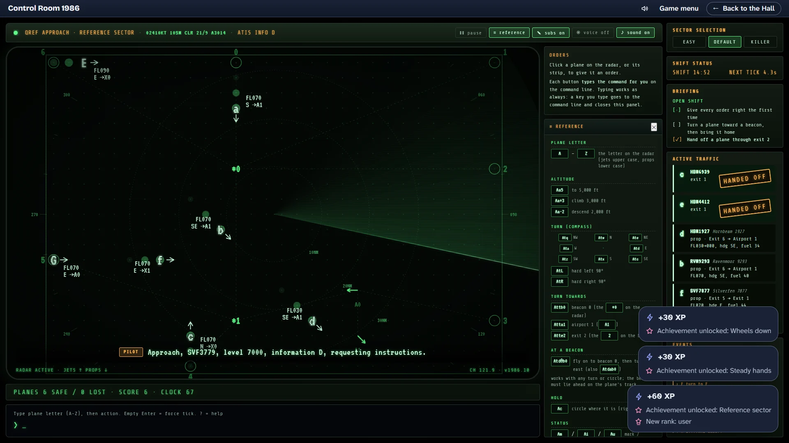
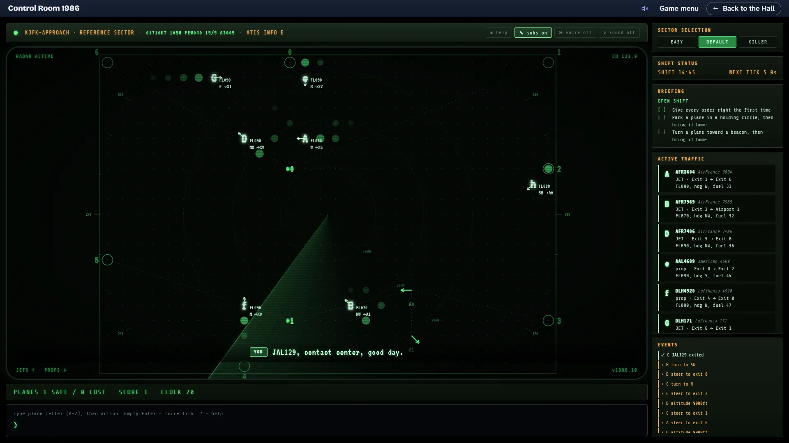
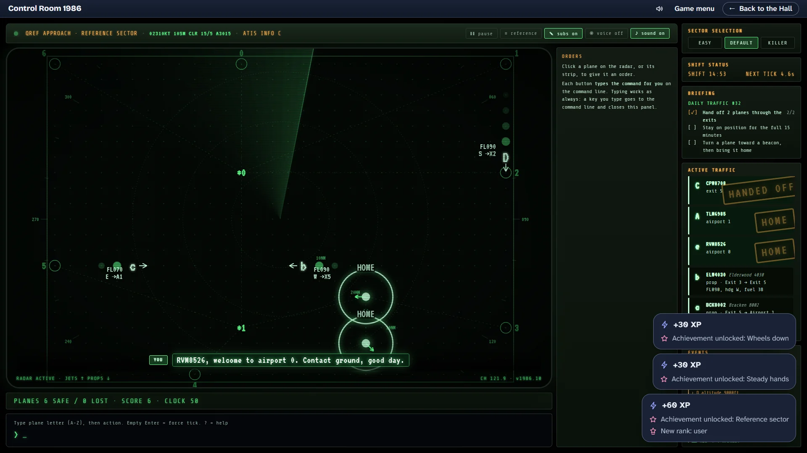
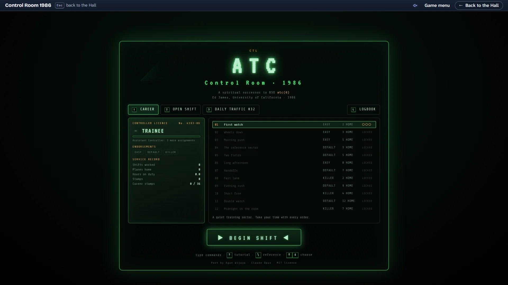
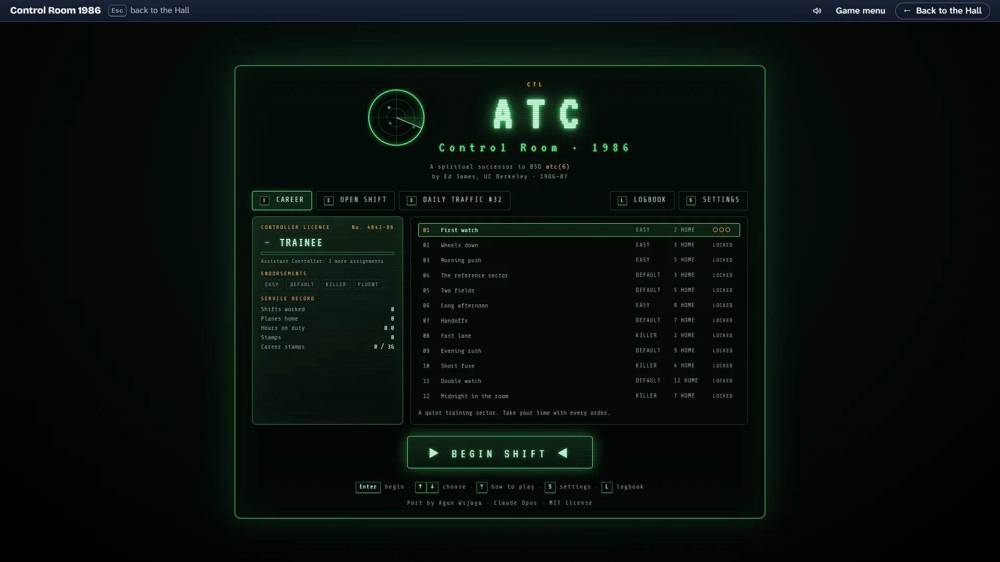

# Control Room 1986 — polish P1-C, before and after

The owner's checkpoint for prompt P1-C (§5). Every frame is 1920×1080 inside the Hall. The
"before" frames are the consolidation review's (`docs/media/review/atc-classic/`), copied here so
this page stands on its own. The "after" frames come from `e2e/polish-shots.spec.ts`
(`SHOTS=1 HALL_PORT=5283 pnpm exec playwright test -c games/atc-classic polish-shots`).

## 1. The on-ramp: order buttons that type for you

| Before                                                          | After                                                             |
| --------------------------------------------------------------- | ----------------------------------------------------------------- |
|  |  |

A new career's first shift: plane `a` was clicked (its strip is lit, amber brackets mark it on the
radar), and **Head for Exit 2** was pressed. The button has just typed `atte2` on the command line
and leaves it there a beat before sending it through the same path as Enter. The hint above the
line reads it back ("steer to exit 2"). The second of the three first-shift tips points at the
panel.

- The panel offers what this plane can do right now: the compass as its keys sit on the keyboard
  (`q w e / a · d / z x c`), hard left and right, circle, altitudes 0–9 with climb or descend
  1,000 ft, head for each beacon, exit and airport, wait for a beacon, mark, ignore and unmark.
- Every button shows the command it types under its words. The plane's destination and the
  altitude it needs there carry a ★. A button is dashed and off exactly when the engine would
  refuse its command, or when the order would change nothing (the altitude it already holds,
  the heading it already flies).
- After the order goes, the panel's foot shows **Typed as `atte2`**, piece by piece
  (`a` plane a · `t` turn · `te2` towards exit 2), with a link that opens the reference card on
  that line. It stays two seconds.
- Typing is untouched: any key typed by hand goes to the command line and closes the panel.
  Keyboard players see no change unless they turn the buttons on.
- **Order buttons** is in the settings and the pause menu (and `Alt+O`). It starts on for a new
  career and off when the save shows 50 or more orders typed by hand.
- Fluent: 50 orders typed by hand in one shift stamps FLUENT on the licence, beside the sector
  endorsements, and prints a line on the report.

## 2. A readable radar, the reference card docked

| Before                                              | After                                                                                |
| --------------------------------------------------- | ------------------------------------------------------------------------------------ |
|  |  |

- Data blocks, exit, beacon and airport labels, and the range and bearing numbers scale with a
  **Radar text size** setting (Standard, Large, Extra large; `Alt+T`). Standard never goes below
  14 px at 1920×1080 or 12 px at 1280×720. Here the data blocks are 18 px.
- The data block now sits across from where the plane is heading, so the heading arrow no longer
  runs through it. Near the sector's edge it moves inside, clear of the arrow. The arrow starts at
  the letter's edge, and a dark rim keeps the letter clear of trails and the sweep.
- Every colour the radar writes in reaches AA (a unit test checks them). The dim text of the page
  (locked career rows, licence details, the footer, the bezel switches) was lifted to 6.3:1 on
  the cards.
- The reference card is closed by default and remembered. It opens with `\` or its bezel button
  and docks in a column beside the radar, above which the order panel sits. It never covers an
  exit. The radar keeps its size at 16:9, because the column takes width the grid did not use.
- The top corner labels moved to the bottom corners, clear of the corner exits 6 and 1.

## 3. The moment a plane comes home

| Before                                                                       | After                                                  |
| ---------------------------------------------------------------------------- | ------------------------------------------------------ |
|  |  |

Two planes land in the same tick, at airports 0 and 1, while the strip of a plane handed off a
moment earlier still carries its stamp. The frame is today's Daily Traffic flown by the testing
aid until its second landing, so the planes change from day to day.

- On the radar, a ring opens from where each plane arrived, in the sweep's colour, with the word
  HOME or HANDED OFF. It is gone in under a second.
- On the traffic list, the strip stays a moment longer, stamped.
- The radio line ("…welcome to airport 0. Contact ground, good day.") is picked out.
- A short climbing tone plays.
- Nothing waits for any of it. Under reduced motion the ring and the word stand still and the
  stamp does not drop in.

The Hall's achievement notes at the lower right belong to the Hall.

## 4. The game menu

| Before                                                             | After                                             |
| ------------------------------------------------------------------ | ------------------------------------------------- |
|  |  |

- The faint radar that filled the menu panel and read as a smudge is gone. A small, crisp scope
  sits beside the title; its blips light as the sweep passes, and it stands still under reduced
  motion.
- The credit reads **Ed James, UC Berkeley · 1986–87**: the original's manual page carries "© 1986
  Ed James", every source file "© 1987 by Ed James, UC Berkeley". The evidence goes in NOTES.
- New on the desk: SETTINGS (`S`); `?` opens how to play here, as the title always promised.
- Enter on a choice reached with Tab applies that choice before the shift begins.

## Also in this pass (no frame)

- **Results** in the collection's order: Play again (R) · Game menu · Back to the Hall (H). Next
  assignment comes first when the career goes on; the Daily's share line comes last.
- **A pause menu** (the bezel's ❚❚ button or `Alt+P`, since Escape keeps clearing the command line
  as in 1986). It holds Resume, Order buttons, How to play, the settings, Game menu and Back to
  the Hall. Both ways out ask first, and so do the sidebar's sector buttons during a shift.
- **Reduced motion** follows the Hall (and the system when the Hall has not said). There is no
  sweep: each tick's positions fade in slowly. There is no title fade, no blinking cursor or
  lamp, and no pulsing.
- **Keyboard and screen readers**: `:focus-visible` everywhere; Alt keys for subtitles (`S`),
  voice (`V`) and sound (`M`); the traffic list is a labelled list, one strip per plane. The
  testing aid stays hidden.
- **Our own names**: invented carriers (Hornbeam HBM, Quailwood QLW, Merrow MRW, …) replace the
  real airlines on the strips and on the radio. Sector codes begin with Q, which no ICAO region
  uses, so none can name a real airport.
- **Loss wording**: calm, in our own words ("lost separation with E", "fuel exhausted, diverted",
  "left the sector at the wrong altitude"). On the radio the controller now says it ("All
  stations, stand by") instead of a mayday.
- **The delay suffix works**: `Atd@b0` holds the heading until beacon 0, then turns. The panel
  offers it as "Wait for a beacon, then turn".

## Critique rounds

1. **First frames.**
   - The data block sat on the heading arrow and the plane letter blurred into it.
   - Two buttons were cut off ("Hard rig…", "Descend o…").
   - Tip 2 pointed low, over an exit.
   - The busy radar had three planes; tip 1 covered a data block.
   - The subtitle highlight drew a line across the whole radar.
   - The panel left dead space under it.
   - The top corner labels collided with exits 6 and 1.

   Fixed: the block moved across from the heading, the arrow starts at the letter's edge, the
   letter got a rim, labels were shortened, tip 2 points at the panel's heading, the radar runs
   until seven planes are up and tips are dismissed for that frame, the highlight is now a box
   round the line itself, and the corner labels moved to the bottom.

2. **Second frames.**
   - At the sector's edge the block ran over the exit marker.
   - The HOME / HANDED OFF word crossed its own ring.
   - The strip stamp hid the strip's text.
   - The frame showed a handoff, not a landing.

   Fixed: the block flips inside near an edge and drops clear of the arrow, the word got a dark
   rim and more distance, and the stamp now covers a shorter strip.
   - The cheat's suggestions almost never landed a plane (0 landings in 30 simulated Easy shifts,
     the same on the original engine). At the checkpoint the landing frame flew today's Daily in
     step with a copy run in Node; since the owner asked for the cheat to be fixed, the frame
     simply follows it.

3. **1280×720 pass.**
   - The pause menu pushed Game menu and Back to the Hall below the fold.
   - The order panel overflowed.
   - The goal line wrapped.
   - The subtitle took two lines over the radar.
   - "left/right" lost their capitals.

   Fixed: the pause menu is two columns, compact sizes apply in short windows, the goal line is
   shorter, and the labels are cased again.

4. **Final pass.**
   - The order frame now presses Head for Exit 2 (`atte2`, more of the language than `aa9`).
   - The data block moved a little further from the selection brackets.
   - The landing frame is the second landing, so fewer of the Hall's first-time notes cover it.

## The owner's answers (2026-10-02)

The owner approved the frames and the open points (the 1986–87 credit, Escape kept for the command
line with pause on Alt+P and the bezel button, the invented names), and asked for the cheat to be
fixed. It now plans a route for every plane (`app/src/planner.js`); following it, no shift was lost
over 30 seeds of 300 ticks on any sector, and the landing frame above comes straight from it.
