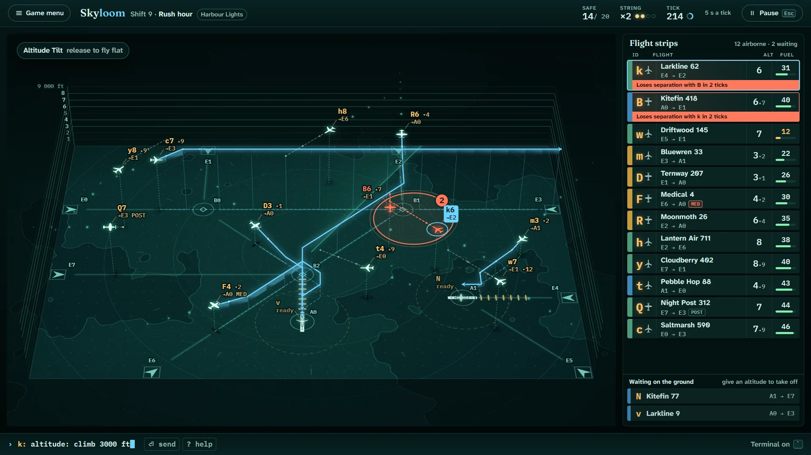

# Skyloom

> Weave the sky. Land them all.

## The hook

Jets and props pour into your airspace, each wanting a runway or a gate on the far side. You draw
their routes through the beacons with one drag, stack their heights so nobody comes too close, and
bring them down one after another, until the approach lights ripple down the runway for three
landings in a row: a string of pearls. Hold the right mouse button and the whole sky tilts into
three dimensions, so you can see who is above whom. When it goes wrong, the game shows you exactly
which tick could have saved it.

## Where it comes from

`atc` was written by Ed James at UC Berkeley in 1986 and 1987 and shipped with the BSD games on
countless Unix machines. On an 80 × 24 terminal it drew a grid of dots, beacons and airports, with
planes as letters and digits; you typed terse orders, a letter and a few keys, while a timer moved
the sky on whether you were ready or not. It had fifteen airspaces, from a gentle seven-second tick
to a frantic one-second one, and it was famously unforgiving: one mistake ended the game. Its manual
cheerfully admits it was built from a secondhand account of an older game.

## What is new

- **Routes you draw.** Drag from a plane through beacons to its gate or runway; the route bends only
  as the plane can, and a route onto a runway times its own final descent.
- **Seeing trouble coming.** Dashed paths three ticks ahead and a ring that counts down to any
  conflict, and Altitude Tilt to read the heights at a glance.
- **Flight strips.** Every plane has a paper strip with an invented airline, its route, height and
  fuel, sorted so the most urgent is on top.
- **A way to learn.** A two-minute tutorial, twelve shifts that teach one idea each with three
  stars, an endless ladder of 25 skies, a shared Daily Sky, and nine clearance puzzles with a par.
- **A record of your work.** Each finished shift is woven into a tapestry, one thread per flight,
  and kept in your logbook.
- **Terminal mode.** The 1986 typed orders still work, with the choices shown as you type.

## At a glance

|                  |                                                                                 |
| ---------------- | ------------------------------------------------------------------------------- |
| Directory        | `/usr/games/arcade`                                                             |
| Players          | 1                                                                               |
| Session          | 5–15 minutes                                                                    |
| Daily challenge  | yes, the Daily Sky                                                              |
| Inspired by      | `atc` (1986)                                                                    |
| Also in the Hall | Control Room 1986 (`atc-classic`), an earlier, typed-only take on the same game |

## More

- [How to play](HOW-TO-PLAY.md)
- [Changes from the original](CHANGES-FROM-ORIGINAL.md)
- [Architecture](ARCHITECTURE.md)
- [Notes](NOTES.md)
