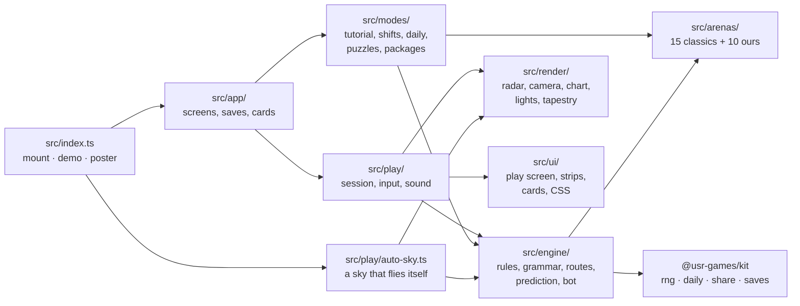
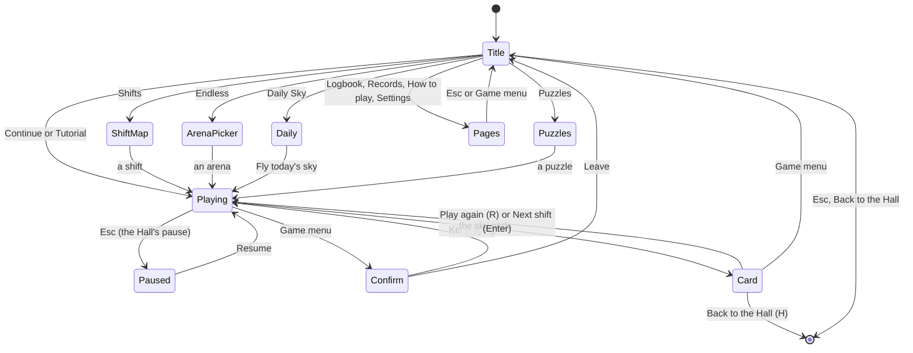
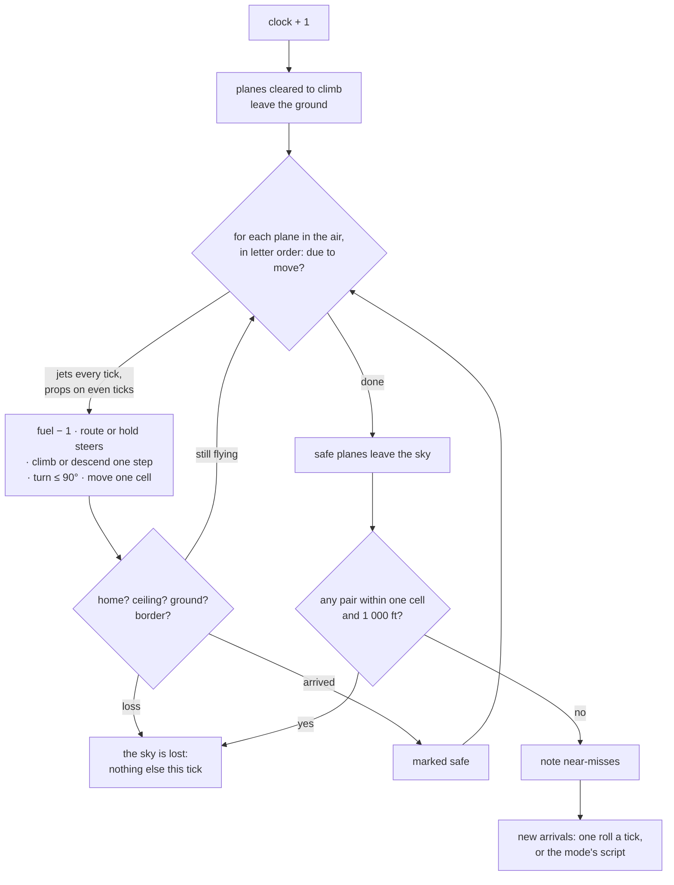
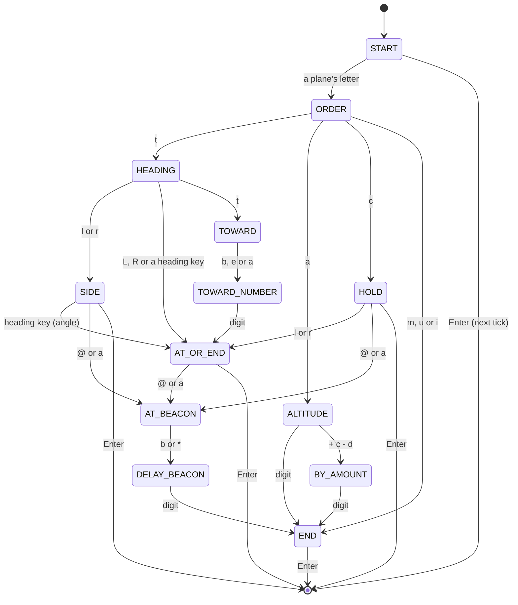

# Skyloom — architecture

## Overview

Skyloom is a native game of the Hall: TypeScript in strict mode, the kit's `GameModule` contract,
and everything drawn in Canvas 2D (radar, Altitude Tilt, tapestry, thumbnails, poster), with no
raster files and no runtime network requests ([ADR 0001](adr/0001-radar-in-canvas-2d.md)). The
rules live in a pure engine of about 2 000 lines (the house controller included), faithful tick for tick to the 1986 program;
the play screen, modes and menus are built around it.

## Module map

| Path                                                 | Responsibility                                                                                       |
| ---------------------------------------------------- | ---------------------------------------------------------------------------------------------------- |
| `src/index.ts`                                       | The kit contract: `mount` (the app), `demo` (a silent self-flying sky), `poster` (key art), packages |
| `src/app/app.ts`                                     | `SkyloomApp`: screens, starting a sky, the end of a sky (saves, packages, `reportResult`, cards)     |
| `src/app/menus.ts`                                   | Title (live sky behind), shift map, arena picker, Daily Sky, puzzles                                 |
| `src/app/pages.ts`                                   | Records, logbook, settings, how to play                                                              |
| `src/app/cards.ts`                                   | The end-of-sky cards: loss with replay, shift tapestry, Daily, Endless, puzzle, tutorial             |
| `src/app/saves.ts`                                   | Save slots, their defaults and the record rule                                                       |
| `src/engine/world.ts`                                | The sky and one tick: launch, fuel, climb, turn, move, checks, arrivals, near-misses                 |
| `src/engine/commands.ts`                             | The Terminal grammar as a table of states; reading a line and giving an order                        |
| `src/engine/route.ts`                                | Turning waypoints into a flyable route (a search over cell and heading)                              |
| `src/engine/predict.ts`                              | Paths three ticks ahead and the conflicts they lead to                                               |
| `src/engine/bot.ts`                                  | The house controller: demos, balance, golden runs                                                    |
| `src/engine/traffic.ts`                              | Invented airlines and flight numbers                                                                 |
| `src/engine/glibc-random.ts`, `trace.ts`, `golden-*` | Faithfulness: GNU libc's `random()`, state traces and the golden runs                                |
| `src/arenas/`                                        | `classic.ts` (the fifteen, derived), `ours.ts` and friends, `library.ts` (Endless order, fast skies) |
| `src/modes/`                                         | Tutorial script, shift definitions and stars, Daily Sky, puzzles and their solver, package rules     |
| `src/play/session.ts`                                | `PlaySession`: the clock, pointer and keys, Terminal mode, banners, the tutorial's steps, the end    |
| `src/play/`                                          | Routing from a drag, effects (ripples, pearls, bursts), flight history, sound, remappable keys       |
| `src/render/`                                        | Everything drawn: see "Where visuals are defined"                                                    |
| `src/ui/`                                            | The play screen's DOM, strips, result cards, the confirm dialog, `skyloom.css` and `screens.css`     |
| `dev/`                                               | The workbench (port 5273): a stand-in Hall context, hero scenes, test hooks                          |
| `scripts/`                                           | Balance and tuning runs, golden-run helpers, puzzle pars                                             |

## Screens

## Engine

The world (`World` in `src/engine/world.ts`) holds the arena, the rules of the mode
(`SkyRules`: fuel on arrival, closed runways, scripted arrivals), the clock, the planes in the air
and on the ground (each list kept in letter order), the count of planes safe, the last letter given
out, the loss if any, and the randomness. One call to `tick(world)` runs a tick exactly as
`update.c` did and returns what happened as events:

Randomness comes from `src/engine/randomness.ts`: three streams of the kit's RNG labelled by the
sky's seed, one standing in for `random()` (what a new plane is), one for `rand()` (whether it comes),
one for flavour (airline, number) that the rules never read. The golden runs swap in
`glibcRandom(seed)`, which shares one generator between both, as GNU libc does. A sky is fully
determined by its arena, rules, seed and the orders given.

Orders reach the engine three ways, all ending in the same fields of a plane (`route`,
`targetAltitude`, `targetHeading`, `hold`, `waitForBeacon`, `status`): a drawn route
(`src/play/routing.ts` → `planRoute`), a key or menu item (`PlaySession.setAltitude`, `setHeading`,
`setHold`), or a typed line (`readLine` → `giveOrder`).

### The Terminal grammar

`src/engine/commands.ts` keeps the original's design: a table of states, each a list of rules (key,
next state, echo text, hint, action). Reading a line replays it key by key from `START`; the result is
`reading` (with the choices for the next key), `tick` (an empty line), `order`, `shell` (`!`), or
`error` with the reason (a key that does not fit, or a rule that refuses the order). Skyloom's
additions are marked in the table: a side for holds (`l`, `r`) and the refusal of a change of zero.

## AI: the house controller

`planSky(world, options)` in `src/engine/bot.ts` decides an intent for every plane each tick: a
route (`searchRoute` by way of a beacon when the plane needs room to climb or descend), a height plan
(cruise, then climb to leave or glide to land), a hold, or for a plane on the ground whether to clear
it. It flies every plan ahead (eight ticks by default) with the engine's own movement and settles
the worst pair first, trying each change on each plane of the pair and keeping the one with the
lowest cost (separation, near-misses, fuel, holding). Routes are cached by position, heading and
destination, which brought a 300-tick shift from seconds to 11–190 ms. It is used for the title
screen's sky, the Hall's demo and poster, the balance tests, the golden runs (its decisions typed as
1986 orders by `intentsAsOrders`) and the workbench's autopilot.

Puzzles have their own solver (`src/modes/puzzle-solver.ts`): it gives each plane one plan as it
appears, as a player would while time stands still, and searches upwards one clearance at a time,
so the first plan that brings everyone home sets the par.

## Where visuals are defined

Every colour comes from a `Look` in `src/render/look.ts` (`DAY_CHART`, `NIGHT_SCOPE`); the DOM around
the radar uses CSS custom properties of the same names in `src/ui/skyloom.css` under
`[data-look='chart']` and `[data-look='scope']`. The two looks are designed separately; neither is an
inversion of the other. The Hall's appearance picks the look and `onAppearanceChange` switches it
live.

| Visual                                    | Defined in                                                                              | Change it by                                                                 |
| ----------------------------------------- | --------------------------------------------------------------------------------------- | ---------------------------------------------------------------------------- |
| The chart: land, water, contours, grid    | `src/render/ground.ts` (`groundTexture`), `noise.ts`                                    | Arena `scenery` (seed, coast, relief); `BANDS` and the look's `land` colours |
| Gates, beacons, runways, airways          | `src/render/ground.ts` (`paintGates` …), `features.ts`                                  | The painters; sizes are in cells                                             |
| Radar sweep and scope rings (Night Scope) | `src/render/radar.ts` (`drawSweep`), `ground.ts`                                        | `SWEEP_SECONDS`; the look's `rings`                                          |
| Planes (jets swept, props straight-wing)  | `src/render/glyphs.ts` (`drawPlaneGlyph`)                                               | The path data; jets and props differ by shape                                |
| Data tags                                 | `src/render/radar.ts` (`drawTags`)                                                      | `textSize` minimums keep tags ≥ 14 px; placement scores corners              |
| Routes, ribbons, the route being drawn    | `drawRoutes`, `drawRibbon`, `drawGhost`                                                 | The look's `route` colours                                                   |
| Forecast paths and the conflict ring      | `drawForecasts`, `drawConflicts`                                                        | Pulse at 1 Hz; shape cues dash the ring and make the badge a diamond         |
| Altitude Tilt: camera, shelves, shadows   | `src/render/camera.ts` (`framed`, `project`, `drawGround`), `drawLayers`, `drawShadows` | `TILT`, `PERSPECTIVE`, `LEVEL_HEIGHT` in `camera.ts`                         |
| Approach lights and the string of pearls  | `src/render/landings.ts`                                                                | `drawApproachLights`, `drawPearlThread`, `drawLandingLights`                 |
| The loss: burst, drain                    | `drawBursts`, `drainColour` in `radar.ts`; `src/play/effects.ts`                        | Reduced motion draws a still burst icon and drains at once                   |
| Night shifts                              | `drawDusk` in `radar.ts`                                                                | Only the Day Chart darkens; the scope is already night                       |
| Compact radar (Hall tiles)                | `COMPACT_CELL` in `radar.ts`                                                            | Below it, no labels or tags are drawn                                        |
| The tapestry                              | `src/render/tapestry.ts` (`drawTapestry`)                                               | Thread colours and weave in its palette                                      |
| Strips, bar, foot, cards, menus           | `src/ui/*.ts`, `skyloom.css`, `screens.css`                                             | The CSS custom properties                                                    |

Reduced motion (from the Hall) stops the sweep, the pulses and the moving dashes, makes the tilt
snap instead of swing, draws ripples and landing lights still, replaces the burst with a still icon
and makes the end of a sky immediate.

## Where sounds are defined

All sounds are patches for the kit's synthesiser in `src/play/sound.ts`; there are no audio files.
They are quiet, and the Hall's volume and Skyloom's own Sound setting apply.

| Sound          | Patch                       | Plays when                                                                |
| -------------- | --------------------------- | ------------------------------------------------------------------------- |
| Tower hum      | `HUM` (`tower-hum`)         | Under every live sky; stops when paused or lost                           |
| Radio blip     | `BLIP` (`radio-blip`)       | An order is given                                                         |
| Refused        | `REFUSED` (`order-refused`) | An order cannot be flown                                                  |
| Landing chime  | `chime(step)`               | A landing; each landing in a string climbs one step of a pentatonic scale |
| Departure      | `DEPARTURE` (`departure`)   | A plane takes off                                                         |
| Arrival        | `ARRIVAL` (`arrival`)       | A plane leaves by its gate                                                |
| Near-miss      | `NEAR_MISS` (`near-miss`)   | Two planes pass close                                                     |
| Loss           | `LOSS` (`loss`)             | The sky is lost: one low tone, the hum cut                                |
| Shift complete | three chimes                | A shift, Daily or puzzle ends without a loss                              |

## Hall integration

- **Results:** `reportResult` with `presentation: 'game'` (Skyloom shows its own cards). Outcome:
  shifts are `win` when the target is met, else `complete`, `loss` when lost; the Daily is `win`
  unless lost; Endless is `win` from 10 planes safe; puzzles `win` when solved. Score is planes safe;
  stats are `planesSafe`, `landings`, `exits`, `ticks`, `longestString`, `nearMisses`. XP events:
  `planes-safe`, `string`, `stars`, `medical` (see HOW-TO-PLAY).
- **Packages:** the manifest's twelve; `src/modes/packages.ts` decides them, those earned in the air
  after every tick (`onProgress`), the rest at the end; each is offered once per visit.
- **Pause menu items:** Prediction on/off and Terminal mode (`refreshPauseItems`).
- **Keys:** the manifest's six controls are read through `src/play/keys.ts` from the Hall's
  `bindings.atc` and rebuilt when settings change; the hints show the bound keys.
- **Daily:** the number and date key come from the kit; `src/modes/daily.ts` picks the arena and
  seed; the share line is built with the kit's `composeShare` and `emojiGrid`.
- **Demo and poster:** `demo(seed)` flies a self-keeping sky on an arena chosen by the seed, silent,
  stopping when hidden; `poster` draws Harbour Lights tilted and leaning in.
- **Saves** (`src/app/saves.ts`, all version 1): `settings`, `campaign` (stars per shift, tutorial
  done), `endless` (best per arena), `daily` (first flight of each day), `counters`, `logbook` (the
  last 40 tapestries), `puzzles` (fewest clearances per puzzle).

## Adding an arena

1. Write it as an `Arena` in `src/arenas/ours.ts` (see [ADR 0002](adr/0002-arena-data.md)): size,
   `tickSeconds`, `spawnOneIn`, gates with inward headings, beacons, runways with landing headings,
   airways to draw, and a `scenery` seed.
2. Add it to `OUR_ARENAS` in `src/arenas/library.ts`.
3. `pnpm vitest --project atc` checks it with `arenaProblems` and the name checks.
4. `pnpm exec tsx games/atc/scripts/balance.ts 50 300 <id>` shows whether the house controller can
   keep it; a sky it loses is too hard for Endless.

## Tests

| Test                      | Command                                                      | What it proves                                                                                     |
| ------------------------- | ------------------------------------------------------------ | -------------------------------------------------------------------------------------------------- |
| Engine, rules and grammar | `pnpm vitest --project atc`                                  | Each rule of the original, the grammar, routes, prediction                                         |
| Golden runs               | (same) `src/engine/golden.test.ts`                           | Fifteen runs match the 1986 program tick for tick                                                  |
| Balance                   | (same) `src/modes/balance.test.ts`                           | Tutorial arena survived on 200 seeds; star rates; daily spacing                                    |
| Tutorial and puzzles      | (same) `tutorial.test.ts`, `puzzles.test.ts`                 | The tutorial's conflict always happens; every par is met by its plan                               |
| Packages, keys, content   | (same) `packages.test.ts`, `keys.test.ts`, `content.test.ts` | Thresholds, remapping, our own words and names                                                     |
| Browser play              | `pnpm exec playwright test -c games/atc e2e/skyloom.spec.ts` | Tutorial, mouse and keyboard orders, strips, Terminal, loss and replay, Daily, every exit, puzzles |
| Hero frames               | `pnpm exec playwright test -c games/atc --grep @hero`        | Renders `docs/media/hero/`                                                                         |
| Documentation shots       | `pnpm exec playwright test -c games/atc --grep @shots`       | Renders `docs/media/screens/`                                                                      |

The browser runs need the workbench: `pnpm --filter @usr-games/game-atc dev` (port 5273). In
development builds the live sky is `window.__skyloom`, and `__skyloomAutopilot(n)` lets the house
controller fly n ticks.

## Kit candidates

- `src/engine/glibc-random.ts`: GNU libc's `random()`, now in two games (worms reproduces it too).
- `src/ui/confirm.ts`: an in-game confirm dialog that keeps Escape from reaching the Hall.
- The compact-tile rule (draw no words below a cell size) could be a note in the kit's demo guide.
