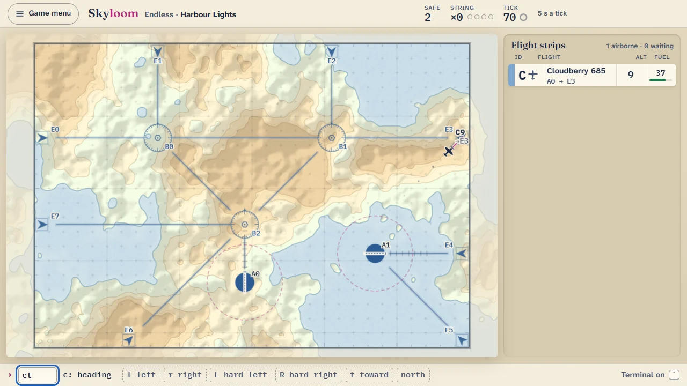
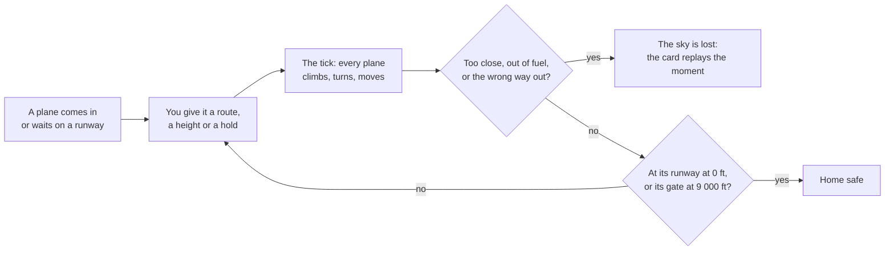

# How to play Skyloom

## Goal

Bring planes home safely: land the ones bound for a runway and send the rest out through their own
gate, while keeping every pair apart. A shift asks for a number of planes before its clock runs
out; Endless goes on until the first mistake.

## The sky

The radar is a grid of cells seen from above. On it:

- **Gates** (E0, E1 …) sit on the edge, each with an arrow pointing in. Planes come in through them
  at 7 000 ft, and planes bound for a gate must leave through it at exactly 9 000 ft.
- **Runways** (A0, A1 …) are round airfields with a bar showing the direction to land in. Planes
  also take off from them.
- **Beacons** (B0, B1 …) are fixed points to route through.
- **Planes** carry a letter. Lower-case letters are jets, which move one cell every tick;
  capital letters are props, which move every other tick. The tag beside each plane shows its
  letter and height in thousands of feet (`k7` flies at 7 000 ft), where it is climbing or descending
  to, and where it is bound.
- **Flight strips** on the right list every plane with its airline, route, height and fuel, the
  most urgent at the top. Planes waiting on a runway sit in the bay below.

The sky moves on by itself, one tick every few seconds; the ring beside "Tick" in the top bar fills
as the next tick comes.

## Rules

1. Each tick every plane that is due to move uses one unit of fuel, changes height by at most
   1 000 ft, turns at most 90°, and moves one cell.
2. A plane with a route steers along it. A route to a gate climbs to 9 000 ft in time to leave; a
   route to a runway glides down to land at 0 ft along the runway's direction.
3. A plane on a runway stays there until you give it a height; it takes off on the next tick.
4. After the planes move, those that reached their destination correctly are home safe.
5. New planes arrive at random through the gates and from the runways.

A sky is lost the moment any of these happens:

| What happened               | When                                                                 |
| --------------------------- | -------------------------------------------------------------------- |
| Loss of separation          | Two planes in the air are within one cell and 1 000 ft of each other |
| Out of fuel                 | A plane's fuel runs out                                              |
| Came down off a runway      | A plane reaches 0 ft anywhere but its own runway                     |
| Wrong runway                | A plane lands on a runway that is not its own                        |
| Landed across the runway    | A plane touches down not flying along the runway's direction         |
| Landed when it should leave | A plane bound for a gate comes down on a runway                      |
| Left too low                | A plane reaches its gate below 9 000 ft                              |
| Wrong gate                  | A plane leaves by a gate that is not its own                         |
| Left when it should land    | A plane bound for a runway leaves by a gate                          |
| Left the airspace           | A plane crosses the edge away from any gate                          |

Planes on the ground are never in each other's way. Two planes that pass within two cells and
1 000 ft, or one cell and 2 000 ft, without losing separation count as a **near-miss**: no harm
done, but it costs a shift's calm star.

## Controls

| Action                       | Mouse                                                     | Keyboard                                              | Remappable |
| ---------------------------- | --------------------------------------------------------- | ----------------------------------------------------- | ---------- |
| Select a plane               | Click the plane or its strip                              | Its letter (Shift + letter while another is selected) | no         |
| Walk the strips              | —                                                         | ↑ ↓ with the strip list focused                       | no         |
| Most urgent plane next       | —                                                         | Tab, with the radar focused (Shift + Tab goes back)   | yes        |
| Let go of the selected plane | Click empty sky                                           | Enter                                                 | no         |
| Draw a route                 | Drag from the plane through beacons to its gate or runway | —                                                     | no         |
| Route a plane from its strip | Drag the strip onto its runway or gate                    | —                                                     | no         |
| Cancel a route being drawn   | Right button                                              | Esc                                                   | no         |
| Set a heading                | Hold the click on a plane: Direct to…                     | w e d c x z a q (north, then clockwise)               | no         |
| Climb or descend             | Scroll over the plane, or hold the click: Climb / Descend | 0–9 for that many thousand feet                       | no         |
| Hold left / hold right       | Hold the click: Hold left / Hold right                    | [ and ]                                               | yes        |
| Ignore or mark a plane       | Hold the click: Ignore / Mark                             | —                                                     | no         |
| Next tick now                | —                                                         | Space                                                 | yes        |
| Altitude Tilt                | Hold the right button; scroll while tilted to lean in     | Hold T (a quick tap selects plane t)                  | yes        |
| Terminal mode                | —                                                         | `                                                     | yes        |
| Pause                        | The Pause button                                          | Esc                                                   | no         |
| Game menu during a sky       | Game menu (asks before leaving)                           | —                                                     | no         |
| Next shift (shift complete)  | Next shift                                                | Enter                                                 | no         |
| Play again (results)         | Play again                                                | R                                                     | no         |
| Back to the Hall (results)   | Back to the Hall                                          | H                                                     | no         |

Remappable keys are changed in the Hall's settings; the hints at the bottom of the screen show the
keys as they are bound.

A route bends only as a plane can turn, so a drawn line becomes the nearest flyable path. The label
under the route being drawn says where it goes and in how many moves, or why it cannot be flown.
Beacons along the way are pinned as you pass over them.

## Terminal mode

Press `` ` `` to open the command line and type orders the way the 1986 game took them. The choices
for the next key are shown as you type; a key that does not fit is not taken, and the line says why.
Enter gives the order; Enter on an empty line moves the sky on a tick; Esc clears the line, or leaves
it when it is empty.

| Order                | Keys                                             | Example  | Meaning                                   |
| -------------------- | ------------------------------------------------ | -------- | ----------------------------------------- |
| Altitude             | letter `a` digit                                 | `ka6`    | k to 6 000 ft                             |
| Climb or descend by  | letter `a` `+` or `c` digit, `-` or `d` digit    | `ka+2`   | k up by 2 000 ft                          |
| Heading              | letter `t` and one of `w e d c x z a q`          | `kte`    | k turns to north-east                     |
| Turn by an angle     | letter `t` `l` or `r` and a heading key          | `ktrd`   | k turns right by 90°                      |
| Turn by 45°          | letter `t` `l` or `r`                            | `ktl`    | k turns left by 45°                       |
| Hard turn            | letter `t` `L` or `R`                            | `ktR`    | k turns right by 90°                      |
| Head for a place     | letter `t` `t` then `b`, `e` or `a` and a number | `kttb1`  | k heads for beacon 1                      |
| Hold                 | letter `c`, optionally `l` or `r`                | `kcl`    | k holds, circling left (`c` alone: right) |
| Wait for a beacon    | any turn or hold, then `@` or `a`, `b`, a number | `kte@b2` | k turns north-east on reaching beacon 2   |
| Mark, unmark, ignore | letter `m`, `u` or `i`                           | `ki`     | k's strip greys and its tag fades         |
| Show the choices     | `?`                                              |          | Lists what can follow                     |
| The little shell     | `!`                                              |          | The way out the 1986 game left open       |

An order changes one thing about a plane: its height, its status, or its heading. A heading order
clears any route or hold the plane had.

## Modes

| Mode         | What changes                                                                                                                                                                                                                    |
| ------------ | ------------------------------------------------------------------------------------------------------------------------------------------------------------------------------------------------------------------------------- |
| Tutorial     | About two minutes on First Light: route a plane out, land one, then part two planes meeting over the beacon. The clock waits for you at each step.                                                                              |
| Shifts       | Twelve skies on a night route, each teaching one idea: two exits, beacons, props and jets, two airports, night, a change of wind, rush hour, low fuel, the 1986 default sky, the tower at midnight. Clear one to open the next. |
| Endless      | Any of 25 skies (ten of ours and the fifteen classics) for as long as you can keep it. Best results are kept per sky.                                                                                                           |
| Daily Sky #N | The same arena and the same traffic for everyone today, numbered by the Hall: four quarters of forty ticks. Pausing draws the blinds, so a break cannot be used to plan. Fast skies only come every other day.                  |
| Puzzles      | Nine set pieces. Time stands still while you plan, and again whenever a new plane comes in; press Space to run. Every order counts as a clearance; bring everyone home in par or fewer.                                         |

## Settings

| Setting                    | Options                                                                                                                              | Default |
| -------------------------- | ------------------------------------------------------------------------------------------------------------------------------------ | ------- |
| Speed                      | Relaxed (1.5× longer ticks) · Classic · Fast (0.6×)                                                                                  | Classic |
| Prediction                 | On · Off (also in the pause menu)                                                                                                    | On      |
| Route snapping             | On · Off                                                                                                                             | On      |
| Shape cues                 | On · Off: a dashed conflict ring with a diamond countdown, a square around planes in conflict, and arrow shapes on the strip holders | Off     |
| Terminal mode at the start | On · Off                                                                                                                             | Off     |
| Sound                      | On · Off                                                                                                                             | On      |

Volume, motion, the colour-blind palette and key bindings are the Hall's own settings and apply
here too. "Forget my Skyloom data" clears this game's saves.

## Scoring

- **Planes safe** is the score everywhere. In Endless, skies are ranked by planes safe and a tie
  goes to the shorter sky, as the 1986 manual described (its code ranked differently; see
  [the changes](CHANGES-FROM-ORIGINAL.md)).
- **Shift stars:** the target number of planes safe; no near-misses; and fuel to spare (planes
  arriving with, on average, at least the shift's share of a full tank). The calm and fuel stars
  count only when the target is met.
- **String of pearls:** landings on consecutive ticks; the longest string is shown on every result.
- **Daily share:** one line, for example `Skyloom #32 · 17 safe · 🟩🟩🟨🟩 · longest string: 3 ✈`.
  Each square is a quarter: green when flown cleanly, yellow with a near-miss, dark where the sky
  was lost. No link is ever added.
- **Puzzles:** solved or not, and your fewest clearances against par.

## Achievements (packages)

| Package             | How to earn it                                                     |
| ------------------- | ------------------------------------------------------------------ |
| `first-light`       | Land your first plane.                                             |
| `beacon-weaver`     | Send five planes through the same beacon in one sky.               |
| `left-turn-at-last` | Fly a full hold to the left.                                       |
| `typist`            | Give fifty orders in Terminal mode, over all your skies.           |
| `daily-regular`     | Fly seven Daily Skies.                                             |
| `shell-escape`      | Hidden.                                                            |
| `string-of-pearls`  | Land three planes on three ticks in a row.                         |
| `running-on-fumes`  | Land a plane with two moves of fuel or less to spare.              |
| `alphabet-soup`     | Fly all twenty-six letters in one sky.                             |
| `clean-shift`       | Earn all three stars on a shift.                                   |
| `night-owl`         | Meet the target of the shift in the tower at midnight.             |
| `killer-instinct`   | Bring 25 planes home safely on Overdrive, the fastest classic sky. |

Packages earned in the air install the moment they happen; the others at the end of the sky.

## XP

Skyloom reports every finished sky to the Hall: a completed session, the first win of the day, the
daily challenge and packages all earn XP under the Hall's rules. Its own XP events are planes safe
(one for every two, up to 12), a string of pearls (3 for each landing after the first in a row, up
to 9), shift stars (4 each) and medical flights landed (2 each, up to 6). Its weekly cron goals are
"Bring _n_ planes home safely" (15–40) and "Land _n_ planes" (8–25).

## Tips

- Draw every route as soon as a plane appears; a routed plane looks after its own height.
- Watch the ring: its number is the ticks left. Two thousand feet between two planes is always
  enough, so a single digit key often settles it.
- Tilt to read heights in a crowd; scroll while tilted to lean in on a busy corner.
- Leave departures on the ground until their way out is clear.
- A long route to a runway glides in gently; a short one may arrive too high to land. The label
  under the route warns you before you let go.
