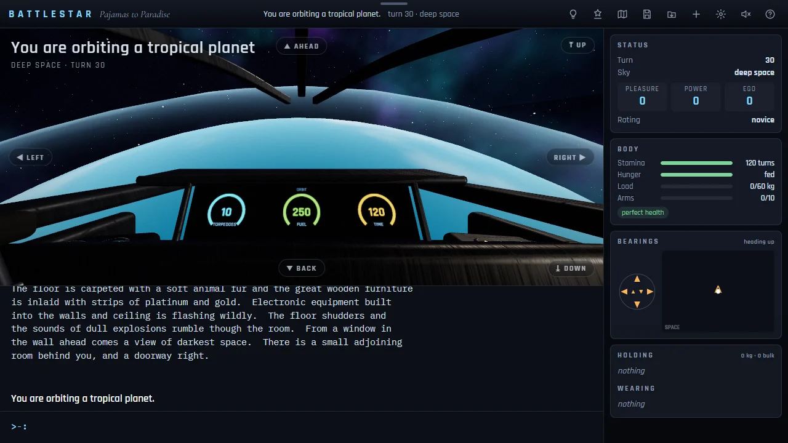

# Pajamas to Paradise

> Wake up aboard a dying starship and find your way to paradise.

## The hook

You wake in silk pajamas in a stateroom of the last great ship of a fallen fleet, and the floor is
already shaking. You say what you want to do in a few plain words, and the room you stand in is
built around you from its own description. Find the launch tube before the hull gives way, take the
last fighter out past an enemy raider, and drop through the clouds to a tropical island where day
turns to night and changes the paths, the caves stay black until you bring a light, and three
charms are waiting for someone to bring them home.

## Where it comes from

`battlestar` is David Riggle’s text adventure from the BSD games. He wrote it in 1979 on a
PDP-11/70 at the University of California, Berkeley, and his manual says he did it to try out
what the C language could do. The version BSD shipped introduces itself as 4.2, from
the autumn of 1984; the manual thanks Chris Guthrie, Peter Da Silva, Kevin Brown, Edward Wang and
Ken Arnold. Its source describes a game half among the stars and half in the tropics, and the
manual says it is meant more for wandering than for puzzling: 275 places, a night that rearranges
the island, three separate scores, and in the middle of it all a dogfight drawn on the terminal
with a handful of characters. Its ship, fighters and enemies borrow their names from a 1970s
television series, which is why the collection lists the game under its subtitle.

## What is new

- Every place is built in 3D from the original’s own words and lit by the game’s own clock: the
  wood-panelled decks of the ship, deep space, the island from the air, coral beaches, a village,
  a rainforest, thermal pools, and caves that stay dark exactly where the original says you
  cannot see.
- The dogfight becomes a cockpit with gauges for torpedoes, fuel and time, played in real time or,
  if you prefer, one move at a time.
- A side panel keeps your three scores, your stamina, food and injuries, a compass, a map of the
  places you have seen and what you are holding and wearing.
- Help when you want it: a hint panel names the next step and why, Tab completes words, and small
  typos are fixed only when the original would not have understood you.
- A soundscape made in code for every place, from the ship’s hum to surf, cicadas and dripping
  caves; it stays silent until you switch it on.
- Saves in the browser, an automatic save between commands, and a Continue button on the title.

## A note on content

The game keeps the 1979 program’s text word for word: it was written for a university terminal
room, not for all ages. Some of it is sexual, including violence against the goddess; some scenes
are gory; there are jokes about drugs; the parser understands profanity; the original victory
requires shooting the goddess; and the rank titles are named after film and television characters.
The pictures stay non-explicit (people are clothed and nothing graphic is drawn), but the words do
not. On 2026-10-01 the owner chose to ship the game as it is, as a recorded exception to the
collection’s all-ages rule, until the game’s modification prompt revises the text. The exception is
listed in `docs/KNOWN-ISSUES.md`.

## At a glance

|                 |                      |
| --------------- | -------------------- |
| Directory       | `/usr/games/stories` |
| Players         | 1                    |
| Session         | 20–60 minutes        |
| Daily challenge | no                   |
| Inspired by     | `battlestar` (1979)  |

## More

- [How to play](HOW-TO-PLAY.md)
- [Changes from the original](CHANGES-FROM-ORIGINAL.md)
- [Architecture](ARCHITECTURE.md)
- [Notes](NOTES.md)
