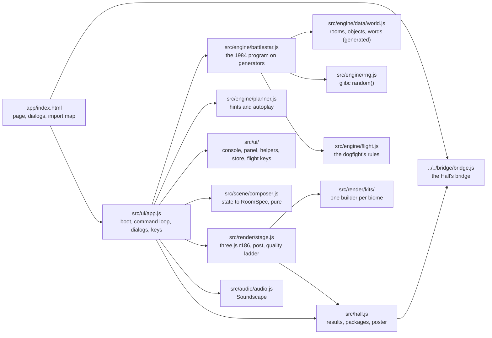
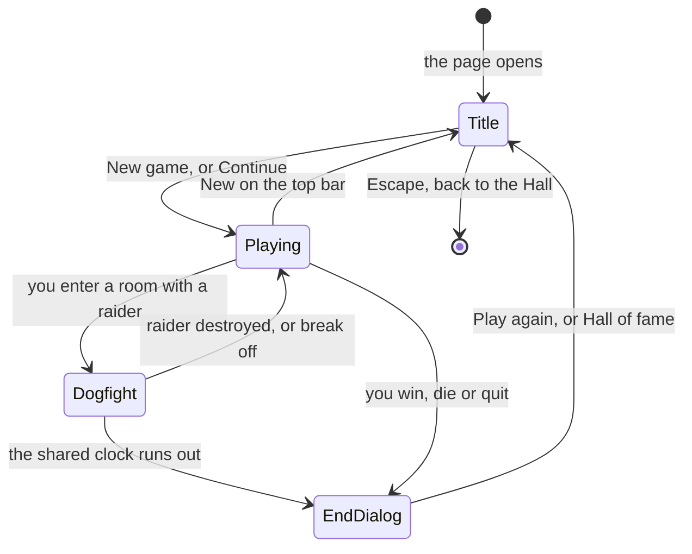

# Pajamas to Paradise — architecture

## Overview

Pajamas to Paradise is a **hosted** game: the owner’s finished port (`battlestar`, fancy-web),
adopted as it was into `games/battlestar/app/` and run by the Hall in a same-origin frame at
`play/battlestar/`. It is vanilla ES modules with no build step; three.js r186 is vendored in
`src/vendor/` and reached through an import map in `index.html`. Underneath is a faithful engine
(about 2,900 lines) that re-expresses the original C program function by function on JavaScript
generators, with its world data generated from the BSD sources; above it, procedural 3D rooms (a
pure scene composer feeding one builder per biome), a cockpit dogfight and a synthesised
soundscape. The upstream design notes are kept in
[`../app/docs/architecture.md`](../app/docs/architecture.md) and its decisions in [`adr/`](adr/).

## Module map

| Path                                                              | Responsibility                                                                                                                                  |
| ----------------------------------------------------------------- | ----------------------------------------------------------------------------------------------------------------------------------------------- |
| `app/index.html`                                                  | The page: top bar, scene, transcript and prompt, side panel, the dialogs (title, saves, settings, help, Override, end), the three.js import map |
| `app/src/engine/battlestar.js`                                    | The game: every C global a field, every C function a method, every blocking read a generator; emits side-channel events                         |
| `app/src/engine/data/world.js`                                    | Rooms, placements, objects, vocabulary and constants, generated by `scripts/extract-data.mjs` from the BSD sources, with the Regents’ notice    |
| `app/src/engine/rng.js`                                           | glibc’s `random()`, so a seed replays the original binary’s dice                                                                                |
| `app/src/engine/flight.js`                                        | `FlightSim`: the dogfight’s grid, drift, fuel, torpedoes and clock, driven by ticks; `autopilotKey()` for tests and autoplay                    |
| `app/src/engine/planner.js`, `autoplay.js`, `routes.js`, `run.js` | The hint planner, autoplay, the two walkthrough routes, headless runs                                                                           |
| `app/src/scene/composer.js`, `layout.js`                          | `composeRoom(game)`: engine state to a `RoomSpec` (biome, place, features, light, props, people, status); the computed map layout               |
| `app/src/render/stage.js`                                         | Renderer, camera, fixed light rig, environments, post chain, travel transitions, the quality ladder; hosts the cockpit                          |
| `app/src/render/kits/`                                            | One builder per biome: `ship`, `space`, `air`, `coast`, `forest`, `cave`; `index.js` dresses the room and applies darkness                      |
| `app/src/render/*.js`                                             | Shared pieces: materials, terrain, water, flora, sky, effects, spacecraft, the cockpit, modelled furniture and buildings, people                |
| `app/src/audio/audio.js`                                          | `bedFor(spec)` (pure) and the `Soundscape` mixer                                                                                                |
| `app/src/ui/`                                                     | `app.js` (boot and wiring), `console.js`, `panel.js`, `helpers.js`, `store.js`, `flight.js`, `styles.css`, `fonts/` (added on adoption)         |
| `app/src/hall.js`                                                 | The bridge glue (added on adoption)                                                                                                             |
| `app/src/vendor/`                                                 | three.js r186 (`three.module.js`, `three.core.js`) and its licence                                                                              |
| `app/tests/`, `app/scripts/`, `app/docs/`                         | The workbench: node tests, golden capture, screenshot, performance and smoke tools, upstream docs; the build leaves it out                      |

## State machine

`Title` is the native `<dialog id="dlg-title">`; closing it in any way starts a game (its `close`
handler calls `newGame`). Loading a saved slot also goes straight to `Playing`. While `Dogfight`
runs, the command line is paused and `FlightController` (`src/ui/flight.js`) owns the keyboard in
the capture phase.

## Engine

The engine reads a character stream and writes text, exactly like the C program on a terminal.
`start()` runs to the first input request; `send(line)` feeds a line; each returns
`{ output, segments, events, request, ended, endKind }`. A request is either a `line` (with the
prompt the original would print) or a `flight` carrying a `FlightSim`, which the page drives in real
time (one tick a second, restarted by each shot) or turn by turn, then hands back with
`resumeFlight()`. A game ends by an exception that unwinds the generators; `endKind` is `won`,
`died` or `quit`.

Alongside the text the engine emits events (`move`, `launch`, `land`, `dusk`, `fightWon`,
`wedding`, …) that never change the text. `app.js` routes them to the stage’s effects, the
soundscape and `hall.js`.

Randomness is glibc’s TYPE_3 generator seeded at new game (the Seed field, `?seed=`, or a random
number from 1 to 30,000), so the same seed and commands replay the same game, as on the original
binary with its process id pinned. `snapshot()` and `restore()` round-trip every field as
versioned JSON (`battlestar-fancy-web`, version 1). `src/ui/store.js` keeps everything in
`localStorage` under `battlestar:`: settings, named save slots, the autosave written between
commands, and the local list of past games. The Override flags default to off; any use sets
`cheated`, which is saved with the game.

## AI

The enemies are the original’s: fights roll damage by weapon, injuries, armour and exhaustion as
the C does, and the raider in a dogfight moves on the original’s 24×80 grid once a second, jinking
when it nears the centre. The hint planner (`planner.js`) works through a sequence of goals
(escape, fly, the goddess, arms and armour, the dark lord, the gifts, the end) over shortest routes
that count walking, flying, launching and landing, and the amulet’s jump; it wins every one of its
40 test seeds. Autoplay simply sends the planner’s next command on a timer.

## Where visuals are defined

| Visual                                                                       | Defined in                                                                                                           |
| ---------------------------------------------------------------------------- | -------------------------------------------------------------------------------------------------------------------- |
| What a place contains: biome, landmarks, light, props, people, status        | `app/src/scene/composer.js` (`composeRoom`)                                                                          |
| The scene for each biome                                                     | `app/src/render/kits/ship.js`, `space.js`, `air.js`, `coast.js`, `forest.js`, `cave.js`; dressing in `kits/index.js` |
| Surfaces (panel, grate, carpet, wood, stone, sand, bark, leaf, metal, gold…) | `app/src/render/materials.js`                                                                                        |
| Furniture, stairs and fittings of the ship                                   | `model.js` (the modelling toolkit), `furnish.js`, `stairs.js`, `shipfit.js`                                          |
| Island buildings and interiors, cave and forest furnishings                  | `island-build.js`, `island-furnish.js`, `buildings.js`, `interiors.js`, `cave-furnish.js`                            |
| People and how they walk                                                     | `humans.js`, `gait.js`, `people.js`                                                                                  |
| Terrain, sea and plants                                                      | `terrain.js`, `water.js`, `flora.js`                                                                                 |
| Sky, sun, moon, stars and planets; light environments per mood               | `sky.js`; `env.js`                                                                                                   |
| Spacecraft (original designs)                                                | `craft.js`                                                                                                           |
| The dogfight cockpit and its gauges                                          | `cockpit.js` and `*-cockpit.js`                                                                                      |
| Flashes and shakes for engine events; particles, glows, light shafts         | `events()` in `app/src/ui/app.js` calling `stage.fx()`; `fx.js`                                                      |
| Bloom, grade, vignette, grain, travel transitions, status effects            | `post.js` (injuries as red edges, fatigue as a slow warp, red alert, a wizard’s glow)                                |
| Page chrome, panels, dialogs, high contrast                                  | `app/src/ui/styles.css`; the compass, minimap and world map in `app/src/ui/panel.js`                                 |
| Fonts                                                                        | `app/src/ui/fonts/fonts.css`                                                                                         |
| Quality ladder (High, Low, Text)                                             | `probeGL()` and `Stage` in `stage.js`; `setDetail` in `model.js` builds coarser pieces on Low                        |

All render files above are in `app/src/render/`. The game has one dark look and does not read the
Hall’s tokens. Reduced motion is its own setting (first taken from the system; in the Hall it
follows the Hall’s setting, live, through the same `settings.motion` path), which removes the
travel slides and camera shake; high contrast is its own setting too. Every texture is drawn by
code at run time; there are no image files.

## Where sounds are defined

Every sound is synthesised in `app/src/audio/audio.js` from noise buffers, filters, oscillators and
envelopes; there are no audio files. The `AudioContext` is created on the first unmute. On its own,
sound is off until the player turns it on; in the Hall the Hall’s sound turns the Sound switch on
at the frame’s first click or key press when the Hall is not muted, at the master level
(`MASTER_LEVEL`, 0.8) scaled by the Hall’s volume.

| Sound                                                                                 | Defined in                         | Plays when                           |
| ------------------------------------------------------------------------------------- | ---------------------------------- | ------------------------------------ |
| Ambience per place (ship hum, wind, surf, cicadas, crickets, cave tone, drums…)       | `bedFor(spec)`                     | Every room change, crossfaded        |
| Sparse incidentals (clanks, gulls, birds, frogs, drips, the klaxon under attack…)     | `bedFor(spec)`, its sparse list    | At random intervals while in a place |
| One-shots for engine events (steps, explosions, sword rings, launch, doors, the win…) | `EVENT_SOUNDS`, `Soundscape.event` | The engine emits the event           |
| Dogfight drone, torpedo zaps, lock tone, the kill                                     | `Soundscape.flight`                | Every dogfight tick and key          |

## Hall integration

All of it lives in `app/src/hall.js`, plus the bridge script tag in `index.html`, one import and
these calls in `app/src/ui/app.js` and one line in `app/src/render/stage.js`:

- `noteGameStarted()` in `newGame`, once the engine exists (a new game, a loaded slot or
  Continue);
- `noteEvents(game, r.events)` right after `events()` in `handle`, once per command;
- `reportGameOver(game, r.endKind)` at the top of `gameOver`;
- `stage.afterFrame = afterStageFrame` when the stage is created, and in `stage.js`
  `this.afterFrame?.(this.canvas)` right after `post.render`, so the poster is captured in the same
  task as the drawing;
- `followHall({ settings, sound, soundButton, stage, flight, setReducedMotion })` once at boot, and
  `hallPaused()` in the hint panel’s autoplay, which waits while the Hall holds the game still.

| Game moment                                                       | Bridge message                                                 |
| ----------------------------------------------------------------- | -------------------------------------------------------------- |
| The title dialog opens or closes                                  | `title-screen { active }` (a `MutationObserver` on its `open`) |
| Escape while the title dialog is the topmost open dialog          | `navigate { to: 'hall' }`                                      |
| `launch` from the launch tube (room 7)                            | `achievement out-of-pajamas`                                   |
| `land`                                                            | `achievement touchdown`                                        |
| `teleport` by the amulet                                          | `achievement amulet-hop`                                       |
| `napkinMap`                                                       | `achievement napkin-map`                                       |
| `darkLordFlees`                                                   | `achievement outwitted`                                        |
| `wedding` (the three charms returned to the throne)               | `achievement prince-liverwort`                                 |
| The engine’s event for a destroyed raider                         | `achievement clean-shot`                                       |
| `seaCaveOpens`                                                    | `achievement low-tide`                                         |
| `wizard` (all three charms held)                                  | `achievement three-charms`                                     |
| `dusk`                                                            | `achievement island-night`                                     |
| 150 places visited in one game                                    | `achievement surveyor`                                         |
| Ego reaches 20                                                    | `achievement generous-heart`                                   |
| The game ends                                                     | `result { outcome, score, stats, xpEvents, durationSeconds }`  |
| 8 s of play after a game starts (pauses left out), once per visit | `posterFromCanvas(stage canvas)`                               |

`PACKAGE_FOR_EVENT` in `hall.js` holds the event-to-package table. `outcome` maps `won` to `win`,
`died` to `loss` and `quit` to `quit` (no XP). `score` is the highest of Pleasure, Power and Ego,
the figure the original’s rating is drawn from. `stats` carries `placesExplored` (the weekly goal
“Explore {n} places”, 30–100) and `turns`. `xpEvents`: `places-explored` (1 per 10 places, at most 25) and `fights-won` (5 per hand-to-hand fight won, at most 25).

A game begun under a hereditary wizard’s name (`game.wiz`), or one marked `cheated` by the Override
panel, sends no score, no XP events and no packages, and reports zero places. Becoming a wizard in
play by holding the three charms (`tempwiz`) is part of the game and counts.

The title dialog is the game menu, so `hall.js` reports it with `setTitleScreen`. The bridge would
normally handle Escape there itself, but the native dialog closes on Escape and its `close` handler
starts a game. So `hall.js` listens on `window` in the capture phase and, when the title dialog is
the topmost open dialog, calls `preventDefault()` and `stopPropagation()` and navigates to the
Hall; the bridge sees the prevented key and leaves it alone ([ADR 0011](../../../docs/adr/0011-adopting-finished-games.md)).
The game ignores appearance messages (it has one look). Since bridge 1.1 `connectToHall` is given
sound, reduced-motion and pause handlers:

| In `hall.js`                                | What it does                                                                                                                                                                                                                                                                                                                                               |
| ------------------------------------------- | ---------------------------------------------------------------------------------------------------------------------------------------------------------------------------------------------------------------------------------------------------------------------------------------------------------------------------------------------------------- |
| `onSound` → `followHallSound`, `syncSwitch` | Sets the master level to the Hall’s volume scaled from 0.8 (`setMasterLevel`) and moves the game’s own Sound switch to match: off while the Hall is muted; on, when it is not, at the frame’s first click or key press (a browser keeps sound made before a gesture silent). The switch still works during the visit, until the Hall’s sound changes again |
| `onReducedMotion` → `followHallMotion`      | Calls the setter `app.js` hands over: `settings.motion` (`?motion=reduce` still wins), the `reduce-motion` class and the stage’s and cockpit’s reduced flags, live                                                                                                                                                                                         |
| `pauseWhenHidden`, `onPause` / `onResume`   | The Hall’s pause and a hidden tab stop the scene’s frame loop, the dogfight’s one-second clock and its autopilot, the hint panel’s autoplay (`hallPaused`) and the sound; each carries on from exactly there, and play time (`durationSeconds`, the poster’s 8 s) leaves the pause out                                                                     |

Opened on its own, the bridge script is missing, `hall` is `null`, and every call does nothing.

## Tests

| Test                               | Command                                                               | What it proves                                                                                                                                                                                                                                                                          |
| ---------------------------------- | --------------------------------------------------------------------- | --------------------------------------------------------------------------------------------------------------------------------------------------------------------------------------------------------------------------------------------------------------------------------------- |
| Upstream unit tests (98, 13 files) | `pnpm run test:hosted` (or `node --test "tests/*.test.js"` in `app/`) | 24 golden transcripts identical byte for byte to the original binary (seven complete wins), the first frame of every dogfight, the room graph, parser quirks, rules, saves, Override off equals the original, the planner, the composer, the parser helpers, sound recipes, zero raster |
| In the Hall (6)                    | `pnpm exec playwright test -c games/battlestar`                       | Opens on its title with no outside requests; quitting reports to the Hall; Back to the Hall; Game menu; the browser’s Back; Escape on the title screen                                                                                                                                  |
| Screenshots                        | `SHOTS=1 pnpm exec playwright test -c games/battlestar`               | `docs/media/` (title, play, signature) at 1280×720 on the machine’s GPU, using `?fresh=1&seed=7` and the game’s `window.__bs.place` hook                                                                                                                                                |

`e2e/battlestar.spec.ts` holds the first two in-Hall tests and the four ways out from
`describeWaysOut` in `packages/bridge/testing/hall.ts`; `e2e/shots.spec.ts` the screenshots. Set
`HALL_PORT` when the Hall’s usual port (5173) is taken. On its own,
`pnpm --dir games/battlestar/app start` serves the game at `http://localhost:5207/`. The upstream
browser smoke test and performance script (`scripts/ui-smoke.mjs`, `scripts/perf.mjs`) stay in the
workbench and are not part of the collection’s runs.

## Kit candidates

None: hosted games talk to the Hall only through the bridge.
