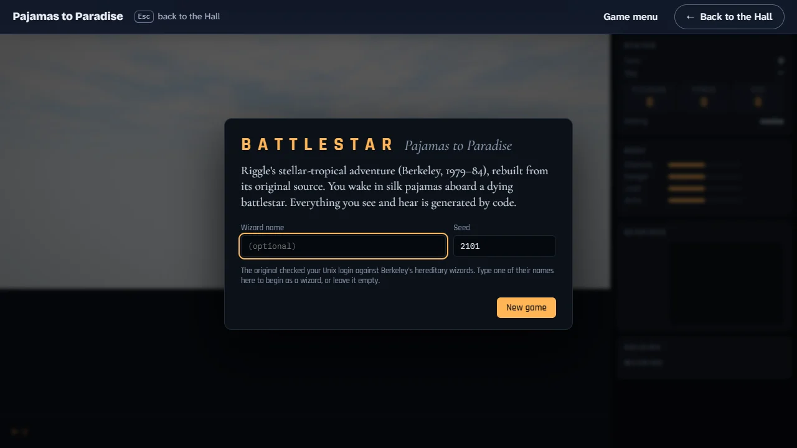
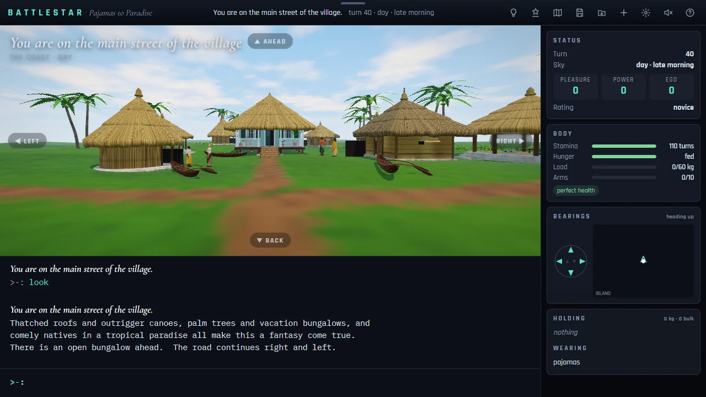
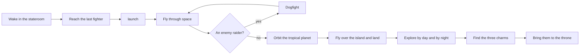

# How to play Pajamas to Paradise

## Goal

Get off the dying ship, fly its last fighter to the tropical planet, land on the island and explore
it. Somewhere on the island and under it are three charms (an amulet, a medallion and a talisman);
bring all three back to the goddess on her throne. Most of the packages reward the journey itself:
the escape, the landing, the dogfight, the first night, the charms and the wedding at the throne.

The game declares a victory only through the original’s own final act at the throne, which is
violent (see the [note on content](ABOUT.md#a-note-on-content)). A game can also end when you die,
when the dogfight clock runs out, or when you type `quit`.

## Starting a game

The title dialog is the game menu. **New game** starts from the stateroom; **Continue** appears
when the game saved itself between commands last time. The **Seed** decides the dice: the same seed
and the same commands always play out the same way. The optional **Wizard name** is the original’s
joke about Berkeley logins: a few names from its source start you as a wizard (and a few others
make the game harder). A game begun as a wizard is not recorded by the Hall. Escape on this dialog
takes you back to the Hall.

## The screen

- **Top bar:** where you are, the turn and the time of day, and the tools (Hints, Override, Map,
  Save, Load, New, Settings, Sound, Help).
- **The scene:** the place you are in, drawn from its description, with buttons for the exits you
  can see.
- **The transcript and the prompt** `>-:` below it: everything the game says, and where you type.
- **The side panel:** turn, sky and the three scores with your rating; stamina, hunger, load,
  arms and injuries; a compass and a map of the places you have seen; what you hold and wear.

## Controls

The game is played by typing; the mouse works the buttons and the exits. Keys are the game’s own
and cannot be remapped from the Hall.

| Action                                   | Keyboard                                                           | Mouse                                     |
| ---------------------------------------- | ------------------------------------------------------------------ | ----------------------------------------- |
| Do something                             | Type a command, then Enter                                         | —                                         |
| Move                                     | `ahead`, `back`, `left`, `right`, `up`, `down` (or `a b l r u d`)  | The exit buttons on the scene             |
| Complete a word                          | Tab (Shift+Tab goes back through the choices)                      | —                                         |
| Repeat an earlier command                | ↑ / ↓                                                              | —                                         |
| Hints                                    | `` ` ``                                                            | Hints                                     |
| Override panel and world map             | Shift+`` ` `` (`~`) or Ctrl+M                                      | Override or Map                           |
| Save                                     | Type `save` and name the slot                                      | Save                                      |
| Load a saved game                        | —                                                                  | Load                                      |
| Back to the title dialog                 | —                                                                  | New                                       |
| Settings                                 | —                                                                  | Settings                                  |
| Sound on or off (see Settings)           | —                                                                  | Sound                                     |
| How to play                              | F1                                                                 | Help                                      |
| Close a panel or dialog                  | Esc                                                                | × or the dialog’s button                  |
| Leave for the Hall from the title dialog | Esc                                                                | ← Back to the Hall on the Hall’s strip    |
| Leave for the Hall during a game         | Type `quit`, close the end dialog, then Esc; or the browser’s Back | ← Back to the Hall on the Hall’s strip    |
| Start again from the Hall’s strip        | —                                                                  | Game menu on the Hall’s strip, then Leave |

### Dogfight keys

While a dogfight runs, the command line waits and these keys fly the fighter:

| Action                                             | Keyboard                                          |
| -------------------------------------------------- | ------------------------------------------------- |
| Turn left                                          | ← or `l`                                          |
| Turn right                                         | → or `r` (also `h`)                               |
| Pull up                                            | ↑ or `u` (also `j`)                               |
| Dive                                               | ↓ or `d` (also `k`)                               |
| Hard turn (five times as fast, ten times the fuel) | Shift with an arrow, or the capital letter        |
| Fire (two torpedoes a shot)                        | F or Space                                        |
| Reticle on or off                                  | `+` (or `=`)                                      |
| Break off                                          | `q` or Esc (the enemy gets a parting shot at you) |

Your keys turn the ship, so the raider drifts the other way across your sights, and a turn keeps
going until you change it. A shot hits only when the raider sits on the centre line, within a hair
of the middle.

## Rules

1. Almost every command takes a turn. The ship is falling apart: after turn 20 the explosions
   begin, and anyone still aboard after turn 30 goes down with it.
2. You `launch` from the room where the last fighter waits. In space you move with the same words;
   meeting an enemy raider starts a dogfight. Over the island, `land` brings you down where the
   ground allows.
3. Moves are relative to the way you face. There is no north or south unless you carry a compass.
   A move into a wall still turns you to face it.
4. Day and night take turns every 100 turns, and the island changes at night: some people leave,
   some appear, and a few paths open only in the dark.
5. You tire and must `sleep`; eating needs a knife in your hand. Injuries reduce what you can carry,
   and three particular wounds together are fatal.
6. Underground you see nothing without a light: the lantern, or a lit match for a single turn.
7. Some creatures fight you on sight. Fight with `kill` (or `shoot`, with the laser in hand), and
   retreat with `back`. Armour and a shield help; worn charms make you easier to hurt.
8. Hold all three charms at once and you become a wizard. Give all three to the goddess at her
   throne for the wedding.

### The dogfight

Every dogfight in the game shares one clock of 120 seconds; it ticks once a second, or once a key
in turn-based mode. You start with ten torpedoes (five shots) and a full tank of 250. Destroy the
raider and the way is clear; break off and it wounds you as it goes; let the shared clock run out
and the game ends.

## Modes

One mode: a single adventure from the stateroom to the throne, at your own pace. There is no daily
challenge. A game can be saved in named slots and continued later in the same browser.

## Settings

The game’s own Settings dialog. Of the Hall’s settings, its sound and reduced motion reach the game
too (below); the rest apply to the Hall around it.

| Setting              | Options                | Default                                                                               |
| -------------------- | ---------------------- | ------------------------------------------------------------------------------------- |
| Graphics             | High · Low · Text only | Chosen for your machine: High with a graphics card, Low without, Text without WebGL 2 |
| High contrast        | on · off               | off                                                                                   |
| Reduce motion        | on · off               | Your system’s setting the first time; in the Hall, the Hall’s setting                 |
| Turn-based dogfights | on · off               | On when your system asks for reduced motion                                           |
| Strict parser        | on · off               | off (typo help on)                                                                    |
| Sound                | on · off (top bar)     | off (in the Hall, as the Hall’s sound is, from your first click or key)               |

Changing Graphics or Reduce motion reloads the page; the title dialog then offers to Continue
from the automatic save. A change to the Hall’s reduced-motion setting applies at once, without a
reload. In the Hall the sound follows the Hall’s: silent while the Hall is muted, otherwise on at
the Hall’s volume from your first click or key in the game; the Sound button still works during
the visit. While the Hall pauses, or the tab is hidden, the scene, a dogfight’s clock, the hint
panel’s autoplay and the sound all wait, and carry on exactly where they were.

## Scoring

The game keeps three scores. Pleasure comes from romance, Power from fights won, and Ego from gifts
and kindness; your rating is a title taken from the strongest of the three. The Hall records the
highest of the three as your score, the same figure the rating is drawn from. The end dialog shows
the scores and can list the game’s own record of past games on this device.

A game begun under a wizard’s name, one in which the Override panel changed anything, or one handed
to the autoplay records no score, no XP events and no packages. Opening the Override panel or the
map to look changes nothing, and a single hint does not count against you, since it only types a
command you could type yourself.

## Achievements (packages)

| Package            | How to earn it                                                                 |
| ------------------ | ------------------------------------------------------------------------------ |
| `out-of-pajamas`   | Launch the last fighter from the ship’s launch tube.                           |
| `touchdown`        | Bring your fighter down safely on the island.                                  |
| `amulet-hop`       | Use the amulet and let it carry you somewhere new.                             |
| `napkin-map`       | Give your coins to the old-timer, and he will draw you a map.                  |
| `outwitted`        | Wear down the dark lord, then step back while you carry the amulet.            |
| `prince-liverwort` | Give all three charms to the goddess at her throne.                            |
| `clean-shot`       | Destroy an enemy raider in a dogfight.                                         |
| `low-tide`         | Open the way down to the sea cave with the amulet, the medallion in your hand. |
| `three-charms`     | Hold the amulet, the medallion and the talisman at the same time.              |
| `island-night`     | Stay until your first dusk falls.                                              |
| `surveyor`         | Explore 150 places in one game.                                                |
| `generous-heart`   | Reach an Ego of 20 through gifts and kindness.                                 |

## XP

Each finished game reports to the Hall. Reaching the original’s victory counts as a win and dying as
a loss; a game you end with `quit` earns no XP. On top of the session’s XP, a game earns 1 XP for
every ten places explored (from ten places, up to 25) and 5 XP for every fight won on foot (up to
25); the Hall caps a session’s extras at 30. The weekly goal asks you to explore a number of places.

## Tips

- Start by facing the way the description tells you, and read the exits: the room names them
  relative to you.
- The ship will not wait. Find your way to the fighter before you go sightseeing.
- A verb on its own reuses the object of your last command (`take knife`, then `drop`), and
  commands chain with commas or `and`.
- Carry a light before you go underground, and do not drop it in the dark.
- If you are stuck, press `` ` ``: the hint panel names a goal, the next command and the reason.
