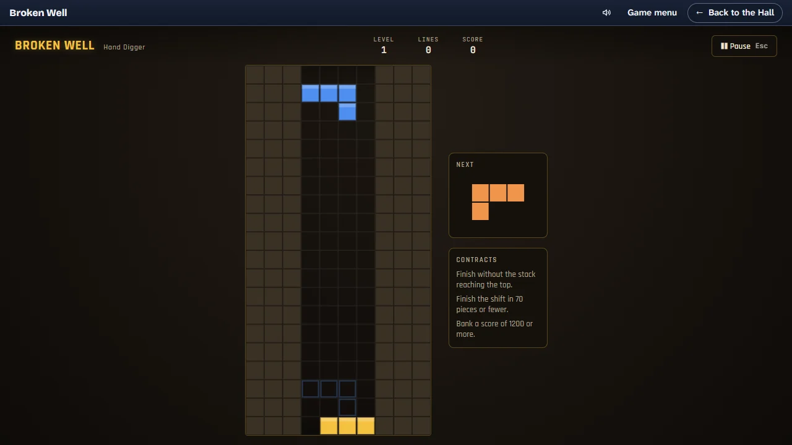

# Broken Well

> The well never holds its shape. Clear it, or outlast the flood.

## The hook

Seven falling shapes, a line to clear, a ghost outline showing where a piece will land — the
familiar loop, but the shaft itself keeps changing under you. One shift it is a narrow canyon,
the next a pillar splits it in two, the one after that rubble is already rising from below. Clear
a shift's line target or hold the well through its flood, and the quarry hands you a harder one.

## Where it comes from

Adapted from the owner's earlier fancy-web port of BSD `tetris` (Chuck Simmons, 1992), which added
reshaped wells, a starting rubble stack and a flood mode on top of the original's seven
tetrominoes and line-clear scoring. See [`CHANGES-FROM-ORIGINAL.md`](CHANGES-FROM-ORIGINAL.md) for
the full account and [`CREDITS.md`](../../CREDITS.md) for attribution.

## What is new here

- A quarry foreman's twelve-shift career, each one reshaping the well or raising the flood,
  with six ranks from Hand Digger to Master of the Broken Well.
- A three-contract briefing before every shift, a seal for each one met, and a logbook that writes
  up what happened.
- Free Dig: pick any well shape, starting rubble and mode yourself, with no contracts attached.
- A Daily Shift everyone plays the same well for, with a share line and no link.
- Light and dark looks for the quarry, both designed on purpose, not one inverted from the other.
