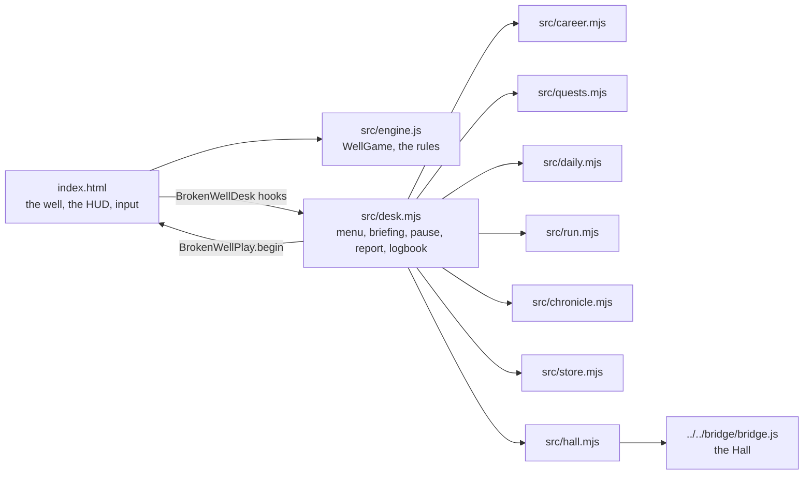
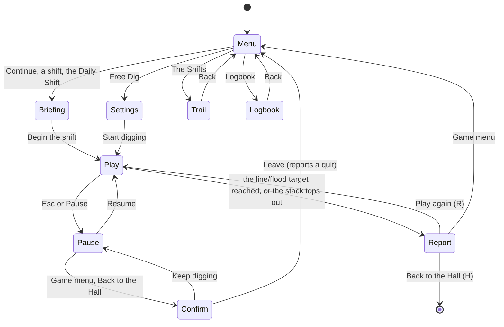

# Broken Well — architecture

## Overview

An adopted, hosted game: a static page (`app/index.html`) with a single Canvas 2D well and a
next-piece preview canvas, built on a pure, DOM-free engine (`app/src/engine.js`, ~450 lines), no
build step. The Hall serves `app/` at `play/blocks-classic/` and talks to it over the bridge.
Around the page's own script, a set of small ES modules add the career, the contracts, the
logbook and the Daily Shift; the engine's own rules are untouched.

## Module map

| Path                     | Responsibility                                                                             |
| ------------------------ | -------------------------------------------------------------------------------------------- |
| `app/index.html`         | The adopted page: the well canvas, next-piece canvas, HUD, input, the animation loop         |
| `app/src/engine.js`      | The adopted engine: wells, pieces, wall kicks, lock delay, rubble, the flood — no DOM         |
| `app/src/desk.mjs`       | Every screen around a shift, and what the page tells it (`window.BrokenWellDesk`)            |
| `app/src/career.mjs`     | The twelve shifts, ranks, unlocking, stars                                                   |
| `app/src/quests.mjs`     | Contract kinds, their wording and their checks                                               |
| `app/src/daily.mjs`      | The Daily Shift: number, seed, well by weekday, contracts, share line                        |
| `app/src/run.mjs`        | One shift as it happens: reads the engine's own counters into a summary                      |
| `app/src/chronicle.mjs`  | The written account of a shift; the logbook                                                  |
| `app/src/store.mjs`      | Saves under `usr-games:blocks-classic:`                                                      |
| `app/src/hall.mjs`       | Bridge glue: results, packages, title screen, pause, sound, appearance, key art              |
| `app/src/desk.css`       | The desk's styles; `app/src/fonts/` the self-hosted Rajdhani and JetBrains Mono               |

## State machine

The page opens with `<body data-desk="menu">`; `desk.mjs` lays the menu over an empty well.
`BrokenWellPlay.begin(options)` replaces the game with a new `WellGame` and starts the animation
loop. `BrokenWellDesk.checkShiftEnd()` is polled once a frame while playing; the engine's own
`gameOver` flag and `run.mjs`'s `hasReachedTarget` are the only two ways a shift ends.

## How the desk follows a shift

Unlike a port whose engine only answers direct calls, this engine already counts everything a
contract needs on itself — `piecesLocked`, `hardDrops`, `tetrises`, `rubbleRowsSurvived`, and
`gameOver` as the "topped out" flag. `run.mjs`'s `summarize(run, game, cleared)` reads those
counters straight off the live `WellGame` when a shift ends, so the page never has to relay every
lock or drop as a separate event the way a hazard-driven game (one chamber, one arrow at a time)
does.

## Where visuals are defined

| Visual                                   | Defined in                           | Change it by                                  |
| ----------------------------------------- | ------------------------------------- | ---------------------------------------------- |
| The well, pieces, ghost, rock             | `index.html` (`drawWell`, `drawBlock`, `drawRock`) | the adopted canvas drawing code  |
| The rubble burst on a line clear          | `index.html` (`spawnClearParticles`, `updateParticles`) | particle count, colour, decay |
| The next-piece preview                    | `index.html` (`drawNext`)             | the mirrored spawn-rotation shape table        |
| HUD, menu, briefing, pause, report        | `src/desk.mjs`, `src/desk.css`        | the desk                                       |
| Light and dark looks                      | `index.html`'s `:root` custom properties, `:root[data-theme='light']` | both palettes designed, not inverted |

## Where sounds are defined

Nowhere yet: the fancy-web port carried no audio, and this adoption did not add any (see
`docs/KNOWN-ISSUES.md`). The Hall's mute and volume still reach `BrokenWellPlay.setSoundLevel`
through `onHallSound`, ready for sound to be added later.

## Hall integration

- **Results.** Every finished shift: `outcome` `win` (the target reached), `loss` (topped out) or
  `quit` (left mid-shift). `score` is the engine's own score; `stats` holds `shiftsCleared`,
  `linesCleared`, `piecesLocked`, `tetrises`, `rubbleRowsSurvived`, `contractsMet`; `xpEvents`
  (`cleared` 10, `contracts` 3 each, `promotion` 6); `daily` for the first Daily Shift of the day.
- **Packages.** The twelve in the manifest, offered by `installEarnedPackages` in `desk.mjs`.
- **Title screen.** The game menu reports `title-screen`, so Esc there leads to the Hall; the
  pause menu's own Esc handling only fires while `data-desk="play"`.
- **Sound, appearance and pause (bridge 1.1).** `onSound` in `hall.mjs` turns the Hall's sound
  into a level and hands it to `desk.mjs`'s `onHallSound`, which calls
  `BrokenWellPlay.setSoundLevel`. `onHallAppearance` sets `data-theme` on `<html>` from the Hall's
  `hello`/`appearance-changed` payloads (or the system preference, outside the Hall); outside the
  Hall this is the only place the look is chosen. `onHallReducedMotion` turns off the rubble burst.
  `pauseWhenHidden: true` folds a hidden tab into the same pause the Hall sends.
- **Key art.** The well canvas, offered once a shift has drawn something worth showing.
- **Saves.** `usr-games:blocks-classic:` `career`, `logbook`, `daily`, each at version 1.
- **Daily.** The number from the kit's epoch (2026-09-01), the seed from the date;
  `?date=YYYY-MM-DD` stands in for today when testing.

## Tests

| Test                    | Command                                                      | What it proves                                                              |
| ----------------------- | -------------------------------------------------------------- | ------------------------------------------------------------------------------ |
| The engine tests        | `pnpm run test:hosted` (or `node --test` in `app/`)             | Spawning, movement, wall kicks, lock delay, line/Tetris clears, every preset, seeded determinism, the flood |
| The desk's tests        | the same (`app/tests/*.test.mjs`)                               | Career ranks and unlocking, contract checks, the Daily Shift's determinism and share line |
| In the Hall             | `pnpm exec playwright test -c games/blocks-classic`             | Menu, a career shift to its report and the Hall's result, the Daily Shift's share line, leaving a shift, pause, every way out, no foreign requests |
| Screenshots             | `SHOTS=1 pnpm exec playwright test -c games/blocks-classic`     | `docs/media/*-1280.webp`                                                      |

## Kit candidates

None new: the desk follows the same career/contracts/logbook/store pattern as `wump-classic` and
`atc-classic`, which could move into the bridge for hosted games one day (noted in those games'
own architecture docs already).
