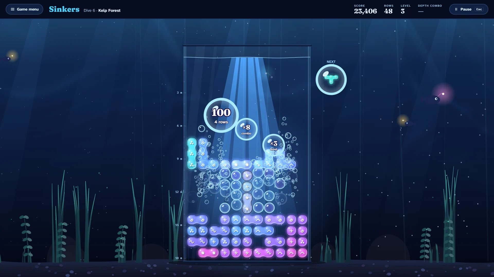

# Sinkers

> Drop deep. Fill the row. Ride the bubbles.

## The hook

Glassy sinkers, four pebbles fused together, sink slowly through a tall aquarium. Slide them, turn
them, and when the sonar shows a good landing, plunge: the farther a sinker falls, the more it
scores, and every plunge in a row makes your next burst bigger. Fill a row from wall to wall and it
cracks into hundreds of bubbles that rush up the tank while light blooms down through the water and
your score rises to the surface in bubbles of its own.

## Where it comes from

The falling-blocks game in the BSD collection began as a winning entry of the 1989 International
Obfuscated C Code Contest: a whole game squeezed into deliberately unreadable C. Chris Torek and
Darren F. Provine turned it into readable code for Berkeley, where it shipped in 1992; Hubert
Feyrer added a preview of the next shape in 1999. It had a delightful oddity at its heart: clearing
rows scored nothing at all. Points came only from landing shapes and from how far you dropped them,
and the manual itself advised dropping as the way to score. Shapes turned one way only, the game
quickened a hair on every tick, and the high-score file kept every level's champion for good, for
the players who came later to look up to.

## What is new

- **Drop deep, score deep.** The original's drop-to-score idea is the heart of the game: the plunge
  pays by distance, and a **depth combo** of plunges in a row multiplies the next burst.
- **A look of its own.** A sunlit aquarium by day and the deep sea at night; sinkers are glass
  pebbles coloured by how deep they rest, with a glyph etched in each so colour is never needed.
- **The sonar.** A dotted footprint on the water shows where the sinker will land, with a ping that
  runs down to it.
- **Twelve Dives.** Coral to clear, currents that push sinkers aside as they sink, seaweed in the
  way, a tank lit only by your sinker's own glow, and fast water; three stars each.
- **Marathon and Classic 1992.** Endless play from any starting level with a champion for each,
  and the original rules in a ten-wide tank: left turns only, rows for nothing, points times level.
- **The Daily Dive.** The same hundred sinkers for everyone, with a par set by the house diver and
  a line to share.

## At a glance

|                 |                                              |
| --------------- | -------------------------------------------- |
| Directory       | `/usr/games/arcade`                          |
| Players         | 1                                            |
| Session         | 3–15 minutes                                 |
| Daily challenge | yes                                          |
| Inspired by     | the 1992 Berkeley falling-blocks game (1992) |

## More

- [How to play](HOW-TO-PLAY.md)
- [Changes from the original](CHANGES-FROM-ORIGINAL.md)
- [Architecture](ARCHITECTURE.md)
