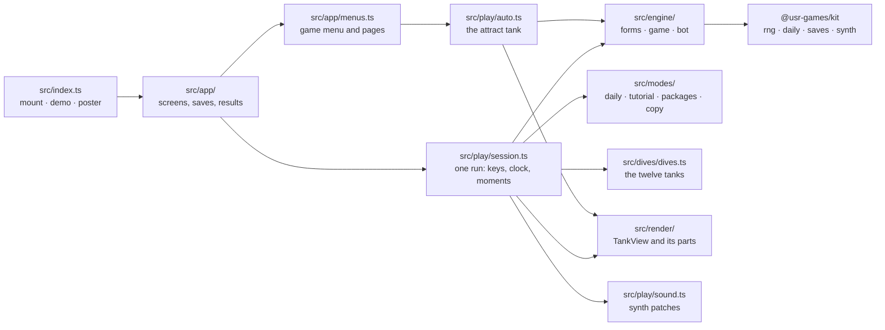
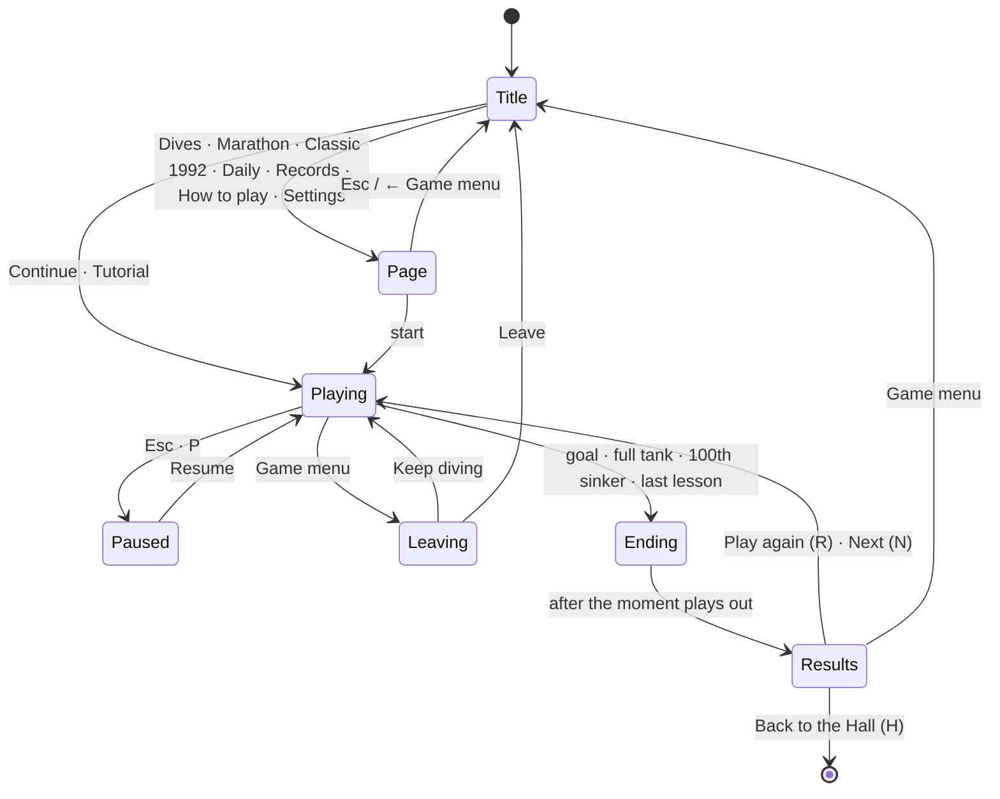
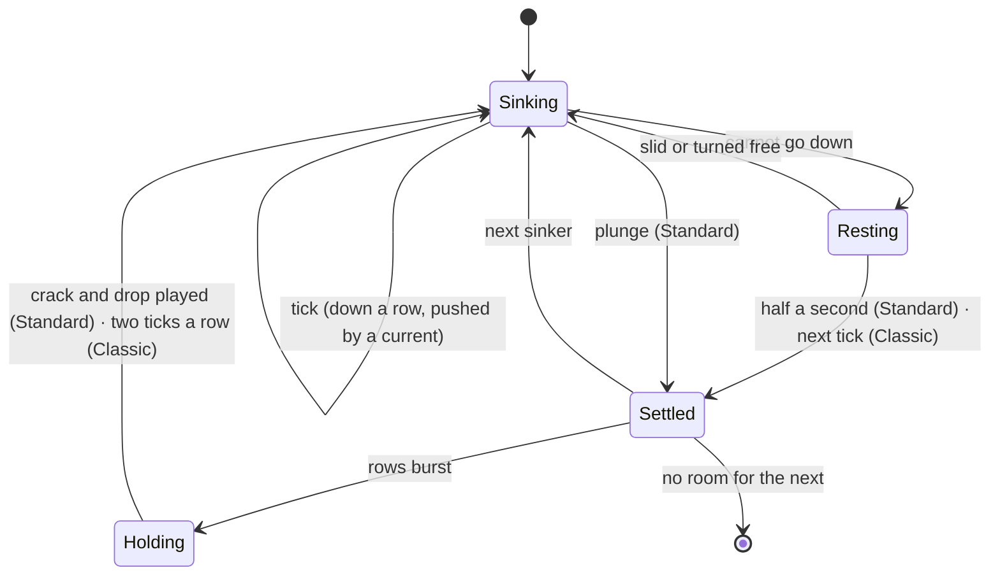

# Sinkers — architecture

## Overview

A native game for the Hall, drawn with Canvas 2D (ADR 0001), with no raster files and no runtime
requests. A pure, seeded engine (about 400 lines) runs both rule sets; a house diver plays the
attract tank, the Hall's demo, the balance tests and the Daily Dive's par (ADR 0003).

## Module map

| Path                  | Responsibility                                                                                    |
| --------------------- | ------------------------------------------------------------------------------------------------- |
| `src/index.ts`        | The kit contract: `mount`, `demo` (the diver in a plain tank), `poster`, `achievements`           |
| `src/engine/forms.ts` | The 19 forms (a centre and three offsets) and their left and right turns                          |
| `src/engine/game.ts`  | One tank: both rule sets, currents, coral and seaweed, scoring, combo, levels, the Classic clock  |
| `src/engine/bot.ts`   | The house diver: placement search, steering through currents, `playSteps`                         |
| `src/dives/dives.ts`  | The twelve dives: floors, currents, goals, star thresholds, state and stars                       |
| `src/modes/`          | The Daily Dive (plan, par, bubbles, share), the tutorial's lessons, packages, end-of-run words    |
| `src/play/session.ts` | A run: keys and repeats, the clock, resting, bursts holding the next sinker, endings, the bar     |
| `src/play/moments.ts` | Turns engine events into burst moments and plunge trails, noting the rows before they vanish      |
| `src/play/auto.ts`    | The diver at play, a key at a time, behind the game menu and in the Hall's tiles                  |
| `src/play/sound.ts`   | Every sound, as kit synth patches                                                                 |
| `src/render/`         | The tank and everything in it (see below)                                                         |
| `src/ui/`             | DOM builders: play screen and bar, title screen, cards (results, confirm, coach), `sinkers.css`   |
| `src/app/`            | The app shell, menus and pages, saves                                                             |
| `dev/`                | The workbench: `?game` (the whole game with a stand-in Hall) and `?scene=` (hero and perf scenes) |

## State machine

Inside a run (`PlaySession.advance`):

## Engine

`Game` is a plain object: the cells (one hidden row above the water, as in 1992), the falling
form and its centre, the next kind, level, points, counters, the depth combo, the Classic clock in
microseconds, and the kit RNG. Every move is a function returning events (`moved`, `drifted`,
`turned`, `blocked`, `plunged`, `landed`, `burst`, `spawned`, `levelled`, `over`); the session
turns events into pictures and sounds. Randomness: `createRng` from the kit, one stream per run;
the next kind is drawn before the current one, as the original did. The Daily Dive plays a fixed
plan of 102 kinds from the day's seed (`dailyPlan`), so every player gets the same sinkers.

Standard and Classic share all of this; they differ in `turn` (one way and no nudge in Classic),
`plunge` (Classic scores a point a row and lands at the next tick), `settle` (landing points),
`clearRows` (nothing for Classic) and the session's clock.

## AI

The house diver (`choosePlacement`) tries every form it can turn to at the top and every column it
can slide to, finds where each would come to rest (through currents too: it sinks a row at a time
and slides back after every push until no current is left below, then plunges), and scores the tank
that would result with the hand-tuned six-feature evaluation known for this kind of game (after
Pierre Dellacherie): landing height, eroded cells, row and column transitions, holes and wells; it
adds a reward for coral cleared. A `well` style keeps one column open (used to stage the hero
burst). One sinker of look-ahead, a fixed amount of work per call, no clock. Numbers in
[NOTES.md](NOTES.md).

## Where visuals are defined

| Visual                                  | Defined in                                              | Change it by                                                        |
| --------------------------------------- | ------------------------------------------------------- | ------------------------------------------------------------------- |
| Every colour on the canvas              | `src/render/look.ts` (`SUNLIT_TANK`, `ABYSS_GLOW`)      | Editing a look; the screens' colours are in `src/ui/sinkers.css`    |
| Layout: tank size and place             | `src/render/layout.ts` (`layoutFor`, `AIR_ROWS`)        | The shares passed by each screen                                    |
| Sea, sand, caustics, rays, plants, fish | `src/render/scenery.ts`                                 | The functions there; the backdrop is cached per size and look       |
| The tank, its water, glass and gauge    | `src/render/tank.ts`                                    | `drawTankBack`, `drawTankFront`                                     |
| Sinkers (pebble clusters, glyphs)       | `src/render/sinkers.ts` (`drawClusters`, `traceLoop`)   | Corner radii and the pinch in `drawClusters`; glyphs in `etchGlyph` |
| The sonar footprint and its ping        | `src/render/sinkers.ts` (`drawSonar`)                   | Dot spacing, `PING_SECONDS`                                         |
| Coral, seaweed, currents, the night     | `src/render/specials.ts`                                | The four functions there                                            |
| Bursts, score bubbles, trails, murk     | `src/render/effects.ts`                                 | `crackSeconds`, the timing constants; all pure functions of age     |
| The next-sinker bubble                  | `src/render/view.ts` (`drawNextBubble`)                 | —                                                                   |
| Dive previews and sinker rows on pages  | `src/render/preview.ts`                                 | —                                                                   |
| Screens around the tank                 | `src/ui/*.ts`, `src/app/menus.ts`, `src/ui/sinkers.css` | Tokens per look at the top of the stylesheet                        |

The appearance comes from the Hall (`context.appearance()`); a change redraws live. Reduced
motion: no glide, no wobble, no sonar ping, still caustics and plants, no attract animation; the
burst still plays its rows out, as information.

## Where sounds are defined

All in `src/play/sound.ts`, kit synth patches, quiet by default, silent when the game's Sound
setting is off.

| Sound          | Patch                       | Plays when                                                 |
| -------------- | --------------------------- | ---------------------------------------------------------- |
| Slide          | `SINKER_PATCHES.slide`      | A slide moves the sinker                                   |
| Turn / blocked | `.turn` / `.blocked`        | A turn succeeds / does not fit                             |
| Drift          | `.drift`                    | A current pushes the sinker                                |
| Plunge         | `plungePatch(rows)`         | A plunge, longer the deeper                                |
| Landing        | `landPatch(plunged)`        | A sinker settles (heavier, with bubbles, after a plunge)   |
| Combo          | `comboPatch(combo)`         | A plunge raises the depth combo to 2 or more               |
| Burst          | `burstPatch(rows, n, pops)` | Rows burst; one pop per score bubble, timed to the picture |
| Level          | `.level`                    | Marathon climbs a level                                    |
| Won            | `.won`                      | A dive's goal is reached                                   |
| Full           | `.full`                     | The tank fills                                             |

## Hall integration

- `reportResult`: outcome `win`/`loss` for dives, `complete` otherwise; score (Classic: points ×
  level); stats `rows`, `plunged`, `sinkers`, `bestCombo`, `fourRowBursts`; XP events `dive`,
  `stars`, `rows`, `daily-bubbles`; `daily: true` on the first Daily Dive of the day;
  `presentation: 'game'` (Sinkers shows its own results card: Play again R · Game menu · Back to
  the Hall H, then Next or Share).
- Packages: `src/modes/packages.ts`, the same list as `manifest.json` (a test keeps them in step);
  burst packages arrive the moment they happen, the rest at the end of a run.
- Pause menu items: the sonar switch; in a dive, "Start the dive again". P asks the Hall to pause
  as Escape would.
- Daily numbering and seed from the kit (`context.daily`); share text with no link.
- Saves (`src/app/saves.ts`), all version 1: `settings`, `progress` (dives, tutorial),
  `marathon` and `classic` (records by level), `daily` (by date), `counters`.

## Tests

| Test                  | Command                                                      | What it proves                                                                                                                                                                             |
| --------------------- | ------------------------------------------------------------ | ------------------------------------------------------------------------------------------------------------------------------------------------------------------------------------------ |
| Engine                | `pnpm vitest run --project blocks src/engine`                | Classic follows the 1992 rules (turn table, spawn, draws, scoring, clock, game over); Standard's nudge, plunge, depth bonus, combo, bursts; currents, coral, the Marathon climb; the diver |
| Dives                 | `pnpm vitest run --project blocks src/dives`                 | Every floor can be cleared; the diver wins ≥ 90 % and earns three stars 12–38 % on every dive                                                                                              |
| Modes                 | `pnpm vitest run --project blocks src/modes`                 | The Daily Dive's plan, order, end, par, bubbles and share line; the tutorial; packages; records                                                                                            |
| Words                 | `pnpm vitest run --project blocks src/content.test.ts`       | No message of the original reused; no forbidden word anywhere; gentle copy; manifest in step                                                                                               |
| Browser: the game     | `pnpm exec playwright test -c games/blocks e2e/game.spec.ts` | Keyboard-only tutorial with a burst; plunge scoring; a dive; Classic 1992; Daily share; every exit; pause                                                                                  |
| Browser: in the Hall  | `pnpm exec playwright test -c games/blocks e2e/hall.spec.ts` | Launched from the Hall; Escape, P, pause items, leaving, results keys                                                                                                                      |
| Frame rate            | `pnpm exec playwright test -c games/blocks e2e/perf.spec.ts` | The busiest tank at 1920 × 1080 by day, by night and as a night dive: mean < 18 ms, p95 < 25 ms                                                                                            |
| Hero frames / screens | `… --grep @hero` / `… --grep @shots`                         | Writes `docs/media/hero/` and `docs/media/screens/`                                                                                                                                        |

## Kit candidates

- `context.requestPause()`: Sinkers' P key asks for the Hall's pause by sending an Escape key
  event, which works but is a workaround.
- The pebble outline tracer (`outlineLoops`, `traceLoop` with its pinch) could serve any game that
  draws fused cells.
