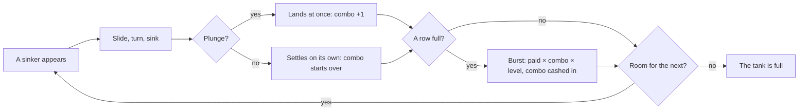

# How to play Sinkers

## Goal

Keep the tank from filling to the surface. Sinkers come one at a time; slide and turn each one so
it fills the gaps below, and plunge it home. Fill a row from wall to wall and it bursts into
bubbles and is gone. In a Dive you win by reaching its goal; in Marathon and Classic 1992 you play
as deep as you can go; the Daily Dive is the same hundred sinkers for everyone.

## Controls

The keyboard plays everything. Nothing needs a mouse but the menus, which also take the keys.

| Action                        | Keyboard                     | Mouse            | Remappable |
| ----------------------------- | ---------------------------- | ---------------- | ---------- |
| Slide left / right            | ← → or A D (hold to repeat)  | —                | no         |
| Turn clockwise                | ↑, W or X                    | —                | no         |
| Turn counter-clockwise        | Z                            | —                | no         |
| Sink faster                   | ↓ or S (hold)                | —                | no         |
| Plunge (straight down)        | Space                        | —                | no         |
| Pause                         | Esc or P                     | Pause            | no         |
| Leave a run                   | Game menu (asks first)       | Game menu        | no         |
| Classic 1992: slide           | ← → or J L                   | —                | no         |
| Classic 1992: turn (left)     | ↑, K or Z                    | —                | no         |
| Classic 1992: drop            | Space                        | —                | no         |
| Classic 1992: leave           | Q (asks first)               | Game menu        | no         |
| Menus                         | ↑ ↓ to move, Enter to choose | Click            | no         |
| Back to the game menu (pages) | Esc                          | ← Game menu      | no         |
| Play again (results)          | R                            | Play again       | no         |
| Next dive (results)           | N                            | Next: …          | no         |
| Back to the Hall (results)    | H                            | Back to the Hall | no         |

Classic 1992 also answers to the 1992 program's own keys, `j k l` and Space.

## Rules

1. A sinker appears at the top of the tank, lowered in through the air above the water.
2. It sinks a row at a time on its own, faster at every level. Slide it, turn it, sink it faster,
   or plunge it straight to the bottom.
3. Resting on something, it waits half a second (moving or turning it starts that wait again, a
   few times) and then settles.
4. A row filled from wall to wall bursts. Everything above it drops down.
5. When a new sinker has no room to appear, the tank is full and the run is over.

**The sonar.** The dotted outline on the water below the sinker is where it will land if you
plunge now. Through a current, it shows where the current will take it. Every second or so a
dotted ping runs down to it. Settings turns the sonar off.

**Turning against a wall.** If a turn will not fit where the sinker is, it tries one cell to the
left, then one to the right. Classic 1992 never does: the turn simply does not happen.

## Modes

| Mode          | What changes                                                                                                                                                                   |
| ------------- | ------------------------------------------------------------------------------------------------------------------------------------------------------------------------------ |
| Tutorial      | About a minute, three lessons: slide and turn into a gap, plunge, and stand the long sinker up for four rows at once. Sinkers wait for your keys.                              |
| Dives         | Twelve tanks in order, each with one idea (see below). A dive opens when the one before it is won. Three stars each.                                                           |
| Marathon      | No goal: play until the tank fills. Choose a starting level from 1 to 9; every ten rows takes you a level deeper (up to 15). Each starting level keeps its own champion.       |
| Classic 1992  | The original rules in a ten-wide, twenty-deep tank (see Scoring). Choose a level from 1 to 9 (2 to start with, as in 1992); each level keeps its champion.                     |
| Daily Dive #N | The same 100 sinkers in the same order for everyone today, at level 3, numbered by the Hall. Only your first dive of the day counts; bubbles measure it against the day's par. |

### The twelve dives

| #   | Dive          | Level | Goal            | The idea                                                     |
| --- | ------------- | ----- | --------------- | ------------------------------------------------------------ |
| 1   | Shallows      | 1     | Burst 8 rows    | Clear water to learn in.                                     |
| 2   | Coral Garden  | 2     | Clear all coral | Coral on the floor: fill the rows round it to burst it free. |
| 3   | The Drift     | 2     | Burst 12 rows   | A current pushes every sinker one cell right as it passes.   |
| 4   | Kelp Forest   | 2     | Burst 12 rows   | Seaweed stands along the walls until its rows burst.         |
| 5   | Deep Plunge   | 3     | Burst 15 rows   | Build the depth combo and cash it in.                        |
| 6   | Crosscurrents | 3     | Burst 15 rows   | Two currents, two ways.                                      |
| 7   | Night Dive    | 3     | Burst 12 rows   | Dark but for your sinker's own glow: trust the sonar.        |
| 8   | Reef Wall     | 3     | Clear all coral | A coral wall six rows deep.                                  |
| 9   | Riptide       | 4     | Burst 15 rows   | Three currents; a plunge zigzags.                            |
| 10  | Fast Water    | 8     | Burst 12 rows   | Level eight from the start.                                  |
| 11  | Sunken Garden | 4     | Clear all coral | Coral among seaweed, under a current.                        |
| 12  | The Trench    | 5     | Clear all coral | Dark, deep and moving.                                       |

Stars: the first is the goal; the second and third are a score to reach (row dives) or a most
number of sinkers to use (coral dives). Each dive's card shows its numbers.

**Currents** push a sinker one cell aside as its centre sinks into the current's row, if there is
room. Slide back after the push, or let the current carry you; the sonar always shows the end.

## Settings

The Hall's settings (appearance, volume, reduced motion) apply everywhere. Sinkers adds:

| Setting | Options  | Default |
| ------- | -------- | ------- |
| Sonar   | on · off | on      |
| Sound   | on · off | on      |

Marathon and Classic 1992 remember the starting level you last chose. The pause menu has the
sonar switch, and in a dive, "Start the dive again".

## Scoring

**Standard rules** (Dives, Marathon, Daily Dive):

- A landing scores 1, 2 or 3 (deeper rows are worth more), times the level.
- A plunge scores twice the rows it falls, times the level.
- A burst scores 10 for one row, 30 for two, 60 for three, 100 for four, times the **depth combo**
  and the level.
- The depth combo counts plunges in a row. A sinker that settles on its own starts it over; a
  burst cashes it in, and it starts over from there. Plunge three times and burst four rows with
  the third: 100 × 3 × the level.

**Classic 1992**, exactly as the 1992 program counted: 1 point for each landing, 1 for each row a
dropped shape falls, nothing at all for clearing rows, and the total multiplied by the level at the
end. A dropped shape lands at the next tick and can still be slid and turned until then. The clock
starts at one tick a second per level and quickens a three-thousandth with every tick; each row
cleared stills the tank for two ticks.

**The Daily Dive** is scored by Standard rules. The house diver dives the day first and its score
is par: half of par earns 🫧, three quarters 🫧🫧, par itself 🫧🫧🫧. The share line reads
`Sinkers #42 · 18,240 · deepest combo ×7 · 🫧🫧🫧`.

## Achievements (packages)

| Package             | How to earn it                                                   |
| ------------------- | ---------------------------------------------------------------- |
| `first-burst`       | Fill a row from wall to wall and watch it burst.                 |
| `four-row-burst`    | Burst four rows with a single sinker.                            |
| `plunge-100`        | Plunge a hundred rows in all, in one run.                        |
| `daily-regular`     | Dive seven Daily Dives.                                          |
| `depth-combo-5`     | Cash in a depth combo of five or more with a burst.              |
| `bubble-chain`      | Burst rows with three sinkers in a row.                          |
| `steady-hands`      | Win a dive without using the sink key once.                      |
| `seaweed-gardener`  | Clear every strand of seaweed from Kelp Forest.                  |
| `night-diver`       | Win the Night Dive by your sinkers' own light.                   |
| `counter-clockwise` | Earn three stars in a dive turning only to the left, as in 1992. |
| `obfuscated`        | Clear ten rows of Classic 1992 started at level 5 or higher.     |
| `champion`          | Set a Marathon record from every starting level, 1 to 9.         |

## XP

Sinkers reports every finished run to the Hall: a completed session, the first win of the day, the
Daily Dive and packages all earn XP by the Hall's rules. The game adds XP for a won dive (10, plus
3 a star), for rows in Marathon and Classic (a point for every four, up to 15) and for the Daily
Dive's bubbles (4 each). Weekly cron goals may ask you to burst rows or to plunge a number of rows
in all.

## Tips

- Plunge whenever the sonar shows a good spot: it scores and it builds the combo.
- Keep one column open and wait for the long sinker: four rows at once after a run of plunges is
  the biggest burst there is.
- Through currents, sink a row at a time with ↓ and slide back after each push; once you are past
  the last current, plunge.
- In a night dive the stack is hidden; the sonar's footprint shows its top wherever you aim.
- In Classic 1992 every row a shape drops is a point: drop early, and remember turns go left only.
