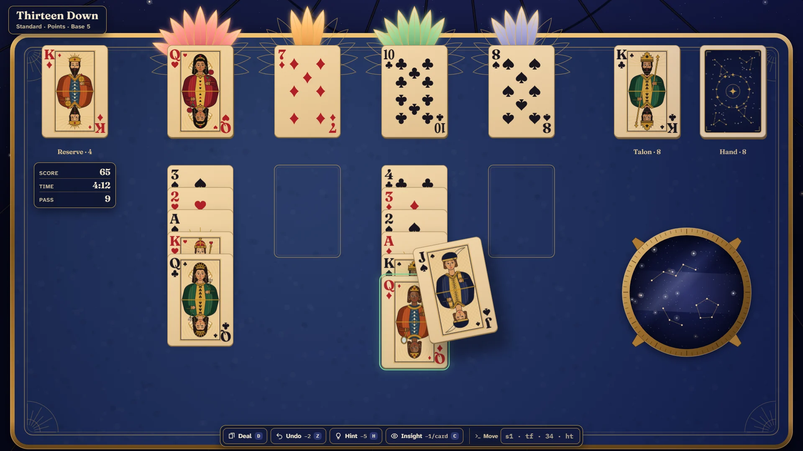

# Thirteen Down

> Thirteen in reserve. Four to build. One bloom to finish.

## The hook

Canfield is the solitaire with a reputation: a stubborn reserve of thirteen cards, foundations
that start wherever the deal decides, and a hand you deal through three cards at a time. Every
card you send home opens a petal of that suit's lotus; fill all four and they bloom together
while the deck spirals up off the table into one neat stack. Information has a price: Insight
will remind you where every card you have seen now lies, but each one costs you. Nerve scores
best.

## Where it comes from

`canfield` reached Berkeley's machines around 1980, written by Steve Levine as a Pascal program
and later converted to C and curses by Steve Feldman, with card counting by Kirk McKusick and
Mikey Olson and a tidier interface from Eric Allman and Kirk McKusick. McKusick also gave it a
bank account: the deal cost $13, an inspection $13 more, playing it out $26, and every card home
paid $5. Every look at the cards was billed, so was every minute at the terminal, and
`cfscores` kept everyone's balance in one shared file, so the whole machine could see whose
account showed winnings and whose showed losses. Its manual lists exactly one bug: it is
impossible to cheat.

## What is new

- **The most beautiful deck in the collection**, drawn entirely in code: twelve original Art
  Deco court figures, elegant pips, two backs, and a four-colour option.
- **Real card physics**: cards have thickness, cast a shadow that grows as they lift, lean as
  you drag them and snap to the places they may go; dealt cards arc and turn over.
- **Two rooms**: a sunlit glasshouse by day, an observatory under a turning dome of stars by
  night, with a star mirror set into the leather.
- **Points or the old account**: score in points, or play the original's Bank with fictional
  play money, every charge written in a paper account book.
- **Fair deals**: a solver proves Daily Deals and "winnable only" deals can be won, and tells
  you after a lost deal whether there was a way through.
- **Twenty-four challenges**, a ninety-second tutorial and the original's typed commands for
  anyone who remembers them.

## At a glance

|                 |                     |
| --------------- | ------------------- |
| Directory       | `/usr/games/cards`  |
| Players         | 1                   |
| Session         | 5–15 minutes        |
| Daily challenge | yes: the Daily Deal |
| Inspired by     | `canfield` (1980)   |

## More

- [How to play](HOW-TO-PLAY.md)
- [Changes from the original](CHANGES-FROM-ORIGINAL.md)
- [Architecture](ARCHITECTURE.md)
- [Notes: verified facts and measurements](NOTES.md)
