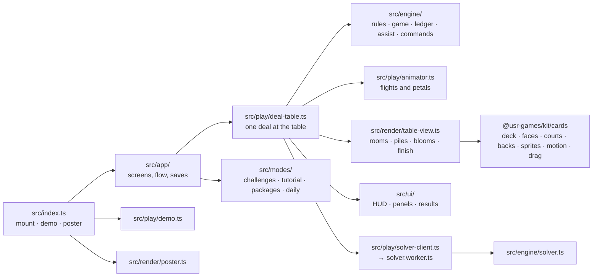
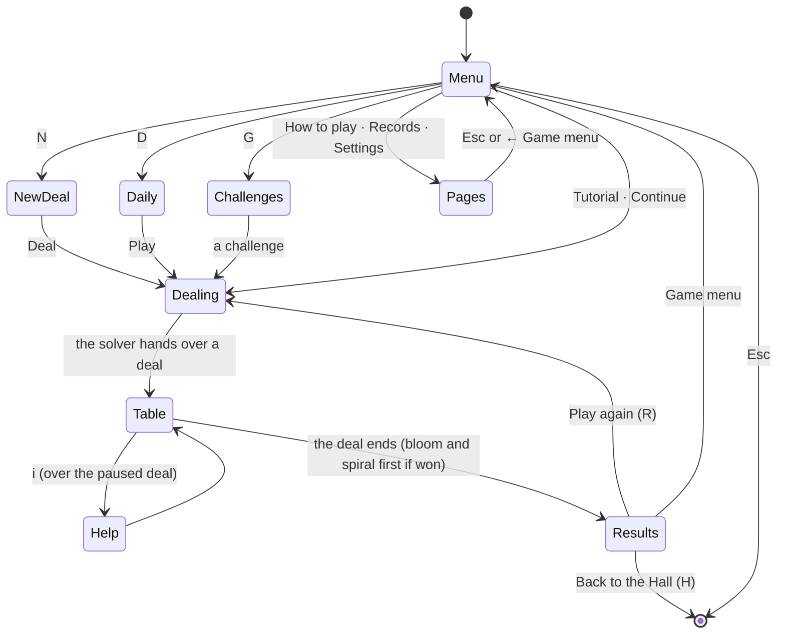
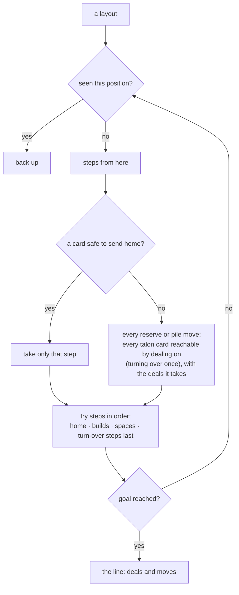

# Thirteen Down — architecture

## Overview

A native game: the Hall mounts `src/index.ts` into its own page. The table is drawn with Canvas 2D
over layered canvases (card faces painted once into image caches), the screens and panels are
plain DOM, and a pure TypeScript engine of about 1,500 lines holds the rules, both scorings and a
solver that runs in a Web Worker. The deck itself lives in the kit (`@usr-games/kit/cards`) so
other card games can use it.

## Module map

| Path                     | Responsibility                                                                                               |
| ------------------------ | ------------------------------------------------------------------------------------------------------------ |
| `src/index.ts`           | The kit contract: `mount`, `demo`, `poster`, `achievements`.                                                 |
| `src/engine/rules.ts`    | The original's rules, pure: the deal's layout, legal moves, applying a move and its automatic moves.         |
| `src/engine/game.ts`     | A deal in play: rules plus what was seen and listed (Insight), the account, undo, the clock passed in.       |
| `src/engine/ledger.ts`   | Points and Bank: the cost table, time billing, statements.                                                   |
| `src/engine/solver.ts`   | Depth-first search with memory; goals: win, empty the reserve, N cards home; a run limit.                    |
| `src/engine/deals.ts`    | Seeded shuffles, winnable deals and the Daily Deal.                                                          |
| `src/engine/assist.ts`   | The best place for a click, the sweep home, dead ends, words for moves, plain hints.                         |
| `src/engine/commands.ts` | The original's typed commands.                                                                               |
| `src/engine/compose.ts`  | Writing deals by hand (tests, the tutorial).                                                                 |
| `src/play/deal-table.ts` | One deal on screen: input (pointer, keyboard, commands), the HUD, panels, hints, the Bank's stages, the end. |
| `src/play/animator.ts`   | Turns rule events into card flights and lotus petals, timed one after another.                               |
| `src/play/demo.ts`       | The attract mode: a proven deal plays itself.                                                                |
| `src/play/sound.ts`      | Synthesised sounds.                                                                                          |
| `src/render/`            | Layout, the two rooms, blooms, card drawing, the table view, the poster.                                     |
| `src/ui/`                | DOM pieces: HUD, Insight and account-book panels, results, dialogs, styles.                                  |
| `src/app/`               | The game menu and its pages, the flow between them, saves.                                                   |
| `src/modes/`             | Challenges (data + checks), the tutorial, packages, the Daily's share line.                                  |
| `scripts/`               | `make-challenges.ts` (finds and proves the 24 challenges), `solve-stats.ts` (winnable shares).               |
| `dev/`                   | The workbench on port 5289: hero scenes and the whole game with a stand-in Hall.                             |

## The app

A deal in progress is saved after every move and offered as **Continue**; leaving through the
Hall never loses it. Starting another deal ends the saved one first, and a Bank deal's charges
are entered in the account when it ends, however it ends.

## Engine

The engine has no DOM and no clock. `openDeal(deal, rules, stage)` lays out the 52 cards in the
original's order (reserve 0–12, base 13, tableau 14–17, hand 18–51), sweeps base cards home, and
deals three. `applyMove(layout, move)` returns the new layout and the events on the way (`dealt`,
`turned-over`, `exposed`, `home`, `built`, `stalled`, `won`), automatic moves included, so the
animator can show them in order and the ledger can bill them.

`Game` (`game.ts`) adds what the rules do not know: the cards seen (they stay seen after an undo),
the cards Insight has listed and charged, the account, the undo trail (300 layouts), counters and
the ending. Every command is passed the game clock in milliseconds; Bank bills time from it.

The deal comes from the kit's seeded random numbers (`createRng`), seeds labelled
`canfield:<seed>`; the Daily uses the kit's `dailySeed('canfield', date)` and takes the first
candidate `…/k` the solver proves winnable within 60,000 positions, so everyone gets the same
deal.

## The solver

A step is "deal on k times, then move a card", so positions that differ only in how far the hand
was dealt are never stored. Positions are keyed by the reserve's height, which cards remain in
the hand and talon and where the talon ends, and the tableau piles sorted. Budgets are counted in
positions, never seconds. See ADR 0002 and the measurements in `NOTES.md`.

The worker (`play/solver.worker.ts`) answers four questions: a hint for a layout (40,000
positions), whether a finished deal could have been won (400,000), a winnable deal for a seed, and
the Daily Deal. In tests it runs in the page through the same calls.

## Where visuals are defined

| Visual                                                   | Defined in                                  | Change it by                                                  |
| -------------------------------------------------------- | ------------------------------------------- | ------------------------------------------------------------- |
| Card stock, indices, pip layouts, aces                   | `packages/kit/src/cards/face.ts`, `pips.ts` | `drawCardFace`, `PIP_PATHS`, `pipLayout`                      |
| The twelve court figures                                 | `packages/kit/src/cards/courts.ts`          | `COURTS` (each figure's parts), the part functions            |
| The two backs                                            | `packages/kit/src/cards/backs.ts`           | `drawConservatory`, `drawConstellations`                      |
| Deck colours, four-colour suits                          | `packages/kit/src/cards/palette.ts`         | `DAY`, `LAMP`, `FOUR_COLOUR`                                  |
| Card images cached per size and look                     | `packages/kit/src/cards/sprites.ts`         | `CardSprites`                                                 |
| Where piles sit                                          | `src/render/layout.ts`                      | `tableLayout`, `fanStep`                                      |
| Table colours per room                                   | `src/render/look.ts`                        | `SUNROOM`, `OBSERVATORY`                                      |
| The Sunroom: planks, plants, sunlight                    | `src/render/scenery.ts`                     | `paintSunroomBase`, `paintSunroomShade`, `paintSunroomLight`  |
| The Observatory: dome, leather, brass, star mirror, lamp | `src/render/scenery.ts`                     | `paintObservatoryBase`, `paintStars`, `paintObservatoryShade` |
| The lotus blooms                                         | `src/render/bloom.ts`                       | `drawBloom`, petal shape and spread                           |
| Card thickness, shadow, lean, flip                       | `src/render/card-draw.ts`                   | `drawCard`                                                    |
| The finish's spiral                                      | `src/render/table-view.ts`                  | `finishPose`, `FINISH_TURNS`                                  |
| Flights and their timing                                 | `src/play/animator.ts`                      | `TIMING`                                                      |
| The key art                                              | `src/render/poster.ts`                      | `PosterPainter`                                               |
| HUD, panels, pages, results                              | `src/ui/thirteen.css`, `src/ui/screens.css` | the `--td-*` colours per room                                 |

The table is five layers (`TableView`): the Observatory's sky (stars repainted at most thirty
times a second), the base (the room, painted once per size), the cards, a **shade** layer blended
by `multiply` (the Sunroom's window light and leaf shade, the Observatory's lamp) and a **light**
layer blended by `soft-light`. Light and shade fall across the cards as well as the table. Under
reduced motion cards land at once, the sky and blooms stand still, and the finish squares the
deck without the spiral.

## Where sounds are defined

| Sound       | Patch (`src/play/sound.ts`) | Plays when                                                |
| ----------- | --------------------------- | --------------------------------------------------------- |
| Riffle      | `RIFFLE`                    | A deal is shuffled                                        |
| Deal        | `dealPatch`                 | Cards go from the hand to the talon                       |
| Place       | `PLACE`                     | A card lands on the tableau                               |
| Turn over   | `TURN_OVER`                 | The talon becomes the hand again                          |
| Chime       | `chime`                     | A card lands home; the pitch climbs with each petal       |
| Wrap        | `WRAP`                      | A foundation turns from king to ace                       |
| Bloom       | `BLOOM`                     | The four lotuses open together                            |
| Finish      | `FINISH`                    | The spiral begins                                         |
| Nope        | `NOPE`                      | A card cannot go where it was asked                       |
| Insight     | `chime` (soft)              | Insight turns on or off, or lists a new card              |
| Pen         | `PEN`                       | A Bank stage is bought or refused; the account book opens |
| Undo · hint | `UNDO` · `HINT`             | Those buttons                                             |

Every sound is quiet, short and synthesised; the Settings page can turn them off.

## Hall integration

- **Results**: `reportResult` once per finished deal with `presentation: 'game'`: `outcome` win,
  loss (a stall or an ended deal with moves), `quit` (ended before any move) or `complete` (the
  tutorial); `score` the points (or cards home × 5 in Bank); `stats { deals, wins, cardsHome }`;
  `xpEvents` bloom 18, half-home 6, challenge 10; `daily` on the first finish of the day.
- **Packages**: installed as earned (`modes/packages.ts`); `reserve-cleared` mid-deal.
- **Pause items**: Take back a move (Z), Hint (H), Insight on or off (C), End this deal.
- **Title screen**: `setOnTitleScreen(true)` on the game menu, false elsewhere.
- **Daily**: the kit's number and seed; share line `Thirteen Down #N · won · 52/52 · 4:31 · 🔍0`.
- **Saves** (`app/saves.ts`, all version 1): `prefs`, `records`, `bank`, `daily`, `challenges`,
  `current` (the deal in progress). Every reader repairs missing or broken fields.
- **Safe zones**: the Pause pill's corner holds nothing; the score card stands under the reserve
  and the toasts' corner holds only scenery.

## Tests

| Test                  | Command                                                                   | What it proves                                                                                                                                                                   |
| --------------------- | ------------------------------------------------------------------------- | -------------------------------------------------------------------------------------------------------------------------------------------------------------------------------- |
| Rules                 | `pnpm vitest run --project canfield`                                      | Every rule of §2, the opening, stalls, stages                                                                                                                                    |
| Cost table            | (same)                                                                    | Each line of the original's costs, Points' mirror, undo, Insight                                                                                                                 |
| Solver                | (same)                                                                    | Lines replay to wins, a stuck deal is proven lost, run limits, Dailies are winnable and identical                                                                                |
| Challenges · tutorial | (same)                                                                    | All 24 proofs meet their goals; the tutorial deal opens as its lessons say                                                                                                       |
| Help                  | (same)                                                                    | Clicks, sweeps, dead ends, typed commands                                                                                                                                        |
| Deck                  | `pnpm vitest run --project kit`                                           | Card numbering, parsing, a fair seeded shuffle                                                                                                                                   |
| Browser               | `pnpm --filter @usr-games/game-canfield exec playwright test -c .`        | Games won by dragging, clicks, keyboard and commands; Insight's price in both scorings; the scoring toggle; the account reset; the Daily share; the ways out; the game in a Hall |
| Hero frames · screens | `… playwright test -c . --grep @hero` · `--grep @shots`                   | `docs/media/`                                                                                                                                                                    |
| Winnable shares       | `pnpm --filter @usr-games/game-canfield solve-stats 200 1500000 standard` | `NOTES.md`                                                                                                                                                                       |

## Kit module and candidates

This prompt owns `packages/kit/src/cards` (`@usr-games/kit/cards`): the deck model, seeded
shuffles, the card renderer (faces, courts, backs, four colours, any size), the image cache, drag
helpers (a pointer tracker with velocity, magnetic snapping, taps and double taps) and motion
helpers (springs, drag lean, arcs, flips). Kit candidates left in the game: the poster painter's
single-canvas compositing, and the solver client's worker-or-page pattern, which Fivefold also
uses.
