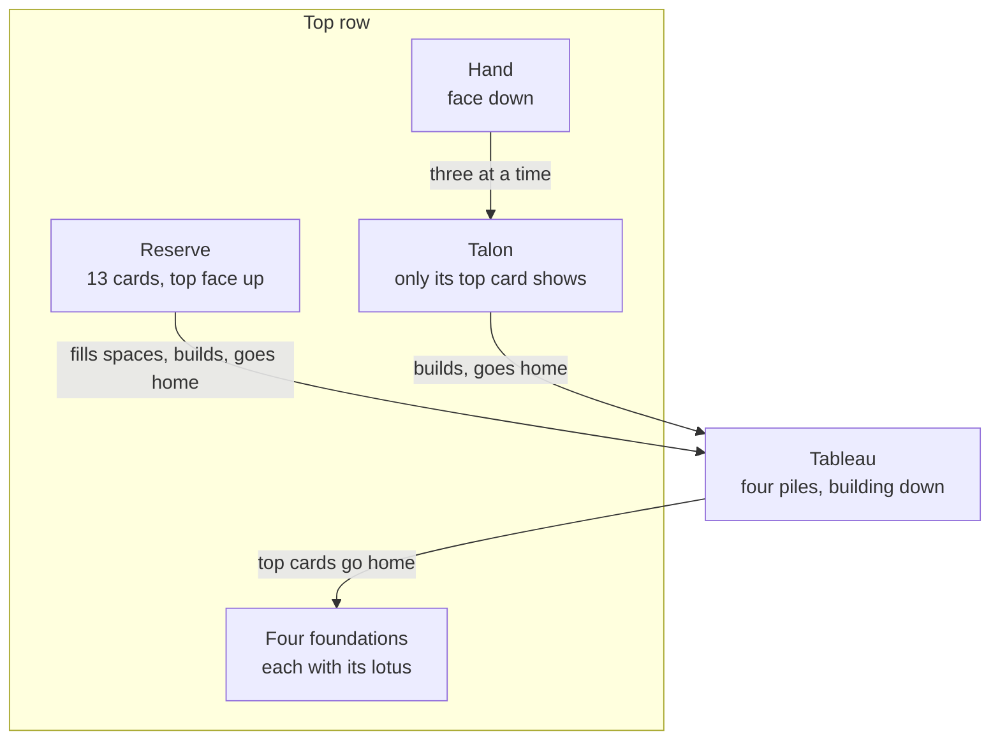

# How to play Thirteen Down

## Goal

Send all fifty-two cards home to the four foundations. Each foundation starts at the deal's base
rank and climbs in its suit, round the corner from king to ace, until all thirteen are home.

## The table

- **The reserve**: thirteen cards, the top one face up. Emptying it is half the battle.
- **The foundations**: the first foundation card sets the **base rank** for all four. The other
  three base cards go home by themselves the moment they show.
- **The tableau**: four piles that build down in alternating colours.
- **The hand and the talon**: deal the hand three cards at a time onto the talon; only the top
  card of the talon shows and can be played.

## Rules

1. A foundation takes the next card of its suit: base, base + 1 … king, ace … up to the card
   below the base.
2. A tableau pile takes a card one rank lower in the other colour; a king goes on an ace.
3. In **Standard** a pile moves only as a whole, onto a card its bottom card fits. In
   **Relaxed** any run from the top of a pile may move.
4. A pile's top card may go home. A pile never moves into a space.
5. A space is filled from the **reserve**, when you choose. Once the reserve is empty, the
   **talon** may fill spaces too.
6. Deal three cards from the hand to the talon. When the talon runs dry, three more come free.
7. When the hand is empty, the talon turns over to become the hand again, in the same order.
8. In **Standard**, four turn-overs in a row without a card moving end the deal, as they did in
   the original. Relaxed has no such limit.
9. Once the reserve, the hand and the talon are all empty, the rest of the cards sweep home by
   themselves.

## Controls

| Action                         | Keyboard                                    | Mouse                                 | Remappable |
| ------------------------------ | ------------------------------------------- | ------------------------------------- | ---------- |
| Move cards                     | Arrows, Enter to pick up, Enter to put down | Drag them; they snap to a legal place | no         |
| Send cards to their best place | Space at the cursor                         | Click (home first)                    | no         |
| Send a card home               | Space at the cursor                         | Double-click                          | no         |
| Deal three (or turn over)      | D, or Enter/Space on the hand               | Click the hand                        | no         |
| Put picked-up cards back       | Backspace, X, or Enter on them              | —                                     | no         |
| Undo                           | Z                                           | Undo                                  | no         |
| Hint                           | H                                           | Hint                                  | no         |
| Insight on or off              | C                                           | Insight                               | no         |
| Account book (Bank)            | L                                           | Ledger                                | no         |
| Type a move as in the original | /, then the command and Enter               | the Move box                          | no         |
| Pause                          | Esc                                         | Pause button                          | no         |
| Play again (results)           | R                                           | Play again                            | no         |
| Back to the Hall (results)     | H                                           | Back to the Hall                      | no         |

The typed commands are the original's: `s1`–`s4` and `sf` move the reserve's top card, `t1`–`t4`
and `tf` the talon's, `12`, `34` … move a pile onto another, `1f`–`4f` send a pile's top card
home, `ht` deals, `c` turns Insight on or off, `b` opens the account book, `i` shows these rules
and `q` ends the deal.

Screen readers hear each place as the cursor reaches it and each move as it is made.

## Insight

Insight is the original's card counter. It lists the cards you have **already seen**, in the
order they now lie in the talon and the hand, grouped in the threes they will be dealt in, with
counts of the hand, talon and reserve. It never shows a card you have not seen. Each card it
lists costs a point (or $1 in Bank) the first time; while it is on, so does every card that
shows on the talon. It can list at most the hand's thirty-four cards.

## Modes

| Mode          | What changes                                                                                                                                |
| ------------- | ------------------------------------------------------------------------------------------------------------------------------------------- |
| Standard      | The original's rules exactly.                                                                                                               |
| Relaxed       | Any run of a pile moves; passes through the hand are free and unlimited.                                                                    |
| Daily Deal #N | The same deal for everyone today, numbered by the Hall: Standard rules, points, proven winnable. Your first finish of the day counts.       |
| Challenges    | Twenty-four hand-picked deals with goals, each proven reachable: win in one pass, without Insight, from a base of seven, get 45 cards home… |
| Tutorial      | Ninety seconds on an easy deal, a coach pointing at each place.                                                                             |

## Settings

| Setting             | Options            | Default  |
| ------------------- | ------------------ | -------- |
| Scoring             | Points · Bank      | Points   |
| Rules               | Standard · Relaxed | Standard |
| Winnable deals only | on · off           | off      |
| Four-colour suits   | on · off           | off      |
| Sound               | on · off           | on       |

A change of scoring or rules applies from the next deal, never the one on the table. The Hall's
settings (appearance, volume, motion) apply too.

## Scoring

**Points** (the default):

| Item                      | Points                                           |
| ------------------------- | ------------------------------------------------ |
| Each card home            | +5                                               |
| A win                     | +100, and a point for every 5 s under 15 minutes |
| Each pass after the first | −5 (Standard only)                               |
| Each card Insight lists   | −1                                               |
| Undo · hint               | −2 · −5                                          |

The score never goes below zero. Records keep your best score, fastest win and longest run of
wins, for each set of rules.

**Bank** is the original's account in **play money**: it cannot be bought, sold, spent or
exchanged, and resetting it in Settings is free. A new account holds $500. A Bank deal comes in
three parts you choose to pay for: the deal ($13), the inspection ($13: make every move you can
without dealing from the hand) and the rest of the game ($26), or walk away at any stage. Once
the game is played out every card home pays $5, the ones already home included. Each pass after
the first costs $5, each card of Insight $1 (at most $34), thinking time $1 a minute (at most $3
between two moves), undo $2 and a hint $5. The account book (L) shows each charge as it comes,
and the deal, this sitting and your lifetime in the original's columns. The balance may dip below
zero; nobody comes to collect.

## Achievements (packages)

| Package           | How to earn it                                                    |
| ----------------- | ----------------------------------------------------------------- |
| `first-bloom`     | Win a deal.                                                       |
| `reserve-cleared` | Empty the reserve before the talon turns over for the first time. |
| `daily-regular`   | Play seven Daily Deals to the end.                                |
| `no-peeking`      | Win without ever turning Insight on.                              |
| `speed-bloom`     | Win in under three minutes.                                       |
| `full-ledger`     | Win without using undo.                                           |
| `lucky-seven`     | Win a deal whose foundations start at seven.                      |
| `ten-wins`        | Win ten deals.                                                    |
| `in-the-black`    | Finish a Bank deal with your sitting ahead of where it began.     |
| `one-pass`        | Win a Standard deal without turning the talon over.               |
| `streak-5`        | Win five deals one after another.                                 |
| `challenge-12`    | Complete twelve of the challenges.                                |

## XP

Thirteen Down reports every finished deal to the Hall: a completed session, the first win of the
day, the Daily Deal (once a day) and packages all earn XP. Within a deal, a win adds 18 XP, half
the deck home 6, and a challenge completed for the first time 10. The weekly cron goals count
wins (`wins`) and cards sent home (`cardsHome`).

## Tips

- Empty the reserve first: every card it holds is a card that cannot help you yet.
- Keep a space open while the reserve still holds a card you will want there.
- Moving a whole pile frees a space but buries a target. Count before you move.
- Each card you take from the talon shifts every deal after it; a single move can bring a
  stuck card into reach.
- Insight only tells you what you could have remembered. Remember it, and keep the points.
