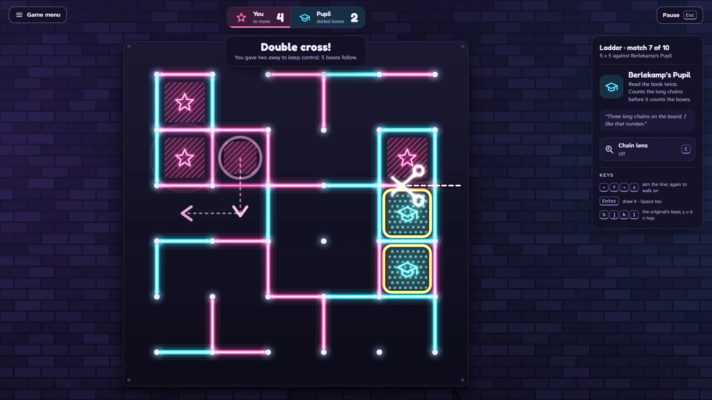

# Double Cross

> Draw a line. Close a box. Learn when to give one away.

## The hook

The pencil-and-paper classic, lit up: take turns joining dots, close the fourth side of a box to
claim it and draw again. It looks like a game of grabbing, and for a while it is. Then the safe
lines run out, the board falls into chains, and you learn the one move that turns it round: take
all but the last two boxes of a chain and hand those two back on purpose. Your rival takes them
and has to open the next chain for you. The pair flashes, a pair of scissors cuts the chain, and
the rest of the board falls your way, box after box. That is the double cross.

## Where it comes from

`dab` is the youngest game in the BSD games collection: Christos Zoulas wrote it for NetBSD in
2003, and Thomas Klausner wrote its manual. You played on a terminal grid with the vi keys, against
a friend or the computer, on any board your screen could hold. Its manual points to Elwyn
Berlekamp's book on the game's deep strategy, yet its computer never plays the book's central
trick: it takes every box it can see, gives away as little as it can when it must, and never hands
a box back. Right after its first rule, the source keeps a place for two smarter ideas behind an
`#ifdef notyet`; they were never written.

## What is new

- **The trick the 2003 computer never learned is the soul of the game**: a five-step tutorial on
  tiny boards, from your first line to the double cross.
- **A ladder of five opponents**: Scribbler, who draws anywhere; Greedy Gus, the original's
  computer ported line for line; Chain Counter; Berlekamp's Pupil, who plays the long chain rule
  and the double cross; and Master, who solves the endgame outright. Ten matches, from 3 × 3 to
  7 × 7.
- **Forty endgame puzzles** where the right move gives boxes away, each checked by the solver.
- **The chain lens**: chains and loops outlined, long chains counted, and who is on course for
  control.
- **A Daily Board**: the same opening for everyone, against the Pupil, with a share line like
  `Double Cross #42 · 14–11 · ✂️2`.
- **Sidewalk Chalk and Night Neon**: wobbling chalk on a sunny pavement by day, flickering neon
  tubes on a brick wall by night. Two players at one keyboard, and any board from 2 × 2 to 10 × 10.

## At a glance

|                 |                               |
| --------------- | ----------------------------- |
| Directory       | `/usr/games/board`            |
| Players         | 1 (against the computer) or 2 |
| Session         | 3–10 minutes                  |
| Daily challenge | yes: the Daily Board (#N)     |
| Inspired by     | `dab` (2003, NetBSD)          |

## Acknowledgement

Double Cross ports the computer player and the random-number handling of `dab`, by Christos
Zoulas, under the NetBSD Foundation's licence. This product includes software developed by the
NetBSD Foundation, Inc. and its contributors.

## More

- [How to play](HOW-TO-PLAY.md)
- [Changes from the original](CHANGES-FROM-ORIGINAL.md)
- [Architecture](ARCHITECTURE.md)
- [Notes](NOTES.md)
