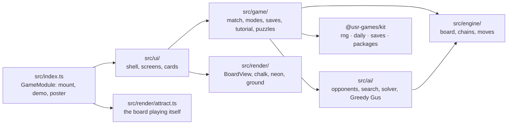
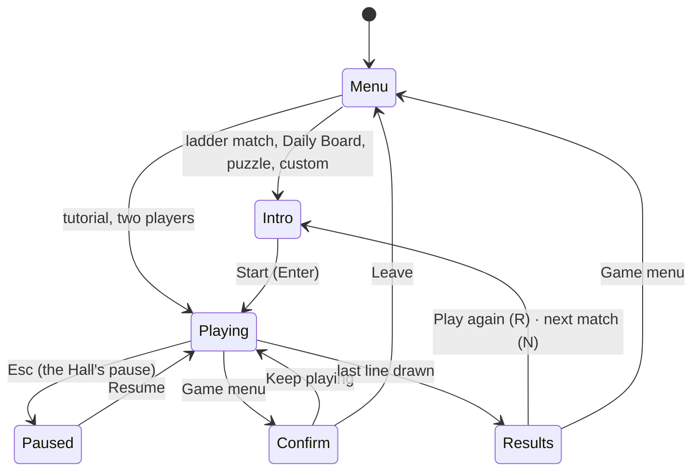

# Double Cross — architecture

## Overview

A native game: TypeScript, Canvas 2D for the board (see [ADR 0001](adr/0001-canvas-2d.md)) and
HTML/SVG for everything round it. A pure engine and AI (no DOM) sit under a thin interface; the
five opponents and the exact solver are described in [ADR 0002](adr/0002-ai-ladder.md).

## Module map

| Path                       | Responsibility                                                                              |
| -------------------------- | ------------------------------------------------------------------------------------------- |
| `src/index.ts`             | The kit contract: `mount`, `demo`, `poster`, `achievements`                                 |
| `src/engine/board.ts`      | Edges and boxes, turns, scoring; immutable `Board`; the original's rules in our words       |
| `src/engine/chains.ts`     | Chains, loops, safe lines, the long chain rule (for the lens and the side panel)            |
| `src/engine/rand48.ts`     | `srand48`/`lrand48` exactly, and the original's permutation (derived, see CREDITS)          |
| `src/ai/greedy-gus.ts`     | The original's computer, `algor.cc`, ported line for line (derived, see CREDITS)            |
| `src/ai/position.ts`       | A mutable board for searches: draw, undraw, side counts, keys                               |
| `src/ai/endgame.ts`        | Pieces, Berlekamp's loony-endgame value, greedy playout, opening and decline lines          |
| `src/ai/search.ts`         | The exhaustive search over the last safe lines                                              |
| `src/ai/solver.ts`         | Exact negamax with alpha–beta, a transposition table and a node budget                      |
| `src/ai/opponents.ts`      | The five opponents behind one `chooseMove`                                                  |
| `src/game/match.ts`        | A match: seats, turns, the computer's move, double-cross detection, counts for achievements |
| `src/game/modes.ts`        | The ladder, the Daily Board's opening, Custom's limits                                      |
| `src/game/setups.ts`       | Turns a mode and the player's settings into a match                                         |
| `src/game/tutorial.ts`     | The five tutorial steps: boards, lessons, checks                                            |
| `src/game/puzzles.ts`      | Puzzle format and board decoding; `puzzle-data.ts` is generated                             |
| `src/game/cursor.ts`       | The keyboard's aim-and-walk cursor and the original's lattice keys                          |
| `src/game/keys.ts`         | Remappable key actions                                                                      |
| `src/game/saves.ts`        | Prefs and records, versioned                                                                |
| `src/game/rivals.ts`       | Names, marks, blurbs and lines for each opponent                                            |
| `src/game/showcase.ts`     | The double cross played out for real, for the poster and the hero frames                    |
| `src/render/board-view.ts` | Draws a frame: ground, lens, lines, boxes, dots, cursor, the double cross                   |
| `src/ui/screens/play.ts`   | The play screen for every mode: input, timing, the computer's pace, results                 |
| `src/ui/timeline.ts`       | What is animating and how far along it is                                                   |
| `src/audio/sounds.ts`      | Every sound, as kit synth patches                                                           |

## State machine

Inside `Playing`, the screen's own clock (stopped while paused) drives everything: a human line is
drawn at once; a computer's line waits 0.6 s (0.26 s while it takes a run, 0.85 s for the first
line, 1.35 s after a double cross, so the moment can be seen).

## Engine

`Board` is immutable: `play(board, edge)` returns the next board and the boxes it closed. Edges
are numbered horizontals first, row by row, then verticals. A move that closes a box keeps the
turn. `Match` wraps the board with the seats and records, for every line, what it closed, what it
put within reach and what it handed back; a double cross is a line that hands back exactly two
boxes waiting on one line (or four, from a loop split in the middle) when boxes could have been
taken.

Randomness: the kit's sfc32 through `createRng`, one stream per match (`dab:<seed>:moves`),
and Greedy Gus's own `lrand48` reseeded from a clock that starts at a seeded second and ticks one
second a line. The Daily Board's opening comes from `dailySeed('dab')` plus `:opening`.

## AI

See [ADR 0002](adr/0002-ai-ladder.md). Every search is bounded by a node budget, never by time:
Chain Counter's safe-line search 150 000 positions, the Pupil's 40 000, Master's 120 000, and the
solver 250 000. Balance numbers are in [NOTES.md](NOTES.md).

## Where visuals are defined

| Visual                         | Defined in                                               | Change it by                                        |
| ------------------------------ | -------------------------------------------------------- | --------------------------------------------------- |
| Colours of both looks          | `src/render/look.ts` (`PALETTES`)                        | Editing a palette; `contrast.test.ts` checks 3:1    |
| Pavement, brick wall, sign     | `src/render/ground.ts`                                   | `paintPavement`, `paintNightWall`                   |
| Chalk strokes, dots, marks     | `src/render/chalk.ts`                                    | `chalkLine` (wobble, dust), `chalkDot`, `chalkMark` |
| Neon tubes                     | `src/render/neon.ts`                                     | `neonPath` glow passes, `flickerOn`                 |
| Players' marks, the scissors   | `src/render/marks.ts`                                    | Stroke lists in a unit square                       |
| Box fills (hatch, stipple)     | `BoardView.drawBox`                                      | `hatch`, `stipple`; `FILLS` in `look.ts`            |
| The chain lens                 | `BoardView.ensureLens`, `lensLabel`                      | Band width, tint, tab size                          |
| The double cross               | `BoardView.drawDoubleCross`, `drawTrail`, `drawScissors` | `CUT_SECONDS` and timing in `ui/timeline.ts`        |
| Keyboard cursor and anchor dot | `BoardView.drawCandidates`, `drawAnchor`                 |                                                     |
| Interface                      | `src/ui/styles.css` (tokens on `.dx[data-look]`)         | The `--dx-*` custom properties                      |
| Poster                         | `src/render/poster.ts`                                   | `cascadeShowcase()` in `game/showcase.ts`           |

The look follows the Hall's appearance: light is Sidewalk Chalk, dark is Night Neon, both drawn on
purpose. Reduced motion (the Hall's setting or the system's) removes the line-drawing and fill
animations, the neon flicker, the camera's hold and the banner's entrance.

## Where sounds are defined

| Sound         | Patch (`src/audio/sounds.ts`) | Plays when                                      |
| ------------- | ----------------------------- | ----------------------------------------------- |
| Chalk scratch | `line('chalk')`               | a line is drawn by day                          |
| Tube buzz     | `line('neon')`                | a line is drawn by night                        |
| Box note      | `box(run, mine)`              | a box is claimed; climbs with each box in a run |
| Snip          | `snip()`                      | a double cross                                  |
| Bump          | `bump()`                      | a line that cannot be drawn                     |
| End tune      | `end(outcome)`                | the last line                                   |

## Hall integration

- `reportResult` once per finished game (never for the tutorial): `outcome` win, loss or draw
  against the computer, `complete` for two players, win or loss for a puzzle by its target;
  `score` your boxes; `stats` `boxesClosed`, `doubleCrosses`, `gamesWon`; `xpEvents`
  `double-cross` (5 each, at most 15) and `ladder-step` (5 plus the match number); `daily` true for
  the day's first finished Daily Board. `presentation: 'game'`: the game draws its own results.
- Packages: the twelve in `src/game/packages.ts`, installed in `PlayScreen.awards`.
- Pause items: the chain lens (where allowed); in puzzles, a hint and a reset.
- Share: `Double Cross #N · you–rival · ✂️crosses` through `context.share`.
- Saves: `prefs` v1 (mark, lens, tutorial done, Custom and Two players set-ups) and `records` v1
  (ladder, puzzles, dailies kept 60 days, totals, opponents beaten).
- The Hall's Pause pill keeps the top right 220 × 64 px: the side panel starts below it, pages start
  80 px down.

## Tests

| Test                             | Command                                                         | What it proves                                                       |
| -------------------------------- | --------------------------------------------------------------- | -------------------------------------------------------------------- |
| Engine and Greedy Gus            | `pnpm vitest run --project dab`                                 | rules, `lrand48` exactness, the port's choices, chains               |
| Solver, endgame model, opponents | (same)                                                          | solver = plain search on 40 positions; loony values; legal games     |
| Balance                          | (same) `src/ai/balance.test.ts`                                 | every rung ≥ 70 % over the one below (40-game replay)                |
| Puzzles                          | (same) `src/game/puzzles.test.ts`                               | all forty: best moves give boxes, the target, the margin, the kind   |
| Match, cursor, contrast, words   | (same)                                                          | double-cross detection, keyboard reach, 3:1 lines, no original text  |
| Workbench end to end             | `pnpm exec playwright test -c games/dab --project workbench`    | mouse, keyboard, tutorial, lens, puzzle, local, custom, share, exits |
| Inside the Hall                  | `pnpm exec playwright test -c games/dab --project hall`         | menu, results reaching the Hall, pause order, the ways out           |
| Hero frames                      | `pnpm exec playwright test -c games/dab --grep @hero`           | renders `docs/media/hero/`                                           |
| Screenshots                      | `SHOTS=1 pnpm exec playwright test -c games/dab --project hall` | renders `docs/media/`                                                |
| Full balance table               | `npx tsx games/dab/scripts/balance.ts 1000`                     | the 1 000-game table in NOTES.md                                     |
| Puzzles                          | `npx tsx games/dab/scripts/puzzles.ts`                          | regenerates `puzzle-data.ts`                                         |
| Frame rate                       | `npx tsx games/dab/scripts/perf.ts neon`                        | fps at 1920 × 1080 (workbench running)                               |

## Kit candidates

- **A move-pacing clock** (`ui/timeline.ts`): a pausable screen clock with "busy" and "hold"
  questions; several turn-based games time their opponents and animations the same way.
- **`boardThumb`** (`ui/dom.ts`): a tiny SVG of a grid position; any grid game's puzzle or level
  list could use one.
- Nothing in the kit was changed.
