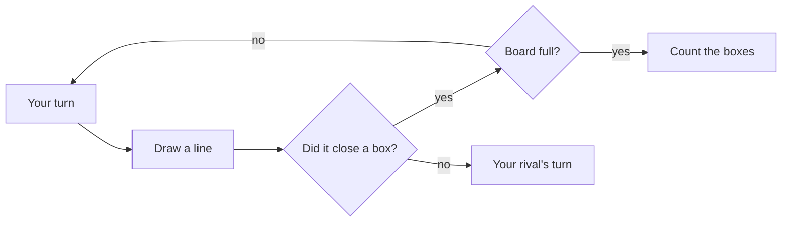

# How to play Double Cross

## Goal

Own more boxes than your rival when every line on the board is drawn.

## Controls

| Action                           | Keyboard                      | Mouse                             | Remappable |
| -------------------------------- | ----------------------------- | --------------------------------- | ---------- |
| Aim the line from the ringed dot | ← ↑ → ↓ (or W A S D)          | Point at a line                   | yes        |
| Walk on to the next dot          | the same arrow again          |                                   | yes        |
| Draw the line                    | Enter or Space                | Click it, or drag from dot to dot | yes        |
| Jump to the next parallel line   | h j k l (the original's keys) |                                   | yes        |
| Hop onto the lines across        | y u b n (the original's keys) |                                   | yes        |
| Take the run of boxes            | T                             | Take the run                      | yes        |
| Chain lens on or off             | C                             | Chain lens                        | yes        |
| Pause                            | Esc                           | Pause button                      | no         |
| Back to the game menu (pages)    | Backspace                     | ← Game menu                       | no         |
| Next match or puzzle (results)   | N                             | Match N · Puzzle N                | no         |
| Play again (results)             | R                             | Play again                        | no         |
| Back to the Hall (results)       | H                             | Back to the Hall                  | no         |

The keyboard's cursor is a line aimed from a dot: an arrow points the line that way, and the same
arrow again walks to the next dot along it. Every line on the board can be reached with the arrows
alone. The original's keys work on its own lattice, and wrap round at the edges as they did.

## Rules

1. Players take turns drawing one line between two neighbouring dots.
2. A line that closes the fourth side of a box claims it: the box takes your mark and your fill
   (hatched or dotted), and you draw again. One line can close two boxes.
3. A line that closes nothing passes the turn.
4. When every line is drawn, the player with more boxes wins. Equal boxes is a tie.

### Chains, control and the double cross

- A box with two sides drawn is part of a **chain**: once anyone draws a third side into it, its
  boxes fall one after another to the other player. A chain that closes on itself is a **loop**.
  Chains of three or more boxes, and loops, are **long**.
- Early on everyone draws **safe lines**, which give nothing away. When they run out, someone must
  open a piece of the board. Opening a long chain is a **loony move**: the player who takes it gets
  to choose what happens next.
- That choice is the **double cross**: take all but the last two boxes of the chain (all but four
  of a loop), then draw the far line so the last two wait on a single line. Your rival takes the
  pair and has to open the next piece for you. Keep doing it and you keep **control** of the whole
  endgame.
- The **long chain rule** says who will get control: the player who drew first wants the dots plus
  the long chains to come out even; the other player wants it odd. The chain lens counts for you.

## Modes

| Mode            | What changes                                                                                                      |
| --------------- | ----------------------------------------------------------------------------------------------------------------- |
| Ladder          | Ten matches, from 3 × 3 against Scribbler to 7 × 7 against Master. Win a match to open the next; replay any.      |
| Daily Board #N  | A 5 × 5 board opened with the same dozen lines for everyone today, against Berlekamp's Pupil; the lens stays off. |
| Endgame puzzles | Forty positions where the best move gives boxes away. Take at least the target number of the boxes still open.    |
| Tutorial        | Five small boards: draw, close, take a chain, the loony move, the double cross.                                   |
| Two players     | Two of you at one keyboard and mouse, with your own names and marks.                                              |
| Custom board    | Any board from 2 × 2 to 10 × 10 boxes, any opponent, either of you first.                                         |

### The opponents

| Opponent          | How it plays                                                                                      |
| ----------------- | ------------------------------------------------------------------------------------------------- |
| Scribbler         | Draws any line at random.                                                                         |
| Greedy Gus        | The 2003 computer: takes every box it can, gives away as few as it must, never gives one back.    |
| Chain Counter     | Gus, but counts how the endgame will fall before the safe lines run out, and opens pieces wisely. |
| Berlekamp's Pupil | Plays the long chain rule, and the double cross when keeping control is worth it.                 |
| Master            | Values every endgame exactly and, once the board is small enough, plays perfectly.                |

## Settings

| Setting                      | Options                                       | Default            |
| ---------------------------- | --------------------------------------------- | ------------------ |
| Your mark                    | star, moon, squiggle, grin, tally, cap, crown | star               |
| Chain lens on at the start   | on · off (never in the Daily Board)           | off                |
| Two players: names and marks | free text · any two different marks           | Player 1, Player 2 |

## Scoring

A game's score is the number of boxes you closed. The Daily Board's first finished game of the
day counts; its share line carries the board's number, the score and your double crosses:
`Double Cross #42 · 14–11 · ✂️2`.

## Achievements (packages)

| Package              | How to earn it                                                        |
| -------------------- | --------------------------------------------------------------------- |
| `first-box`          | Close your first box.                                                 |
| `first-double-cross` | Hand back the last two boxes of a chain on purpose, and keep control. |
| `beat-greedy-gus`    | Beat Greedy Gus, the computer from the 2003 original.                 |
| `shut-out`           | Win a game in which your rival closes no box at all.                  |
| `loop-de-loop`       | Win a game whose last piece is a loop.                                |
| `daily-regular`      | Finish seven Daily Boards.                                            |
| `beat-the-pupil`     | Beat Berlekamp's Pupil.                                               |
| `control-freak`      | Win a game in which your rival had to open every long chain and loop. |
| `big-board`          | Win on a board of 7 × 7 or larger.                                    |
| `sharing-is-winning` | Give away four or more boxes with a single line, and still win.       |
| `beat-master-4x4`    | Beat Master on a board of 4 × 4 or larger.                            |
| `puzzle-30`          | Solve thirty endgame puzzles.                                         |

## XP

This game reports results to the Hall: a completed session, the first win of the day, the daily
challenge and packages all earn XP (see the Hall's rules). Within a game, double crosses earn a
little more (5 each, up to 15), and so does winning a ladder match (more the higher it is). Weekly
cron goals count the boxes you close and the double crosses you play.

## Tips

- Count the long chains before the safe lines run out; the lens does it for you.
- Keep a small piece (one or two boxes) to give away when you need to pass the duty to open.
- When your rival opens a long chain, take all but two and stop: hand the last two back with the
  far line. Take the run (T) stops there for you.
- A loop costs four to keep control through; sometimes it is better simply to take it.
- Open a chain of two in its middle: then it cannot be handed back to you.
