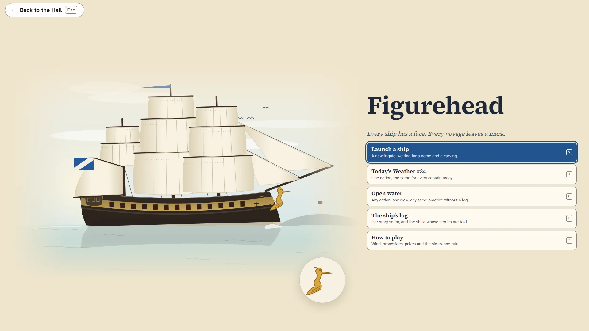

# Figurehead

> Every ship has a face. Every voyage leaves a mark.

## The hook

You do not play a captain's career. You play the life of one ship: a forty-gun frigate you name
and give a carving, from her launch to her last passage home, twelve chapters over thirty years.
Every battle leaves its scars on her hull for good. The best victories are not the ships you sink
but the ships you take whole, because a prize brought home with enough of your hands aboard can
join your squadron, under one of your own officers. Lose her, and the story goes on: a ship taken
can be cut out of an enemy harbour, and a ship lost is built again under the same figurehead.

## Where it comes from

`sail` was Dave Riggle's game of fighting sail, written on a PDP-11/70 at Berkeley in 1980, with
Ed Wang reworking it from almost nothing in 1983 and Craig Leres making it portable. It was a
computer version of a board game of fighting sail: several players at their own terminals each
commanded a ship in a historical battle, typing helm strings like `l1r2` and broadside orders
while a driver program moved every ship and played the computer's captains. Its rules were rich
and its tables deep: the wind decides how far a square-rigger can sail on every heading, a
broadside fired down an enemy's length does terrible harm, and a prize whose prisoners outnumber
its prize crew six to one rises and takes itself back.

## What is new

- **A ship's life instead of a list of battles.** Twelve chapters, mostly with a choice of two;
  her crew seasons from green to elite; her officers become captains; a dockyard visit between
  some chapters offers a refit.
- **Taking ships whole.** A beaten ship that has lost her masts or most of her people yields with
  her hull sound, and after the action every prize needs a prize crew by the original's
  six-to-one rule. Two more hands and she joins your squadron.
- **Scars that stay.** Patches of new planking, a replaced mast, a patch of the enemy's own timber
  where she was taken and retaken: her portrait carries her history.
- **Defeat is a chapter, not an ending.** A cutting-out to take her back, or a new hull under the
  old carving, and an epilogue that remembers both.
- **A chart you can read.** Pick where she ends the turn from dots on the chart; the wind rose
  counts the squares on every heading; red squares show where an enemy could be next turn.
- **Today's Weather** (the same action for every captain each day) and **Open water** for
  practice.

## At a glance

|                 |                       |
| --------------- | --------------------- |
| Directory       | `/usr/games/strategy` |
| Players         | 1                     |
| Session         | 10–25 minutes         |
| Daily challenge | yes                   |
| Inspired by     | `sail` (1980)         |

## More

- [How to play](HOW-TO-PLAY.md)
- [Changes from the original](CHANGES-FROM-ORIGINAL.md)
- [Architecture](ARCHITECTURE.md)
- [Notes](NOTES.md)
