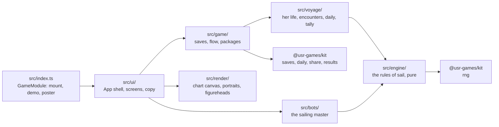
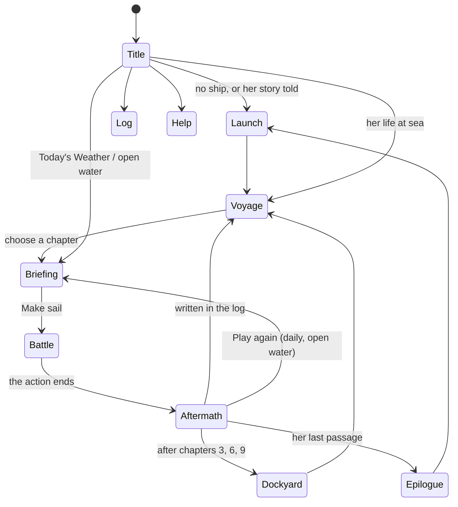

# Figurehead — architecture

## Overview

Figurehead is a native game: TypeScript in `src/`, mounted by the Hall through the kit contract.
The sea fight is drawn on a 2D canvas (the chart, ships from above, the turn's film); ships seen
from the side, the figureheads and the menu art are SVG built in code. No raster, no network, no
dependencies beyond `@usr-games/kit`.

## Module map

| Path                        | Responsibility                                                                                        |
| --------------------------- | ----------------------------------------------------------------------------------------------------- |
| `src/index.ts`              | `mount`, `demo`, `poster`, `achievements`: the whole contract with the Hall                           |
| `src/engine/tables.ts`      | The original's rule tables and ten rows of its ship table, plus our merchantman                       |
| `src/engine/state.ts`       | `createBattle` from a setup, snags, boarding-party bookkeeping, the event emitter                     |
| `src/engine/geometry.ts`    | Distance, range, bearings, arcs of fire (`gunsBear`), the angle routine                               |
| `src/engine/movement.ts`    | Allowance by heading (`maxMove`), the helm grammar (`checkHelm`), every ship moving at once           |
| `src/engine/gunnery.ts`     | The hit reckoning, the damage tables, striking, the computer's gunnery, burning and sinking           |
| `src/engine/boarding.ts`    | Grapples, fouls, boarding parties, fights on deck, the six-to-one rule                                |
| `src/engine/captains.ts`    | The computer captains' helm search and the roles: attack, flee, merchant, follow, hold off, at anchor |
| `src/engine/turn.ts`        | `resolveTurn`: one turn in the original's order, plus Figurehead's rules; `checkEnd`                  |
| `src/engine/reach.ts`       | Every pose a ship can reach this turn, with its helm string (the dots and the red squares)            |
| `src/voyage/encounters.ts`  | The twelve kinds of encounter as seeded battle setups, with their three mentions                      |
| `src/voyage/life.ts`        | Her life: the arc, crew seasoning, prize offers and verdicts, closing a chapter, endings              |
| `src/voyage/tally.ts`       | Counting a battle from its events; the mentions                                                       |
| `src/voyage/daily.ts`       | Today's Weather, its rating, and open water                                                           |
| `src/bots/captain.ts`       | The sailing master: predicts the computer captains, scores end squares, fires, boards                 |
| `src/bots/sim.ts`           | Playing encounters and whole lives with a bot, for the balance tests and `scripts/sim.ts`             |
| `src/game/`                 | Saves (`saves.ts`), the thread from menu to battle to log (`flow.ts`), packages                       |
| `src/render/chart-view.ts`  | The chart canvas: camera, sea and grid, overlays, ships, the turn's film and its effects              |
| `src/render/topdown.ts`     | A ship seen from above                                                                                |
| `src/render/portrait.ts`    | A ship seen from the side, with damage, scars and refits; the menu's scene                            |
| `src/render/figureheads.ts` | The five carvings                                                                                     |
| `src/render/demo.ts`        | The attract mode and the poster                                                                       |
| `src/ui/screens/`           | Title, launch, voyage, briefing, battle, aftermath, dockyard, epilogue, log, open water, help         |
| `src/ui/battle/`            | The battle's draft orders and the wind rose                                                           |
| `src/ui/copy.ts`            | Every word a player reads                                                                             |
| `dev/`                      | The workbench (port 5320): the game against a stand-in Hall, and art scenes                           |
| `scripts/`                  | `sim.ts` (balance report), `trace.ts` (one battle turn by turn), `shot.ts` (workbench screenshots)    |

## Screens

A battle in progress is saved after every turn (`active`), so leaving through the Hall's Game
menu or Back to the Hall keeps it; the game menu offers to return to it.

## Engine

`Battle` is one JSON-safe object: ships with their live specs and the specs they started with,
the wind, the chart's size, the kit RNG's state, and the turn. `resolveTurn(battle, orders)`
returns a new battle and the events to play back; it never changes its input. The turn runs in
the original's order (`turn.ts` lists it): the player's orders, the weather, the computer's
unfouling, burning and sinking hulks, rising prisoners, the computer captains' helms, every ship
moving at once, grapples, boarders, the computer's broadsides, the fights on deck, sails, and
the player's reloading. The dice come from the kit RNG (`createRng(figurehead:battle:<seed>)`),
saved in the battle after every turn, so a battle replays exactly from its seed and orders.

Figurehead's own rules, each marked in `turn.ts`: a beaten computer ship yields with her hull
sound (no sinking or burning roll); ships can leave the bounded chart (escaping, or a merchantman
reaching safety); a hurricane ends the action instead of sinking every ship; the player may
strike her flag. The cutting-out uses the original's own six-to-one rule: her ship is held by a
small prize crew with her people below as prisoners.

## AI

The computer captains search helm strings depth-first within their allowance, as the original
driver did, and keep the one that scores best. The `attack` score is the original's (close the
range, a bonus when the guns bear, never turn the stern to the enemy); `flee`, `merchant`,
`follow` and `holdoff` score distance to a goal, to the enemy or to the flagship; `anchored`
ships do not move or drift. Their gunnery is the original's: never reloading, double shot
alongside, chain at a ship under full sail, grape when they mean to board.

The sailing master (`src/bots/captain.ts`) reads the computer captains exactly: they choose
their helms from where the ships lie before anyone moves, so their courses this turn are known.
It scores each reachable end square by the rules' own hit reckoning (what we can fire next turn
minus what they fire at us this turn), fires what bears, reloads (chain for a runner or a
seaman's prize), boards a weaker crew. `gunner` aims at hulls; `seaman` aims high to take ships
whole.

## Where visuals are defined

| Visual                                | Defined in                                          | Change it by                                                  |
| ------------------------------------- | --------------------------------------------------- | ------------------------------------------------------------- |
| Colours of both looks                 | `src/render/palette.ts`, `src/ui/styles.css`        | `PALETTES.day` / `.night`; the CSS custom properties per look |
| The chart: paper, sea, grid, border   | `ChartView.drawSea`                                 | Wash, grid weights, the wind ripples' count                   |
| Ships from above                      | `src/render/topdown.ts`                             | `LENGTHS`, `MASTS`, the beam and sail spans                   |
| Reach dots, chosen course, ghost ship | `ChartView.drawReach`                               |                                                               |
| An enemy's possible positions         | `ChartView.drawFan`                                 | `enemyReach` in the palette                                   |
| Arcs of fire                          | `ChartView.drawArcs`                                | Faint range marks; a battery under the pointer fills its arc  |
| Night actions: lantern light          | `ChartView.drawNight`, `lanternLit`                 | The 6.5-square pool and 9-square sight                        |
| The turn's film: flashes, smoke, shot | `ChartView.play`, `spawnFireEffects`, `drawEffects` | Durations in `play`; `pace` under reduced motion              |
| Ships from the side                   | `src/render/portrait.ts`                            | `SHAPES` per design, `mastsFor`, `hullDetails`, `scarMarks`   |
| The menu's scene (sky, coast, moon)   | `backdrop`, `sceneDefs` in `portrait.ts`            |                                                               |
| The carvings                          | `src/render/figureheads.ts`                         | One SVG path set per figurehead                               |
| The wind rose                         | `src/ui/battle/rose.ts`                             |                                                               |

Both looks are designed separately; nothing is inverted. Under reduced motion the camera jumps
instead of gliding, flags do not flutter, the film is shortened to its outcome, and the chart is
redrawn only when something changes.

## Where sounds are defined

| Sound        | Patch (`src/audio/sounds.ts`) | Plays when                                        |
| ------------ | ----------------------------- | ------------------------------------------------- |
| Ship's bell  | `bell`                        | Each turn begins; a chapter is written in the log |
| Broadside    | `broadside`                   | Her guns fire; the enemy fires at her             |
| Distant guns | `distant`                     | The enemy fires at another ship                   |
| Splash       | `splash`                      | Her shot falls short                              |
| Timber       | `timber`                      | Shot strikes home                                 |
| Helm, tick   | `helm`, `tick`                | A helm order is given                             |
| Strike       | `strike`                      | A ship lowers her flag                            |
| Won, sombre  | `won`, `sombre`               | The action ends                                   |
| Wind         | `WIND` drone                  | While a battle is on screen                       |

## Hall integration

- **Results:** every finished action calls `reportResult` with `presentation: 'game'`: outcome
  `win`, `loss` or `draw`; score = renown (Voyage, open water) or the day's rating; stats
  `prizes`, `broadsides`, `mentions`, `rakes`; XP events for prizes and mentions; `daily` for
  Today's Weather. A Voyage chapter reports when it is written in the log, after the prize crews
  are chosen. Abandoning a Today's Weather or open-water battle reports `quit`.
- **Packages:** installed when earned, some mid-battle (`raking-fire`, `bare-poles`,
  `signal-flying`), the rest when a chapter closes (`game/flow.ts`).
- **Pause menu:** "Break off the action" (Voyage) or "Abandon this battle", each confirmed.
- **Daily:** numbered and seeded by the kit (`context.daily`); the first try of a day is on
  record (`days` save).
- **Saves** (all version 1): `life`, `memories`, `active`, `days`, `open`, `counts`, `prefs`.

## Tests

| Test                      | Command                                                 | What it proves                                                                               |
| ------------------------- | ------------------------------------------------------- | -------------------------------------------------------------------------------------------- |
| Engine                    | `pnpm vitest run --project figurehead`                  | The canonical behaviours T-05 to T-22, and Figurehead's own rules                            |
| Voyage                    | (same)                                                  | Encounters on the chart, the six-to-one verdicts, captains, taken and rebuilt ships, endings |
| Balance                   | (same, `src/bots/balance.test.ts`)                      | The locked win rates and a whole life's outcome (see NOTES.md)                               |
| Manifest                  | (same, `src/content.test.ts`)                           | The manifest validates and lists the game's packages                                         |
| In the Hall               | `pnpm exec playwright test -c games/figurehead`         | The game menu, a battle by keyboard, the aftermath and the ways out                          |
| Documentation screenshots | `SHOTS=1 pnpm exec playwright test -c games/figurehead` | `docs/media/`                                                                                |
| Balance report            | `pnpm --filter @usr-games/game-figurehead sim [runs]`   | The full table in NOTES.md                                                                   |

## Kit candidates

- `ui/dialog.ts`: a small confirmation sheet with focus kept inside, for games that draw their own.
- `render/portrait.ts`'s scene fade: an SVG scene that fades into the page or card it sits on.
