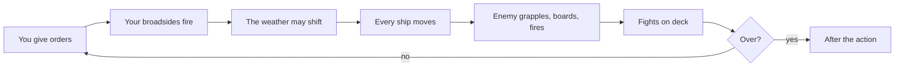
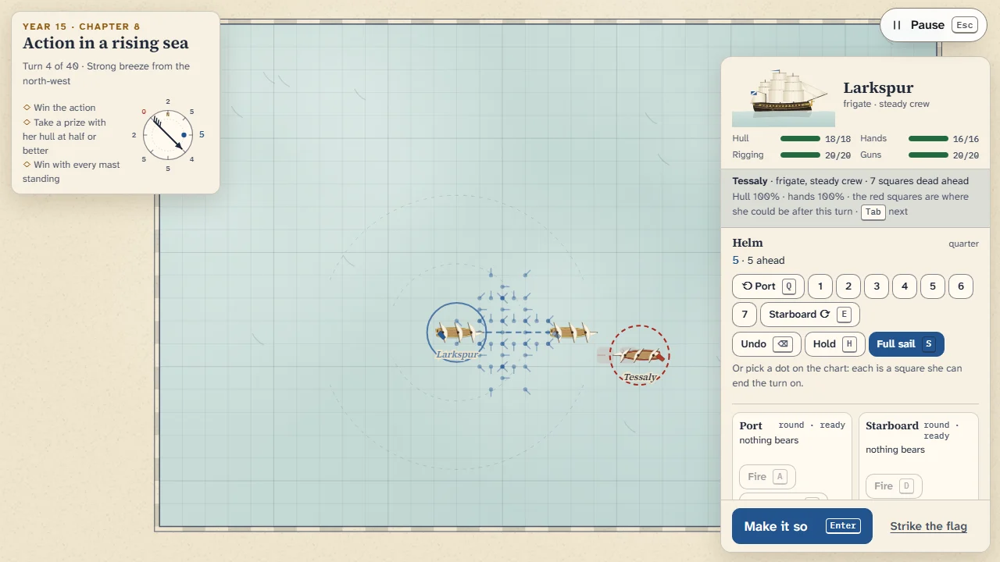
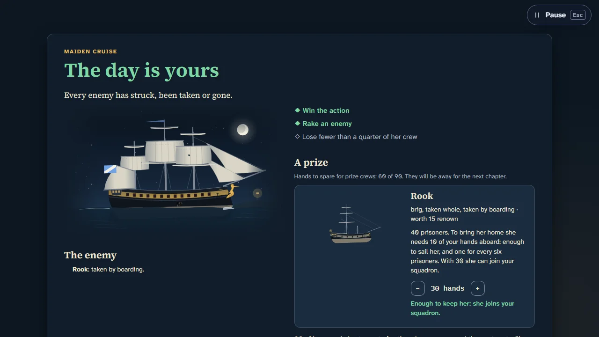
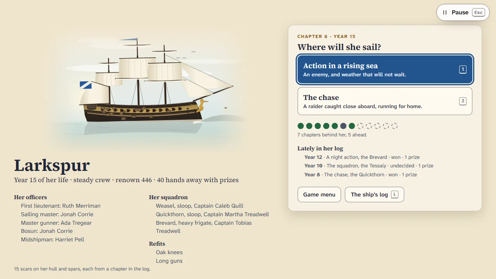

# How to play Figurehead

## Goal

See one ship through her whole life: twelve chapters over thirty years, from her maiden cruise to
her last passage home. Win her actions, take enemy ships whole and bring them home, make captains
of her officers, and earn the mentions in her log. There is no losing the game: a ship taken is
cut out of an enemy harbour, a ship lost is rebuilt under the same carving, and every life ends
with an epilogue.

## Controls

Everything can be done with the keyboard alone, or with the mouse alone.

| Action                                    | Keyboard             | Mouse                            |
| ----------------------------------------- | -------------------- | -------------------------------- |
| Make it so: play the turn                 | Enter                | Make it so                       |
| Turn to port / to starboard               | Q / E (or [ / ])     | ⟲ Port / Starboard ⟳             |
| Sail that many squares ahead              | 1 – 7                | 1 – 7                            |
| Undo the last helm order                  | Backspace            | Undo                             |
| Hold her where she is                     | H or 0               | Hold                             |
| Steer to a square                         | —                    | Click a dot on the chart         |
| Fire the port / starboard broadside       | A / D                | Fire, on each battery            |
| Aim at her hull or her rigging            | W                    | At her hull / At her rigging     |
| Reload port / starboard with another shot | Z / C                | Reload with…                     |
| Full sail or battle sail                  | S                    | Full sail / Battle sail          |
| Grapple, or cast off                      | G                    | Grapple … / Cast off …           |
| Board with 1, 2 or 3 sections             | B (again for more)   | Board …                          |
| Keep hands back to repel boarders         | V                    | Keep hands back to repel         |
| Repairs (all hands)                       | —                    | Hull, Guns, Rigging              |
| Signal the squadron                       | K                    | Engage, Follow me, Hold off      |
| Take the sailing master's advice          | M                    | Take it                          |
| Show the next enemy's possible positions  | Tab (Shift+Tab back) | Click an enemy ship              |
| Zoom the chart; follow the action again   | + / −, F             | Wheel; double-click; drag to pan |
| Skip the turn's film                      | Space                | —                                |
| Strike the flag (asks first)              | —                    | Strike the flag                  |
| Pause                                     | Esc                  | Pause                            |
| Play again / Continue the voyage          | R                    | Play again / Continue the voyage |
| Back to the Hall (after an action)        | H                    | Back to the Hall                 |

Keys are the game's own and are not remapped from the Hall.

## Rules

A turn goes like this:

1. **Your orders.** Choose where she will end the turn, which broadsides fire and at what, what to
   reload with, sails, boarders, repairs, a signal. Nothing happens until you make it so.
2. **Your guns fire first**, from where the ships lie now.
3. **The weather** may change, every seventh turn.
4. **Every ship moves at once**, a square at a time. Ships that collide may foul each other.
5. **The enemy** throws grapnels, sends boarders, and fires.
6. **Fights on deck** are settled.
7. A beaten enemy may **yield**, and the action may be over.

### Sailing

A square-rigger cannot sail into the wind. The **wind rose** in the top-left card counts the
squares she can sail on every heading: most with the wind on her quarter, none with it dead
ahead. Every turn costs a square, and she cannot turn twice running. A ship that makes no
headway for two turns starts to drift downwind. Full sail is faster, but rigging hit under full
sail takes twice the damage.

The **dots** around your ship are every square she can end the turn on, each with a short tick
showing her heading there. Click one, or build a helm string with the keys: `3` sails three
squares ahead, `l2` turns to port and sails two, `r1l1` turns, sails, turns and sails.

### Guns

Each broadside covers three points either side of the beam. **Round shot** reaches ten squares;
beyond six it can only be aimed at the rigging. **Chain shot** reaches three and only tears
rigging. **Grape** and **double shot** work alongside only; double takes two turns to load. A
**rake**, firing down an enemy's length from ahead or astern, hits much harder, and from astern
hardest of all. The battery cards tell you the target, the range and how heavy the broadside
will be.

The enemy's guns never need reloading, and alongside they always fire double shot: stay out of
pistol shot unless you mean to board. The red squares around an enemy are every place she could
be after this turn.

### Close action

A ship within a square can be grappled (one time in three against an enemy). Grappled or fouled,
you can send one, two or three sections of your crew across, and keep sections back to repel
boarders, who fight at double strength on their own deck. Win the fight on her deck and she is
yours.

### Taking prizes

A ship whose hull is shot away strikes her colours, and may sink or burn afterwards. A ship that
has lost all her masts, or most of her people, or whose hull is badly holed and her crew thinned,
**yields** with her hull sound: she will not sink or burn. After the action every prize needs a
**prize crew**: enough of your hands to sail her, and one for every six prisoners, or her
prisoners will rise and take her back on the way home. Two hands more and she can **join your
squadron**, if she is sound and there is room for three. Hands sent with prizes are away for the
next chapter.

### Her life

- **Crew:** green at her launch, then steady, crack and elite as she fights and wins. Heavy losses
  bring green hands aboard.
- **Officers:** when a prize joins the squadron, your senior officer takes command of her and
  everyone below steps up.
- **Squadron:** ships kept from your prizes sail with you in the squadron actions. If yours are
  too few, the station lends you ships.
- **Dockyard:** after the third, sixth and ninth chapters, choose one of two refits.
- **Scars:** hull damage leaves patches, lost masts leave new timber, and stay for her life.
- **Taken:** strike or be boarded and she is held in an enemy harbour; the next chapter is a
  cutting-out by night. Board her, or thin her prize crew with grape until her own people below
  outnumber them six to one and rise.
- **Lost:** she sinks or burns, or is not taken back; a new hull is built under the same name
  with a numeral, and the figurehead goes onto her bow.

## Modes

| Mode               | What changes                                                                                                        |
| ------------------ | ------------------------------------------------------------------------------------------------------------------- |
| The Voyage         | Her life: twelve chapters, prizes, scars, a squadron, an epilogue. No retries: it is her life.                      |
| Today's Weather #N | One action a day, the same for every captain, in the station frigate with a crack crew. The first try is on record. |
| Open water         | Any action, any enemy, any crew, any sea code. Practice; nothing goes in her log.                                   |

## Settings

The Hall's settings (appearance, sound, motion) apply. Day and night are two designed looks: the
chart table by daylight, or by lantern light.

## Scoring

**Renown** is the Voyage's score: 25 for a win (5 if neither side won), 10 for each mention, and
every prize brought home at her worth, doubled if she was taken whole by boarding or yielded,
times one and a half if her hull was at half or better, halved if she was battered.

**Today's Weather** is rated 1,000 for a win, 250 for each mention, ten times the prizes' worth,
and ten for every turn to spare when she wins early. Its share line shows the mentions as squares
and the rating, with no link.

## Achievements (packages)

| Package            | How to earn it                                |
| ------------------ | --------------------------------------------- |
| `maiden-cruise`    | Sail her first chapter to its end.            |
| `first-prize`      | Bring a prize home.                           |
| `raking-fire`      | Fire a broadside down an enemy's length.      |
| `taken-whole`      | Take a prize with her hull at half or better. |
| `fair-weather`     | Win a Today's Weather.                        |
| `signal-flying`    | Hoist a signal to your squadron.              |
| `old-hands`        | See her crew become crack.                    |
| `captain-made`     | Give one of your officers a prize to command. |
| `brought-home`     | Take back your own ship.                      |
| `bare-poles`       | Bring down every mast of an enemy ship.       |
| `full-life`        | See a ship to her last anchorage.             |
| `best-crew-afloat` | See her crew become elite.                    |

## XP

Every finished action reports to the Hall: a win, a loss (she struck, was taken, sank or burned)
or a draw (nightfall, the weather, broken off, the enemy got away). Each prize brought home earns
8 XP (three at most), and the mentions 2 XP each. Abandoning an open-water or Today's Weather
action counts as quitting; breaking off a Voyage action goes in her log as unfinished. Weekly
goals can ask you to bring prizes home, fire broadsides or earn mentions.

## Tips

- Read the red squares before you choose a dot: end the turn where your guns will bear on her
  likely squares and hers will not.
- Cross her bow or, better, her stern, and fire as she lies end on.
- Chain shot at three squares and a hull left alone make a prize that can serve.
- Keep out of pistol shot of a ship you cannot board: her double shot is murderous alongside.
- The sailing master's advice is a good teacher: take it, then see why it went there.
- In a convoy, get between the raiders and the merchantmen early; merchantmen yield to anything
  alongside.
- Send two extra hands with a sound prize if you can spare them: she will fight beside you later.
