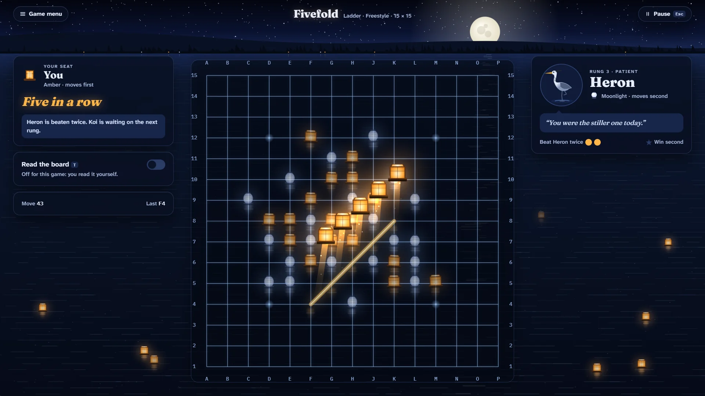

# Fivefold

> Five in a row. Read the threats before they read you.

## The hook

The oldest race on a grid: take turns placing pieces, and be first to make an unbroken line of
five. Fivefold pits you against a 1994 Berkeley mind that hunts for hidden combinations — and lets
you switch on its thoughts to learn how it plays. By day the board is raked into the sand of a stone
garden and you play river pebbles; by night it is drawn in light on a still lake and every move sets
a lantern afloat. Make five, and the five lanterns rise together into the sky and become stars.

## Where it comes from

Ralph Campbell wrote the Berkeley five-in-a-row program, and it reached the BSD games in 1994. It
played on a Go-sized 19 × 19 board, with a board display borrowed from Peter Langston's Go referee
program. Inside, it thinks in _frames_ — every run of five points on the board — and searches for
combinations of frames that force a win: a real threat-space idea, years early. It was built for
robot tournaments, where a referee program pits one player against another, and it could play
itself. It also had a little personality: a gloat when it won, a grumble when you did, and real
surprise (with a typo) at a tie.

## What is new

- **Read the board**: switch it on and every four and open three on the board is drawn for you —
  solid lines for fours, dashed for open threes, rings where they complete.
- **A ladder of six opponents**, from playful Pebble to Campbell (the full 1994 search, move for move)
  and the Referee beyond it, each with kind words of their own. Beat each twice to climb; win moving
  second for a star.
- **A replay that shows what the AI weighed** before every move: the points it rated, the frames it
  found forcing, its choice.
- **Sixty puzzles**, "win in two" to "win in seven", found by the program's own combination search
  and each proved to have exactly one answer — plus a **Daily Puzzle** to share.
- **The Bot League**: the tournament mode, now a show. Pick two opponents and watch them play a
  match.
- Two rule sets (Freestyle, as in 1994, and Exactly five), two board sizes, two players at one
  device, and a 90-second tutorial.

## At a glance

|                 |                                    |
| --------------- | ---------------------------------- |
| Directory       | `/usr/games/board`                 |
| Players         | 1–2                                |
| Session         | 3–15 minutes                       |
| Daily challenge | yes: the Daily Puzzle              |
| Inspired by     | `gomoku` (1994), by Ralph Campbell |

## More

- [How to play](HOW-TO-PLAY.md)
- [Changes from the original](CHANGES-FROM-ORIGINAL.md)
- [Architecture](ARCHITECTURE.md)
