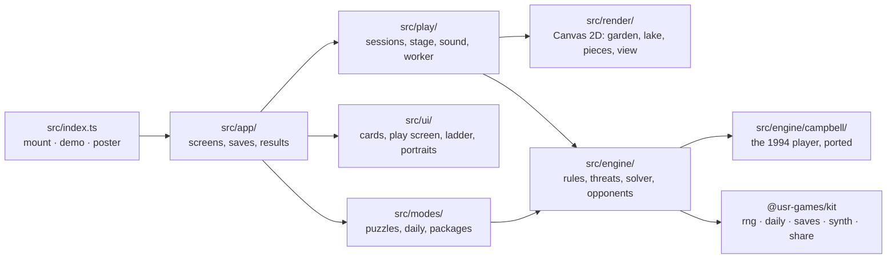
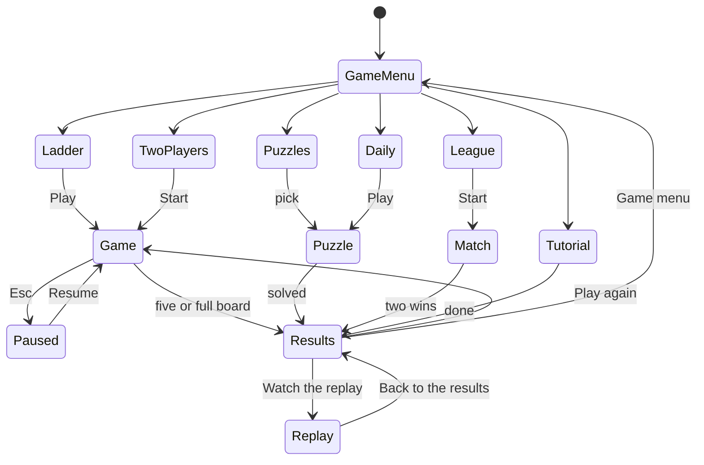

# Fivefold — architecture

## Overview

Fivefold is a native game: strict TypeScript, drawn on one Canvas 2D per screen (ADR 0001), with its
own DOM screens around the board. Its opponents all think with a structure-for-structure port of the
1994 program's `pickmove`, proven move for move against the C program, running in a Web Worker
during play (ADR 0002). A threat-space solver of our own judges puzzles and strengthens the Referee.

## Module map

| Path                                                | Responsibility                                                                                             |
| --------------------------------------------------- | ---------------------------------------------------------------------------------------------------------- |
| `src/index.ts`                                      | `mount`, `demo` (two gentle opponents playing themselves), `poster` (five lanterns rising), `achievements` |
| `src/app/app.ts`                                    | Screens, sessions, results in the collection's order, packages, Hall pause items, `reportResult`           |
| `src/app/menus.ts`                                  | Game menu, ladder, puzzles, Daily Puzzle (with a preview board), two players, Bot League, help, settings   |
| `src/app/saves.ts`                                  | Save slots: settings, ladder, puzzles, daily, counters (all version 1, read defensively)                   |
| `src/engine/game.ts`                                | Fivefold's rules: 15 or 19 lines, Freestyle or Exactly five, win, draw, undo                               |
| `src/engine/threats.ts`                             | What Read the board draws: fours and open threes, merged per line                                          |
| `src/engine/solver.ts`                              | Threat-space search: fours and open threes, every winning first move, quickest win                         |
| `src/engine/opponents.ts`                           | The six opponents: names, lines, and how each plays (depth, slips, blind spots, work cap)                  |
| `src/engine/ai.ts`                                  | An opponent at the board: five, block, the Referee's search, the 1994 choice, human slips                  |
| `src/engine/campbell/`                              | The port: `board.ts` (bdinit, makemove), `pickmove.ts`, `glibc-random.ts`, `mind.ts` (adapter)             |
| `src/engine/match.ts`                               | Whole games between opponents, for the balance tests                                                       |
| `src/modes/puzzles.ts`                              | The puzzle data (`puzzles.json`), bands, the daily rotation                                                |
| `src/modes/packages.ts`                             | The twelve packages and what earns them                                                                    |
| `src/modes/daily.ts`                                | The Daily Puzzle's share line                                                                              |
| `src/play/session.ts`                               | A game: ladder (ranked or practice) or two players                                                         |
| `src/play/puzzle-session.ts`                        | A puzzle or the Daily Puzzle: judging, the other side's answers, Show me                                   |
| `src/play/league.ts`                                | The Bot League match                                                                                       |
| `src/play/replay.ts`                                | The replay with what the AI weighed                                                                        |
| `src/play/tutorial.ts`                              | The four-step tutorial                                                                                     |
| `src/play/stage.ts`                                 | The live board: canvas loop, pieces, threats, win moment, pointer and keyboard                             |
| `src/play/ai-worker.ts`, `ai-client.ts`, `brain.ts` | The opponent in a worker (or in the page where there are no workers)                                       |
| `src/play/sound.ts`                                 | Synthesised patches                                                                                        |
| `src/render/`                                       | Looks, geometry, garden, lake, pieces, drifters, scenery (menus), board view                               |
| `scripts/make-puzzles.ts`                           | Generates `src/modes/puzzles.json`                                                                         |

## State machine

## Engine

`GameState` holds the board (`(Stone | null)[]`, points `y·size + x` from the top left), the moves,
whose turn, the winner and the winning line. `play` places, checks every direction through the new
piece against the rules (`wins`: five or more in Freestyle, exactly five in Exactly five) and the full
board. Nothing in `src/engine/` touches the DOM.

Randomness: the 1994 player breaks ties with a coin (`random() & 1`). In play its coin is a kit RNG
stream (`createRng(seed)` per seat, split per side in matches); in the reference tests it is a
reproduction of glibc's `random()` so games replay exactly. The Daily Puzzle comes from a seeded
shuffle of the daily pool indexed by the Hall's daily number.

## AI

The 1994 player (`src/engine/campbell/pickmove.ts`): frames are runs of five spots; each has a
combination value ⟨a, b⟩ (moves to unstoppable, open ends). It values every empty spot by the best
frame through it, combines crossing frames into combinations of two, then three and more (no deeper
than half the moves played), and picks the best spot for the side to move unless the other side is
one move from an unstoppable combination it cannot outrun. The port keeps the original's quirks
(NOTES.md). Fivefold adds two options that leave its choices alone when unused: `maxDepth` and
`maxWork` (combinations of three frames or more per side per move, with the deeper search stopping at
the cap), and a record of what it weighed.

On top, `OpponentMind` (`src/engine/ai.ts`):

1. A five of its own: play it.
2. A five of yours waiting: block it (Pebble forgets one time in five).
3. The Referee only: a forcing win by fours (up to 10 moves) or with threes (up to 5), by the solver.
4. The 1994 choice, with the opponent's depth and work cap.
5. The Referee only: if that move leaves you a forcing win, the first answer that does not.
6. The gentler opponents only: with their chances, overlook your open three (play their own best
   point instead), or slip to a near-best point on a quiet move.

The solver (`src/engine/solver.ts`) searches threat space with a node budget (never the clock): the
attacker plays fours (the reply is forced) and, when asked, open threes (the defender may answer at
any point that stops the open four, or with a four of its own). It lists every winning first move,
which proves a puzzle's uniqueness and judges a player's puzzle move.

All work limits are counts, so tests are deterministic. During play the opponent thinks in a worker
(`ai-worker.ts`) and the session waits at least half a second, so moves never land before you have
looked up.

## Where visuals are defined

| Visual                                                  | Defined in               | Change it by                                          |
| ------------------------------------------------------- | ------------------------ | ----------------------------------------------------- |
| Every colour of both looks                              | `src/render/look.ts`     | Editing `ZEN_SAND` / `LANTERN_LAKE`                   |
| Board geometry, play layout                             | `src/render/geometry.ts` | `boardGeometry`, `playLayout`                         |
| Garden: sand, raking, rocks, moss, kerb, grooves        | `src/render/garden.ts`   | `drawGardenBackdrop`, `drawGardenBoard`, `rockGroups` |
| Lake: sky, moon, shore, water, moon path, grid of light | `src/render/lake.ts`     | `drawLakeBackdrop`, `drawMoonPath`, `drawLakeBoard`   |
| Pebbles, lanterns, halos, reflections                   | `src/render/pieces.ts`   | `drawPebble`, `drawBoxLantern`, `drawRoundLantern`    |
| Lanterns drifting beside the board                      | `src/render/drifters.ts` | `drawDrifters`                                        |
| Threat lines, cursor, ghost, AI weighing, win moment    | `src/render/view.ts`     | `drawThreat`, `drawWeighing`, `drawWin`, `WIN_TIMING` |
| Menu scenery and the "five" motif                       | `src/render/scenery.ts`  | `SceneryView`                                         |
| Opponent portraits (SVG)                                | `src/ui/portraits.ts`    | One function per opponent                             |
| Screens around the board                                | `src/ui/fivefold.css`    | `--ff-*` tokens per look at the top                   |

Light and dark are two designs, chosen from the Hall's appearance and switched live. Reduced motion:
lanterns stop bobbing, nothing drifts or shimmers, the win moment shows its end state (rings raked;
stars in the sky), the menus' scenery is drawn once.

## Where sounds are defined

| Sound        | Patch (`src/play/sound.ts`) | Plays when                                 |
| ------------ | --------------------------- | ------------------------------------------ |
| Pebble       | `pebble(mine)`              | A piece lands, by day                      |
| Lantern      | `lantern(mine)`             | A piece lands, by night                    |
| Warning      | `WARNING`                   | An opponent makes a four against you       |
| Win          | `phrase(...)` rising        | A five (yours, or anyone's at one device)  |
| Loss, draw   | `phrase(...)`               | An opponent's five; a full board           |
| Solved, miss | `phrase(...)`               | A puzzle solved; a puzzle move that misses |

All quiet (gains 0.16–0.32); the game's own Sound setting and the Hall's volume both apply.

## Hall integration

- `reportResult`, always `presentation: 'game'`: ladder games `win` / `loss` / `draw` with stats
  `{ games, wins, moves }` and XP `win` (8 + 3 × rung) or `game` (3), practice `practice` (2); two
  players `complete`; puzzles `win` with `{ puzzles: 1 }` and XP `puzzle` (3 + 2 × moves), `daily: true`
  for the day's first solve; the tutorial and Bot League matches `complete`.
- Packages from `packagesForGame` and `packagesForPuzzles`, offered once a visit.
- Pause items: Read the board (T) and Take back a move (Z) in games where they are allowed; Try again
  and Show me in puzzles; Show their thinking in the Bot League; Back to the results in a replay.
- Daily numbering from `context.daily`; the share line from `dailyShareText`.
- Saves (`src/app/saves.ts`), all version 1: `settings`, `ladder`, `puzzles`, `daily`, `counters`.

## Tests

| Test                   | Command                                                                            | What it proves                                                                                                                          |
| ---------------------- | ---------------------------------------------------------------------------------- | --------------------------------------------------------------------------------------------------------------------------------------- |
| Reference games        | `pnpm vitest run --project gomoku pickmove` (`GOMOKU_REFERENCE=all` for all 30)    | The port plays every move the C program played                                                                                          |
| Rules, threats, solver | `pnpm vitest run --project gomoku engine`                                          | Freestyle and Exactly five; reading the board; the solver                                                                               |
| Opponents              | `pnpm vitest run --project gomoku ai`                                              | Fives taken, fours blocked, games end legally                                                                                           |
| Balance                | `pnpm vitest run --project gomoku balance` (`GOMOKU_BALANCE=<file>` for the curve) | The ladder rises against the yardstick                                                                                                  |
| Puzzles                | `pnpm vitest run --project gomoku modes` (`GOMOKU_PUZZLES=all`)                    | One answer each, the quickest, as marked                                                                                                |
| Words                  | `pnpm vitest run --project gomoku content`                                         | No original strings, kind copy, packages in step                                                                                        |
| Browser                | `pnpm exec playwright test -c games/gomoku`                                        | Mouse and keyboard play, Read the board, replay, puzzles, two players, Bot League, daily share, exits; the game in the Hall; frame rate |
| Hero frames, screens   | `... --grep @hero`, `... --grep @shots`                                            | The images in `docs/media/`                                                                                                             |

## Kit candidates

- A way for a game to ask the Hall for its pause (the game sends a synthetic Escape today).
- A Web Worker helper for games whose AI should think off the page's thread.
