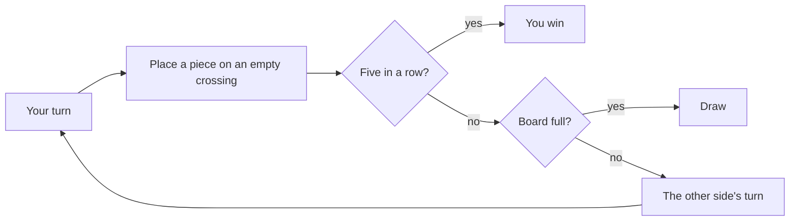

# How to play Fivefold

## Goal

Be the first to make an unbroken line of five of your pieces — across, down or on a slant. A full
board with no five is a draw.

## Controls

| Action                         | Keyboard                     | Mouse                        | Remappable |
| ------------------------------ | ---------------------------- | ---------------------------- | ---------- |
| Move the cursor on the board   | ← ↑ → ↓                      | Point at a crossing          | no         |
| Place a piece                  | Enter or Space               | Click a crossing             | no         |
| Read the board on or off       | T                            | The switch on the left       | no         |
| Take a move back               | Z (practice, two players)    | Pause menu: Take back a move | no         |
| Try a puzzle again             | R                            | Try again                    | no         |
| Show a puzzle's answer         | S                            | Show me                      | no         |
| Show the Bot League's thinking | W                            | Show their thinking          | no         |
| Step through a replay          | ← → (Home, End; Space plays) | The replay's buttons         | no         |
| Move through the game menu     | ↑ ↓, then Enter              | Click an item                | no         |
| Pause                          | Esc                          | Pause button                 | no         |
| Back to the game menu (pages)  | Esc                          | Game menu                    | no         |
| Play again (results)           | R                            | Play again                   | no         |
| Watch the replay (results)     | W                            | Watch the replay             | no         |
| Next opponent or puzzle        | N                            | Next                         | no         |
| Back to the Hall (results)     | H                            | Back to the Hall             | no         |

## Rules

1. The first player (slate by day, amber by night) places a piece on any empty crossing.
2. The second player (quartz by day, moonlight by night) does the same. Turns alternate.
3. A move that makes five in a row wins at once.
4. If the board fills with no five, the game is a draw.

**Freestyle** (the 1994 rule) counts five or more in a row. **Exactly five** counts only five: a line
of six or more wins nothing. Boards are 15 × 15 (the default) or 19 × 19 (the original's).

### Reading the board

- A **four** is four of one side in a line of five with the fifth point empty: one move from five.
  It must be answered at once.
- An **open three** is three in a line with room at both ends: one more move makes an **open four**
  (two points of five at once), which no single move can stop.
- **Read the board** draws them: solid lines for fours, dashed lines for open threes, each in its
  side's colour, and rings where they complete. It is allowed in practice games, puzzles and
  two-player games; ranked ladder games and the Daily Puzzle leave the reading to you.

## Modes

| Mode        | What changes                                                                                                                                                                                                                                              |
| ----------- | --------------------------------------------------------------------------------------------------------------------------------------------------------------------------------------------------------------------------------------------------------- |
| Tutorial    | About 90 seconds: make five, block a four, turn an open three into an open four, switch on Read the board.                                                                                                                                                |
| Ladder      | Pebble, Reed, Heron, Koi, Campbell; beat each twice in ranked games to meet the next. A ranked win moving second earns that opponent's star. The Referee waits beyond Campbell. Practice games allow Read the board and take-backs and count for nothing. |
| Puzzles     | Sixty positions, each with one way to force five in the moves given: Gentle (2–3), Keen (4–5), Deep (6–7). Any move that keeps the win forced is right; the other side answers every threat as well as it can.                                            |
| Daily #N    | Everyone gets the same puzzle today, numbered by the Hall. Your first solve is the one that counts and can be shared: `Fivefold #42 · solved in 3 · 🔵🔵🔵` (a white circle for each try before).                                                         |
| Two players | One board, one device, taking turns; Read the board and take-backs allowed.                                                                                                                                                                               |
| Bot League  | Pick two opponents and a pace; they play a match, first to two wins, swapping sides each game. Show their thinking to see what each weighed.                                                                                                              |

After any game against an opponent, **Watch the replay** steps through it and shows, before each of
the opponent's moves, what its search weighed: dots on the points it rated (bigger for stronger),
dotted lines along the frames it found forcing, a ring round its choice and a dashed ring round your
best point by its reckoning.

## The opponents

| Opponent | Temperament        | How they play                                                                                            |
| -------- | ------------------ | -------------------------------------------------------------------------------------------------------- |
| Pebble   | Playful            | Looks one frame deep; often plays a near-best point; may miss your three, rarely even your four.         |
| Reed     | Easygoing          | Two frames deep; still slips now and then.                                                               |
| Heron    | Patient            | Three frames deep; seldom slips.                                                                         |
| Koi      | Crafty             | Four frames deep; hardly ever slips.                                                                     |
| Campbell | The 1994 mind      | The full 1994 combination search, as the original played it.                                             |
| Referee  | Reads every threat | Campbell's search plus a modern hunt for wins by chains of threats, and checks every move against yours. |

## Settings

| Setting                     | Options                       | Default   |
| --------------------------- | ----------------------------- | --------- |
| Board for new games         | 15 × 15 · 19 × 19             | 15 × 15   |
| Rules                       | Freestyle · Exactly five      | Freestyle |
| Read the board when allowed | On · Off                      | On        |
| Sound                       | On · Off                      | On        |
| Ladder: you play            | First · second (for the star) | First     |
| Ladder: game                | Ranked · Practice             | Ranked    |
| Bot League pace             | Calm · Brisk · Swift          | Brisk     |

## Scoring

There is no score to chase: a game is won, lost or drawn. The ladder keeps two win pips and a star
for each opponent; the puzzles keep which you have solved; the Daily Puzzle keeps your moves and tries.

## Achievements (packages)

| Package              | How to earn it                                                  |
| -------------------- | --------------------------------------------------------------- |
| `first-five`         | Make five in a row against any opponent.                        |
| `white-win`          | Win a game moving second.                                       |
| `league-fan`         | Watch a whole Bot League match to the end.                      |
| `daily-regular`      | Solve seven Daily Puzzles.                                      |
| `beat-each-opponent` | Beat Pebble, Reed, Heron, Koi and Campbell, each at least once. |
| `beat-campbell`      | Beat Campbell, the full Berkeley search.                        |
| `exactly-five-win`   | Win a game under Exactly five.                                  |
| `four-four`          | Make two fours with a single stone.                             |
| `fast-five`          | Win in fewer than fifteen of your own moves.                    |
| `referee-slayer`     | Beat the Referee.                                               |
| `puzzle-50`          | Solve fifty of the puzzles.                                     |
| `no-overlay-win`     | Beat Campbell with Read the board off the whole game.           |

## XP

This game reports results to the Hall: a finished game, the first win of the day, the daily
challenge and packages all earn XP (see the Hall's rules). Ranked wins earn more the higher the rung;
practice games, two-player games, the tutorial and Bot League matches earn a little. Weekly cron
goals: _Win {n} games_ and _Solve {n} puzzles_.

## Tips

- Every move, look for fours first — yours, then theirs. Then open threes.
- An open three is a threat: answer it at one of its ends (or next to it) before it becomes an open
  four.
- The strongest moves make two threats at once: a four and an open three, or two of either. One
  answer cannot stop both.
- Moving first is a real advantage; that is why a win moving second earns a star.
- Watch the replay of a lost game with its thinking on: the dotted lines show the combination it
  saw before you did.
