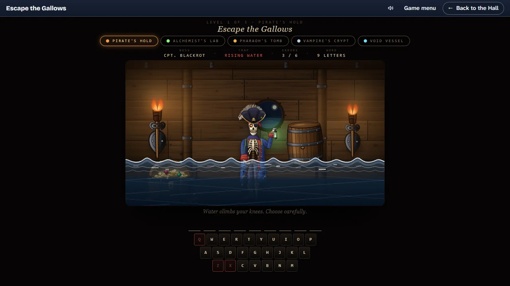

# Escape the Gallows

> Five rooms, five ciphers, six mistakes before the room wins.

## The hook

Every door is locked with a cipher, and every room is out to get you while you work on it. Guess
a letter: right, and it writes itself into the door; wrong, and the room moves. The hold floods,
the gas thickens, the sand pours, the Count steps closer, the air goes foul. Six mistakes and the
room wins, and each room wins in its own way. Solve the cipher and the door opens, and the room's
boss lets slip the first letter of its weakness.

## Where it comes from

`hangman` reached Berkeley's games around 1983, written by Ken Arnold with the curses library he
was building: a word picked at random from the system dictionary, seven wrong guesses drawn as a
figure on a gallows, and a running average of mistakes per word. This version is the owner's
earlier fancy-web port of it, which kept the loop (one hidden word, letters guessed one by one, a
budget of mistakes) and rebuilt everything around it as an escape through five themed rooms.

## What is new

- **Five rooms, five threats**: a pirate hold filling with water, an alchemist's laboratory
  filling with gas, a pharaoh's tomb filling with sand, a crypt where a vampire count closes in
  on his prisoner, a starship losing its air.
- **A cipher list for every room**, about forty words each, with a clue for every word.
- **An ending for every room**: the captain's bones adrift among the flotsam, the doktor flat
  out on his laboratory floor, the court bowed to the floor before the mummy, the cape closing in
  the dark, the bridge window cracking open.
- **Rooms that answer every miss**: the doktor gives a little more to the gas each time (head
  bowed, knees buckling, kneeling, bowed to the floor), and the bridge's life-support monitors
  track the oxygen falling while carbon dioxide, ammonia and hydrogen sulphide rise.
- **Every picture drawn in code**: characters, rooms and props, with a living scene in each
  (torches, waves rolling across the flood, streamers from a Tesla coil, bats, a walking mummy,
  a turning sky).

## At a glance

|                 |                    |
| --------------- | ------------------ |
| Directory       | `/usr/games/words` |
| Players         | 1                  |
| Session         | 2–8 minutes        |
| Daily challenge | no                 |
| Inspired by     | `hangman` (1983)   |
