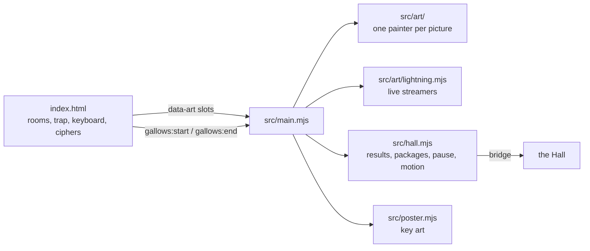

# Escape the Gallows — architecture

## Overview

A static hosted game: `app/index.html` is the port as it shipped (markup, CSS and the game's
script), and `app/src/` adds the pictures drawn in code and the Hall adapter. No build step; the
Hall serves the folder at `play/hangman-classic/` and loads the shared bridge from
`../../bridge/bridge.js`.

| Path                  | Responsibility                                                                                                                 |
| --------------------- | ------------------------------------------------------------------------------------------------------------------------------ |
| `app/index.html`      | The port: five scenes, the trap overlay, the word, the keyboard, the ciphers and the game loop.                                |
| `app/src/main.mjs`    | Paints every `data-art` slot, hands the end-of-room pictures to the page, runs motion and pause.                               |
| `app/src/hall.mjs`    | The bridge: a result per cipher, packages, the Hall's pause and reduced motion.                                                |
| `app/src/poster.mjs`  | The Hall's key art: the Pirate's Hold composed from the same pictures, onto a canvas.                                          |
| `app/src/art/kit.mjs` | SVG helpers: gradients, grain, `paint()` (a shape with soft shade and light inside its outline).                               |
| `app/src/art/*.mjs`   | One module per room: `captain`, `hold`, `remains`, `water`; `lab`, `alchemist`, `lightning`; `tomb`, `court`; `crypt`; `void`. |
| `app/tests/`          | `node:test`: every painter returns one self-contained SVG; the page loads nothing from outside.                                |
| `e2e/`                | Playwright inside the Hall: rooms, wins, losses, endings, streamers, motion, pause, ways out, shots.                           |

## How a picture gets on the page

Each slot in the page is an element with `data-art="<painter>"`. `main.mjs` calls the painter with
a unique id prefix (so gradients and clip paths of two copies never collide) and sets the slot's
`innerHTML` to the returned `<svg>`. Pictures the page swaps at the end of a room (the flotsam and
bones, the bowed court) are reached through `window.HoldArt` and `TombArt`, which the page's own
lose and reset functions call.

Two pictures follow the miss count instead of being swapped. The doktor is a jointed figure: the
page sets `data-slump` (0–6) on `.lab-character` in `renderHUD`, and CSS inside his picture turns
his joints into that pose. The bridge's four life-support monitors are set by
`window.VoidArt.showGasLevels(bridge, misses)`, which the page calls from `updateAirMonitors`.

## Where visuals are defined

| Visual                                                           | Defined in              | Change it by                                                             |
| ---------------------------------------------------------------- | ----------------------- | ------------------------------------------------------------------------ |
| Captain Blackrot                                                 | `src/art/captain.mjs`   | `captain()`                                                              |
| Plank wall, sconce, barrel, chest, flotsam                       | `src/art/hold.mjs`      | `holdWall`, `wallTorch`, `barrel`, `chest`, `flotsam`                    |
| The captain's bones and coat afloat                              | `src/art/remains.mjs`   | `PIECES`, `REMAINS`                                                      |
| The flood's surface                                              | `src/art/water.mjs`     | `waterSurface` (rows, glints)                                            |
| Lab wall, chart, proportions study, atom, coil, glassware        | `src/art/lab.mjs`       | `labWall` … `teslaCoil`, `TESLA_TOROID`                                  |
| Streamers from the coil                                          | `src/art/lightning.mjs` | `streamer`, `DRAW_EVERY_MS`                                              |
| Doktor Formalin, one pose per miss                               | `src/art/alchemist.mjs` | `POSES` (joint angles), `FEATURES` (face, flask), `BONES` (pivots)       |
| Gods, coffin, sphinx, Apis, mummy, lotus torch                   | `src/art/tomb.mjs`      | `HEADS`, `deity`, `mummy` (its motion is CSS inside the picture)         |
| The people of the tomb, standing and bowed                       | `src/art/court.mjs`     | `templeCourt`, `templeCourtBowed`                                        |
| Crypt wall, the Count, the werewolf, the cape, candelabrum, bats | `src/art/crypt.mjs`     | `fiendFace`, `count`, `werewolf`, `cloaked`, `bat`                       |
| Space, the bridge, stations, spaceplane, astronaut               | `src/art/void.mjs`      | `spaceBackdrop`, `bridge`                                                |
| The life-support monitors and their readings per miss            | `src/art/void.mjs`      | `GASES` (readings, caution and danger limits), `showGasLevels`           |
| Bat flight paths, barrel bob, ripples, short-window layout       | `index.html` (CSS)      | `batFlight1–4`, `barrelBob`, `floodRipple`, `@media (max-height: 860px)` |

## Hall integration

- **Results**: `hall.result` once per cipher, `win` or `loss`, score 50 + 10 per mistake in hand,
  stats `ciphers`, `misses`, `letters`; XP events `escape` (8) and `clean` (4).
- **Packages**: five rooms, `clean-escape`, `by-a-thread`, `long-cipher`, and `every-door` from
  the rooms escaped, kept under `usr-games:hangman-classic:escaped`.
- **Pause**: the Hall's pause and a hidden tab add `is-paused` to the page (every CSS animation
  holds), pause the SVG animations and stop the streamers.
- **Reduced motion**: the Hall's setting or the system's adds `reduced-motion`: no animation in
  the rooms, no bats, no streamers, no falling sand.
- **Poster**: `poster.mjs` composes the Pirate's Hold into an SVG image, draws it on a canvas and
  offers it with `posterFromCanvas`.
- **Appearance**: dark only, as the port shipped (KNOWN-ISSUES).

## Tests

| Test              | Command                                                      | What it proves                                                                                                            |
| ----------------- | ------------------------------------------------------------ | ------------------------------------------------------------------------------------------------------------------------- |
| Pictures and page | `pnpm run test:hosted`                                       | Every painter returns one SVG with its ids prefixed and every `url(#…)` defined; the page fetches nothing from outside    |
| In the Hall       | `pnpm exec playwright test -c games/hangman-classic`         | Rooms drawn, a win with its package, a loss with its ending, every room's end, streamers, reduced motion, pause, ways out |
| Screenshots       | `SHOTS=1 pnpm exec playwright test -c games/hangman-classic` | `docs/media/`                                                                                                             |
