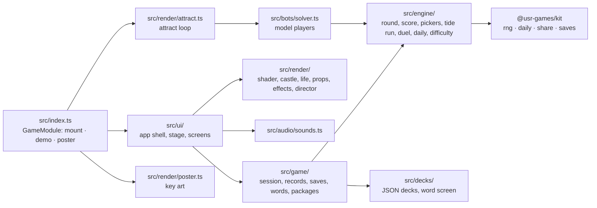
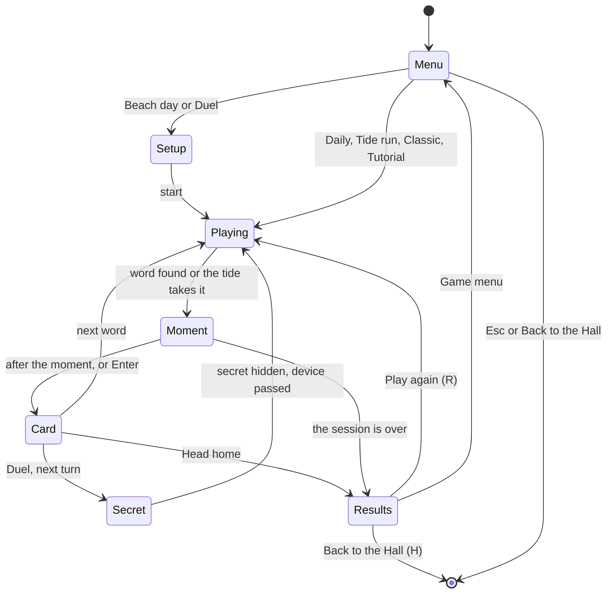

# Before the Tide — architecture

## Overview

A native game: a TypeScript module the Hall mounts through the kit contract. The beach is a
WebGL 1 fragment shader (sky, sea, swash, sand) under a Canvas 2D layer (castle, creatures, props,
effects), with an HTML interface on top ([ADR 0001](adr/0001-webgl-sea-and-canvas-castle.md)).
The engine is a few hundred lines of pure, seeded rules; the word decks are plain JSON.

## Module map

| Path                  | Responsibility                                                                                                                       |
| --------------------- | ------------------------------------------------------------------------------------------------------------------------------------ |
| `src/index.ts`        | `mount`, `demo`, `poster`, `achievements`: the kit contract                                                                          |
| `src/engine/`         | A round (`round.ts`), the tide average (`score.ts`), both word pickers (`pickers.ts`), Tide runs, Duels, the Daily, difficulty tiers |
| `src/decks/`          | The nine decks (`data/*.json`), their loader, the all-ages word screen (`screen.ts`) and the build-time validator (`decks.test.ts`)  |
| `src/game/`           | A visit in one mode (`session.ts`), records and package rules (`records.ts`), saves, word sources per mode, the package list         |
| `src/bots/`           | The well-read and letter-order model players: difficulty calibration, balance tests, the attract loop                                |
| `src/render/`         | Everything drawn: the shader, the castle and its collapse, crabs and gulls, props, effects, the director that animates events        |
| `src/ui/`             | The app shell (`app.ts`), the living beach behind every screen (`stage.ts`), the HUD, the screens                                    |
| `src/audio/sounds.ts` | Every sound, as kit synth patches                                                                                                    |

## State machine

Pause is the Hall's: while it is open the stage's clock stops (so moments resume exactly where
they were) and keys are ignored.

## Engine

- **A round** (`engine/round.ts`) is immutable data: the word, the letters tried, waves taken,
  waves allowed (7, or fewer late in a Tide run), Lighthouse uses and status. `guess` returns
  `hit`, `miss`, `repeat`, `not-a-letter` or `over`. Repeats and non-letters change nothing, as in
  the original.
- **The tide average** (`engine/score.ts`): a word scores its waves, or 9 when lost.
  `averageWithWordInPlay` is the original's "current" figure.
- **Pickers** (`engine/pickers.ts`): `pickFair` for play; `pickLikeTheOriginal` and
  `originalPickerOdds` reproduce the original's biased picker for the faithfulness tests only.
- **Randomness**: the kit's `createRng`. A session is seeded from its mode, the day and the time;
  the Daily walks one fixed shuffle of its pool (`engine/daily.ts`), so every player gets the
  same word and none repeats until the pool is used up.
- **Difficulty** (`engine/difficulty.ts`): a straight line in distinct letters and mean letter
  rarity, fitted to the well-read model player's misses on the everyday deck; the cut-offs are
  its thirds. See NOTES.md for the numbers.

## AI

There is no opponent. Two model players (`bots/solver.ts`) measure the decks: a **well-read**
player who knows every deck word and picks the letter in most remaining candidates, and a
**letter-order** player who tries letters from commonest to rarest. They bracket a person, fix
the difficulty tiers, and are locked in `bots/balance.test.ts`. The attract loop uses a looser
version of the first (it guesses hopefully three times in ten), so the castle does fall now and
then.

## Where visuals are defined

| What                                                                                   | Where                                                                                                                 |
| -------------------------------------------------------------------------------------- | --------------------------------------------------------------------------------------------------------------------- |
| Both looks' colours (Midday, Moonlit Tide)                                             | `render/palette.ts`                                                                                                   |
| Where everything sits, at every size                                                   | `render/layout.ts` (play, game menu, and compact for attract and poster)                                              |
| Sky, sea, breakers, the wrong letter's swell, swash, wet and dry sand, stars           | `render/sea-shader.ts`, driven by `render/sea.ts`                                                                     |
| Sea without WebGL                                                                      | `render/painted-sea.ts`                                                                                               |
| The castle, its sections, heaps, dune, windows, shells                                 | `render/castle.ts` (geometry constants at the top), `render/castle-model.ts` (sections, wash order, decoration slots) |
| Shells, starfish, sea glass                                                            | `render/ornaments.ts`                                                                                                 |
| Crabs, gulls, footprints                                                               | `render/life.ts`                                                                                                      |
| Headland, lighthouse and its beam, tide gauge, bucket and spade, the word's damp patch | `render/props.ts`                                                                                                     |
| Spray, sand slides, sparkles, rainbow mist, glowing fan                                | `render/effects.ts`                                                                                                   |
| What happens when (waves, carving, win, loss, repair, rebuild)                         | `render/director.ts` (timings at the top)                                                                             |
| Score panel, word slots, shells keyboard, gauge label, Lighthouse button               | `ui/hud.ts`, `ui/styles.css`                                                                                          |
| Cards, buttons, privacy screens, deck picker                                           | `ui/screens/*.ts`, `ui/screens.css`                                                                                   |

The Hall's palette tokens are not used inside the beach: the two looks are the game's own,
designed separately and switched by the Hall's light or dark appearance. **Reduced motion**: the
director sets `still`, so the sea's clock stops, swells and surges are dropped, sections cross-fade
into their heaps, decorations appear without a pop, and the slot letters skip their trace.

## Where sounds are defined

All in `audio/sounds.ts`, played through the Hall's synth (quiet by default, following its volume
and mute):

| Patch        | When                                                                         |
| ------------ | ---------------------------------------------------------------------------- |
| `surf`       | Once per breath of the sea, as the breaker reaches the shore (`ui/stage.ts`) |
| `gull`       | Now and then, by day only                                                    |
| `chime`      | A right letter; one step up a pentatonic scale per letter found              |
| `whoosh`     | A wrong letter's swell                                                       |
| `tap`        | A repeat or a key that is not a letter                                       |
| `lighthouse` | The Lighthouse's bell                                                        |
| `win`        | The castle stands                                                            |
| `lose`       | The tide takes it                                                            |
| `repair`     | A Tide run's clean word mends a section                                      |
| `select`     | Picking a mode on the game menu                                              |

## Hall integration

- **Results**: one `reportResult` per finished session (not the tutorial), with
  `presentation: 'game'`. Outcome: Daily and Tide run `win`/`loss`, Beach day, Classic and Duel
  `complete`. Score: words found. Stats: `wordsFound`, `cleanWords`, `wordsPlayed`. XP events:
  `clean-words` (3 each, up to 15) and `long-word` (5).
- **Packages**: twelve (`game/packages.ts`, the same list as the manifest), installed by the rules
  in `game/records.ts`.
- **Pause items**: in Beach day and Classic, "Head home and see your beach".
- **Daily**: the kit's number and seed; the share line is built from the kit's daily number and
  emoji grid on one line (`engine/daily.ts`).
- **Saves**: `prefs` v1 (deck, tier, tutorial done, Duel names and turns) and `records` v1
  (lifetime tally, counts, streaks, best beach and run, daily entries, recent words), in
  `game/saves.ts`.
- **Title screen**: `setOnTitleScreen(true)` on the game menu only. The interface keeps the top
  right clear for the Pause pill and keeps the word and keys out of the bottom-left toast corner
  (`render/layout.ts`).

## Tests

| What                                                                                                    | Where                                       | Command                                                                                 |
| ------------------------------------------------------------------------------------------------------- | ------------------------------------------- | --------------------------------------------------------------------------------------- |
| Rules, scoring, the Lighthouse, the Daily                                                               | `src/engine/rules.test.ts`                  | `pnpm vitest run --project hangman`                                                     |
| The original picker's bias (Classic's harness)                                                          | `src/engine/pickers.test.ts`                | same                                                                                    |
| Tide runs and Duels                                                                                     | `src/engine/modes.test.ts`                  | same                                                                                    |
| Decks: shape, sizes, duplicates, word screen, notes                                                     | `src/decks/decks.test.ts`                   | same                                                                                    |
| Difficulty tiers and balance against the model players                                                  | `src/bots/balance.test.ts`                  | same                                                                                    |
| Sessions, records, packages, word sources, manifest                                                     | `src/game/*.test.ts`                        | same                                                                                    |
| Keyboard and mouse play, Lighthouse, Daily share, Duel privacy, Tide run repairs, reduced motion, exits | `e2e/game.spec.ts`                          | `pnpm exec playwright test -c games/hangman e2e/game.spec.ts`                           |
| Hero frames                                                                                             | `e2e/hero.spec.ts`                          | `pnpm exec playwright test -c games/hangman --grep @hero`                               |
| Inside the Hall, and the documentation screenshots                                                      | `e2e/hall.spec.ts`, `e2e/shots.spec.ts`     | `pnpm exec playwright test -c games/hangman --project hall` (`SHOTS=1` for screenshots) |
| Difficulty calibration                                                                                  | `scripts/difficulty.ts`, `scripts/tiers.ts` | `pnpm exec tsx games/hangman/scripts/difficulty.ts`                                     |

## Kit candidates

- **A one-line share** helper: `composeShare` always puts the emoji grid on its own line; a
  `layout: 'inline'` option would cover this game's share line (`engine/daily.ts`).
- **A pausable stage clock** that stops with the Hall's pause and a hidden tab
  (`ui/stage.ts`); Double Cross proposed the same.
- **Event listeners in the DOM builder** (`ui/dom.ts`): several games wrote their own.
