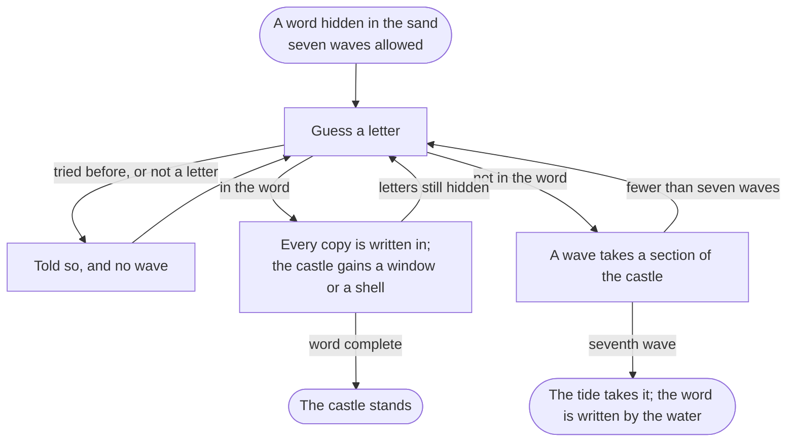

# How to play Before the Tide

## Goal

Find the hidden word before seven waves wash the sandcastle away. Across many words, keep your
**tide average** (the waves each word took) as low as you can, like a golf score.

## Controls

| Action                                        | Keyboard           | Mouse                       |
| --------------------------------------------- | ------------------ | --------------------------- |
| Guess a letter                                | `A`–`Z`            | Click a shell or pebble     |
| Light the Lighthouse (a letter for one wave)  | `?` or `/`         | The Lighthouse button       |
| Next word, or carry on after a moment         | `Enter`            | The card's first button     |
| Pause (Hall menu)                             | `Esc`              | The Pause button, top right |
| Play again / back to the Hall, on the results | `R` / `H`          | The results buttons         |
| Move between buttons and choices              | `Tab`, `Shift+Tab` | —                           |
| Leave from the game menu                      | `Esc`              | "← Back to the Hall"        |

Every control is a real button, so the whole game is playable with the keyboard alone. Focus rings
show only while you use the keyboard.

## Rules

1. A word is hidden in the wet sand, one groove per letter.
2. Guess one letter at a time. Upper or lower case is the same.
3. A right letter fills every slot where it appears, and the castle gains a window or a shell.
4. A wrong letter sends a wave. The sea takes the castle from the outside in: the moat bank, the
   gatehouse, the left tower, the right tower, the walls, the keep with its flag. Each one sinks
   into a heap of wet sand, and the float on the tide gauge rises a notch.
5. A letter you already tried, or a key that is not a letter, is turned away with a note. It costs
   nothing.
6. Find every letter to win the word. The seventh wave smooths what is left into a dune, and the
   retreating water writes the word in the sand.

**The Lighthouse.** Press `?` or the button to have the Lighthouse show you the hidden letter that
fills the most slots (ties go to the letter more common in English). It costs one wave. It rests
when one more wave would bring the castle down, and it never shines in the Daily Word, Classic or
a Duel.

## Modes

| Mode           | What it is                                                                                                                                                                                                            |
| -------------- | --------------------------------------------------------------------------------------------------------------------------------------------------------------------------------------------------------------------- |
| **Daily Word** | One word for everyone each day, numbered by the Hall (#N), no Lighthouse. Your first finished Daily Word of the day counts; later ones are for fun. Share it without spoiling the word.                               |
| **Beach day**  | Word after word from the deck you choose (Everyday, Ocean, Space, Food, Animals, Music, Weather, Sports or Computing history), at any difficulty or just the easy, medium or hard third. Head home whenever you like. |
| **Tide run**   | Ten everyday words against one castle, climbing from easy to hard. Waves are not repaired between words, but a word found without a single wave mends one section. How far can you get before the tide wins?          |
| **Duel**       | Two players, one device. Take turns: one writes a secret word behind a privacy screen, the other guesses it. After the agreed number of words each, the fewer waves wins.                                             |
| **Classic**    | The 1983 rules: everyday words of six letters and up, no Lighthouse, and the original's two figures, the current and overall averages, to three places.                                                               |
| **Tutorial**   | Forty seconds with a coach: a right letter, a wrong one, the Lighthouse, done.                                                                                                                                        |

## Settings

Before the Tide follows the Hall's settings: sound and volume, light or dark (Midday or Moonlit
Tide), and reduced motion. Under reduced motion the sea stays calm, waves become gentle fades, and
sections cross-fade into their heaps. The game's own Settings page opens the Hall's, and can
forget this game's records.

## Scoring

- **A word's score** is the number of waves it took, Lighthouse included. A word the tide takes
  scores **9**, two more than the seven allowed, so losing always costs more than scraping through.
- **The tide average** is the mean over words, lower is better. The play screen shows it as it
  would stand if the word in play ended now, beside the average of this beach and of all time.
  Duel words stay out of your average.
- **The Daily share line** gives the day's number, the waves and seven squares, one per wave the
  castle could take. It never includes the word:

  `Before the Tide #42 · 🏰 2 waves · 🟨🟨⬜⬜⬜⬜⬜`

## Achievements (packages)

| Package             | Tier  | How to earn it                                                            |
| ------------------- | ----- | ------------------------------------------------------------------------- |
| Castle standing     | core  | Find your first word before the tide does.                                |
| Not a drop          | core  | Find a word without a single wave reaching the castle.                    |
| One wave short      | core  | Find a word with six waves in, when the next would have taken the castle. |
| Long shoreline      | core  | Find a word of twelve letters.                                            |
| Sand duelist        | core  | Finish a Duel with a friend.                                              |
| Morning walker      | core  | Play seven Daily Words.                                                   |
| Beachcomber         | extra | Find a word from every deck.                                              |
| Punched in          | extra | Find ten words from the Computing history deck.                           |
| By starlight        | extra | Play twenty words in a row without the Lighthouse.                        |
| Berkeley sands      | extra | Find five Classic words in a row.                                         |
| Under par           | rare  | Keep a tide average under 2 over a beach of ten words or more.            |
| Ten before the tide | rare  | Find all ten words of a Tide run.                                         |

## XP

This game reports results to the Hall: a completed session, the first win of the day, the daily
challenge and packages all earn XP (see the Hall's rules). Within a session, words found without a
wave earn a small bonus (3 XP each, up to 15), and a long word found (ten letters or more) earns 5.
Weekly cron goals count words found and words found without a wave.

## Tips

- Vowels first is the classic opening, but in a short word one wrong vowel is a whole wave. Try
  the commonest consonants (T, N, S, R) too.
- Hard words are short words with rare letters: fewer slots to fill, more ways to be wrong.
- Save the Lighthouse for a word with a long run of gaps: the letter it shows fills the most slots.
- In a Tide run a clean word mends a section, so playing carefully on easy words buys room for
  the hard ones at the end.
