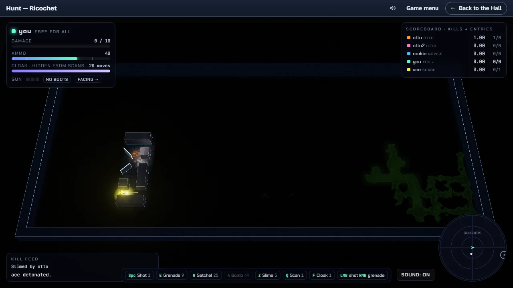

# Hunt — Ricochet

> A maze, a few rivals and nowhere to hide.

## The hook

You drop into a dark maze with a handful of rivals. Your drone lights only what lies ahead of it
and to its sides, never behind, and every shot you fire flashes your position to everyone. Shots
fly five times faster than you walk and bounce off glass mirrors that swivel each time they are
hit, so the best shot is often the one you bank around a corner. Blast a wall open, roll slime
down a corridor, tag a rival out of the maze, and keep an eye on the gunshot radar: someone is
always listening.

## Where it comes from

`hunt` is the maze game Conrad Huang, Ken Arnold and Greg Couch wrote at the UCSF Computer Graphics
Lab (its build file is dated 1985; the sources carry the University of California’s copyright from
1983). It was a game for a whole network of 4BSD machines: one computer ran the `huntd` server,
everyone else joined from their own terminal, and all of them shared one maze drawn in characters,
51 cells wide and 23 high. If nobody pressed a key, the whole world stood still. A robot player
called Otto could join when friends were busy; its own source cheerfully admits that it is buggy
and unfair.

## What is new

- A 3D neon arena drawn entirely in code: your beam lights exactly the cells the original let you
  see, and what you have seen stays behind as a faint blueprint.
- The Ricochet arena, the default: a maze with loops whose lone pillars become glass mirrors, so
  bank shots of many bounces are everywhere. The original maze and a lightly aged one are a click
  away.
- One to eight bots: a faithful Otto, a slow-to-react Novice and a Sharpshooter that plans its
  ricochets through the mirrors it remembers.
- A steady clock, ten steps a second by default, instead of a world that waits for keystrokes.
- Modern controls (WASD to move, the arrows or the mouse to face) beside the original keys, and a
  Coach that previews where your next shot will bounce.
- Three views: the 3D arena, the original 80×24 terminal screen, or both side by side.

## At a glance

|                 |                     |
| --------------- | ------------------- |
| Directory       | `/usr/games/arcade` |
| Players         | 1, against 1–8 bots |
| Session         | 5–15 minutes        |
| Daily challenge | no                  |
| Inspired by     | `hunt` (1983)       |

## More

- [How to play](HOW-TO-PLAY.md)
- [Changes from the original](CHANGES-FROM-ORIGINAL.md)
- [Architecture](ARCHITECTURE.md)
- [Notes](NOTES.md)
