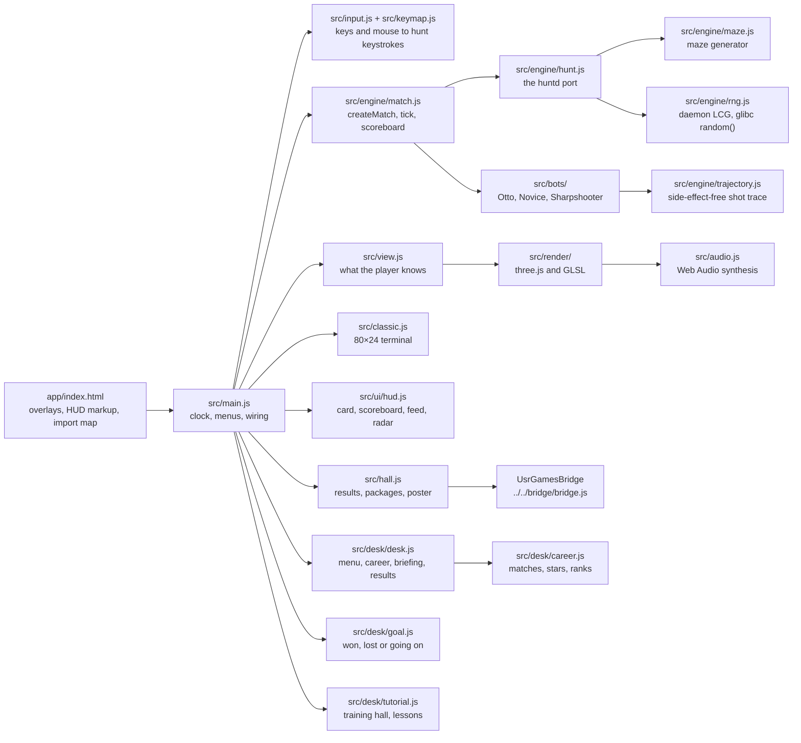
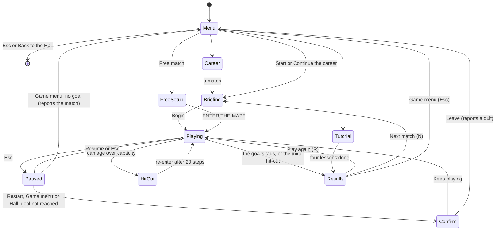
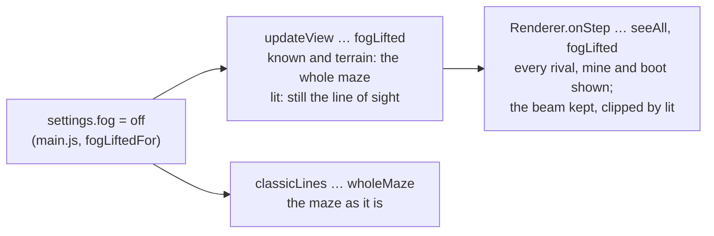

# Hunt — Ricochet — architecture

## Overview

Hunt — Ricochet is a **hosted** game: the owner’s finished port (`hunt`, fancy-web), adopted as it
was into `games/hunt/app/`. It is vanilla JavaScript ES modules with no build step and no runtime
dependencies, drawing with three.js r186 (vendored in `app/src/vendor/`, mapped by an import map
in `index.html`) and hand-written GLSL; the Hall serves the folder as it is at `play/hunt/`. The
rules engine is a function-by-function port of the `huntd` daemon, pure and DOM-free, and
golden-tested against step-by-step traces of the C original. The upstream design notes are in
[`../app/docs/architecture.md`](../app/docs/architecture.md) and its decisions in [`adr/`](adr/).

On 2026-10-02, at the owner’s request, the collection added a desk around the port (`app/src/desk/`:
the game menu, a ten-match career, briefings, results, a tutorial) and assists in a Settings page:
Fog, Bot speed, the Turn by turn pace and the Easy and Aim controls. The rules engine (`hunt.js`)
is untouched; bot speed lives in `match.js`, every other addition in the host.

## Module map

| Path                         | Responsibility                                                                                            |
| ---------------------------- | --------------------------------------------------------------------------------------------------------- |
| `app/src/engine/`            | Rules: maze, players, shots, blasts, slime, walls and regrowth, scoring, the Override flags               |
| `app/src/bots/`              | The three bot kinds and the map explorer the two new ones share                                           |
| `app/src/main.js`            | The host: settings, match setup, the fixed-step loop, pause, views, the Coach, the test hooks             |
| `app/src/input.js`           | Keyboard and mouse to hunt keystrokes, typeahead, remapping                                               |
| `app/src/keymap.js`          | Every binding: the hunt keystroke per action, Classic and Modern keys, UI keys                            |
| `app/src/view.js`            | Per-cell light, memory and ghosts for the renderer                                                        |
| `app/src/render/`            | The 3D arena, effects, post-processing, quality profiles                                                  |
| `app/src/classic.js`         | The original 80×24 terminal screen, drawn from the same state                                             |
| `app/src/ui/hud.js`          | HUD card, scoreboard, feed, message line, weapon bar, gunshot radar                                       |
| `app/src/audio.js`           | Procedural sound                                                                                          |
| `app/src/fonts/`             | Self-hosted Chakra Petch and JetBrains Mono (added on adoption)                                           |
| `app/src/hall.js`            | The bridge glue (added on adoption)                                                                       |
| `app/src/desk/`              | The collection’s desk: `desk.js` (screens), `career.js`, `goal.js`, `tutorial.js`, `store.js`, `desk.css` |
| `app/scripts/`, `app/tests/` | The workbench: dev server, screenshot and timing scripts, the C oracle, unit tests (not shipped)          |

The engine imports nothing from the host; `app/tests/` runs it in Node.

## State machine

Behind every menu runs a match of bots alone (`startDemo`), watched whole from above, silent; the
key art for the Hall is taken from it. While hit out, a match keeps running and you watch the whole
arena. The Hall’s strip can leave from any state (Back to the Hall) or reload the frame onto the
game menu (Game menu); neither sends a result.

## The desk and the assists

| Piece        | Where                                              | How it works                                                                                                                                                                                                                                                                     |
| ------------ | -------------------------------------------------- | -------------------------------------------------------------------------------------------------------------------------------------------------------------------------------------------------------------------------------------------------------------------------------- |
| Career       | `desk/career.js`                                   | Ten matches (arena, seed, roster of bot kinds, goal); stars by hit-outs; ranks by wins; saved as `usr-games:hunt:career`                                                                                                                                                         |
| Goal         | `desk/goal.js`                                     | `goalOutcome`: won at the goal’s tags (`gkills`), lost at its hit-outs (`deaths`); rivals’ tags never end a match                                                                                                                                                                |
| Tutorial     | `desk/tutorial.js`                                 | A hand-made training hall (`loadMaze`); a target that never types, worn down so one shot tags it; lesson checks from events                                                                                                                                                      |
| Bot speed    | `engine/match.js` `tick`, `BOT_SPEEDS`             | On a step the bots sit out, their typed keys wait in their queues and they type nothing new; humans never sit out                                                                                                                                                                |
| Turn by turn | `main.js` `worldMayMove`                           | The clock steps only while a key waits, a step key is held, Wait was pressed, or the player is hit out or flying                                                                                                                                                                 |
| Easy, Aim    | `keymap.js` `EASY`, `AIM`, `keysFor`               | An action becomes a turn key (when the facing after the queue differs) and then the step or the weapon. Under Aim the arrows walk like W A S D, and with Shift or Alt they fire that way; a key let go always ends a held walk, whatever modifiers are down (`input.js` `keyup`) |
| Aim’s orb    | `render/actors.js` (`round`), `renderer.js`        | The player’s actor is a sphere with a ring and no thruster; with the fog off no beam shows a facing                                                                                                                                                                              |
| Settings     | `index.html` `#settings`, `main.js` `applySetting` | Each option takes effect at once, mid-match too; saved with the port’s settings (`hunt.settings`)                                                                                                                                                                                |

Bot speed was measured with `app/scripts/career-sim.mjs`: the player’s seat driven by a bot brain
(see [NOTES](NOTES.md#the-career-simulated)).

## Engine

The whole game is one plain object, `g`, that survives a JSON round trip mid-match. It keeps the C
daemon’s data model on purpose, because the rules live in it: a 51×23 grid of characters that
shots and players are drawn into, an ordered list of shots, player slots that are compacted when
someone leaves, each player’s screen memory, a ring of the 40 most recently destroyed walls, and
the scoreboard in single-precision floats.

`step(g, think)` in `hunt.js` is one pass of the daemon’s main loop: each player runs one queued
keystroke, shots move five cells, blasts, slime and flyers resolve, the hit-out players leave (their
spare ammo may go off where they fell), at most one waiting player enters, and `think` lets the bots
type their next keys. `match.tick(g)` passes the bot runner as `think`. The host calls it from
`requestAnimationFrame` through `clock.js` at 10 steps a second (Relaxed 8, Frantic 14, a quarter of
that in slow motion), never more than four steps per frame; the renderer interpolates in between.

Randomness: every daemon decision uses the daemon’s own linear congruential generator (`rn` in
`rng.js`), and each bot has its own glibc `random()` stream seeded from the match seed. Nothing else
is random, so the same seed and the same keys per step give the same match. The Ricochet arena is
the original maze generator with 45% of the inner wall segments knocked out before the original
remapping pass, which turns every lone pillar into a mirror; Veteran ages a Classic maze with the
original’s 1% regrowth odds. The engine’s own default stays Classic, so the golden traces and the
Override baseline are unaffected.

## AI

Every bot is a player that types hunt keystrokes into its own queue, and knows only its own screen,
ammo and gun heat. `runBots` asks a bot for its next keys whenever its queue is empty.

| Bot          | File                  | How it decides                                                                                                                                                                                                                                                                                                                                          |
| ------------ | --------------------- | ------------------------------------------------------------------------------------------------------------------------------------------------------------------------------------------------------------------------------------------------------------------------------------------------------------------------------------------------------- |
| Classic Otto | `src/bots/otto.js`    | The original robot ported literally: reads its screen, looks along four strips, attacks head-on with two small slimes or from the side with two shots, wanders by following walls. Its three logic bugs are kept; two faults of the original client (steering by the last arrow on the screen, waiting for an acknowledgement that never came) are not. |
| Novice       | `src/bots/novice.js`  | Reacts three to six steps late, half the time only turns, fires straight lines only, throws a grenade one time in ten, explores with `explore.js`.                                                                                                                                                                                                      |
| Sharpshooter | `src/bots/sharp.js`   | Traces each facing through the mirrors it remembers with `trajectory.js` (up to 8 bounces, flips included), leads walking targets, throws a grenade when a bank shot ends beside a rival, sidesteps, hunts, defuses mines when low on ammo.                                                                                                             |
| (shared)     | `src/bots/explore.js` | Breadth-first search over the bot’s remembered map toward its stalest part, committing to a goal until it has seen it.                                                                                                                                                                                                                                  |

There are no time budgets: each bot does a fixed amount of work per decision. Upstream measured
1,700 steps a second with eight Sharpshooters (0.6 ms per step at worst) and 67,000 with eight
Ottos.

## Where visuals are defined

| Visual                                                                    | Defined in                                                                   |
| ------------------------------------------------------------------------- | ---------------------------------------------------------------------------- |
| Floor: lit cells, blueprint memory ticks, slime, lava, scorch, blast heat | `app/src/render/floor.js`, per-cell fields in `fields.js`, GLSL in `glsl.js` |
| The beam in the air, clipped to what you can see                          | `app/src/render/shaft.js`                                                    |
| Walls and border; cracks when destroyed, a light seam when regrowing      | `app/src/render/walls.js`                                                    |
| Mirrors (flash, ripple, swivel) and doors (scatter gates)                 | `app/src/render/mirrors.js`                                                  |
| Drones, team markers, cloak shimmer, ghosts of remembered rivals          | `app/src/render/actors.js`                                                   |
| Mines and boots                                                           | `app/src/render/items.js`                                                    |
| Shots in flight, bent at mirrors along each step’s exact path             | `app/src/render/projectiles.js`                                              |
| Blasts, sparks, debris, shards, respawn beams, point lights               | `app/src/render/fx.js`, timed by `direct()` in `renderer.js`                 |
| Bloom, refraction, colour fringing, vignette, tone mapping, grain         | `app/src/render/post.js`                                                     |
| Team, player and material colours                                         | `app/src/render/palette.js`                                                  |
| The Coach’s path, bounce marks and blast square                           | `app/src/render/coach.js`                                                    |
| Cameras, quality profiles (High, Low, Lite), shader warm-up               | `app/src/render/renderer.js`                                                 |
| HUD card, scoreboard, feed, weapon bar, radar                             | `app/src/ui/hud.js`, styles in `app/index.html`                              |
| Terminal view                                                             | `app/src/classic.js`, styles in `app/index.html`                             |
| Setup, pause, help, controls and re-entry overlays                        | `app/index.html`                                                             |

There is one dark look; the game does not read the Hall’s tokens. Auto quality picks High on a
GPU and Lite on a software renderer, and drops a level after three seconds below 38 fps; without
WebGL the terminal view takes over. Reduced motion is read from the system at start (`reduced` in
`main.js`, passed to the renderer) and, in the Hall, follows the Hall’s setting live through
`renderer.reduced`: no camera shake, hit jolts or colour fringing, a softer hurt flash, faster
easing of the light fields. No image or audio file is loaded anywhere
(`app/tests/no-raster.test.js`).

## Where sounds are defined

Every sound is synthesised in `app/src/audio.js` (`Sound.play`, no audio files), panned by screen
position and quieter with distance. The renderer emits an `sfx` event at the moment each engine
event plays out (`renderer.js`): fire, ricochet, scatter, boom, crumble, regrow, splat, death,
enter, whoosh (thrown), land, absorb, zing, volcano, and the small ones (move, turn, bump, hot,
scan, cloak, trip, defuse, boots). `main.js` adds the hurt sound and a soft tick when the key queue
is full. On its own, sound is off until the player presses SOUND; the first press creates the
audio context and ramps the master gain to 0.8. In the Hall it starts at the Hall’s level instead
(0.8 scaled by the Hall’s volume, silent while the Hall is muted), and the audio context starts on
the first click or key in the frame.

## Hall integration

`app/src/hall.js` holds all of it. `index.html` loads the bridge as a classic script
(`../../bridge/bridge.js`, after the import map and just before `main.js`), and `hall.js` connects
with `globalThis.UsrGamesBridge?.connectToHall({ id: 'hunt', onSound, onReducedMotion })`; opened
on its own, the script is missing or not hosted and every call does nothing. Everything is read from the events each engine
step already returns, through `noteEvents` in `main.js`’s `syncFrame`.

| Hunt moment                                                     | Bridge message                                                |
| --------------------------------------------------------------- | ------------------------------------------------------------- |
| The setup overlay shows or hides (`#setup` gains or loses `on`) | `title-screen { active }`, from a `MutationObserver`          |
| Esc on the setup with neither help nor Controls open            | `navigate { to: 'hall' }` (`leaveFromSetup`)                  |
| Your first tag                                                  | package `first-tag`                                           |
| You fire slime, or a charge of 49 or more                       | packages `green-tide`, `wall-breaker`                         |
| One of your shots bounces; its third bounce                     | packages `bank-shot`, `hall-of-mirrors`                       |
| You defuse a mine; catch a shot; pick up the second boot        | packages `defuser`, `good-shield`, `two-boots`                |
| A regrowing wall throws you                                     | package `lift-off`                                            |
| A rival named `ace…` is hit out by you                          | package `ace-tamer`                                           |
| Three tags since your last entry                                | package `hat-trick`                                           |
| You lead the scoreboard with 5+ tags and 5+ players in the maze | package `top-board`                                           |
| New match or Restart seed in the pause menu                     | `result { outcome, score, stats, xpEvents, durationSeconds }` |
| The first match to run eight seconds, right after a frame       | `poster`, through `posterFromCanvas` of `#gl`                 |

`outcome` is always `complete`: a match never ends by itself, so it counts as a session only when
the player ends it from the pause menu. `score` is the player’s tags (`gkills`: rivals only).
`stats` carries `tags`, `entries`, `bankShots` (shots of yours that bounced at least once) and
`defused`; `tags` and `bankShots` feed the manifest’s weekly goals. `xpEvents`: `tags`, 3 XP per
tag, at most 25, plus `won` (10) for a won match with a goal, `stars` (2 each) and `promotion` (6)
from the career. A match with a goal reports `win` or `loss` when it is decided and `quit` when it
is left early; a match without one reports `complete` when ended from the pause menu. Once any
Override flag has been turned on (`g.cheated`), the result has no score,
`tags` is 0, there are no XP events, and no further packages are sent. Fog: Off is a setting, not
an Override flag: it leaves `g.cheated` alone, so such a match reports like any other. Packages
are sent once per page load. Hunt ignores the Hall’s appearance messages (it has one look) and,
for now, its pause: a match keeps running while the Hall pauses or the tab is hidden (an open
issue; Esc is the game’s own pause). Since bridge 1.1 it follows the Hall’s sound and reduced
motion:

| In `hall.js`                          | What it does                                                                                                                                                                                                                                          |
| ------------------------------------- | ----------------------------------------------------------------------------------------------------------------------------------------------------------------------------------------------------------------------------------------------------- |
| `followHall`                          | Called once by `main.js` with the audio, the SOUND switch and the renderer; in the Hall it listens for the first click or key in the frame (`wakeSound`), which creates or resumes the audio context                                                  |
| `onSound` → `applyHallSound`          | Sets `audio.muted` and the master gain to the Hall’s volume scaled from the switch’s 0.8 (`soundLevel`), silent while the Hall is muted, and writes the switch’s own label and `aria-pressed`; SOUND still works until the Hall’s sound changes again |
| `onReducedMotion` → `applyHallMotion` | Replaces `renderer.reduced`, which the renderer reads as it draws (camera shake, hit jolts, colour fringing, how slowly sight lines light up) and the hurt flash in `main.js` reads too                                                               |

**Why `main.js` asks for the trip to the Hall itself.** The bridge normally sends
`navigate { to: 'hall' }` for Escape on the title screen, but only when the page has not handled the
key. Hunt’s `Input` treats Escape as its pause key and calls `preventDefault`, so the bridge always
leaves it alone; `onUi` in `main.js` calls `leaveFromSetup` instead when no match is running.

The changes to the game’s own files are one import and these calls in `main.js`: `noteEvents` in
`syncFrame` after `hud.onEvents`; `noteMatchStarted` at the end of `startMatch` (before the
URL-only warp); `reportMatchEnded` before Restart seed (`p-restart`) and New match (`p-new`);
`leaveFromSetup` for Escape on the setup; and the poster offer after `renderer.frame`. Plus the
font and bridge lines in `index.html` and the port in `package.json` (see [NOTES](NOTES.md)).
Prompt C1 added `followHall` once the renderer is built, the hurt flash reading `r.reduced`, and
one line in `input.js` that leaves Tab to the browser outside live play, so it moves focus on the
setup and pause menus and out of the frame to the Hall’s strip.

## The Fog setting

Added on 2026-10-02 at the owner’s request: with the fog off the whole maze is lit, for players
who find the line of sight too hard. It is the setting `fog` (`on` or `off`) in `main.js`,
remembered with the others and switched on the setup or in the pause menu.

| File                         | Change                                                                                                                                                         |
| ---------------------------- | -------------------------------------------------------------------------------------------------------------------------------------------------------------- |
| `app/src/main.js`            | The `fog` setting; `fogLiftedFor(me)` (never while hit out or under Override’s See whole maze); `syncFrame` passes it on; the Coach shows the rivals it lights |
| `app/src/view.js`            | `updateView(…, { fogLifted })`: every cell known as it is, `lit` left as the player’s line of sight; `items(…, fogLifted)` counts every mine and boot as seen  |
| `app/src/render/renderer.js` | `fogLifted`: the beam and its shaft stay on (clipped by the line of sight, so they stop at the first wall); rivals lit as if seen                              |
| `app/src/classic.js`         | `wholeScreen`: the terminal draws the maze as it is, translated as `check()` writes a screen, explosions on top                                                |
| `app/index.html`             | The Fog switch under Bots on the setup and in the pause menu, the FOG OFF badge, a line in the help                                                            |

The engine is untouched, so the golden traces and the Override baseline still hold; the bots
still see only their own screens.

## Tests

| Test                                 | Command                                           | What it proves                                                                                                                                                                                                                                                                                    |
| ------------------------------------ | ------------------------------------------------- | ------------------------------------------------------------------------------------------------------------------------------------------------------------------------------------------------------------------------------------------------------------------------------------------------- |
| Unit tests (102 in 14 files)         | `pnpm run test:hosted` (or `pnpm test` in `app/`) | Upstream: golden traces, mirrors and the Coach’s paths, weapons, world, sight, scoring, view, bots, stress, Override, zero raster, shortcut conflicts; ours: the Fog setting (`fog.test.js`); the career, goals, bot speed, the Easy and Aim keys and the training hall (`desk.test.js`)          |
| Golden traces (7, part of the above) | the same; `app/tests/golden.test.js`              | The engine matches the C daemon field by field, step by step, over about 6,000 steps                                                                                                                                                                                                              |
| In the Hall (25)                     | `pnpm exec playwright test -c games/hunt`         | Opens on the game menu with no outside requests; a free match ended from the pause menu counts; a career match won (stars, next match), lost, and left early (confirm, quit); Fog off; Slow bots and Turn by turn; the Aim keys and the orb; the tutorial; sound, motion, keyboard, every way out |
| Screenshots                          | `SHOTS=1 pnpm exec playwright test -c games/hunt` | `docs/media/`, on the machine’s GPU                                                                                                                                                                                                                                                               |

The golden traces in `app/tests/golden/*.jsonl.gz` were recorded by `scripts/oracle/capture.mjs`,
which compiles the original daemon and Otto from a local copy of the BSD source (never committed)
around `scripts/oracle/harness.c`, a scripted driver loop with a small virtual terminal per player;
re-recording needs that source and a C compiler (`pnpm --dir games/hunt/app oracle`). The
zero-raster test fails on any image (SVG included) or audio file, or any image or audio loader, in
`app/`. The in-Hall suite (`games/hunt/e2e/hunt.spec.ts`) checks: it opens on the match setup with
no outside requests; a match ended from the pause menu counts as a session; Back to the Hall; Game
menu; the browser’s Back; Escape on the title screen. `games/hunt/e2e/shots.spec.ts` drives the
scenes with the URL options `autostart`, `seed`, `coach`, `arena` and `camera`.

Set `HALL_PORT` when the Hall’s usual port (5173) is taken. On its own,
`pnpm --dir games/hunt/app serve` serves Hunt at `http://localhost:5206/`; the upstream README lists
every URL option.

## Kit candidates

None: hosted games talk to the Hall only through the bridge.
