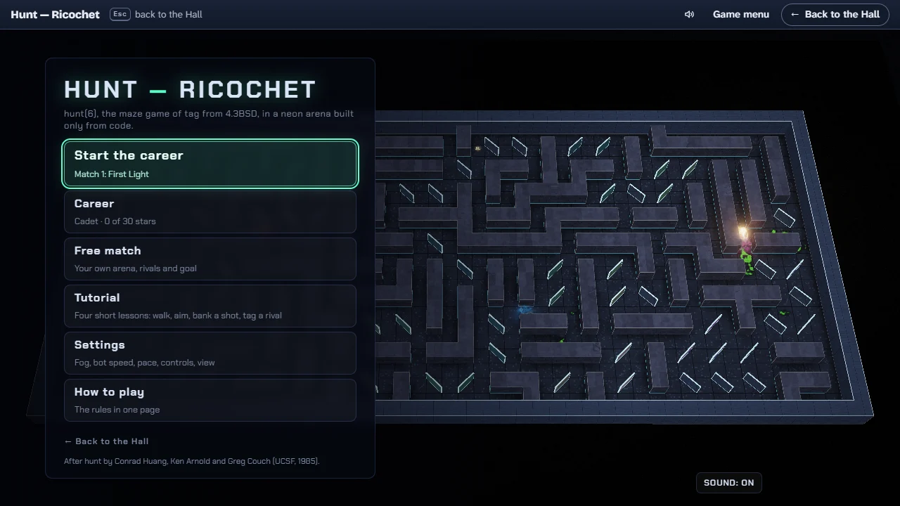
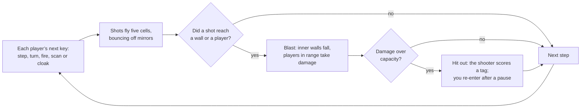
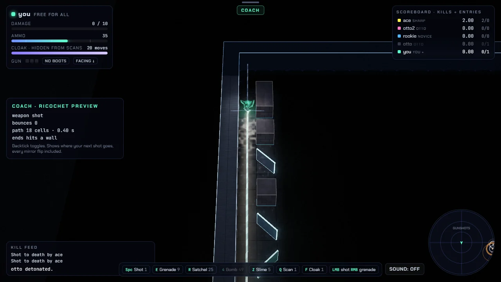

# How to play Hunt — Ricochet

## Goal

Tag rivals out of the maze and stay in it yourself. A match with a goal (every career match, and a
free match if you give it one) is won by tagging its number of rivals before you are hit out three
times, and lost on the third hit-out. Rivals tagging each other never end it, so how fast it goes
is up to you. A free match with no limit never ends by itself, as on the original’s server: end it
from the pause menu (Esc) and it counts as played. Your Hall score is the number of rivals you
tagged.

## The game menu

The game opens on its menu, laid over a match of bots alone that runs behind it. Esc there leads
back to the Hall.

| Item                           | What it does                                                                        |
| ------------------------------ | ----------------------------------------------------------------------------------- |
| Start (or Continue) the career | Opens the briefing of the first match you have not won yet                          |
| Career                         | The ten matches, your rank and your stars                                           |
| Free match                     | Your own arena, mode, rivals, map seed and goal (No limit, 3, 5 or 10 tags)         |
| Tutorial                       | Four short lessons: walk, aim and fire, bank a shot off a mirror, tag a slow rookie |
| Settings                       | Fog, bot speed, pace, speed, controls, entry, view, camera, quality and your name   |
| How to play                    | The rules and the keys of your control scheme                                       |
| ← Back to the Hall             | Leaves for the Hall                                                                 |

**The pause menu** (Esc in a match): Resume, Restart match, How to play, Settings, Game menu,
Back to the Hall. Leaving a match with a goal before it is decided asks first, and then counts as
a quit. **The results** (after a match with a goal): Play again (R), Next match (N, after a career
win), Game menu (Esc), Back to the Hall (H).

## Controls

Four schemes, chosen under **Controls** in Settings. Modern is the default; Classic is the original
program’s own keys. **Easy** and **Aim** are additions of this collection that drop the separate
facing keys:

| Action                     | Easy                                    | Aim                                                                                   |
| -------------------------- | --------------------------------------- | ------------------------------------------------------------------------------------- |
| Walk                       | Arrows or W A S D; you turn as you walk | Arrows or W A S D; walking never changes where you aim                                |
| Shot (1 ammo)              | Space or 1, where you walk              | Shift with an arrow: fires that way at once. Space or 1: again the way you last fired |
| Grenade (9)                | E or 2                                  | Alt with an arrow: thrown that way at once. E or 2: the way you last fired            |
| Satchel charge (25)        | R or 3                                  | R or 3, the way you last fired                                                        |
| Bombs, slime, scan, cloak  | As in Modern (4–0, Z X C V, Q, F)       | As in Modern; slime and bombs go the way you last fired                               |
| Mouse                      | Left button shot, right button grenade  | Left button shot, right button grenade, toward the pointer                            |
| Wait a step (Turn by turn) | .                                       | .                                                                                     |

Under Aim your drone is a round orb with a ring, since it has no facing to show; hunt still needs
one, so you face where you last fired, and with the fog on you see that way. Mines still go off far
more often when you back onto them, so mind which way you last fired. Under either scheme an
action may take two steps, a turn and then the step or the shot, as the original counts them.

The Modern and Classic schemes, every action a single original keystroke:

| Action                                   | Modern                   | Classic              | Mouse (Modern only)          |
| ---------------------------------------- | ------------------------ | -------------------- | ---------------------------- |
| Step left, down, up, right (never turns) | A S W D                  | h j k l              | —                            |
| Face left, down, up, right               | ← ↓ ↑ →                  | H J K L              | Point where you want to face |
| Shot (1 ammo)                            | Space or 1               | f or 1               | Left button                  |
| Grenade, 3×3 blast (9)                   | E or 2                   | g or 2               | Right button                 |
| Satchel charge, 5×5 (25)                 | R or 3                   | F or 3               | —                            |
| Bomb, 7×7 (49)                           | 4                        | G or 4               | —                            |
| Bigger bombs, 9×9 to 19×19 (81 to 361)   | 5 6 7 8 9 0              | 5 6 7 8 9 0          | —                            |
| Bomb, 21×21 (441)                        | unbound; set in Controls | @                    | —                            |
| Slime, 5 / 10 / 15 / 20 ammo             | Z X C V                  | o O p P              | —                            |
| Scan (1)                                 | Q                        | s                    | —                            |
| Cloak (1)                                | F                        | c                    | —                            |
| Pause and resume                         | Esc                      | Esc                  | Resume                       |
| How to play                              | `?`                      | `?`                  | How to play, Help            |
| Coach (ricochet preview)                 | `` ` ``                  | `` ` ``              | —                            |
| Override panel                           | `\`                      | `\`                  | —                            |
| Show or hide the scoreboard              | Tab, during a match      | Tab, during a match  | —                            |
| Next view: 3D, split, terminal           | F2                       | F2                   | View, in the pause menu      |
| Camera: overview or follow               | F3                       | F3                   | Camera, in the pause menu    |
| How to re-enter, while you are hit out   | C, S or F                | C, S or F            | Cloaked, Scanning, Flying    |
| Wait a step (Turn by turn)               | .                        | .                    | —                            |
| Sound on or off (see Settings)           | —                        | —                    | SOUND                        |
| Leave for the Hall                       | Esc on the game menu     | Esc on the game menu | ← Back to the Hall           |

- **Remapping.** Every Modern game key can be changed under **Controls** (on the setup or in the
  pause menu): click a binding, then press the new key; Esc cancels. The new keys are saved on this
  device. Esc, `?`, `` ` ``, `\`, Tab, F2 and F3 belong to the game’s menus and cannot be used.
  Classic keys stay as they are.
- **Typing ahead.** Up to three keys wait in line; one runs each step. A held step key repeats once
  per step.
- **The mouse** turns your drone toward the pointer, four ways only, with a small dead zone near the
  diagonals so it does not flicker. A click that needs a new facing turns first and fires on the next
  step.
- **Keyboard focus.** On the menus and in the pause menu, Tab moves between the buttons and out
  of the frame to the Hall’s strip (Shift+Tab goes the other way). In a running match Tab shows and
  hides the scoreboard instead, so press Esc first to reach the buttons. Esc on the game menu leads
  back to the Hall.

## Rules

1. Time runs in steps, ten a second at Standard speed. In each step, every player’s next queued key
   runs: one step, one turn, one shot, one scan or one cloak.
2. **Stepping never turns you.** You see the cells around you, plus a three-cell-wide strip ahead
   and to each side, up to the first wall; never behind. What you have seen stays on your map, but
   a rival you remember disappears from it as soon as they move.
3. You fire only the way you face. Shots travel five cells per step. A mirror turns a shot through
   90° and flips to the other diagonal every time it does. A door (a swirling gate) sends a shot
   off in a random direction; players can walk through doors.
4. A shot explodes where it hits a wall or a player. Every blast knocks out the inner walls it
   covers; the border never breaks. At most 40 walls can be missing at once, and past that the
   oldest grows back, now and then as a mirror or a door. A wall that grows back under you throws
   you through the air.
5. A shot does 5 damage; a blast does 5 for each ring from its edge inward. You are hit out when
   your damage goes over your capacity, which starts at 10, so three shots are enough. Each rival
   you tag raises your capacity by 2 and heals 2. Hitting yourself or a teammate out costs you a
   tag.
6. Firing shows every player where you stand and which way you face. After three shots your gun is
   too hot to fire again until you take a step.
7. You enter with 15 ammo. Each time anyone enters, everyone already inside gets 5 more, and the
   newcomer gets 5 for each of them. Defusing a mine and catching a shot add more; nothing else
   refills you. Ask for something you cannot afford and you get the biggest thing you can.
8. Every entry drops one small and one large mine somewhere in the maze. Walk onto one facing
   forward and it goes off 2 times in 100; sideways, half the time; backing onto it, 95 times in 100. If it does not go off, you defuse it for 1 or 9 ammo.
9. Slime oozes ahead and to the sides, around walls but never through them, three cells for each
   ammo spent, and does 5 damage to anyone in every cell it reaches. One boot halves slime damage;
   the pair cancels it. There is one pair of boots in the maze.
10. A cloak hides you from scans (not from sight) for 20 of your own moves. A scan shows every rival
    who is not cloaked, wherever they are.
11. While you are hit out you watch the whole arena. After a short pause (20 steps, two seconds at
    Standard speed) you re-enter at a random spot: cloaked, scanning or flying, as you choose.

## Modes

### The career

Ten matches against more and stronger bots, each won by tagging its number of rivals before you
are hit out three times. Each one opens when you win the one before. Stars: ★ a win, ★★ a win hit
out at most once, ★★★ a win never hit out; a replay can raise them, never lower them.

| #   | Match             | Arena    | Rivals                                   | Tags to win |
| --- | ----------------- | -------- | ---------------------------------------- | ----------- |
| 1   | First Light       | Ricochet | 1 Novice                                 | 2           |
| 2   | Two to Chase      | Ricochet | 2 Novice                                 | 3           |
| 3   | The Old Robot     | Classic  | 2 Classic Otto                           | 3           |
| 4   | Crowded Corridors | Veteran  | 2 Novice, 1 Classic Otto                 | 4           |
| 5   | Mirror Maze       | Ricochet | 2 Novice, 1 Classic Otto                 | 4           |
| 6   | One Sharp Eye     | Ricochet | 1 Sharpshooter                           | 3           |
| 7   | Busy Night        | Veteran  | 1 Sharpshooter, 2 Novice, 1 Classic Otto | 5           |
| 8   | Two Sharp Eyes    | Ricochet | 2 Sharpshooter                           | 4           |
| 9   | Full House        | Veteran  | 1 Sharpshooter, 2 Novice, 2 Classic Otto | 5           |
| 10  | Grand Final       | Ricochet | 2 Sharpshooter, 1 Classic Otto, 1 Novice | 6           |

Ranks come with matches won: Cadet, Runner (2), Marksman (4), Mirror Reader (6), Maze Master (8),
Champion of the Maze (all 10). Your settings apply to career matches too: a win with the fog off
or the bots slowed counts like any other.

### The tutorial

Four lessons in a training hall: take eight steps; tag a training target to your right; bank a
shot off a mirror into a pocket the target cannot be reached in any other way (the Coach line shows
the path, and a shot that misses flips the mirror, so fire again); tag a slow rookie once. The
instructions follow your control scheme. The tutorial earns no XP or packages.

### Free match

Hunt has no daily challenge; the map seed on the free match setup decides the maze, so the same
seed always builds the same arena.

| Mode         | What changes                                                                                                        |
| ------------ | ------------------------------------------------------------------------------------------------------------------- |
| Free for all | Everyone against everyone.                                                                                          |
| Two teams    | Team 1 in yellow, team 2 in blue with a hollow marker. Teammates take full damage, and hitting one out costs a tag. |

| Arena    | What it is                                                                                                                 |
| -------- | -------------------------------------------------------------------------------------------------------------------------- |
| Classic  | The original maze generator as it was: no mirrors or doors until blown walls grow back.                                    |
| Veteran  | As if every wall had already been blown up and regrown once: a few mirrors and doors, mostly inside wall runs.             |
| Ricochet | The default: a maze with loops whose lone pillars become free-standing mirrors (about 57 per maze). Bank shots everywhere. |

| Bots         | How they play                                                                                                            |
| ------------ | ------------------------------------------------------------------------------------------------------------------------ |
| Novice       | Reacts three to six steps late, fires only in straight lines, rarely throws a grenade.                                   |
| Classic Otto | The original robot player, quirks and all. It follows walls, which works in Classic and sends it in circles in Ricochet. |
| Sharpshooter | Plans shots through the mirrors it remembers, aims ahead of a moving rival, sidesteps and hunts.                         |
| Mixed        | The default: Otto, Novice and Sharpshooter in turn.                                                                      |

Every bot plays fair: it knows only what its own screen shows and types keys like you do.

## Settings

The **Settings** page (from the game menu, the free match setup, a briefing or the pause menu):

| Setting   | Options                                                  | Default                                   |
| --------- | -------------------------------------------------------- | ----------------------------------------- |
| Fog       | On (line of sight), Off (the whole maze)                 | On                                        |
| Bot speed | Slow, Medium, Fast                                       | Fast                                      |
| Pace      | Real time, Turn by turn                                  | Real time                                 |
| Speed     | Relaxed (8 steps a second), Standard (10), Frantic (14)  | Standard                                  |
| Controls  | Easy, Aim, Modern (WASD and mouse), Classic (hjkl)       | Modern                                    |
| Enter as  | Cloaked, Scanning, Flying                                | Cloaked                                   |
| View      | 3D, Split (terminal beside the 3D follow view), Terminal | 3D                                        |
| Camera    | Overview, Follow                                         | Overview                                  |
| Quality   | Auto, High, Low                                          | Auto                                      |
| Name      | Up to ten characters                                     | you                                       |
| Sound     | On, Off (the switch at the bottom of the screen)         | Off (in the Hall, as the Hall’s sound is) |

The **free match setup**: mode, goal (No limit, 3, 5 or 10 tags), bots (1 to 8, default 4),
difficulty, arena and map seed (default 1985).

**Bot speed.** Fast is the original server: every bot acts on every step. Medium lets them act on
two steps in three, Slow on one in three. You, the shots, the slime and the blasts keep the full
pace. It changes at once, mid-match too.

**Turn by turn.** The world moves only when you do: each key you press is one step for everyone,
and **.** waits a step without doing anything. Held keys repeat as usual. While you are hit out or
in the air the world runs by itself until you are back. This is how the original behaved: when
nobody typed, nothing moved. A TURN BY TURN badge sits at the top of the screen.

**Fog.** With the fog on you see what the original lets you see: ahead and to your sides, never
behind. Set it to Off, in Settings or at any time from the pause menu, and the whole maze is lit:
every wall, rival, mine and boot, in the 3D arena and on the terminal screen alike. Your beam
still shows where you face and stops at the first wall, and a FOG OFF badge sits at the top of the
screen. The bots still see only what their own screens show. A match played with the fog off
counts like any other: score, tags, XP and packages.

Auto quality starts High on a graphics card and Lite on a software renderer, and steps down if the
frame rate stays low. Without WebGL the game plays in the terminal view. Hunt follows the Hall’s
reduced-motion setting as soon as you change it (on its own, your system’s, when it starts): no
camera shake, no colour fringing on big blasts and a gentler flash when you are hurt. In the Hall
its sound follows the Hall’s: on at the Hall’s volume from your first click or key in the game,
silent while the Hall is muted, and SOUND still works during the visit. On its own it starts
silent. A match does not pause by itself when the Hall pauses or the tab is hidden; press Esc to
pause it. It has one dark look; the Hall’s strip follows the Hall’s light or dark appearance.

## Coach and Override

The **Coach** (`` ` ``) draws the path your next shot would take for your current facing and
weapon: every bounce, every mirror flip the shot itself would cause, the blast square of heavier
ordnance, and a warning when the shot would come back at you or enter a door. It knows the walls,
never the rivals you cannot see, and it does not affect your score.

The **Override** panel (`\`) is the game’s cheat layer: no damage to you, unlimited ammo, every
mine shown, the whole maze lit (the same view as Fog: Off, which is not a cheat), frozen bots, slow
motion, instant re-entry. Turning any of them on marks your score as cheated for the rest of the
match. In the Hall such a match still counts as a session, but it reports no score, no tags and no
XP for tags, and earns no packages from that moment on.

## Scoring

The Hall’s score for a match is the number of rivals you tagged (teammates and yourself do not
count). A match with a goal reports a win or a loss to the Hall, and a quit if you leave it before
it is decided. The game’s own scoreboard ranks players the way the original did, by tags per
entry, where an own goal takes a tag away and, after fifteen entries, older tags slowly count for
less. Each row also shows tags and times hit out.

The game’s own screens still use harsher words for all this: they count kills, keep a kill feed
and print the original’s messages for each hit-out. A later update will reword them; see
[NOTES](NOTES.md#open-questions).

## Achievements (packages)

| Package           | How to earn it                                                               |
| ----------------- | ---------------------------------------------------------------------------- |
| `first-tag`       | Tag a rival for the first time.                                              |
| `bank-shot`       | Bounce one of your shots off a mirror.                                       |
| `defuser`         | Step on a mine and turn it into ammunition.                                  |
| `wall-breaker`    | Launch a seven-by-seven charge or bigger.                                    |
| `green-tide`      | Send out a wave of slime.                                                    |
| `hat-trick`       | Tag three rivals without being hit out in between.                           |
| `good-shield`     | Catch a charge you were facing.                                              |
| `two-boots`       | Pick up the second boot of the pair.                                         |
| `ace-tamer`       | Tag a Sharpshooter bot (they are the ones named “ace”).                      |
| `top-board`       | Lead the scoreboard with five tags or more while four or more rivals are in. |
| `hall-of-mirrors` | Bank one shot off three mirrors or more.                                     |
| `lift-off`        | Get thrown when a wall grows back under your feet.                           |
| `first-win`       | Win a match with a goal: its tags before three hit-outs.                     |
| `flawless`        | Win a career match without being hit out.                                    |
| `champion`        | Win all ten matches of the career.                                           |

## XP

A match with a goal reports to the Hall when it is won or lost; a match with no limit when you end
it from the pause menu; a match with a goal left early from the pause menu reports a quit, which
earns nothing. On top of the session’s XP a match earns 3 XP for every rival you tagged (up to 25),
10 for a win, 2 for each career star and 6 for a new rank; the Hall caps a session’s extras at 30.
Leaving mid-match through the Hall’s strip sends no result, like quitting. Weekly goals can
ask you to tag a number of rivals (10 to 30) or to bank a number of shots off mirrors (3 to 10);
a bank shot counts once for each of your shots that bounces off at least one mirror.

## Tips

- New to hunt? Take the tutorial, then play the first career matches with Easy controls, the fog
  off and the bots on Slow. Put them back one at a time as you get the feel.

- Finding the maze too dark? Set Fog to Off and learn the arena whole, then turn it back on.
- Face where you are going. Backing onto a mine sets it off almost every time.
- Fire with a purpose: every shot tells the whole maze where you are.
- After three shots, take a step before you need your gun again.
- In the Ricochet arena, turn the Coach on for a while to learn how mirrors flip after each hit.
- Slime finds its way around corners; roll it down a corridor you cannot see into.
- A cloak hides you from scans, not from eyes. Re-enter scanning when you want to find people fast.
