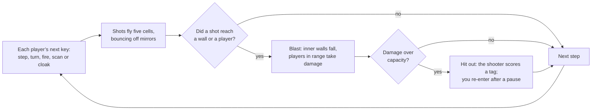

# How to play Hunt — Ricochet

## Goal

Tag as many rivals as you can and stay in the maze as long as you can. A match never ends by
itself: players are hit out, come back and carry on, as on the original’s server. When you have
had enough, open the pause menu (Esc) and choose **New match** or **Restart seed**; that ends the
match and reports it to the Hall. Your Hall score is the number of rivals you tagged.

## Setting up a match

The match setup is the game menu. Pick your options and press **ENTER THE MAZE**. Esc here takes
you back to the Hall. Every choice is remembered on this device. In a 1280×720 window the setup
scrolls, and ENTER THE MAZE sits below the fold.

## Controls

The Modern scheme is the default; the Classic scheme is the original program’s own keys. Choose
one under **Controls** on the setup. Either way, every action is a single original keystroke.

| Action                                   | Modern                                                      | Classic                | Mouse (Modern only)                       |
| ---------------------------------------- | ----------------------------------------------------------- | ---------------------- | ----------------------------------------- |
| Step left, down, up, right (never turns) | A S W D                                                     | h j k l                | —                                         |
| Face left, down, up, right               | ← ↓ ↑ →                                                     | H J K L                | Point where you want to face              |
| Shot (1 ammo)                            | Space or 1                                                  | f or 1                 | Left button                               |
| Grenade, 3×3 blast (9)                   | E or 2                                                      | g or 2                 | Right button                              |
| Satchel charge, 5×5 (25)                 | R or 3                                                      | F or 3                 | —                                         |
| Bomb, 7×7 (49)                           | 4                                                           | G or 4                 | —                                         |
| Bigger bombs, 9×9 to 19×19 (81 to 361)   | 5 6 7 8 9 0                                                 | 5 6 7 8 9 0            | —                                         |
| Bomb, 21×21 (441)                        | unbound; set in Controls                                    | @                      | —                                         |
| Slime, 5 / 10 / 15 / 20 ammo             | Z X C V                                                     | o O p P                | —                                         |
| Scan (1)                                 | Q                                                           | s                      | —                                         |
| Cloak (1)                                | F                                                           | c                      | —                                         |
| Pause and resume                         | Esc                                                         | Esc                    | Resume                                    |
| How to play                              | `?`                                                         | `?`                    | How to play, Help                         |
| Coach (ricochet preview)                 | `` ` ``                                                     | `` ` ``                | —                                         |
| Override panel                           | `\`                                                         | `\`                    | —                                         |
| Show or hide the scoreboard              | Tab, during a match                                         | Tab, during a match    | —                                         |
| Next view: 3D, split, terminal           | F2                                                          | F2                     | View, in the pause menu                   |
| Camera: overview or follow               | F3                                                          | F3                     | Camera, in the pause menu                 |
| How to re-enter, while you are hit out   | C, S or F                                                   | C, S or F              | Cloaked, Scanning, Flying                 |
| Sound on or off (see Settings)           | —                                                           | —                      | SOUND                                     |
| Leave for the Hall                       | Esc on the match setup                                      | Esc on the match setup | ← Back to the Hall on the Hall’s strip    |
| Start afresh on the match setup          | Shift+Tab to the Hall’s strip, from the setup or pause menu | The same               | Game menu on the Hall’s strip, then Leave |

- **Remapping.** Every Modern game key can be changed under **Controls** (on the setup or in the
  pause menu): click a binding, then press the new key; Esc cancels. The new keys are saved on this
  device. Esc, `?`, `` ` ``, `\`, Tab, F2 and F3 belong to the game’s menus and cannot be used.
  Classic keys stay as they are.
- **Typing ahead.** Up to three keys wait in line; one runs each step. A held step key repeats once
  per step.
- **The mouse** turns your drone toward the pointer, four ways only, with a small dead zone near the
  diagonals so it does not flicker. A click that needs a new facing turns first and fires on the next
  step.
- **Keyboard focus.** On the setup and in the pause menu, Tab moves between the buttons and out of
  the frame to the Hall’s strip (Shift+Tab goes the other way). In a running match Tab shows and
  hides the scoreboard instead, so press Esc first to reach the buttons. Esc on the setup leads back
  to the Hall.

## Rules

1. Time runs in steps, ten a second at Standard speed. In each step, every player’s next queued key
   runs: one step, one turn, one shot, one scan or one cloak.
2. **Stepping never turns you.** You see the cells around you, plus a three-cell-wide strip ahead
   and to each side, up to the first wall; never behind. What you have seen stays on your map, but
   a rival you remember disappears from it as soon as they move.
3. You fire only the way you face. Shots travel five cells per step. A mirror turns a shot through
   90° and flips to the other diagonal every time it does. A door (a swirling gate) sends a shot
   off in a random direction; players can walk through doors.
4. A shot explodes where it hits a wall or a player. Every blast knocks out the inner walls it
   covers; the border never breaks. At most 40 walls can be missing at once, and past that the
   oldest grows back, now and then as a mirror or a door. A wall that grows back under you throws
   you through the air.
5. A shot does 5 damage; a blast does 5 for each ring from its edge inward. You are hit out when
   your damage goes over your capacity, which starts at 10, so three shots are enough. Each rival
   you tag raises your capacity by 2 and heals 2. Hitting yourself or a teammate out costs you a
   tag.
6. Firing shows every player where you stand and which way you face. After three shots your gun is
   too hot to fire again until you take a step.
7. You enter with 15 ammo. Each time anyone enters, everyone already inside gets 5 more, and the
   newcomer gets 5 for each of them. Defusing a mine and catching a shot add more; nothing else
   refills you. Ask for something you cannot afford and you get the biggest thing you can.
8. Every entry drops one small and one large mine somewhere in the maze. Walk onto one facing
   forward and it goes off 2 times in 100; sideways, half the time; backing onto it, 95 times in 100. If it does not go off, you defuse it for 1 or 9 ammo.
9. Slime oozes ahead and to the sides, around walls but never through them, three cells for each
   ammo spent, and does 5 damage to anyone in every cell it reaches. One boot halves slime damage;
   the pair cancels it. There is one pair of boots in the maze.
10. A cloak hides you from scans (not from sight) for 20 of your own moves. A scan shows every rival
    who is not cloaked, wherever they are.
11. While you are hit out you watch the whole arena. After a short pause (20 steps, two seconds at
    Standard speed) you re-enter at a random spot: cloaked, scanning or flying, as you choose.

## Modes

Hunt has no daily challenge; the map seed on the setup decides the maze, so the same seed always
builds the same arena.

| Mode         | What changes                                                                                                        |
| ------------ | ------------------------------------------------------------------------------------------------------------------- |
| Free for all | Everyone against everyone.                                                                                          |
| Two teams    | Team 1 in yellow, team 2 in blue with a hollow marker. Teammates take full damage, and hitting one out costs a tag. |

| Arena    | What it is                                                                                                                 |
| -------- | -------------------------------------------------------------------------------------------------------------------------- |
| Classic  | The original maze generator as it was: no mirrors or doors until blown walls grow back.                                    |
| Veteran  | As if every wall had already been blown up and regrown once: a few mirrors and doors, mostly inside wall runs.             |
| Ricochet | The default: a maze with loops whose lone pillars become free-standing mirrors (about 57 per maze). Bank shots everywhere. |

| Bots         | How they play                                                                                                            |
| ------------ | ------------------------------------------------------------------------------------------------------------------------ |
| Novice       | Reacts three to six steps late, fires only in straight lines, rarely throws a grenade.                                   |
| Classic Otto | The original robot player, quirks and all. It follows walls, which works in Classic and sends it in circles in Ricochet. |
| Sharpshooter | Plans shots through the mirrors it remembers, aims ahead of a moving rival, sidesteps and hunts.                         |
| Mixed        | The default: Otto, Novice and Sharpshooter in turn.                                                                      |

Every bot plays fair: it knows only what its own screen shows and types keys like you do.

## Settings

| Setting  | Options                                                  | Default                                   |
| -------- | -------------------------------------------------------- | ----------------------------------------- |
| Name     | Up to ten characters                                     | you                                       |
| Bots     | 1 to 8                                                   | 4                                         |
| Map seed | Any whole number, or Random                              | 1985                                      |
| Speed    | Relaxed (8 steps a second), Standard (10), Frantic (14)  | Standard                                  |
| Enter as | Cloaked, Scanning, Flying                                | Cloaked                                   |
| Controls | Modern (WASD and mouse), Classic (hjkl)                  | Modern                                    |
| View     | 3D, Split (terminal beside the 3D follow view), Terminal | 3D                                        |
| Camera   | Overview, Follow                                         | Overview                                  |
| Quality  | Auto, High, Low                                          | Auto                                      |
| Sound    | On, Off                                                  | Off (in the Hall, as the Hall’s sound is) |

Auto quality starts High on a graphics card and Lite on a software renderer, and steps down if the
frame rate stays low. Without WebGL the game plays in the terminal view. Hunt follows the Hall’s
reduced-motion setting as soon as you change it (on its own, your system’s, when it starts): no
camera shake, no colour fringing on big blasts and a gentler flash when you are hurt. In the Hall
its sound follows the Hall’s: on at the Hall’s volume from your first click or key in the game,
silent while the Hall is muted, and SOUND still works during the visit. On its own it starts
silent. A match does not pause by itself when the Hall pauses or the tab is hidden; press Esc to
pause it. It has one dark look; the Hall’s strip follows the Hall’s light or dark appearance.

## Coach and Override

The **Coach** (`` ` ``) draws the path your next shot would take for your current facing and
weapon: every bounce, every mirror flip the shot itself would cause, the blast square of heavier
ordnance, and a warning when the shot would come back at you or enter a door. It knows the walls,
never the rivals you cannot see, and it does not affect your score.

The **Override** panel (`\`) is the game’s cheat layer: no damage to you, unlimited ammo, every
mine shown, the whole maze lit, frozen bots, slow motion, instant re-entry. Turning any of them on
marks your score as cheated for the rest of the match. In the Hall such a match still counts as a
session, but it reports no score, no tags and no XP for tags, and earns no packages from that
moment on.

## Scoring

The Hall’s score for a match is the number of rivals you tagged (teammates and yourself do not
count). The game’s own scoreboard ranks players the way the original did, by tags per entry, where
an own goal takes a tag away and, after fifteen entries, older tags slowly count for less. Each
row also shows tags and times hit out.

The game’s own screens still use harsher words for all this: they count kills, keep a kill feed
and print the original’s messages for each hit-out. A later update will reword them; see
[NOTES](NOTES.md#open-questions).

## Achievements (packages)

| Package           | How to earn it                                                               |
| ----------------- | ---------------------------------------------------------------------------- |
| `first-tag`       | Tag a rival for the first time.                                              |
| `bank-shot`       | Bounce one of your shots off a mirror.                                       |
| `defuser`         | Step on a mine and turn it into ammunition.                                  |
| `wall-breaker`    | Launch a seven-by-seven charge or bigger.                                    |
| `green-tide`      | Send out a wave of slime.                                                    |
| `hat-trick`       | Tag three rivals without being hit out in between.                           |
| `good-shield`     | Catch a charge you were facing.                                              |
| `two-boots`       | Pick up the second boot of the pair.                                         |
| `ace-tamer`       | Tag a Sharpshooter bot (they are the ones named “ace”).                      |
| `top-board`       | Lead the scoreboard with five tags or more while four or more rivals are in. |
| `hall-of-mirrors` | Bank one shot off three mirrors or more.                                     |
| `lift-off`        | Get thrown when a wall grows back under your feet.                           |

## XP

Each match you end from the pause menu reports to the Hall as a completed session. On top of the
session’s XP it earns 3 XP for every rival you tagged, up to 25; the Hall caps a session’s extras
at 30. Leaving mid-match through the Hall’s strip sends no result, like quitting. Weekly goals can
ask you to tag a number of rivals (10 to 30) or to bank a number of shots off mirrors (3 to 10);
a bank shot counts once for each of your shots that bounces off at least one mirror.

## Tips

- Face where you are going. Backing onto a mine sets it off almost every time.
- Fire with a purpose: every shot tells the whole maze where you are.
- After three shots, take a step before you need your gun again.
- In the Ricochet arena, turn the Coach on for a while to learn how mirrors flip after each hit.
- Slime finds its way around corners; roll it down a corridor you cannot see into.
- A cloak hides you from scans, not from eyes. Re-enter scanning when you want to find people fast.
