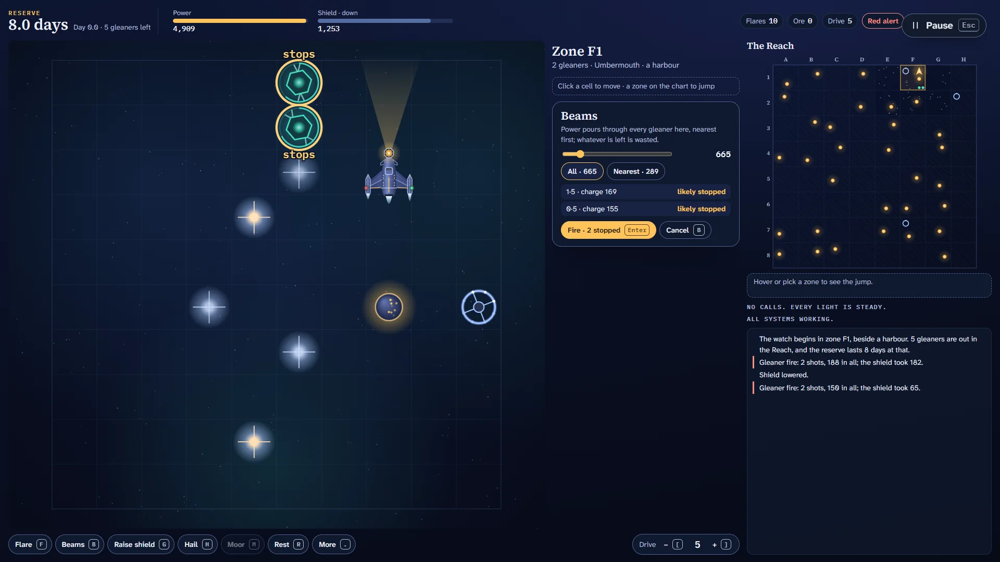

# Lightkeeper

> Thirty-two lit worlds, one ship, and a swarm that will not wait.

## The hook

You keep the Lantern, the only ship watching over the Reach: eight by eight zones of space and
thirty-two inhabited worlds, each a warm light on your chart. Gleaners, self-replicating mining
drones, have settled in the Reach. When they reach a world it sends out a call, with a deadline.
Answer in time and the world is safe; miss it and its light goes out, and the gleaners turn it into
a forge that builds more of them.

The clock is the swarm's own: a reserve that drains a little for every gleaner still out there,
every day. Every gleaner you stop makes the reserve last longer, and the figure at the top of the
screen jumps up to prove it. Every order costs power or time, and the gleaners answer every one of
them: they close in, fire, tire, and drift away to the next zone.

## Where it comes from

`trek` is Eric Allman's space game from the BSD games. He wrote it in C at Berkeley in May 1976,
with help from Jeff Poskanzer and Pete Rubinstein, after a FORTRAN game by David Matuszek and
Paul Reynolds and the BASIC game before it. You typed commands at a terminal and read the galaxy as
a grid of letters.

Its source holds far more than its manual says. The clock was never a fixed number of days: it was
a pool of resources shared by the enemy, so stopping one bought time. Inhabited systems sent
distress calls and, if nobody came, were taken and started producing new enemies, which spilled
into the next quadrant when theirs was full. Starbases came under siege. A damaged radio meant the
calls still happened, unheard, and came in all at once when it was fixed. The game kept snapshots
of the galaxy, and flying past warp nine could throw you back to one. A tournament password seeded
the whole galaxy so that two players could play the same one. Winning with a clean record promoted
you one skill level, up to Commodore Emeritus.

## What is new

- **The Reach as a chart of lights.** Every world is a light; calls pulse with their deadlines,
  dark worlds glow with a cold forge, and the end of a watch is the chart of what you kept.
- **A career of six ranks,** from Cadet to High Warden, each adding one idea: calls, then sieges
  and hailing, then a fragile radio and long-range snares, dying stars and flare spreads, a reactor
  that no longer recharges in flight, and finally a single harbour and the redline. Promotions use
  the original's own rule: a win worth 1,000 points with a clean record. Ranks are never taken away.
- **Aim, don't type.** Click a cell to move, a zone on the chart to jump, and see every order's
  cost, path and risk before you give it. Flares show their track and how far they may stray; beams
  show which gleaners a volley will likely stop.
- **Tonight's watch.** The original's tournament codes became a nightly watch, the same Reach for
  everyone, and open watches where any code you type gives everyone the same galaxy.
- **The 1976 rules in full,** every event from the first watch at the original numbers, for anyone
  who wants the game as it was.
- **A keeper's ship of our own.** The Lantern is a slim corvette with swept radiator wings, an
  engine pod at each wingtip and a lighthouse lamp room in her bow, whose light leads her across
  every zone; the old Ember is a boxy, patched tender.
- **Nobody dies.** Gleaners are machines; a stopped one simply goes dark, and a lost ship means the
  crew rowing home in the boats.

## At a glance

|                 |                                              |
| --------------- | -------------------------------------------- |
| Directory       | `/usr/games/strategy`                        |
| Players         | 1                                            |
| Session         | 10–25 minutes                                |
| Daily challenge | yes (Tonight's watch)                        |
| Inspired by     | `trek` (1976)                                |
| Also here       | `trek` — Trek: Deep Space, the typed 3D port |

## More

- [How to play](HOW-TO-PLAY.md)
- [Changes from the original](CHANGES-FROM-ORIGINAL.md)
- [Architecture](ARCHITECTURE.md)
- [Notes](NOTES.md)
