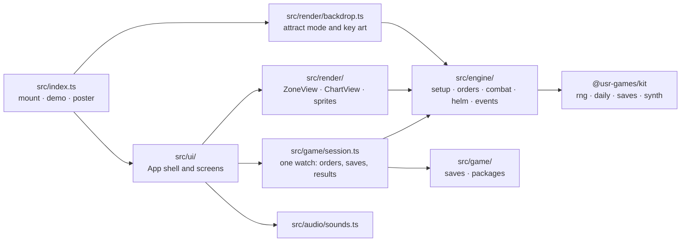
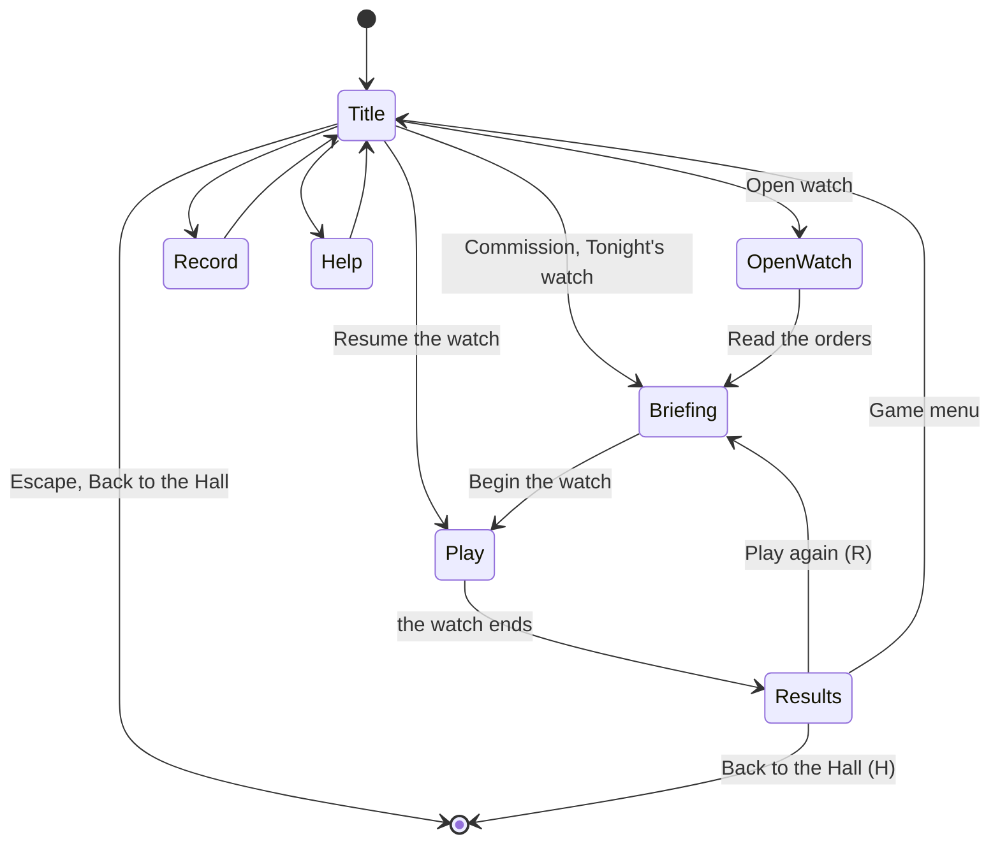
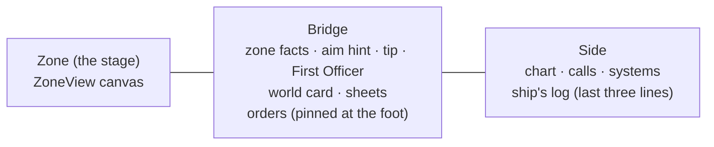
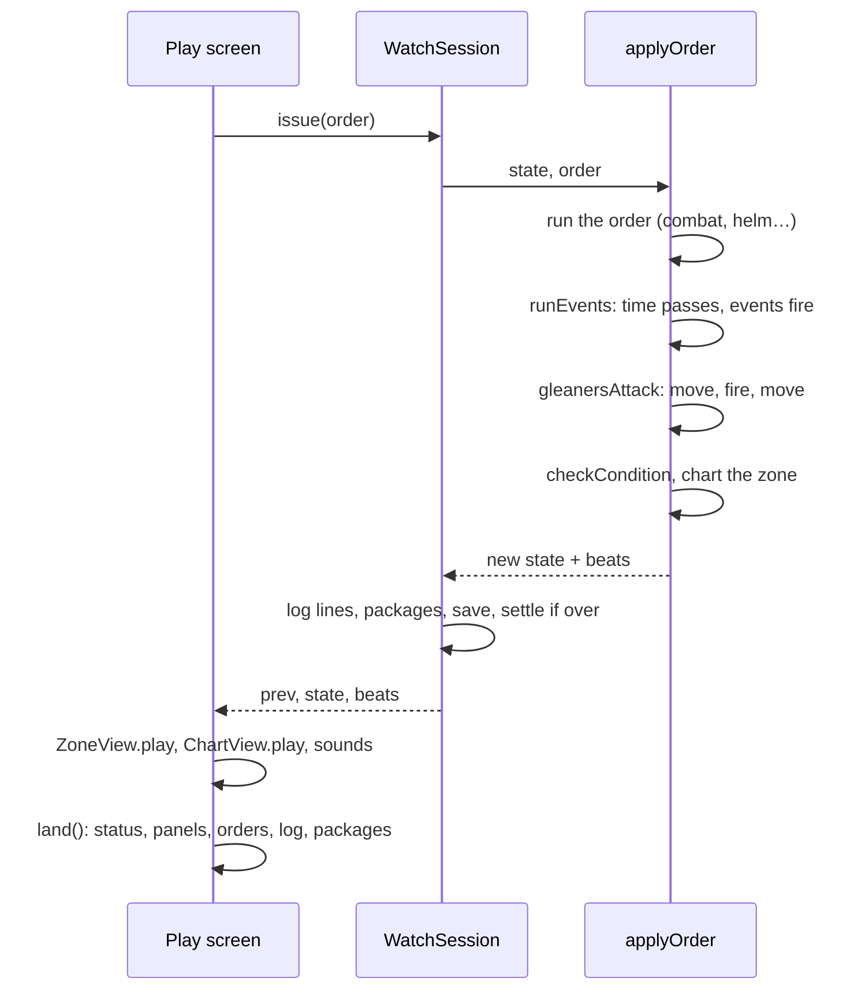

# Lightkeeper — architecture

## Overview

Lightkeeper is a **native** game: strict TypeScript against the kit contract, mounted by the Hall
from `src/index.ts`. The zone and the chart are drawn with Canvas 2D (no WebGL, no raster files);
the panels and menus are plain DOM. The rules are a pure engine (about 2,000 lines) that follows
the 1976 program's C source closely; the screen only animates what the engine reports.

## Module map

| Path                        | Responsibility                                                                                                                     |
| --------------------------- | ---------------------------------------------------------------------------------------------------------------------------------- |
| `src/index.ts`              | The kit contract: `mount`, `demo`, `poster`, `achievements`                                                                        |
| `src/engine/types.ts`       | The whole watch as plain JSON: zones, cells, gleaners, ship, event list, tally                                                     |
| `src/engine/params.ts`      | Ranks, rule sets, the original's numbers by skill, and the career's tuning (`CAREER_TUNING`)                                       |
| `src/engine/setup.ts`       | `newWatch`: harbours, worlds, swarm and first events from a seed                                                                   |
| `src/engine/orders.ts`      | `applyOrder`: the captain's orders and the original's play loop around them                                                        |
| `src/engine/combat.ts`      | Gleaner volleys and moves, beam banks, flares, novas, dying stars, rams                                                            |
| `src/engine/helm.ts`        | Moving: drive, thrusters, the Rim, black holes, snares, the redline and its time portals                                           |
| `src/engine/events.ts`      | Time passing: the reserve, calls, sieges, forges, snapshots, repairs, the radio backlog                                            |
| `src/engine/schedule.ts`    | The event list and system damage                                                                                                   |
| `src/engine/losses.ts`      | Gleaners stopped, harbours and worlds lost, calls answered                                                                         |
| `src/engine/zone.ts`        | Entering a zone, its fixed layout, distances, the chart's memory                                                                   |
| `src/engine/score.ts`       | The score sheet, the promotion rule, the lights                                                                                    |
| `src/engine/preview.ts`     | The computer's previews: courses, costs, flare tracks, beam outcomes, known calls                                                  |
| `src/engine/bot.ts`         | The steady captain, for simulations, the attract mode and the dev autopilot                                                        |
| `src/engine/beats.ts`       | What happened during an order, as data; the only thing the screen hears from the engine                                            |
| `src/game/session.ts`       | A watch in play: applies orders, keeps the log, saves after every order, settles the result                                        |
| `src/game/saves.ts`         | Career, gazetteer, nights, open-watch settings, the watch in progress, preferences; seeds                                          |
| `src/game/packages.ts`      | The twelve packages and when beats or the end of a watch earn them                                                                 |
| `src/data/worlds.ts`        | The thirty-two worlds and their gazetteer lines                                                                                    |
| `src/render/`               | `ZoneView` (the zone and its animations), `ChartView` (the Reach), the ships, sprites, palettes, the menu's hero ship and backdrop |
| `src/render/flare-guide.ts` | The flare preview's geometry (the bearing line and its stray wedges), drawn by `ZoneView` and checked by the tests                 |
| `src/ui/`                   | The `App` shell, screens, the log's words (`copy.ts`), styles                                                                      |
| `src/audio/sounds.ts`       | Synth patches and which beats play them                                                                                            |
| `scripts/`                  | Developer tools: simulations, traces, workbench screenshots (not shipped)                                                          |
| `dev/`                      | The workbench on port 5300: the game against a stand-in Hall                                                                       |

## Screens

## The play screen

`src/ui/screens/play.ts` builds three grid columns (`.lk-play` in `styles.css`): the zone takes
what is left, the bridge `clamp(270px, 20vw, 380px)`, the side `clamp(300px, 25vw, 480px)`. The
bridge's notes scroll above the orders when they overflow (and take the focus then, so a keyboard
can scroll them). Three media queries tune it: at 1,000 px tall or more the orders stand in one
column; under 800 px tall the standing hints hide and the First Officer steps back while an order
is aimed; under 1,180 px wide the side drops below (chart beside calls and log) and the other
rows take their content's height while the screen scrolls; under 960 px everything stacks. The
status bar wraps its chips under the meters when its row is short. The whole
log is a dialog over the screen (`lk-log-full`): one `section` per order with an `h3` and an
ordered list; while it is open the rest of the screen is `inert`, and closing it gives the focus
back to whatever opened it.

## One order

Every order follows the loop the original ran after each command. The state given to
`applyOrder` is never changed: the order works on a copy, and a refused order returns the old
state with a single `refused` beat.

An order **lands** when its animation ends (`land()` in `play.ts`). Until then the status bar, the
zone's facts, the world card, the calls, the orders and the log keep showing the state before the
order (`landing.prev`), and packages earned during the order wait too, so the Hall's notes never
cover the moment. A key or a click, or the next order, lands it at once.

The original ended a game with a `longjmp`; the engine throws `EndOfWatch` from wherever the watch
ends and `applyOrder` records the outcome. The random stream is the kit's sfc32, kept in the state
so a saved watch resumes exactly. A zone's layout is drawn from its own seed the first time anyone
looks, so the same code shows the same Reach whatever route a player takes.

## Rendering

- **Beats to animation.** `ZoneView.play(prev, next, beats)` builds a light _scene_ (the zone's
  things and positions) and walks the beats on a timeline: the ship's path, gleaners sliding,
  bolts, beams, flares, novas, stopped gleaners powering down, jumps with streaks. When a jump lands
  in a new zone the scene is rebuilt _as of the arrival_ by undoing the later gleaner beats on the
  final state (`sceneAtArrival`). At the end the scene settles on `next`. Any key or click skips.
- **A world saved.** A `world-relit` beat earned by the Lantern in her own zone schedules the
  bloom 0.3 s after the shots land (`MOMENT_SECONDS`, 1.5 s; `STILL_MOMENT_SECONDS`, 1.2 s, under
  reduced motion): `bloom()` draws the light, the rings, the world lit and its name, and
  `camera()` leans the view in (at most 1.16×, clamped so the canvas edge never shows; none under
  reduced motion). `lastMomentAt` tells the play screen when to sound the chime and tells
  `ChartView.play` when to close the call ring (`closeCall()`).
- **The flare preview** is drawn from `flareGuide()` (`render/flare-guide.ts`): a straight line on
  the bearing, ending level with the cell the flight meets or at the board's edge, inside the
  ±scatter wedge; a spread of three adds two faint wedges. In the Chart look `wedge()` hatches in
  ink with a darker edge.
- **The Lantern** is drawn at 1.32 cells (`SHIP_SCALE`); `ShipLook.beamsReady` lights the emitters
  (`drawEmitters()` in `render/sprites.ts`) and the shield has two counter-turning sheens.
- **Looks.** `render/palette.ts` holds both looks for the canvas: the Chart (paper, navy ink,
  amber) and the Night Watch (deep blue, warm lamp, teal drones). The CSS mirrors them as `--lk-*`
  properties under `.lk-root[data-look]`. Reduced motion freezes the idle time and shortens and
  flattens every animation.
- **Where things are drawn:** the Lantern and the Ember in `render/ship.ts` (the big one on the
  game menu in `render/hero.ts`); gleaners, stars, black holes, worlds, harbours, the shield, the
  lamp's light and the chart's lights in `render/sprites.ts`; zone backgrounds (starfield and nebula, or paper and compass rose)
  and every effect in `render/zone-view.ts`; the chart in `render/chart-view.ts`.
- **Sounds** are kit synth patches in `audio/sounds.ts`, one per kind of beat, spread over the
  animation.

## Saves

All through `context.save`, versioned, scoped to `lightkeeper`: `career`, `gazetteer`, `nights`,
`open`, `active` (the watch in progress, written after every order and cleared when it ends) and
`prefs`.

## Tests

| What                                                                                                                                                                             | Where                                                                      |
| -------------------------------------------------------------------------------------------------------------------------------------------------------------------------------- | -------------------------------------------------------------------------- |
| Rules, setup, orders, previews, score                                                                                                                                            | `src/engine/engine.test.ts`                                                |
| The career curve on fixed seeds                                                                                                                                                  | `src/engine/balance.test.ts`                                               |
| Our own words; the manifest and packages                                                                                                                                         | `src/content.test.ts`                                                      |
| The flare preview's geometry against the engine's flight                                                                                                                         | `src/render/flare-guide.test.ts`                                           |
| In the Hall (menu, a volley, results, resume, ways out)                                                                                                                          | `e2e/lightkeeper.spec.ts`                                                  |
| The log drawer, the saved-world moment (played, skipped, reduced motion), the flare preview against its card, the results card at 1280×720 and 1920×1080, axe on the play screen | `e2e/polish.spec.ts`                                                       |
| Documentation screenshots                                                                                                                                                        | `e2e/shots.spec.ts` (`SHOTS=1`)                                            |
| The polish pass's before-and-after frames                                                                                                                                        | `e2e/polish-shots.spec.ts` (`SHOTS=1`), with `docs/media/polish/POLISH.md` |

Run them with `pnpm vitest run --project lightkeeper` and
`pnpm exec playwright test -c games/lightkeeper` (the suite starts its own Hall on port 5301).

## Developer tools

- `pnpm --filter @usr-games/game-lightkeeper dev` — the workbench on port 5300
  (`?look=night`, `&fresh=1`, `&rank=N`, `&go=commission|daily|open|record|help`).
- `tsx scripts/sim.ts [runs] [rules] [length]` — the steady captain over many watches per rank.
- `tsx scripts/rates.ts <rank> <runs>` — win and promotion rates on the balance seeds.
- `tsx scripts/trace.ts <rank> <seed>` — one watch, order by order.
- `tsx scripts/shot.ts <out.png> <path> [w] [h] [steps]` — a workbench screenshot after scripted
  steps; `auto:<n>` runs the development autopilot (`window.__lightkeeperAutopilot`, present only
  in development builds). Development builds also expose `__lightkeeperState`,
  `__lightkeeperBlooming` (the world blooming right now, or null) and `__lightkeeperFlareGuide`
  (the flare preview as drawn) for the e2e tests.
- `tsx scripts/find-rescue.ts` — finds open-watch codes where the autopilot saves a world in the
  Lantern's zone (`lantern-rook` does on its eleventh order), for the moment's tests and pictures.

## Kit candidates

- A tiny element builder (`ui/dom.ts`) shared with Zoomies' shape.
- `decorRandom` and `hashOf` (`render/palette.ts`) for decoration that must never touch a game's
  rules stream.
