# Lightkeeper — polish P1-L, before and after

The owner's checkpoint for prompt P1-L (§4). The "after" frames are 1920×1080 inside the Hall
(Console Home), in Chart (light) and Night Watch (dark), from `e2e/polish-shots.spec.ts`:
`SHOTS=1 HALL_PORT=5281 pnpm exec playwright test -c games/lightkeeper polish-shots`. The "before"
frames are the consolidation review's (`docs/media/review/lightkeeper/`), copied here so this page
stands on its own. The review did not shoot the results screen or the flare preview, so those two
"before" frames are the game's own 1280×720 documentation shots from before this pass.

No rule or balance changed. Every change is in `src/render/`, `src/ui/`, `src/audio/` and the
game's own e2e and scripts; `src/engine/` is untouched, and its golden runs still pass.

## 1. A world worth saving

| Before                                                                               | After                                                         |
| ------------------------------------------------------------------------------------ | ------------------------------------------------------------- |
| 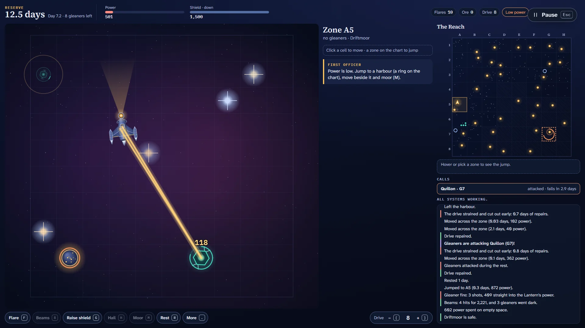 | 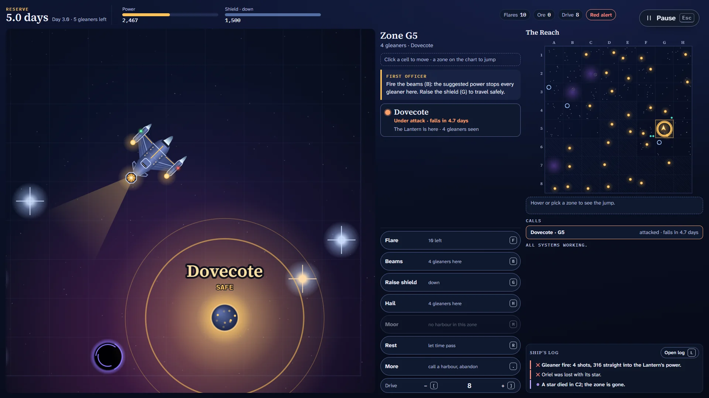 |
| 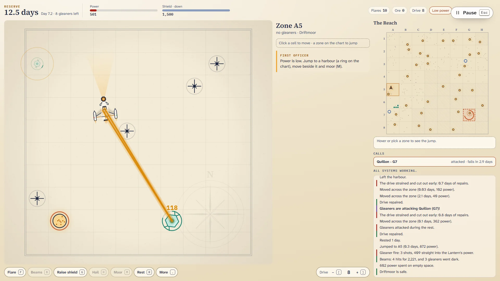                | 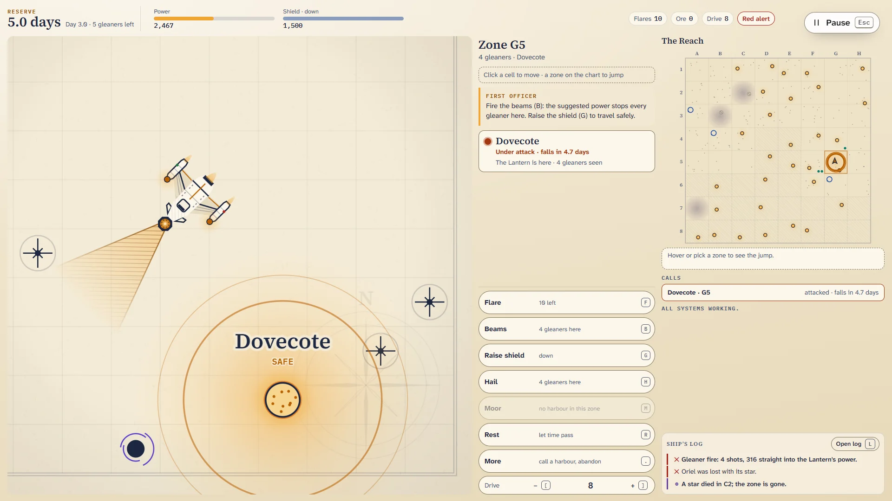       |

The order that stops a zone's last gleaner now plays in three beats.

1. **The shots land.** Beams or a flare, exactly as before, and the gleaners leave.
2. **The world blooms** 0.3 s later, for 1.5 s: light swells out of it with two rings, the world is
   drawn lit, and its name rises above it in the display face with SAFE under it (the name drops
   below the world when the world sits in the top row). The view leans in: up to 1.16× closer, and
   a world near an edge is drawn towards the middle, though never so far that the canvas edge
   shows. On the chart, the zone's call ring sweeps closed in lamp colour and pings. The chime
   sounds as the bloom starts.
3. **Then everything catches up.** The status bar, the zone's facts, the First Officer, the world
   card, the calls, the orders and the log all keep showing the moment before the order until the
   bloom has played. So do the Hall's achievement notes, which used to cover the moment. In the
   frame, Dovecote's card still reads "Under attack" and the orders still count four gleaners.
   That is by design: it all turns a moment later.

Any key or click lands the order at once. Under reduced motion the bloom is a still highlight with
the name for 1.2 s, and the view does not move.

## 2. A calmer play screen

| Before                                                       | After                                                        |
| ------------------------------------------------------------ | ------------------------------------------------------------ |
| 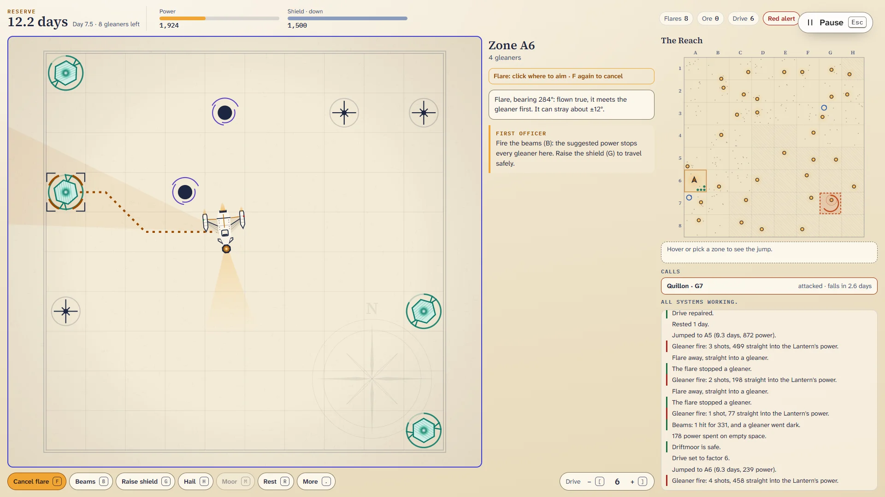 | 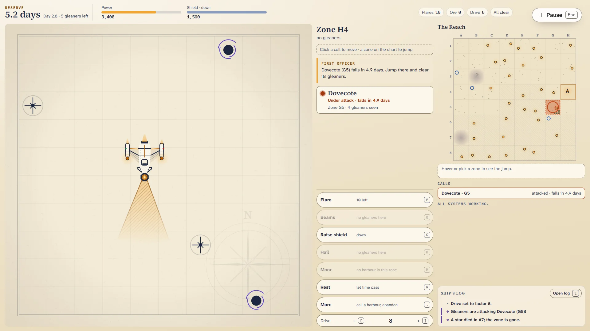 |
|           | 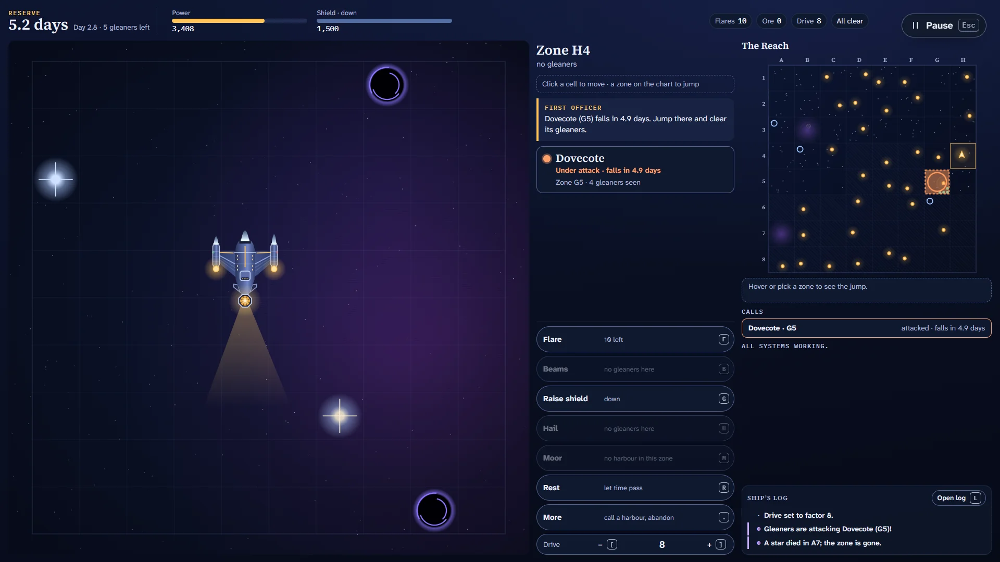                  |

- **The zone is the stage.** It takes the full height at the left. The middle column (the bridge)
  holds the zone's facts, the hint for an order being aimed, the First Officer and the world card,
  with the orders at its foot. The right column holds the chart, the calls under it, the systems
  under repair and the ship's log.
- **The world card** shows the world the player is looking at on the chart, otherwise the one in
  the Lantern's zone, otherwise the world of the most urgent call (here Dovecote, falling in
  4.9 days). It gives the world's light as the crew knows it (a coloured dot plus words) and what
  is known about the zone.
- **The ship's log** shows its last three lines, newest first. Each line has a mark (✓ good,
  ✕ harm, ! warning, ◉ radio, · note) as well as a colour, so no status depends on colour alone.
  **Open log** (`L`) shows the whole watch over the play screen, one "Order N · day X" heading per
  order. It is a dialog with headings and ordered lists for screen readers; `L` or `Esc` closes it.
- **The orders** each carry a word on what they would do right now: "9 left", "4 gleaners here",
  "up · travel costs double", "fly beside the harbour", "repairs and recharge". On a screen 1,000 px
  tall or more they stand in one column; on shorter screens they sit two to a row (see §6).
- **The Lantern** is drawn 1.32× larger. Its beam emitters glow at the pod tips while the beams can
  fire (not moored, not shrouded, power left, beams not down). The shield has a second sheen
  turning against the first.

## 3. The results card

| Before (1280×720)                                              | After                                                            |
| -------------------------------------------------------------- | ---------------------------------------------------------------- |
| 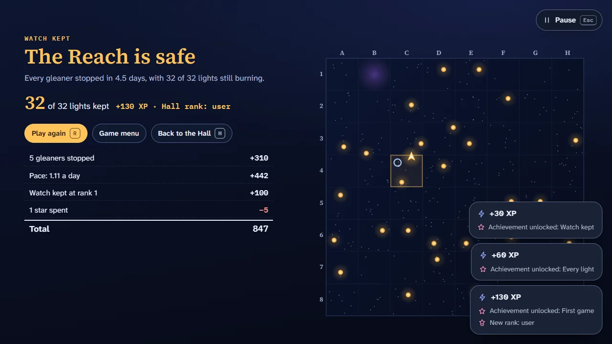 | 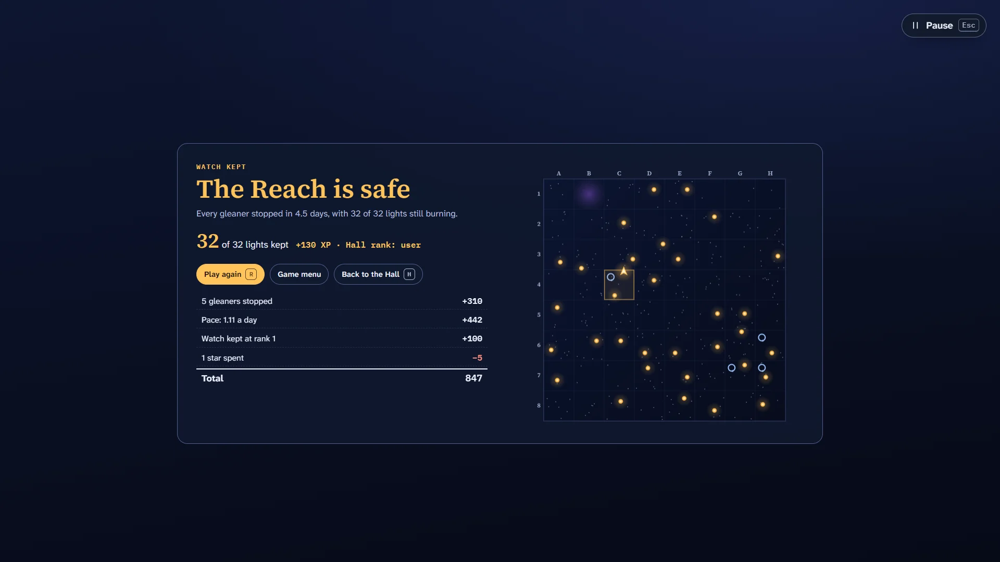 |
| 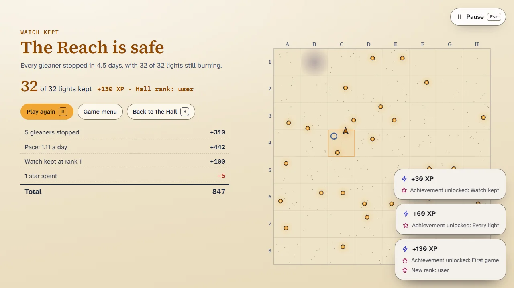       | 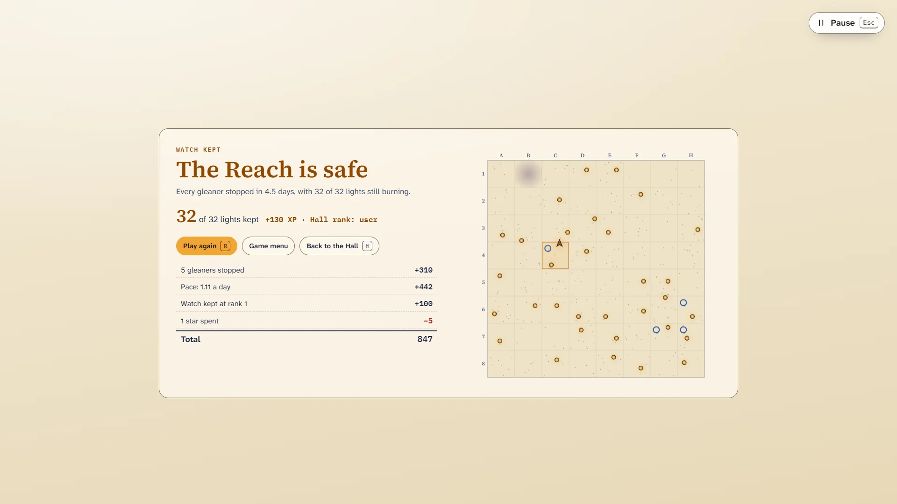       |

At 1920×1080 the score used to fill only the top left. Now it is one centred card: words, score,
buttons and the score lines on the left, the chart of the watch on the right, at most 1,240 px
wide. Below 960 px wide the two halves stack. (In the "before" frame the Hall's achievement notes
sit over the chart. They still appear on results, which is the Hall's normal behaviour.)

## 4. The flare preview agrees with itself

| Before (1280×720)                                                    | After                                                        |
| -------------------------------------------------------------------- | ------------------------------------------------------------ |
| 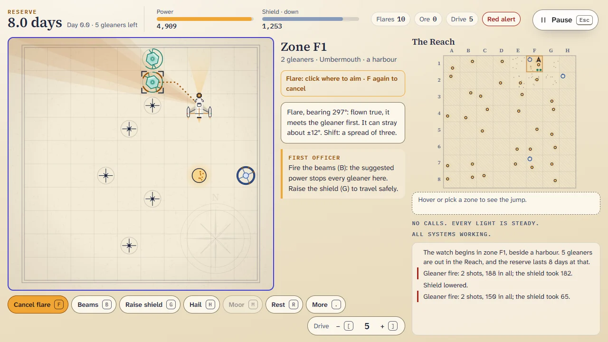 | 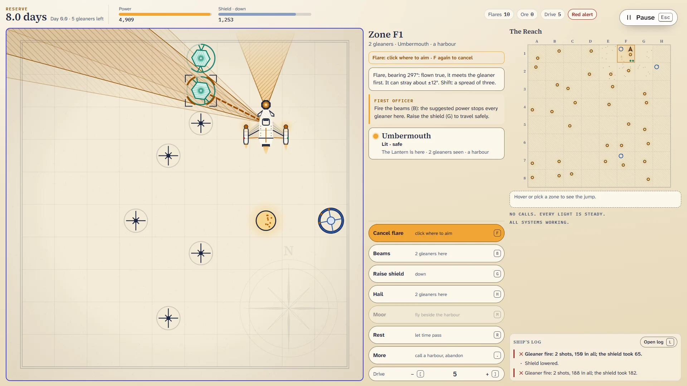 |
| 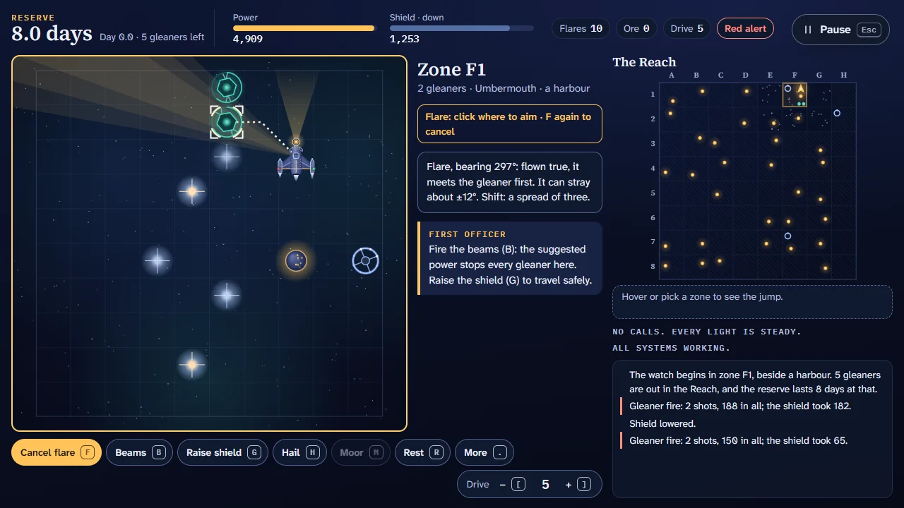                 | 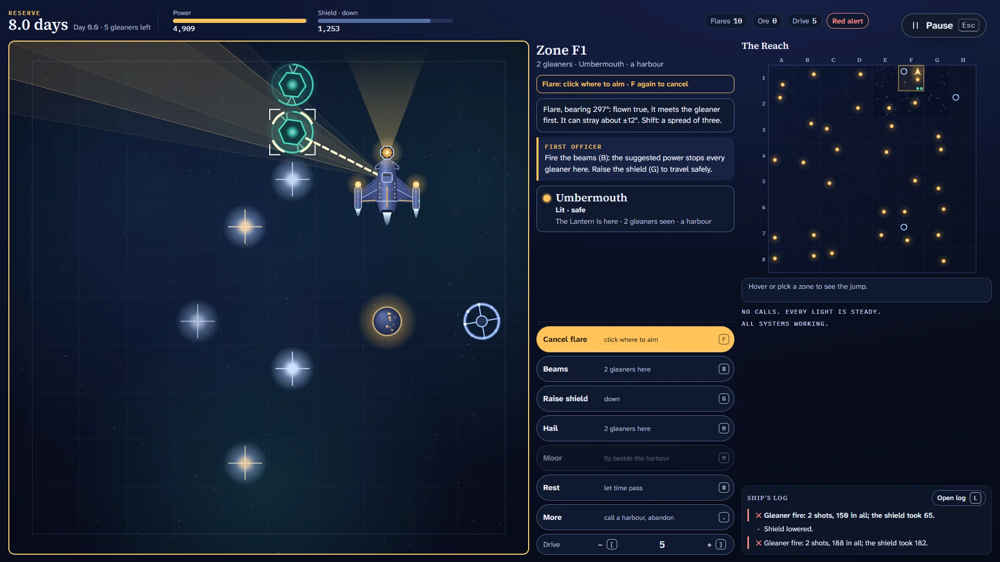                 |

The flight is drawn as the card describes it: a straight dashed bearing to the first thing it meets
(or the board's edge), inside the ±12° stray wedge. The stair-stepped cell path is gone. With the
spread-of-three rule the two outer flares' wedges are drawn faint, so the aimed one stays clear. In
Chart the wedge is ink-hatched with a darker edge, so it reads as well as Night Watch's glow.

## 5. Chart's lighthouse beam

| Before                                                      | After                                             |
| ----------------------------------------------------------- | ------------------------------------------------- |
| 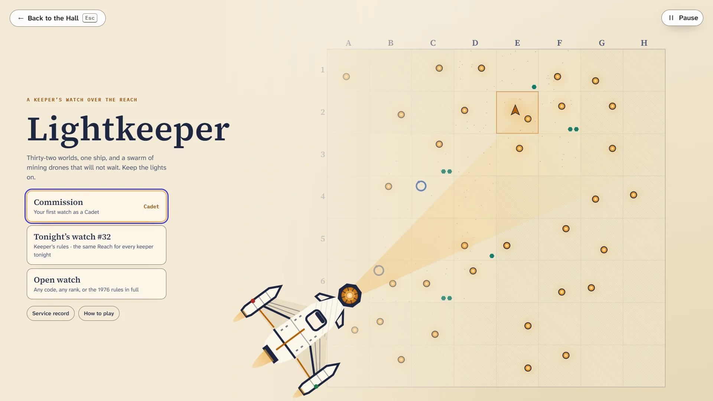 | 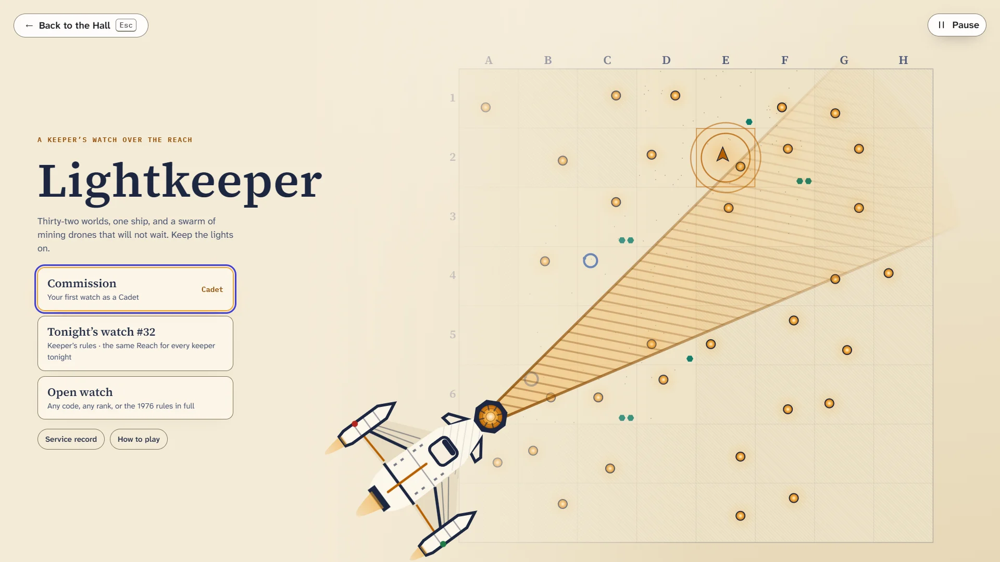 |

The menu's beam in Chart is now a stronger fill with ink hatching and darker edges. The lamp cone
in play has the same treatment. Night Watch is unchanged ([its menu](before-title-night-1920.webp)).

## 6. On a short screen (1280×720)

| Chart                                            | Night Watch                                            |
| ------------------------------------------------ | ------------------------------------------------------ |
| 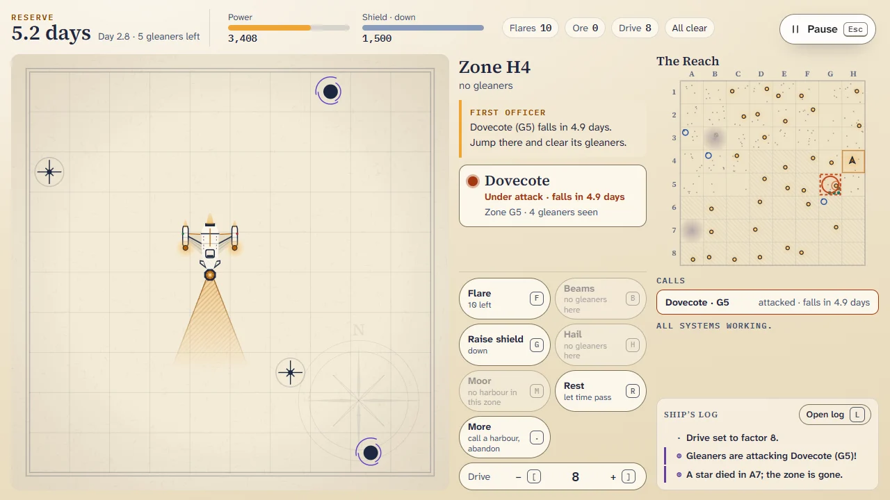 | 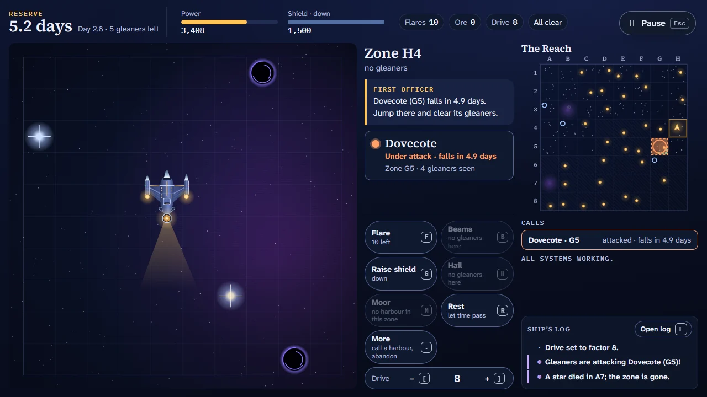 |

The orders stay in reach at the foot of the bridge. If the words above them do not fit (a flare
being aimed, a sheet open), those words scroll instead. Below 800 px tall, the standing "click a
cell to move" hint gives its room to the world card. The hints for an order being aimed still show.

## Critique rounds

1. **First full frames.** The play screen did not fill the height: a `position: relative` on the
   grid overrode the screen's absolute fill. The Hall's achievement notes landed on top of the
   bloom, so package installs made during an order are now held until it lands. The bridge had a
   gap above the orders.
2. **Filling the bridge.** The world card fell back to nothing in an empty zone; it now shows the
   most urgent call's world. Each order gained its one-line note. The chart grew (up to half the
   screen's height). The full-log dialog and the hatched flare wedge were checked in both looks.
3. **Short screens and the moment.** At 1280×720 the orders were pushed below the fold, so the log
   moved under the calls and the orders were pinned to the bridge's foot. The view's lean towards
   a saved world could bare the canvas edge; it is now clamped. The spread-of-three wedges were as
   strong as the aimed one, so the outer two are now faint. "No harbour near" contradicted "a
   harbour" in the zone's facts and now reads "fly beside the harbour". On tall screens the orders
   went to one column, which closed most of the bridge's gap.
4. **Consistency.** At 1280×720 the world card was cut off, so the standing helm hint now hides
   below 800 px tall. During the bloom the orders already said "no gleaners here" while the zone's
   facts still said four, so the orders now wait for the landing like every other panel. I briefly
   let the world card turn as the bloom starts, then reverted it to follow the brief ("only after
   that the panel and the log update"). See question 2.

## For the owner

1. **The log's home.** The brief places the calls under the chart and the First Officer and the
   world card in the middle column, but does not place the log. It sits under the calls, at the
   foot of the right column, because that keeps every order visible at 1280×720. Keep it there?
2. **When the panels turn.** As briefed, the world card, calls, orders and log change only after the
   bloom, so a still frame mid-bloom shows "SAFE" over the world beside a card that says "Under
   attack". The alternative is to turn the world card and the calls as the bloom starts and keep
   only the log and the score for the landing. That is a one-line change. Which do you prefer?
3. **The Hall's Pause pill** still shows on the game menu and the results screen. That is the
   Hall's to fix (P1-Z §4). The status bar keeps the top-right 220 × 64 px clear as asked.

## The owner's answer

Approved on 2026-10-02 ("ok, approved."), with no change asked. So the log stays under the calls,
and the panels keep turning after the bloom.

Small changes after the approval, found while writing the tests, all shown in the frames above:

- The flare line now keeps the bearing exactly and stops level with the cell the flight meets.
  Drawing it to that cell's centre had bent it by a degree or two from the card's bearing.
- Under 800 px tall, the First Officer steps back while an order is being aimed, and the chart's
  standing "hover or pick a zone" hint hides, so two calls fit above the log.
- When the bridge's notes overflow, they take the focus so a keyboard can scroll them (axe asked
  for this). While the whole log is open the screen behind it is inert, and closing the log gives
  the focus back to whatever opened it.
- Narrower screens work again. Under 1,180 px wide the zone and the bridge fill the screen and the
  chart, the calls and the log follow a scroll below, side by side; under 960 px everything stacks.
  The status bar wraps its chips under the meters instead of letting them overlap. Checked at
  2560×1440, 1200×760, 1024×768 and 800×900.
