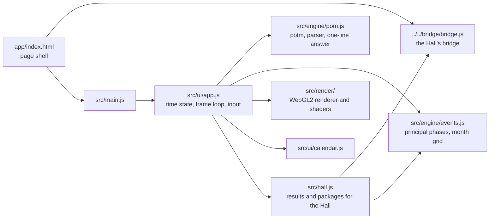
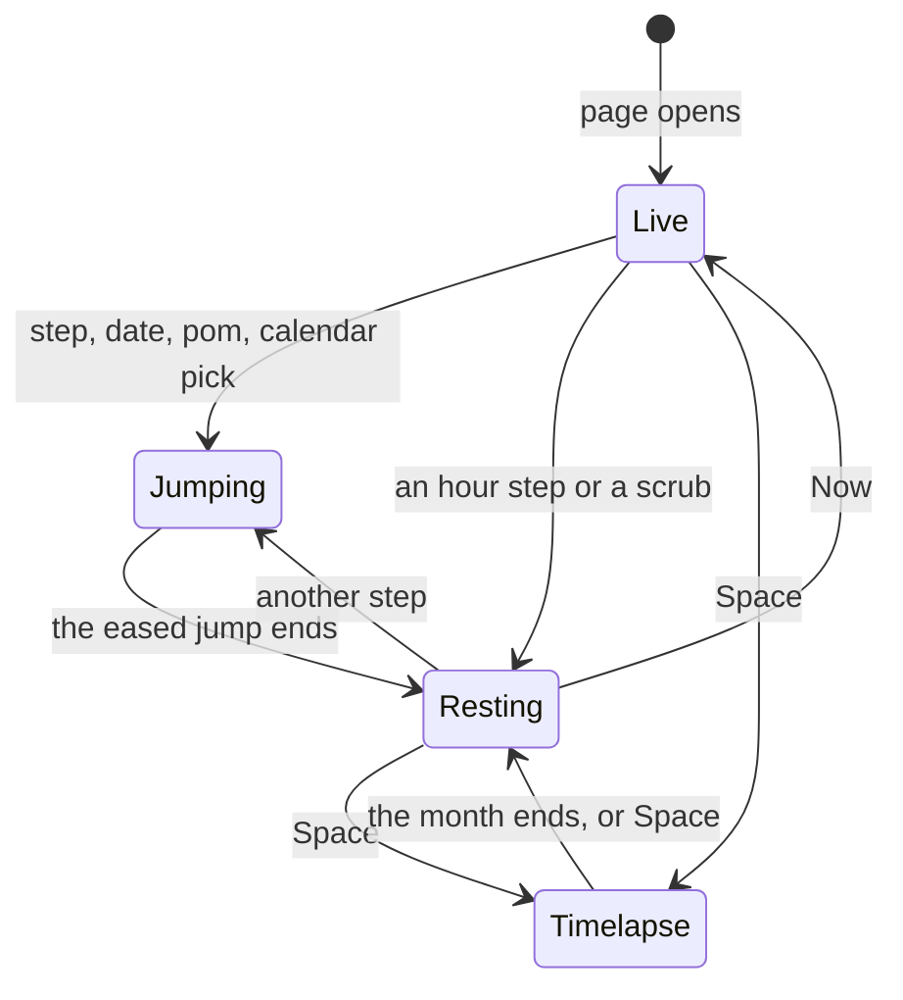

# Selene — architecture

## Overview

Selene is a **hosted** game: the finished port the owner built earlier (`pom`, fancy-web), adopted
as it was into `games/pom/app/` and run by the Hall in a same-origin frame at `play/pom/`. It is
plain ES modules with no build step, drawn with raw WebGL2 and GLSL; the engine is a faithful
JavaScript port of the original C program. The upstream design notes are kept in
[`../app/docs/architecture.md`](../app/docs/architecture.md) and its decisions in [`adr/`](adr/).

## Module map

| Path                       | Responsibility                                                                |
| -------------------------- | ----------------------------------------------------------------------------- |
| `app/index.html`           | The page: canvas, readout, toolbar, dock, calendar drawer, About dialog       |
| `app/src/engine/pom.js`    | `potm()` and the output rules of the original, the date parser, time zones    |
| `app/src/engine/events.js` | Principal phases by bisection on pom’s elongation; month grids                |
| `app/src/render/`          | WebGL2 helpers, the surface bake, the scene shader, lunar features (IAU data) |
| `app/src/ui/app.js`        | The one frame loop: live, animated jumps, timelapse, scrubbing; all input     |
| `app/src/ui/calendar.js`   | The calendar drawer and its list of coming phases                             |
| `app/src/ui/styles.css`    | Layout and the night look                                                     |
| `app/src/ui/fonts/`        | Self-hosted Cormorant Garamond, Inter and JetBrains Mono (added on adoption)  |
| `app/src/hall.js`          | The bridge glue (added on adoption)                                           |
| `app/src/cli.js`           | `pom` as a terminal program on top of the same engine                         |

## State machine

`Resting` is the state the Hall integration listens for: the view has come to rest on an hour the
player chose.

## Engine

`pom.js` follows `pom.c` line by line: the 1990 epoch, the `adj360` loop, the Duffett-Smith sections
in the comments, and `printf("%1.0f")` rounding reproduced in `cRound0`. It adds `potmDetail` (the
raw elongation D) and `phaseState` for the renderer. Everything on screen derives from D. There is
no randomness in the engine; the surface noise in the shaders is seeded, so every visit draws the
same Moon.

## Where visuals are defined

| Visual                                | Defined in                         | Change it by                                  |
| ------------------------------------- | ---------------------------------- | --------------------------------------------- |
| Seas and named craters                | `app/src/render/features.js`       | Editing the lobe and crater tables            |
| Surface bake (height, albedo)         | `app/src/render/shaders/bake.js`   | The bake shader; regenerate screenshots after |
| Moon, sky, Milky Way, lake, landscape | `app/src/render/shaders/scene.js`  | The scene shader                              |
| Shared noise                          | `app/src/render/shaders/common.js` |                                               |
| Frame, bake steps, mini moons         | `app/src/render/renderer.js`       |                                               |
| Panels, type, colours, high contrast  | `app/src/ui/styles.css`            | CSS custom properties at the top              |
| Fonts                                 | `app/src/ui/fonts/fonts.css`       | Swap the woff2 files and update the credits   |

Selene has one night look and does not read the Hall’s tokens. Reduced motion comes from the
system (`prefers-reduced-motion`); high contrast from the system or its own toggle.

## Where sounds are defined

Selene makes no sound.

## Hall integration

All of it lives in `app/src/hall.js`, plus one script tag in `index.html` and four calls in
`app/src/ui/app.js`.

| Selene moment                                              | Bridge message                                                                                                                              |
| ---------------------------------------------------------- | ------------------------------------------------------------------------------------------------------------------------------------------- |
| First rest on a chosen hour, first timelapse or pom answer | `result { outcome: 'complete', durationSeconds }`, once per visit                                                                           |
| Rest within 12 hours of the coming full / new moon         | `achievement next-full-moon` / `next-new-moon`                                                                                              |
| Rest on an hour a century or more away                     | `achievement century-hop`                                                                                                                   |
| Rest in a month with two full moons                        | `achievement two-full-moons`                                                                                                                |
| A timelapse runs to its end with the page in view          | `achievement full-lunation`                                                                                                                 |
| pom accepts a typed date                                   | `achievement ask-pom`                                                                                                                       |
| 1.5 s after the Moon is baked, once per visit              | `poster` (via `posterFromCanvas`): a full Moon drawn for the Hall’s key art in the same task as a normal frame, so the player never sees it |

Selene sends no title-screen signal: it has no title screen, and the Hall’s strip would otherwise
stay over its toolbar. It does not act on pause or appearance messages (nothing runs that needs
pausing, and it has one look). Opened on its own, the bridge script is missing and `hall.js` does
nothing.

## Tests

| Test                     | Command                                                               | What it proves                                                                            |
| ------------------------ | --------------------------------------------------------------------- | ----------------------------------------------------------------------------------------- |
| Upstream unit tests (29) | `pnpm run test:hosted` (or `node --test "tests/*.test.js"` in `app/`) | Byte-for-byte output against captures of the real binary, the parser, phases, zero raster |
| In the Hall (8)          | `pnpm exec playwright test -c games/pom`                              | Launch, XP, four packages, every way out, no requests beyond its own files                |
| Screenshots              | `SHOTS=1 pnpm exec playwright test -c games/pom`                      | `docs/media/`, on the machine’s GPU                                                       |

Set `HALL_PORT` when the Hall’s usual port (5173) is taken. On its own, `pnpm --dir games/pom/app start`
serves Selene at `http://localhost:5201/`.

## Kit candidates

None: hosted games talk to the Hall only through the bridge.
