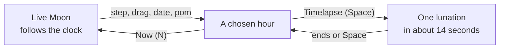

# How to play Selene

## Goal

There is no score and no end. Selene shows the Moon as it is right now, and lets you travel to any
hour you like to see how it looked or how it will look. A good visit is one where you find
something: the next full moon, the night you were born, a month with two full moons.

## Controls

Selene is played with the keyboard or the mouse; nothing needs both. Keys are Selene’s own and
cannot be remapped from the Hall.

| Action                                 | Keyboard                   | Mouse                                       |
| -------------------------------------- | -------------------------- | ------------------------------------------- |
| One hour back or forward               | ← / →                      | Drag along the time bar                     |
| One day back or forward                | Shift + ← / →              | The ‹ and › buttons                         |
| One lunar month back or forward        | Page Up / Page Down        | —                                           |
| Play a month-long timelapse, or stop   | Space                      | Timelapse                                   |
| Back to the live Moon                  | N                          | Now                                         |
| Open or close the Moon calendar        | C                          | Calendar                                    |
| High contrast on or off                | H                          | Contrast                                    |
| About Selene and its shortcuts         | ?                          | About                                       |
| Close the calendar or the About dialog | Esc                        | The × button                                |
| Ask pom about a date                   | Type in the `pom` field, ↵ | —                                           |
| Pick a date and hour                   | The date field             | The date field                              |
| Rock the Moon on its axis              | —                          | Drag the Moon (it springs back)             |
| Name a sea or crater                   | —                          | Point at it                                 |
| Leave for the Hall                     | Tab to the Hall’s strip    | Move to the top edge; ← Back to the Hall    |
| Start Selene afresh                    | Tab to the Hall’s strip    | Move to the top edge; Game menu, then Leave |

## Rules

Selene has no rules to break, only a clock to move:

1. It opens on the live Moon, following the real time.
2. Any step, drag, date or pom command moves the view to that hour; the Moon, the sky and the
   readout follow.
3. The caption at the bottom is exactly what the original `pom` would print for the hour shown.

## Modes

| Mode        | What changes                                                                                   |
| ----------- | ---------------------------------------------------------------------------------------------- |
| Live        | The Moon follows the real time, minute by minute.                                              |
| Chosen hour | Any hour you travel to; pom’s answer switches to “was” or “will be”.                           |
| Timelapse   | One lunar month plays in about fourteen seconds (stepped a day at a time with reduced motion). |
| Calendar    | A month of little moons, and the next eight principal phases to jump to.                       |

## Settings

Selene’s own toggles live in its toolbar: high contrast (also on when your system asks for more
contrast). It follows your system’s reduced-motion setting: no twinkle or ripples, instant jumps,
a stepped timelapse. Selene has a single night look; the Hall’s strip follows the Hall’s light or
dark appearance.

## Scoring

None. Selene is a toy.

## Achievements (packages)

| Package          | How to earn it                                                   |
| ---------------- | ---------------------------------------------------------------- |
| `full-lunation`  | Watch a whole timelapse, start to finish, with Selene in view.   |
| `next-full-moon` | Travel to the coming full moon (within half a day of it).        |
| `next-new-moon`  | Travel to the coming new moon (within half a day of it).         |
| `ask-pom`        | Type a date in the `pom` field that pom accepts.                 |
| `two-full-moons` | Come to rest on any hour of a month that holds two full moons.   |
| `century-hop`    | Visit the Moon more than a hundred years from today, either way. |

## XP

Selene is a toy, so the Hall gives it a small, flat amount of XP once a day, for a visit in which
you really travel through time (any step, drag, date, pom command or timelapse). Leaving it open
earns nothing more. Each package is worth 15 XP. Selene reports no XP events and no weekly goals.

## Tips

- The little moons along the time bar mark the principal phases; drag to one and let go.
- In the calendar, the list under the month jumps straight to the next new moon, quarter or full
  moon.
- Two full moons in one month happen every two or three years: try a few Decembers, Augusts or
  Mays with Page Down.
- The pom field takes the date the old way, `ccyymmddHH`, counted from the right, so any leading
  part can be left out: `12` is noon today, `0112` is noon on the first of this month and
  `010112` is noon on New Year’s Day.
