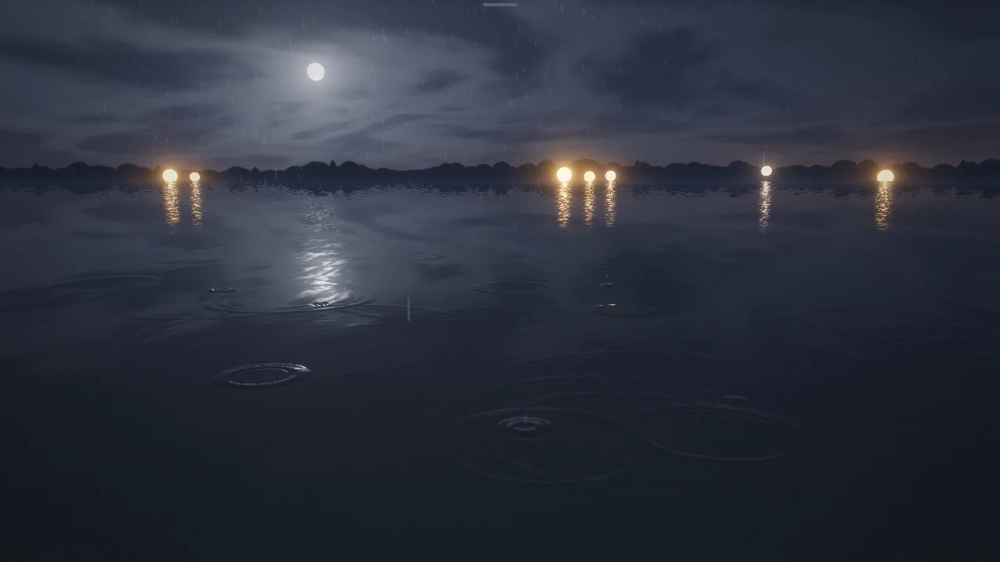

# Rain on Still Water

> Rain on a night pond, every drop from the 1980 loop.

## The hook

A still pond at night: a moon behind thin cloud, lanterns on the far bank, and rain. Every drop
lands where a 1980 terminal program put one, at the moment it put it, and sends real rings across
the water that cross and fade. Slide from a drizzle to a downpour, turn the sound on to hear each
drop land, or open the old terminal beside the pond and watch the same shower drawn in dots and
slashes.

## Where it comes from

Like `worms`, `rain` is a screensaver Eric P. Scott wrote at Caltech’s High Energy Physics group in
1980, by the date in his note in the source. Its manual page says it was modelled on a VAX/VMS program of the
same name, and that it only looked right on a 9600-baud line or with its delay option. On the
terminal five drops were alive at once: each began as a dot, swelled to a small `o` and a capital
`O`, opened into a small ring and then a wider one of dashes and slashes, and vanished.

## What is new

- A pond at night, all drawn in code: sky, moon, clouds, a treeline, seven lanterns and their
  glitter on the water.
- Each moment of each drop pushes on a real wave simulation, so the rings spread, cross and
  interfere.
- You see the drops fall: the picture runs a third of a second behind the program, so each one
  is in the air before it lands on its dot.
- Rain from a drizzle to a deluge, plus a 9600-baud setting that rains as fast as an old terminal
  line could draw it.
- Classic and split views show the 1980 screen beside the pond, frame for frame.
- Optional sound, all synthesised: a hiss that follows the rain, a soft splash for each drop and,
  now and then, the plink of a trapped bubble.

## At a glance

|                 |                           |
| --------------- | ------------------------- |
| Directory       | `/usr/games/toys`         |
| Players         | 1                         |
| Session         | 1–10 minutes              |
| Daily challenge | no                        |
| Inspired by     | `rain` (1989 manual page) |

## More

- [How to play](HOW-TO-PLAY.md)
- [Changes from the original](CHANGES-FROM-ORIGINAL.md)
- [Architecture](ARCHITECTURE.md)
- [Notes](NOTES.md)
