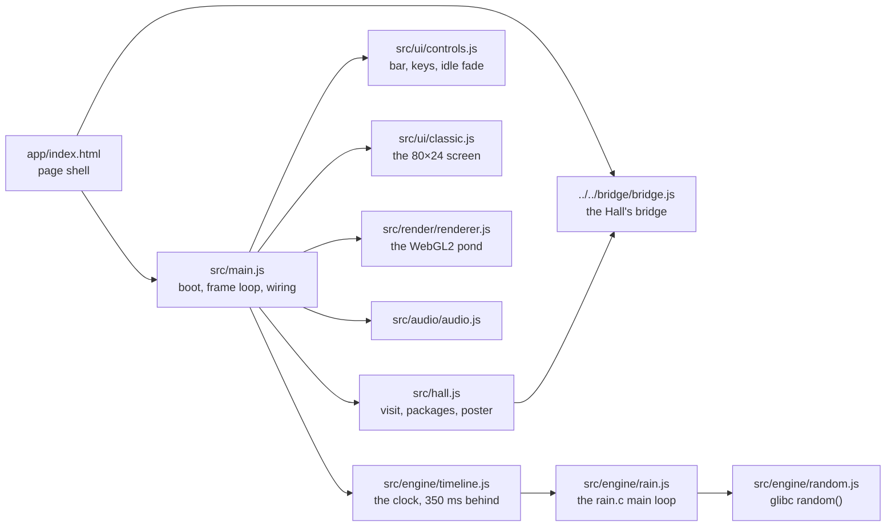
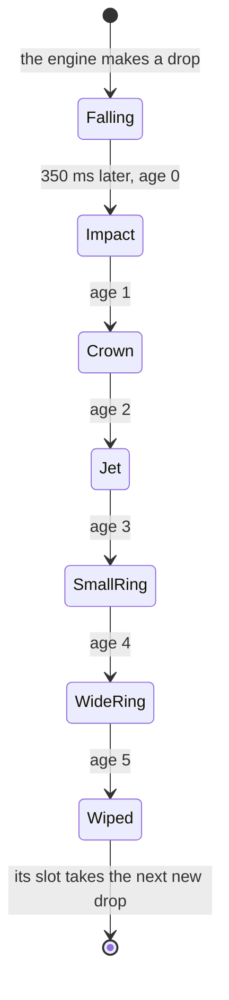

# Rain on Still Water — architecture

## Overview

Rain on Still Water is a **hosted** game: the finished port the owner built earlier (`rain`,
fancy-web), adopted as it was into `games/rain/app/` and run by the Hall in a same-origin frame at
`play/rain/`. It is plain ES modules with no build step. The pond is raw WebGL2 and GLSL: a
wave-equation simulation on float render targets, a procedural sky and water shader, instanced rain
streaks and splash droplets, bloom and a filmic grade. The classic view is text in a `<pre>`, which
is also the fallback without WebGL2. The engine is a line-by-line port of the original loop, under
200 lines, plus a 60-line clock. The upstream design notes are kept in
[`../app/docs/architecture.md`](../app/docs/architecture.md) and its decisions in [`adr/`](adr/).

## Module map

| Path                         | Responsibility                                                                                        |
| ---------------------------- | ----------------------------------------------------------------------------------------------------- |
| `app/index.html`             | The page: the pond canvas, the classic `<pre>`, title, sound button, control bar, help, Show controls |
| `app/src/main.js`            | Boot, the frame loop, where each drop lies on the water, views, the quality fallback                  |
| `app/src/engine/rain.js`     | The original loop on a persistent 80×24 screen, `-d` parsing, the 9600-baud pace                      |
| `app/src/engine/timeline.js` | An engine frame every delay; the queue both views read 350 ms later                                   |
| `app/src/engine/random.js`   | glibc’s `random()`; seed 1 is the original’s sequence                                                 |
| `app/src/render/`            | WebGL2 helpers, the wave simulation, sky and water, particles, bloom, pond geometry                   |
| `app/src/ui/controls.js`     | Intensity slider and presets, views, quality, sound, fullscreen, help, keys, idle fade, Show controls |
| `app/src/ui/classic.js`      | The classic view, sized to fit its pane                                                               |
| `app/src/ui/style.css`       | Layout and the night look, with system font stacks (no web fonts)                                     |
| `app/src/audio/audio.js`     | Synthesised hiss, splashes and plinks                                                                 |
| `app/src/hall.js`            | The bridge glue (added on adoption)                                                                   |

## State machine

The state that matters is a drop’s life. The engine makes a drop; both views show it 350 ms later
and step it through six ages, one per engine frame. `IMPULSES` in `renderer.js` turns each age into
a push on the water.

## Engine

`rain.js` runs the original loop on a persistent 80×24 screen, so the wipe of the oldest drop can
blank parts of a neighbour exactly as on a terminal; the five positions picked before the loop
enter mid-life with no impact (“phantom” drops). `random.js` reproduces glibc’s generator from seed
1, the original’s unseeded start, so the port rains the binary’s own rain. A frame takes `-d` ms;
for `-d 0`, `frameMs` counts the bytes curses would send for it at 960 bytes a second, about
150 ms. `timeline.js` queues each engine frame and both views take it 350 ms later, so a new drop
is seen falling and the split view stays frame for frame; after a hidden tab or a stall longer than
a second it resumes instead of replaying the backlog. `parseDelay` checks `?d=` as the original
checked `-d`.

## Where visuals are defined

| Visual                                              | Defined in                                    | Change it by                               |
| --------------------------------------------------- | --------------------------------------------- | ------------------------------------------ |
| The rings: wave equation, damping, drop impulses    | `app/src/render/shaders/sim.js`               | The simulation shader                      |
| What each age of a drop does to the water           | `IMPULSES` in `app/src/render/renderer.js`    | The impulse table                          |
| Lanterns on the far bank                            | `LAMPS` in `renderer.js`                      | Azimuth, height, glow, power, warmth       |
| High, Low and Lite quality                          | `PROFILES` in `renderer.js`                   |                                            |
| Sky, clouds, moon, stars, treeline, mist            | `ENV_FS` in `app/src/render/shaders/scene.js` | The environment shader                     |
| Water: reflections, glitter columns, far shimmer    | `SCENE_FS` in `scene.js`                      | The scene shader                           |
| Rain streaks, falling drops, crown and jet droplets | `app/src/render/particles.js`                 |                                            |
| Bloom and the final grade                           | `app/src/render/shaders/post.js`              |                                            |
| Camera, pond grid, where the 80×24 screen lies      | `app/src/render/geometry.js`                  | `CAMERA`, `termToWorld`                    |
| The classic screen                                  | `app/src/ui/classic.js`                       | `--term-fg` and `--term-bg` in `style.css` |
| Control bar, help, notices                          | `app/src/ui/style.css`                        | CSS custom properties at the top           |

Rain on Still Water has one night look and does not read the Hall’s tokens. Reduced motion comes
from the system (`prefers-reduced-motion`) or `?reduced` at start-up and, in the Hall, from the
Hall’s setting, live. The renderer steps down a ladder instead
of failing: High, then Low once if High runs under 40 fps in the first seconds, Lite on a software
rasteriser, and the classic view when WebGL2 or float render targets are missing.

## Where sounds are defined

All sound is synthesised in `app/src/audio/audio.js` (no samples), and nothing is created until
sound is first turned on: by the player, or in the Hall by the Hall’s sound when it is not muted.
The master level is its designed 0.9, scaled in the Hall through `setVolume`.

| Sound           | Defined in                                                             | Plays when                                                                                       |
| --------------- | ---------------------------------------------------------------------- | ------------------------------------------------------------------------------------------------ |
| Hiss and rumble | `build()` and `setRain()`: looping generated noise through two filters | Always while sound is on; louder as the rain grows                                               |
| Splash          | `plink()`: a burst of band-passed noise                                | A drop lands (age 0), softer and higher when its droplet falls back (age 3); at most 48 a second |
| Bubble plink    | `plink()`, `BUBBLE_CHANCE`                                             | About one landing in four, and some droplets falling back                                        |

## Hall integration

All of it lives in `app/src/hall.js`, plus one script tag in `index.html` and, in
`app/src/main.js`, one import, calls at four moments the page already handled, the hand-over of
its audio and two setters (`followHall`) and a hold check (`isHeldStill`) at the top of the frame
loop.

| Rain on Still Water moment                      | Bridge message                                                    |
| ----------------------------------------------- | ----------------------------------------------------------------- |
| The first key press or click                    | `result { outcome: 'complete', durationSeconds }`, once per visit |
| Sound turned on with its own button or M        | `achievement hear-the-pond`                                       |
| The delay set to 0 (9600 baud)                  | `achievement nine-six-hundred`                                    |
| The delay set to 1–10 ms                        | `achievement downpour`                                            |
| The player picks the split view                 | `achievement side-by-side`                                        |
| The player picks the classic view               | `achievement back-to-1980`                                        |
| H hides every control (`hidden-ui` on `<body>`) | `achievement lights-out`                                          |
| The first pond frame drawn 5 s after opening    | `poster`, from `#pond` through `posterFromCanvas`                 |

Lights out is noticed by a `MutationObserver` on the body’s class, so `controls.js` needs no call
into `hall.js`. A view set by `?view=` at start-up is not a choice and earns nothing. Rain on Still
Water sends no title-screen signal: it has no title screen, and the Hall’s strip carries the ways
out. It does not act on appearance messages (it has one look). Since bridge 1.1 it follows the
Hall’s sound, motion and pause:

| In `hall.js`                              | What it does                                                                                                                                                                                                                                                                                                                                            |
| ----------------------------------------- | ------------------------------------------------------------------------------------------------------------------------------------------------------------------------------------------------------------------------------------------------------------------------------------------------------------------------------------------------------- |
| `onSound` → `applyHallSound`              | Sets the pond’s level to the Hall’s volume scaled from its own 0.9 (`soundLevel`, `setVolume`) and turns sound on, or off while the Hall is muted; the Sound button and M still work until the Hall’s sound changes again. Only the player’s own button or M counts towards `hear-the-pond`                                                             |
| `startSoundOnGesture`                     | If the browser held audio back, the first key or click in the frame starts it                                                                                                                                                                                                                                                                           |
| `onReducedMotion` → `applyHallMotion`     | Sets the loop’s `reducedMotion` (softer splashes, thinner streaks) and `renderer.reducedMotion` (a still camera) live, through the setter `main.js` hands over; a pond still at its start-up intensity moves to the one the setting starts with (400 or 120 ms). Toggles `data-reduced-motion` on the root, where `style.css` repeats its `--fade` rule |
| `pauseWhenHidden`, `onPause` / `onResume` | The Hall’s pause and a hidden tab hold the frame loop (`isHeldStill`) and suspend the audio context; on resume the rain carries on where it was                                                                                                                                                                                                         |

Opened on its own, the bridge script is missing, `hall.js` does nothing and the pond starts silent
as before.

## Tests

| Test                                    | Command                                                                  | What it proves                                                                                                   |
| --------------------------------------- | ------------------------------------------------------------------------ | ---------------------------------------------------------------------------------------------------------------- |
| Upstream unit tests (22, and 1 skipped) | `pnpm run test:hosted` (or `node --test "tests/**/*.test.js"` in `app/`) | glibc `random()`, `-d` parsing, a drop’s six ages, the clock and its latency, pond geometry, the impulse mapping |
| In the Hall (5)                         | `pnpm exec playwright test -c games/rain`                                | Opens with no outside requests; a key press is the visit and the split view installs a package; every way out    |
| Screenshots                             | `SHOTS=1 pnpm exec playwright test -c games/rain`                        | `docs/media/title-1280.webp`, `play-1280.webp`, `signature-1280.webp` (the split view), on the machine’s GPU     |

The skipped test compares frames with captures of the real binary; it runs again once the captures
are put in `app/tests/fixtures/captures/` (see [`NOTES.md`](NOTES.md)). Set `HALL_PORT` when the
Hall’s usual port (5173) is taken. On its own, `pnpm --dir games/rain/app start` serves Rain on
Still Water at `http://localhost:5204/`.

## Kit candidates

None: hosted games talk to the Hall only through the bridge.
