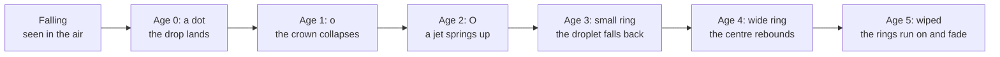

# How to play Rain on Still Water

## Goal

There is nothing to win and nothing to lose. Rain on Still Water is a screensaver: the rain falls
on its own, every drop where the 1980 program put it, and you choose how hard it rains, whether you
hear it and how you look at it. A good visit is one where you find the rain you like and listen for
a while.

## Controls

The controls fade after about three seconds of stillness and come back when you move the mouse or
press a key. Keys are the game’s own and cannot be remapped from the Hall.

| Action                                 | Keyboard                | Mouse                                        |
| -------------------------------------- | ----------------------- | -------------------------------------------- |
| Heavier or lighter rain                | → / ← (or + / −)        | Drag the Intensity slider                    |
| A preset                               | —                       | Drizzle, Rain, Downpour, Deluge or 9600 baud |
| Rain at 9600-baud pace                 | 0                       | 9600 baud                                    |
| The pond                               | 1                       | Modern                                       |
| Split view (or back to the pond)       | 2 (S switches it)       | Split                                        |
| The 1980 screen (or back to the pond)  | 3 (C switches it)       | Classic                                      |
| Sound on or off (off at the start)     | M                       | Sound, top right                             |
| Quality High or Low                    | Q                       | The High / Low button                        |
| Fullscreen                             | F                       | The fullscreen button                        |
| Hide every control, or bring them back | H                       | —                                            |
| The list of shortcuts                  | ?                       | The ? button                                 |
| Close the list of shortcuts            | Esc                     | Close                                        |
| Leave for the Hall                     | Tab to the Hall’s strip | Move to the top edge; ← Back to the Hall     |
| Start Rain on Still Water afresh       | Tab to the Hall’s strip | Move to the top edge; Game menu, then Leave  |

## Rules

The rain follows the original program’s loop, unchanged:

1. Every frame, one new drop lands at a random spot on an 80×24 screen, at least two cells in from
   each edge.
2. Five drops are alive at a time. Each lives six frames: a dot, a small `o`, a capital `O`, a
   small ring, a wide ring, and then it is wiped away.
3. The delay between frames is the rain: drops per second are 1,000 divided by the delay in
   milliseconds.
4. At the 9600-baud setting (`-d 0`) each frame takes as long as an old 9600-baud line needed to
   draw it, roughly 150 ms.

## Modes

| View    | What you see                                                                               |
| ------- | ------------------------------------------------------------------------------------------ |
| Modern  | The pond at night. This is where it opens.                                                 |
| Split   | The 1980 screen on the left and the pond on the right, driven by one engine and one clock. |
| Classic | The 1980 screen alone: 80×24 characters, exactly as the original drew them.                |

There is no daily challenge.

## Settings

| Setting   | Options                                                                                              | Default                                      |
| --------- | ---------------------------------------------------------------------------------------------------- | -------------------------------------------- |
| Intensity | 999 down to 1 ms between frames; Drizzle (400), Rain (120), Downpour (10), Deluge (1); 9600 baud (0) | Rain, `-d 120` (Drizzle with reduced motion) |
| View      | Modern · Split · Classic                                                                             | Modern                                       |
| Quality   | High · Low                                                                                           | High                                         |
| Sound     | on · off                                                                                             | off                                          |

On a machine without a GPU the pond runs in a lighter profile by itself, and if High runs slowly in
the first seconds it switches to Low once, with a notice. Rain on Still Water follows your system’s
reduced-motion setting: it starts in a drizzle, holds the view still, softens the splashes, thins
the streaks and shows the controls without fading. It has a single night look; the Hall’s strip
follows the Hall’s light or dark appearance.

## Scoring

None. Rain on Still Water is a toy.

## Achievements (packages)

| Package            | How to earn it                                                                              |
| ------------------ | ------------------------------------------------------------------------------------------- |
| `hear-the-pond`    | Turn the sound on.                                                                          |
| `nine-six-hundred` | Let it rain at 9600-baud pace: press 0 or pick 9600 baud.                                   |
| `downpour`         | Turn the rain up to 10 ms between frames or less: Downpour, Deluge or the slider’s far end. |
| `side-by-side`     | Switch to the split view.                                                                   |
| `back-to-1980`     | Switch to the classic view.                                                                 |
| `lights-out`       | Press H to hide every control.                                                              |

## XP

Rain on Still Water is a toy, so the Hall gives it a small, flat amount of XP once a day, for a
visit in which you press a key or click. Moving the mouse only wakes the controls, and leaving the
rain running earns nothing more. Each package is worth 15 XP. It reports no XP events and no weekly
goals.

## Tips

- A drizzle shows each ring whole on a mirror-still pond; a deluge breaks the whole surface up.
- In the split view, pick a dot on the 1980 screen and watch its drop land on the pond at the same
  moment.
- The screen lies over the water with its rows running into the distance, so a drop in the top-left
  of the classic screen lands far out on the left of the pond.
- With sound on in a light rain, listen for the plinks: only about one drop in four traps a bubble.
- H leaves nothing but the rain; press H again to bring the controls back.
